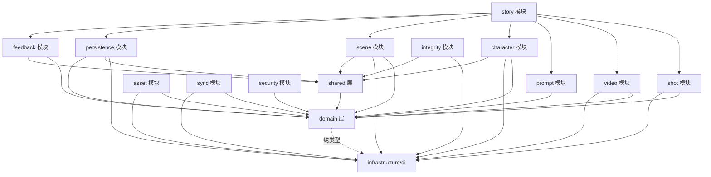

# AI Animation Studio — 项目技术文档 v2

---

## 目录

- [第 1 章 架构总览](#第-1-章-架构总览)
  - [1.1 系统定位](#11-系统定位)
  - [1.2 技术栈](#12-技术栈)
  - [1.3 架构风格](#13-架构风格)
  - [1.4 目录结构](#14-目录结构)
  - [1.5 依赖方向规则](#15-依赖方向规则)
- [第 2 章 领域层（Domain Layer）](#第-2-章-领域层domain-layer)
  - [2.1 领域层职责](#21-领域层职责)
  - [2.2 Result 类型与错误层级](#22-result-类型与错误层级)
  - [2.3 Port 接口](#23-port-接口)
- [第 3 章 模块系统](#第-3-章-模块系统)
  - [3.1 模块结构约定](#31-模块结构约定)
  - [3.2 Barrel 规则](#32-barrel-规则)
  - [3.3 跨模块通信规则](#33-跨模块通信规则)
  - [3.4 模块列表](#34-模块列表)
- [第 4 章 Electron IPC 与 API 服务器](#第-4-章-electron-ipc-与-api-服务器)
  - [4.1 IPC 权限系统](#41-ipc-权限系统)
  - [4.2 HTTP API 服务器](#42-http-api-服务器)
- [第 5 章 安全系统](#第-5-章-安全系统)
  - [5.1 SSRF 防护](#51-ssrf-防护)
  - [5.2 密钥存储](#52-密钥存储)
- [第 6 章 数据库与 Schema](#第-6-章-数据库与-schema)
  - [6.1 数据库配置](#61-数据库配置)
  - [6.2 Schema 架构](#62-schema-架构)
  - [6.3 完整表定义](#63-完整表定义)
  - [6.4 连接表（Junction Tables）](#64-连接表junction-tables)
  - [6.5 缓存表（Cache Tables）](#65-缓存表cache-tables无基础列)
  - [6.6 同步表（Sync Tables）](#66-同步表sync-tables)
  - [6.7 索引](#67-索引)
  - [6.8 JSON 容器接口定义](#68-json-容器接口定义)
- [第 7 章 DI 容器](#第-7-章-di-容器)
  - [7.1 容器架构](#71-容器架构)
  - [7.2 Token 注册完整列表](#72-token-注册完整列表)
  - [7.3 容器 API](#73-容器-api)
- [第 8 章 网络层与 AI 提供商](#第-8-章-网络层与-ai-提供商)
  - [8.1 API 客户端架构](#81-api-客户端架构)
  - [8.2 AI 提供商策略模式](#82-ai-提供商策略模式)
  - [8.3 网络弹性](#83-网络弹性)
  - [8.4 API 配置管理](#84-api-配置管理)
- [第 9 章 功能模块详细描述](#第-9-章-功能模块详细描述)
  - [9.1 character 模块](#91-character-模块)
  - [9.2 scene 模块](#92-scene-模块)
  - [9.3 shot 模块](#93-shot-模块)
  - [9.4 video 模块](#94-video-模块)
  - [9.5 story 模块](#95-story-模块)
  - [9.6 prompt 模块](#96-prompt-模块)
  - [9.7 asset 模块](#97-asset-模块)
  - [9.8 sync 模块](#98-sync-模块)
  - [9.9 security 模块](#99-security-模块)
  - [9.10 persistence 模块](#910-persistence-模块)
  - [9.11 integrity 模块](#911-integrity-模块)
  - [9.12 feedback 模块](#912-feedback-模块)
- [第 9B 章 进程生命周期与崩溃恢复](#第-9b-章-进程生命周期与崩溃恢复)
  - [9B.1 Electron 主进程入口](#9b1-electron-主进程入口)
  - [9B.2 错误处理策略](#9b2-错误处理策略)
  - [9B.3 优雅关闭序列](#9b3-优雅关闭序列)
  - [9B.4 API 服务器连接追踪](#9b4-api-服务器连接追踪)
- [第 9C 章 状态管理](#第-9c-章-状态管理)
  - [9C.1 Zustand Store 架构](#9c1-zustand-store-架构)
  - [9C.2 核心 Store 列表](#9c2-核心-store-列表)
  - [9C.3 useVideoTaskStore 详细](#9c3-usevideotaskstore-详细)
  - [9C.4 领域事件系统](#9c4-领域事件系统)
- [第 10 章 前端页面与路由](#第-10-章-前端页面与路由)
  - [10.1 页面列表](#101-页面列表)
  - [10.2 布局](#102-布局)
  - [10.3 导航](#103-导航)
- [第 11 章 测试体系](#第-11-章-测试体系)
  - [11.1 测试框架与运行](#111-测试框架与运行)
  - [11.2 测试分层](#112-测试分层)
  - [11.3 DI 替换](#113-di-替换)
  - [11.4 better-sqlite3 注意事项](#114-better-sqlite3-注意事项)
  - [11.5 已有测试文件](#115-已有测试文件)
- [第 12 章 构建与部署](#第-12-章-构建与部署)
  - [12.1 构建脚本](#121-构建脚本)
  - [12.2 构建配置要点](#122-构建配置要点)
  - [12.3 环境变量](#123-环境变量)
  - [12.4 .npmrc 约束](#124-npmrc-约束)
- [第 13 章 日志系统](#第-13-章-日志系统)
  - [13.1 架构概述](#131-架构概述)
  - [13.2 日志级别](#132-日志级别)
  - [13.3 LogEntry 结构](#133-logentry-结构)
  - [13.4 Logger 类 API](#134-logger-类-api)
  - [13.5 LoggerRegistry 与全局单例](#135-loggerregistry-与全局单例)
  - [13.6 Transport 接口](#136-transport-接口)
  - [13.7 ConsoleTransport](#137-consoletransport)
  - [13.8 FileTransport](#138-filetransport)
  - [13.9 传输层初始化](#139-传输层初始化)
  - [13.10 日志文件位置](#1310-日志文件位置)
  - [13.11 安全日志](#1311-安全日志)
  - [13.12 错误日志脱敏](#1312-错误日志脱敏)
  - [13.13 日志使用示例](#1313-日志使用示例)
- [第 13B 章 共享模块与配置](#第-13b-章-共享模块与配置)
  - [13B.1 shared 层架构](#13b1-shared-层架构)
  - [13B.2 Toast 通知系统](#13b2-toast-通知系统)
  - [13B.3 ErrorBoundary](#13b3-errorboundary)
  - [13B.4 平台检测](#13b4-平台检测)
  - [13B.5 图片工具](#13b5-图片工具)
  - [13B.6 config 层](#13b6-config-层)
- [第 14 章 模块间依赖关系](#第-14-章-模块间依赖关系)
  - [14.1 模块依赖图](#141-模块依赖图)
  - [14.2 依赖方向规则](#142-依赖方向规则)
  - [14.3 跨模块通信规则](#143-跨模块通信规则)
- [第 15 章 代码风格与关键模式](#第-15-章-代码风格与关键模式)
  - [15.1 代码风格](#151-代码风格)
  - [15.2 React 模式](#152-react-模式)
  - [15.3 数据访问模式](#153-数据访问模式)
  - [15.4 Electron 集成模式](#154-electron-集成模式)
  - [15.5 DI Token 分类](#155-di-token-分类)
  - [15.6 领域事件模式](#156-领域事件模式)
  - [15.7 Result 模式](#157-result-模式)
  - [15.8 状态机模式](#158-状态机模式)
- [附录 A：Zod Schema 定义](#附录-azod-schema-定义)
  - [A.1 character.ts](#a1-characterts)
  - [A.2 scene.ts](#a2-scenets)
  - [A.3 shot-system.ts](#a3-shot-systemts)
  - [A.4 story.ts](#a4-storyts)
  - [A.5 api.ts](#a5-apits)
  - [A.6 media.ts](#a6-mediats)
  - [A.7 Schema 辅助函数](#a7-schema-辅助函数)
- [附录 B：Schema Builder 与 Feature Flags](#附录-bschema-builder-与-feature-flags)
  - [B.1 Schema Builder](#b1-schema-builder)
  - [B.2 Feature Flags](#b2-feature-flags)
  - [B.3 迁移框架](#b3-迁移框架)
- [附录 C：SQL 安全工具](#附录-csql-安全工具)
  - [C.1 sql-sanitizer.ts](#c1-sql-sanitizerts)
  - [C.2 schema-registry.ts](#c2-schema-registryts)
  - [C.3 sqlite-core.ts](#c3-sqlite-corets)
- [附录 D：插件系统](#附录-d插件系统)
  - [D.1 插件架构](#d1-插件架构)
  - [D.2 插件注册 API](#d2-插件注册-api)
  - [D.3 内置提供商](#d3-内置提供商)

---

## 第 1 章 架构总览

### 1.1 系统定位

AI Animation Studio 是一款基于 Electron + Next.js 的桌面应用，面向 AI 驱动的动画制作流程。应用采用本地优先（local-first）架构，核心数据存储在本地 SQLite 数据库中，支持离线使用，仅在调用 AI 生成服务时需要网络连接。

### 1.2 技术栈

| 层级 | 技术 | 版本 |
|------|------|------|
| 桌面框架 | Electron | — |
| 前端框架 | Next.js (output: "export") | 16 |
| UI 库 | React | 19 |
| 状态管理 | Zustand | 5 |
| CSS | Tailwind CSS | 4 |
| 语言 | TypeScript (strict mode) | — |
| 数据库 | better-sqlite3 (WAL mode) | 12.10.0 |
| 测试 | Vitest | — |

### 1.3 架构风格

采用 DDD（领域驱动设计）+ 子域模块化架构，优化 AI 驱动开发流程。核心原则：

- **依赖方向向内**：`app → modules → domain`，`infrastructure → domain + shared`
- **domain 层零依赖**：纯类型、Schema、Result 类型，不导入任何其他层
- **shared 层仅依赖 domain**：不导入 modules 或 infrastructure
- **modules 层通过 DI 访问 infrastructure**：不直接导入 `@/infrastructure/*`（除 `@/infrastructure/di`）

### 1.4 目录结构

```
src/
  domain/          → 纯类型、Schema、Result 类型、Port 接口
  modules/         → 业务逻辑子域模块（每个含 hooks/, services/, presentation/）
  infrastructure/  → DI 容器、存储、网络、API 客户端、AI 提供商
  shared/          → 跨切 UI（Toast, Sidebar, ErrorBoundary）、工具函数、错误日志
  app/             → Next.js 页面和布局（通过 Context 消费模块）
  config/          → 常量、端口、共享配置

electron/src/
  main.ts          → 应用生命周期、窗口管理、崩溃恢复
  main-dev.ts      → 开发模式入口（相同崩溃恢复、调试日志、DevTools）
  main-common.ts   → 共享：createWindow、静态服务器、gracefulShutdown、配置 IPC
  api-server.ts    → HTTP API 服务器（渲染进程↔主进程通信）
  preload.ts       → IPC 桥接（权限系统 + 速率限制）
  database/        → SQLite 连接、Schema 构建器、Schema、迁移
  handlers/        → IPC 处理器（database, config, sync, secure-config）
  plugins/         → 插件注册、用户插件加载器、提供商
  security/        → SSRF 防护、密钥存储
  logging/         → Logger（ConsoleTransport + FileTransport）
```

### 1.5 依赖方向规则

| 层 | 允许导入 | 禁止导入 |
|----|---------|---------|
| `domain/` | 无外部依赖 | `@/modules/*`, `@/infrastructure/*` |
| `shared/` | `@/domain/*` | `@/modules/*`, `@/infrastructure/*` |
| `modules/` | `@/domain/*`, `@/shared/*`, `@/infrastructure/di` | `@/infrastructure/*`（DI 除外）, `@/modules/*/*/*` |
| `infrastructure/` | `@/domain/*`, `@/shared/*` | `@/modules/*` |
| `app/` | 所有层 | 深层模块路径 `@/modules/*/*/*` |

---

## 第 2 章 领域层（Domain Layer）

### 2.1 领域层职责

领域层（`src/domain/`）是整个系统的核心，包含纯类型定义、Zod Schema、Result 类型和 Port 接口。领域层不依赖任何其他层，确保业务规则的纯粹性和可移植性。

目录结构：

```
src/domain/
  schemas/         → Zod Schema 定义（character, scene, story, shot-system, api, media）
  types/
    result.ts      → Result 类型、AppError 错误层级
  ports/           → Port 接口定义（storage, ai-provider, sync, element-manager, reference-engine）
```

### 2.2 Result 类型与错误层级

`src/domain/types/result.ts` 定义了系统的核心错误处理模式。所有业务操作使用 `Result<T>` 类型返回，不抛异常。

#### 2.2.1 Result 类型定义

```typescript
export type Result<T, E = AppError> =
  | { ok: true; value: T }
  | { ok: false; error: E };
```

辅助函数：

| 函数 | 签名 | 说明 |
|------|------|------|
| `ok<T>` | `(value: T) => Result<T, never>` | 创建成功结果 |
| `err<E>` | `(error: E) => Result<never, E>` | 创建失败结果 |
| `fromThrowable<T>` | `(fn: () => T) => Result<T, AppError>` | 安全包装同步函数 |
| `fromAsyncThrowable<T>` | `(fn: () => Promise<T>) => Promise<Result<T, AppError>>` | 安全包装异步函数 |

#### 2.2.2 AppError 错误层级

所有业务错误继承自 `AppError` 基类，形成完整的错误分类体系：

```
AppError (code: string, message: string, cause?: unknown)
  ├── DatabaseError       (code: "DATABASE_ERROR")
  ├── ValidationError     (code: "VALIDATION_ERROR")
  ├── ApiError            (code: "API_ERROR", statusCode?: number, apiCode?: string)
  ├── NotFoundError       (code: "NOT_FOUND")
  ├── NetworkError        (code: "NETWORK_ERROR")
  ├── StorageError        (code: "STORAGE_ERROR")
  ├── ConfigurationError  (code: "CONFIGURATION_ERROR")
  ├── GenerationError     (code: "GENERATION_ERROR", generationType: GenerationType)
  ├── TimeoutError        (code: "TIMEOUT_ERROR")
  ├── RateLimitError      (code: "RATE_LIMIT_ERROR", retryAfter?: number)
  └── AuthenticationError (code: "AUTHENTICATION_ERROR")
```

各错误类详细说明：

| 错误类 | code | 特有属性 | 使用场景 |
|--------|------|---------|---------|
| `AppError` | 自定义 | `code`, `cause` | 基类，通用错误 |
| `DatabaseError` | `DATABASE_ERROR` | — | SQLite 操作失败 |
| `ValidationError` | `VALIDATION_ERROR` | — | Zod Schema 校验失败 |
| `ApiError` | `API_ERROR` | `statusCode`, `apiCode` | AI API 返回错误响应 |
| `NotFoundError` | `NOT_FOUND` | — | 实体按 ID 查询不存在 |
| `NetworkError` | `NETWORK_ERROR` | — | 网络连接失败 |
| `StorageError` | `STORAGE_ERROR` | — | 本地存储操作失败 |
| `ConfigurationError` | `CONFIGURATION_ERROR` | — | API 配置缺失或无效 |
| `GenerationError` | `GENERATION_ERROR` | `generationType` | AI 生成任务失败 |
| `TimeoutError` | `TIMEOUT_ERROR` | — | API 请求超时 |
| `RateLimitError` | `RATE_LIMIT_ERROR` | `retryAfter` | API 限流 |
| `AuthenticationError` | `AUTHENTICATION_ERROR` | — | API Key 无效或过期 |

`GenerationType` 枚举值：`"keyframe" | "framePair" | "video" | "image" | "text"`

`NotFoundError` 构造函数自动生成消息：`${entity} with id "${id}" not found`

`AppError.toString()` 格式：`[CODE] message`

### 2.3 Port 接口

Port 接口定义在 `src/domain/ports/`，是模块层与基础设施层之间的解耦契约。模块通过 Port 接口声明依赖，基础设施提供实现并通过 DI 容器注册。

#### 2.3.1 IVideoTaskStorage

视频任务存储 Port，定义视频任务的 CRUD 操作：

| 方法 | 签名 | 说明 |
|------|------|------|
| `getVideoTasks` | `() => Promise<VideoTask[]>` | 获取所有视频任务 |
| `getVideoTaskById` | `(taskId: string) => Promise<VideoTask \| null>` | 按 ID 获取任务 |
| `getVideoTasksByStory` | `(storyId: string) => Promise<VideoTask[]>` | 按故事 ID 获取任务 |
| `getVideoTasksByStatus` | `(status: string) => Promise<VideoTask[]>` | 按状态获取任务 |
| `getPendingVideoTasks` | `() => Promise<VideoTask[]>` | 获取待处理任务 |
| `createVideoTask` | `(task: Partial<VideoTask> & { taskId: string }) => Promise<void>` | 创建任务 |
| `updateVideoTask` | `(taskId: string, updates: Partial<VideoTask>) => Promise<void>` | 更新任务 |
| `deleteVideoTask` | `(taskId: string) => Promise<void>` | 删除任务 |
| `deleteVideoTasksByStatus` | `(statuses: string[]) => Promise<void>` | 按状态批量删除 |
| `deleteExpiredVideoTasks` | `() => Promise<number>` | 删除过期任务，返回删除数量 |
| `clearVideoTasks` | `() => Promise<void>` | 清空所有任务 |
| `bulkPutVideoTasks` | `(tasks: Partial<VideoTask>[]) => Promise<void>` | 批量写入任务 |

#### 2.3.2 ICharacterStorage

角色存储 Port：

| 方法 | 签名 | 说明 |
|------|------|------|
| `getCharacters` | `() => Promise<Character[]>` | 获取所有角色 |
| `getCharacterById` | `(id: string) => Promise<Character \| null>` | 按 ID 获取角色 |
| `createCharacter` | `(character: Partial<Character>) => Promise<void>` | 创建角色 |
| `updateCharacter` | `(id: string, updates: Partial<Character>) => Promise<void>` | 更新角色 |
| `deleteCharacter` | `(id: string) => Promise<void>` | 删除角色 |
| `incrementCharacterUseCount` | `(id: string) => Promise<void>` | 增加使用计数 |
| `getOutfitsForCharacter` | `(characterId: string) => Promise<CharacterOutfit[]>` | 获取角色服装 |
| `saveOutfitsForCharacter` | `(characterId: string, outfits: CharacterOutfit[]) => Promise<void>` | 保存角色服装 |
| `updateOutfitImage` | `(outfitId: string, imageUrl: string, localImagePath?: string) => Promise<void>` | 更新服装图片 |

#### 2.3.3 ISceneStorage

场景存储 Port：

| 方法 | 签名 | 说明 |
|------|------|------|
| `getScenes` | `() => Promise<Scene[]>` | 获取所有场景 |
| `getSceneById` | `(id: string) => Promise<Scene \| null>` | 按 ID 获取场景 |
| `createScene` | `(scene: Partial<Scene>) => Promise<void>` | 创建场景 |
| `updateScene` | `(id: string, updates: Partial<Scene>) => Promise<void>` | 更新场景 |
| `deleteScene` | `(id: string) => Promise<void>` | 删除场景 |

#### 2.3.4 IStoryStorage

故事存储 Port：

| 方法 | 签名 | 说明 |
|------|------|------|
| `getStories` | `() => Promise<Story[]>` | 获取所有故事 |
| `getStoryById` | `(id: string) => Promise<Story \| null>` | 按 ID 获取故事 |
| `getStoryByBeatId` | `(beatId: string) => Promise<Story \| null>` | 按 Beat ID 获取故事 |
| `createStory` | `(story: Partial<Story>) => Promise<void>` | 创建故事 |
| `updateStory` | `(id: string, updates: Partial<Story>) => Promise<void>` | 更新故事 |
| `deleteStory` | `(id: string) => Promise<void>` | 删除故事 |

#### 2.3.5 IVideoProvider

视频生成提供商 Port，定义视频生成、状态查询、关键帧生成等操作：

| 方法 | 说明 |
|------|------|
| `generateVideo(prompt, options?)` | 生成视频，支持首帧/尾帧/角色参考/场景参考/参考视频 |
| `queryVideoStatus(taskId, options?)` | 查询异步视频任务状态 |
| `generateKeyframe(params)` | 生成关键帧图片 |
| `generateFramePair(params)` | 生成首尾帧对 |
| `generateVideoWithFrames(params)` | 使用首尾帧生成视频 |

`generateVideo` 的 options 参数：

| 字段 | 类型 | 说明 |
|------|------|------|
| `firstFrameUrl` | `string?` | 首帧图片 URL |
| `lastFrameUrl` | `string?` | 尾帧图片 URL |
| `characterRef` | `string?` | 角色参考图 URL |
| `sceneRef` | `string?` | 场景参考图 URL |
| `duration` | `number?` | 视频时长 |
| `referenceVideo` | `string \| null?` | 参考视频 URL |
| `providerId` | `string?` | 提供商 ID |
| `modelId` | `string?` | 模型 ID |
| `format` | `string?` | 提供商格式 |

#### 2.3.6 IImageProvider

图片生成提供商 Port：

| 方法 | 说明 |
|------|------|
| `generateImage(prompt, type?, options?)` | 生成图片，支持 size/providerId/modelId/purpose |
| `analyzeImage(imageUrl, type?, prompt?, options?)` | 分析图片，返回分析结果 |

#### 2.3.7 ITextProvider

文本生成提供商 Port：

| 方法 | 说明 |
|------|------|
| `generateText(prompt, options?)` | 生成文本，支持 maxTokens/temperature/providerId/modelId |

#### 2.3.8 IFileUploader

文件上传 Port：

| 方法 | 说明 |
|------|------|
| `uploadFile(file: File)` | 上传文件，返回 URL |

#### 2.3.9 ISyncStorage

同步存储 Port，提供安全的 SQL 操作接口：

| 方法 | 签名 | 说明 |
|------|------|------|
| `safeQuery<T>` | `(sql: string, params?: unknown[]) => Promise<T[]>` | 安全查询 |
| `safeRun` | `(sql: string, params?: unknown[]) => Promise<DbRunResult>` | 安全执行 |
| `safeTransaction` | `(statements: { sql: string; params: unknown[] }[]) => Promise<unknown[]>` | 安全事务 |
| `registerChangeTracker` | `(tracker: (entityType, entityId, operation) => Promise<void>) => void` | 注册变更追踪器 |

`DbRunResult` 类型：`{ changes?: number; lastInsertRowid?: number }`

#### 2.3.10 IElementManager

元素管理 Port，提供元素生命周期管理、资产绑定和更新通知：

| 方法 | 签名 | 说明 |
|------|------|------|
| `subscribe` | `(listener: () => void) => () => void` | 订阅元素更新通知，返回取消订阅函数 |
| `getLibrary` | `() => Promise<ElementLibrary>` | 获取完整元素库 |
| `createElement` | `(type: ElementType, name: string, description?: string) => Promise<StoryElement>` | 创建元素 |
| `bindAsset` | `(elementId: string, asset: AssetBinding) => Promise<StoryElement>` | 绑定资产 |
| `unbindAsset` | `(elementId: string, assetUrl: string) => Promise<StoryElement>` | 解绑资产 |
| `getElement` | `(elementId: string) => Promise<StoryElement \| undefined>` | 获取单个元素 |
| `getAllElements` | `() => Promise<StoryElement[]>` | 获取所有元素 |
| `getElementsByType` | `(type: ElementType) => Promise<StoryElement[]>` | 按类型获取元素 |
| `deleteElement` | `(elementId: string) => Promise<void>` | 删除元素 |
| `updateElement` | `(elementId: string, updates: Partial<StoryElement>) => Promise<StoryElement>` | 更新元素 |

#### 2.3.11 IReferenceEngine

引用引擎 Port，管理分镜间引用关系：

| 方法 | 签名 | 说明 |
|------|------|------|
| `validateReference` | `(shot, allShots, reference) => ReferenceValidationResult` | 验证引用有效性 |
| `getTargetShot` | `(shot, allShots, reference) => StoryBeat \| undefined` | 获取引用目标分镜 |
| `getReferenceVideoUrl` | `(shot, allShots, reference) => string \| undefined` | 获取引用视频 URL |
| `buildReferenceDescription` | `(shot, allShots, reference) => string` | 构建引用描述文本 |

`ReferenceValidationResult` 类型：`{ valid: boolean; error?: string }`

---

## 第 3 章 模块系统

### 3.1 模块结构约定

每个模块位于 `src/modules/` 下，遵循统一结构：

```
module-name/
  index.ts           → Barrel 文件（公共 API）
  MODULE.md          → 模块契约（目的、子域、依赖）
  hooks/             → React Hooks
  services/          → 业务逻辑服务
  presentation/      → React 组件
  domain/            → 模块特定领域类型（如需要）
```

### 3.2 Barrel 规则

- `index.ts` 必须重新导出所有公共 API
- 内部实现细节不得导出
- 其他模块仅通过 `@/modules/xxx` 导入

### 3.3 跨模块通信规则

- 模块间通过 barrel `@/modules/xxx` 导入，禁止深层路径 `@/modules/xxx/hooks/yyy`
- 深层路径导入被 ESLint 规则拦截（生产代码 error，测试代码 warn）
- 类型导出允许通过 `export type` 从 infrastructure re-export（编译时依赖，无运行时影响）

### 3.4 模块列表

| 模块 | 职责 | 子域数量 |
|------|------|---------|
| character | 角色管理 | 4 |
| scene | 场景管理 | 4 |
| shot | 分镜核心 | 7 |
| video | 视频任务管理 | 4 |
| story | 故事创作 | 5 |
| prompt | 提示词引擎 | 8 |
| asset | 资产管理 | 5 |
| sync | 数据同步 | 2 |
| security | 安全 | 1 |
| persistence | 持久化 | 2 |
| integrity | 完整性 | 1 |
| feedback | 用户反馈 | 2 |

---

## 第 4 章 Electron IPC 与 API 服务器

### 4.1 IPC 权限系统

`electron/src/preload.ts` 实现了严格的 IPC 权限控制系统。所有 IPC 通道必须在 `IPC_PERMISSIONS` 中注册，未注册的通道将被拦截并记录安全日志。

#### 4.1.1 IPC_PERMISSIONS 完整表

**READONLY 级别**（只读操作，速率限制：300 次/分钟）：

| 通道名 | 说明 |
|--------|------|
| `db:query` | 数据库查询 |
| `db:get` | 数据库单条获取 |
| `db:stats` | 数据库统计信息 |
| `db:type` | 数据库类型查询 |
| `assets:read-file-base64` | 读取文件为 Base64 |
| `assets:get-dir` | 获取资产目录路径 |
| `assets:file-exists` | 检查文件是否存在 |
| `fs:read-file` | 读取文件 |
| `cache:get-cache-directory` | 获取缓存目录 |
| `fs:get-file-info` | 获取文件信息 |
| `fs:get-disk-space` | 获取磁盘空间 |
| `image:to-base64` | 图片转 Base64 |
| `config:get` | 获取配置 |
| `secure-config:load` | 加载安全配置 |
| `secure-config:has` | 检查安全配置是否存在 |
| `export:data` | 导出数据 |

**READWRITE 级别**（读写操作，速率限制：100 次/分钟）：

| 通道名 | 说明 |
|--------|------|
| `db:run` | 数据库执行（INSERT/UPDATE/DELETE） |
| `db:batch-insert` | 数据库批量插入 |
| `db:init` | 数据库初始化 |
| `db:save` | 数据库保存 |
| `assets:save-image` | 保存图片文件 |
| `assets:save-buffer` | 保存 Buffer 数据 |
| `assets:copy-file` | 复制文件 |
| `fs:write-file` | 写入文件 |
| `image:normalize` | 图片标准化处理 |
| `config:set` | 设置配置 |
| `secure-config:save` | 保存安全配置 |
| `secure-config:delete` | 删除安全配置 |

**DANGEROUS 级别**（危险操作，速率限制：100 次/分钟）：

| 通道名 | 说明 |
|--------|------|
| `db:transaction` | 数据库事务 |
| `db:migrate` | 数据库迁移 |
| `db:vacuum` | 数据库 VACUUM |
| `db:analyze` | 数据库 ANALYZE |
| `db:checkpoint` | 数据库 WAL Checkpoint |
| `assets:delete-file` | 删除文件 |

**SYSTEM 级别**（系统操作，速率限制：100 次/分钟）：

| 通道名 | 说明 |
|--------|------|
| `shell:open-external` | 打开外部链接 |
| `dialog:open-file` | 打开文件对话框 |
| `dialog:save-file` | 保存文件对话框 |
| `db:close` | 关闭数据库连接 |

**SECURE 级别**（安全操作，速率限制：100 次/分钟）：

| 通道名 | 说明 |
|--------|------|
| `secure-config:resolve` | 解析安全配置（最高权限） |

#### 4.1.2 速率限制

| 限制类型 | 最大调用次数 | 时间窗口 |
|---------|------------|---------|
| READONLY 通道 | 300 | 60 秒 |
| 默认通道 | 100 | 60 秒 |
| 全局限制 | 600 | 60 秒 |

速率限制实现细节：
- 每个通道维护独立的调用时间戳历史
- 全局维护一个统一的调用时间戳数组
- 每 60 秒清理过期时间戳
- 通道历史记录上限 200 个，超出时淘汰最少使用的
- 超出限制时抛出错误，包含当前计数和限制信息

#### 4.1.3 DDL 防护

渲染进程禁止执行 DDL 语句。DDL 检测机制：

1. 仅对 `db:run` 和 `db:transaction` 通道执行 DDL 检查
2. 检测前先剥离 SQL 注释（块注释 `/* */` 和行注释 `--`）
3. DDL 正则模式：`/^\s*(DROP|ALTER|CREATE|TRUNCATE|ATTACH|DETACH)\s/i`
4. `db:transaction` 通道检查事务中每条语句
5. 拦截时通过 `log:security` 通道记录安全事件

#### 4.1.4 contextBridge API

`preload.ts` 通过 `contextBridge.exposeInMainWorld("electronAPI", {...})` 暴露以下 API：

| API 名称 | IPC 通道 | 说明 |
|----------|---------|------|
| `openExternal` | `shell:open-external` | 打开外部链接 |
| `saveImage` | `assets:save-image` | 保存图片 |
| `deleteFile` | `assets:delete-file` | 删除文件 |
| `readFileAsBase64` | `assets:read-file-base64` | 读取文件为 Base64 |
| `getAssetsDir` | `assets:get-dir` | 获取资产目录 |
| `saveBuffer` | `assets:save-buffer` | 保存 Buffer |
| `fileExists` | `assets:file-exists` | 检查文件存在 |
| `copyFile` | `assets:copy-file` | 复制文件 |
| `openFileDialog` | `dialog:open-file` | 打开文件对话框 |
| `saveFileDialog` | `dialog:save-file` | 保存文件对话框 |
| `writeFile` | `fs:write-file` | 写入文件 |
| `readFile` | `fs:read-file` | 读取文件 |
| `getCacheDirectory` | `cache:get-cache-directory` | 获取缓存目录 |
| `getFileInfo` | `fs:get-file-info` | 获取文件信息 |
| `getDiskSpace` | `fs:get-disk-space` | 获取磁盘空间 |
| `normalizeImage` | `image:normalize` | 图片标准化 |
| `imageToBase64IPC` | `image:to-base64` | 图片转 Base64 |
| `dbQuery` | `db:query` | 数据库查询 |
| `dbRun` | `db:run` | 数据库执行 |
| `dbTransaction` | `db:transaction` | 数据库事务 |
| `secureConfigSave` | `secure-config:save` | 保存安全配置 |
| `secureConfigLoad` | `secure-config:load` | 加载安全配置 |
| `secureConfigResolve` | `secure-config:resolve` | 解析安全配置 |
| `secureConfigDelete` | `secure-config:delete` | 删除安全配置 |
| `secureConfigHas` | `secure-config:has` | 检查安全配置 |
| `exportData` | `export:data` | 导出数据 |
| `getConfig` | `config:get` (sync) | 获取配置（同步） |
| `setConfig` | `config:set` (sync) | 设置配置（同步） |

此外还暴露以下非 IPC 属性：
- `onNavigate` / `onMenuNewCharacter` / `onMenuNewScene` / `onMenuExport` — 菜单事件监听
- `removeMenuListeners` — 移除所有菜单事件监听
- `platform` — 操作系统平台（`process.platform`）
- `versions` — Node/Electron/Chrome 版本信息

### 4.2 HTTP API 服务器

`electron/src/api-server.ts` 实现了本地 HTTP API 服务器，监听端口 30100，为渲染进程提供 RESTful API。

#### 4.2.1 服务器配置

| 配置项 | 值 |
|--------|-----|
| 监听端口 | 30100 (`API_SERVER_PORT`) |
| 监听地址 | `127.0.0.1`（仅本地访问） |
| 最大请求体 | 50 MB |
| 速率限制 | 180 次/分钟/IP |
| CORS 允许来源 | `localhost:30100`, `localhost:3000`, `127.0.0.1` 对应端口 |
| 必需请求头 | `X-Electron-App` |

#### 4.2.2 完整路由表

**核心 API 路由**：

| 路由 | 方法 | 处理器 | 说明 |
|------|------|--------|------|
| `config` | GET, POST, HEAD | `handleConfig` | 获取/设置应用配置 |
| `secure-config` | POST | `handleSecureConfig` | 安全配置操作（加密存储） |
| `upload` | POST | `apiGateway.handleUpload` | 文件上传 |
| `analyze-image` | POST | `apiGateway.analyzeImage` | 图片分析 |
| `generate-image` | POST | `apiGateway.generateImage` | 图片生成 |
| `generate-keyframe` | POST | `apiGateway.generateKeyframe` | 关键帧生成 |
| `generate-frame-pair` | POST | `apiGateway.generateFramePair` | 首尾帧对生成 |
| `generate-video` | POST | `apiGateway.generateVideo` | 视频生成 |
| `video-status` | GET, POST | `apiGateway.videoStatus` | 视频任务状态查询 |
| `generate-text` | POST | `apiGateway.generateText` | 文本生成 |
| `test-connection` | POST | `handleTestConnection` | API 连接测试 |
| `export` | POST | 内联处理器 | 数据导出 |

**同步路由**：

| 路由 | 方法 | 处理器 | 说明 |
|------|------|--------|------|
| `sync/config` | GET, POST | `handleSyncConfig` | 同步配置管理 |
| `sync/test` | POST | `handleSyncTest` | 同步连接测试 |
| `sync/proxy` | POST | `handleSyncProxy` | 同步代理请求 |

**故事路由**：

| 路由 | 方法 | 说明 |
|------|------|------|
| `story/plan` | POST | AI 生成分镜大纲 |
| `story/generate-video` | POST | 故事视频生成 |
| `story/generate-keyframe` | POST | 故事关键帧生成 |
| `story/generate-frame-pair` | POST | 故事帧对生成（首帧+尾帧串行） |

**角色/场景路由**：

| 路由 | 方法 | 说明 |
|------|------|------|
| `character/generate-image` | POST | 角色图片生成（支持详细提示词模式） |
| `scene/generate-image` | POST | 场景图片生成（支持详细提示词模式） |
| `character/analyze-image` | POST | 角色图片分析 |
| `scene/analyze-image` | POST | 场景图片分析 |

**视频路由**：

| 路由 | 方法 | 说明 |
|------|------|------|
| `video/select-strategy` | POST | 选择视频提供商策略 |
| `video/detect-format` | POST | 检测视频格式 |
| `video/tracking-info` | POST | 获取视频追踪信息 |
| `video/provider-info` | POST | 获取提供商信息 |
| `video/recover` | POST | 视频任务恢复 |

**快速生成路由**：

| 路由 | 方法 | 说明 |
|------|------|------|
| `quick-generate/video` | POST | 快速视频生成 |

**插件路由**：

| 路由 | 方法 | 说明 |
|------|------|------|
| `plugins/list` | GET | 列出所有插件及能力 |
| `plugins/capabilities` | GET | 获取提供商能力详情 |
| `plugins/add` | POST | 添加用户插件 |
| `plugins/delete` | POST | 删除用户插件 |
| `plugins/reload` | POST | 重新加载用户插件 |
| `plugins/validate` | POST | 验证插件配置 |
| `plugins/schema` | GET | 获取插件 Schema |
| `plugins/specification` | GET | 获取插件规范文档 |

**分镜与一致性路由**：

| 路由 | 方法 | 说明 |
|------|------|------|
| `shot/validate-reference` | POST | 验证分镜引用 |
| `shot/get-reference-video-url` | POST | 获取引用视频 URL |
| `shot/build-reference-description` | POST | 构建引用描述 |
| `validate/consistency` | POST | 一致性配置校验 |
| `validate/feature-anchoring` | POST | 特征锚定配置校验 |
| `validate/no-frame-binding` | POST | 无帧绑定校验 |
| `reference/check-character` | POST | 角色引用检查 |
| `reference/check-scene` | POST | 场景引用检查 |
| `visual-consistency/check` | POST | 视觉一致性检查 |
| `visual-consistency/check-beat` | POST | 分镜元素一致性检查 |

**分镜生成路由**：

| 路由 | 方法 | 说明 |
|------|------|------|
| `storyboard/generate-keyframe` | POST | 分镜关键帧生成 |
| `storyboard/generate-frame-pair` | POST | 分镜帧对生成 |
| `storyboard/generate-video` | POST | 分镜视频生成 |
| `storyboard/generate-full-workflow` | POST | 分镜完整工作流 |
| `storyboard/generate-keyframe-chain` | POST | 关键帧链生成 |

**批量操作路由**：

| 路由 | 方法 | 说明 |
|------|------|------|
| `video-tasks/bulk-save` | POST | 批量保存视频任务 |

**健康检查**：

| 路由 | 方法 | 说明 |
|------|------|------|
| `health` | GET | 服务健康检查（无需 `X-Electron-App` 头） |

#### 4.2.3 请求处理流程

1. **CORS 检查**：验证 Origin 是否在允许列表中
2. **OPTIONS 预检**：直接返回 200
3. **健康检查**：`/health` 路径无需认证，返回服务状态、运行时间、数据库状态
4. **X-Electron-App 头检查**：缺失时返回 403
5. **速率限制**：超出时返回 429
6. **路由匹配**：从 URL 提取路径，匹配 `routes` 表
7. **方法检查**：验证 HTTP 方法是否在路由允许列表中
8. **请求体解析**：限制最大 50MB，超出返回 413
9. **处理器调用**：合并查询参数和请求体，调用路由处理器
10. **响应返回**：处理器返回结果，支持自定义 HTTP 状态码

#### 4.2.4 连接追踪与优雅关闭

- `apiConnections: Set<net.Socket>` 追踪所有活跃连接
- 新连接时加入 Set，关闭时移除
- 关闭服务器时，先 `destroy()` 所有追踪的连接，再调用 `server.close()`
- 防止 keep-alive 连接阻塞进程退出

---

## 第 5 章 安全系统

### 5.1 SSRF 防护

`electron/src/security/ssrf-guard/ssrf-guard.ts` 实现了完整的 SSRF（服务器端请求伪造）防护模块。

#### 5.1.1 设计原则

- 独立可插拔模块，零外部依赖
- 即使用户配置的 URL 也验证目标 IP
- 支持自定义白名单（自部署服务器场景）
- DNS Rebinding 防护

#### 5.1.2 配置接口

```typescript
interface SsrfGuardConfig {
  enableDnsResolution?: boolean;     // 是否启用 DNS 解析验证（默认 true）
  customWhitelist?: string[];        // 自定义白名单（IP 或 CIDR）
  blockMetadataEndpoints?: boolean;  // 是否阻止云元数据端点（默认 true）
  dnsFailurePolicy?: "allow" | "deny";  // DNS 解析失败策略（默认 "allow"）
}
```

#### 5.1.3 验证流程

`validate(urlStr)` 异步验证方法按以下顺序执行：

1. **URL 解析**：无效格式返回 `{ safe: false, reason: "Invalid URL format" }`
2. **协议检查**：仅允许 `http:` 和 `https:` 协议
3. **云元数据端点检查**：阻止以下端点：
   - `169.254.169.254`（AWS/GCP/Azure 元数据）
   - `metadata.google.internal`
   - `metadata.goog`
4. **自定义白名单检查**：白名单中的域名仍需通过 DNS 解析验证
5. **主机名私有地址检查**：检查主机名是否匹配私有地址模式
6. **DNS 解析验证**：解析域名后检查 IP 是否为私有地址，防止 DNS Rebinding

`validateSync(urlStr)` 同步验证方法：不执行 DNS 解析，仅检查主机名模式，用于快速预检查。

#### 5.1.4 私有 IP 检测规则

**IPv4 私有地址模式**：

| 模式 | 说明 |
|------|------|
| `127.*` | 回环地址 |
| `10.*` | A 类私有网络 |
| `172.16-31.*` | B 类私有网络 |
| `192.168.*` | C 类私有网络 |
| `0.*` | 保留地址 |
| `localhost` | 本地主机名 |

**IPv6 私有地址检测**：

| 检测方法 | 说明 |
|---------|------|
| `::1` | 回环地址 |
| Link-Local 检测 | 第一段 hextet 解析为整数，`(value & 0xffc0) === 0xfe80` |
| ULA 检测 | 第一段 hextet 解析为整数，`(value & 0xfe00) === 0xfc00` |
| `fc`/`fd` 前缀 | ULA 地址正则匹配 |
| IPv4 映射 | `::ffff:x.x.x.x` 和完整格式映射，递归检查 IPv4 部分 |

#### 5.1.5 DNS 解析

- 优先解析 IPv4（`dns.resolve4`），失败后尝试 IPv6（`dns.resolve6`）
- DNS 超时 3 秒，超时后根据 `dnsFailurePolicy` 决定是否放行
- 解析结果缓存 10 秒（`RESOLVED_IP_TTL`）
- 全局单例导出：`ssrfGuard`

#### 5.1.6 验证结果接口

```typescript
interface SsrfValidationResult {
  safe: boolean;
  reason?: string;
  resolvedIp?: string;
}
```

### 5.2 密钥存储

`electron/src/security/key-storage/` 实现了策略模式的密钥存储系统，确保 API Key 的安全存储。

#### 5.2.1 架构设计

```
KeyStorageManager（统一入口）
  ├── SafeStorageStrategy (priority: 1)    → Electron safeStorage API
  └── PlaintextFallbackStrategy (priority: 99) → AES-256-GCM + 机器指纹
```

策略选择逻辑：按 `priority` 排序，自动选择第一个 `isAvailable()` 返回 true 的策略。

#### 5.2.2 KeyStorageStrategy 接口

```typescript
interface KeyStorageStrategy {
  readonly name: string;
  readonly priority: number;
  isAvailable(): boolean;
  save(key: string, value: string): Promise<StorageResult>;
  load(key: string): Promise<StorageResult<string | null>>;
  delete(key: string): Promise<StorageResult>;
  list(): Promise<StorageResult<string[]>>;
  clear(): Promise<StorageResult>;
}
```

`StorageResult<T>` 类型：`{ ok: true; value: T } | { ok: false; error: string }`

#### 5.2.3 SafeStorageStrategy

使用 Electron 内置 `safeStorage` API 加密敏感数据，利用操作系统级安全机制：

| 操作系统 | 安全后端 |
|---------|---------|
| Windows | DPAPI |
| macOS | Keychain |
| Linux | libsecret / kwallet |

**存储机制**：
- 加密文件路径：`%APPDATA%/ai-animation-studio/secure/encrypted-keys.json`
- 写入流程：JSON 序列化 → `safeStorage.encryptString()` → Base64 编码 → 原子写入（先写 `.tmp` 再 `rename`）
- 读取流程：读取文件 → Base64 解码 → `safeStorage.decryptString()` → JSON 解析
- 内存缓存：`dataCache: Map<string, string>` 避免频繁磁盘 I/O

**加密数据包导出**（用于云端同步）：

```typescript
interface EncryptedDataPacket {
  alg: string;          // "aes-256-gcm"
  iv: string;           // 初始化向量（Base64）
  tag: string;          // 认证标签（Base64，GCM 模式）
  ciphertext: string;   // 密文（Base64）
  createdAt: string;    // 加密时间（ISO 8601）
  strategy: string;     // 加密策略名称
}
```

密钥派生：使用 `safeStorage.encryptString()` 加密固定种子 → SHA-256 哈希 → 32 字节 AES 密钥

#### 5.2.4 PlaintextFallbackStrategy

当 `safeStorage` 不可用时的回退策略，使用 AES-256-GCM 加密存储：

- 加密文件路径：`%APPDATA%/ai-animation-studio/secure/encrypted-keys.fallback.json`
- 密钥派生：机器指纹（hostname + platform + arch + homedir + machineId）→ SHA-256 → 32 字节 AES 密钥
- 机器 ID 获取优先级：`node-machine-id` → 本地 `.machine-id` 文件 → UUID 随机生成 → userDataPath SHA-256
- 写入格式：`EncryptedDataPacket` JSON
- 兼容旧格式：如果文件不是加密格式（无 `iv` 和 `ciphertext` 字段），按明文 JSON 解析

**安全提示**：此策略的密钥派生基于机器特征，安全性低于 `SafeStorageStrategy`，仅作为回退方案。

#### 5.2.5 KeyStorageManager API

| 方法 | 说明 |
|------|------|
| `register(strategy)` | 注册存储策略 |
| `getStrategy(name)` | 获取指定策略 |
| `getAllStrategies()` | 获取所有策略 |
| `getActiveStrategy()` | 获取当前活动策略 |
| `initialize()` | 初始化，自动选择最优策略 |
| `save(key, value)` | 保存密钥 |
| `load(key)` | 读取密钥 |
| `delete(key)` | 删除密钥 |
| `list()` | 列出所有密钥 |
| `clear()` | 清空所有密钥 |

全局单例：`keyStorage`

---

## 第 6 章 数据库与 Schema

### 6.1 数据库配置

| 配置项 | 值 | 说明 |
|--------|-----|------|
| 数据库引擎 | better-sqlite3 | 同步 API，高性能 |
| 日志模式 | WAL | Write-Ahead Logging，支持并发读写 |
| 同步模式 | NORMAL | 平衡性能与安全性 |
| 缓存大小 | -64000 (64MB) | 负值表示 KB |
| 临时存储 | memory | 临时表存储在内存中 |
| mmap 大小 | 268435456 (256MB) | 内存映射 I/O |
| 数据库路径 | `%APPDATA%/ai-animation-studio/database/studio.db` | — |
| 目录权限 | 0o700 | 仅用户可访问 |
| Schema 版本 | 2 | 当前版本（项目未发布，迁移表为空，框架已就绪） |

### 6.2 Schema 架构

#### 6.2.1 7 字段基础列

所有业务表（`baseColumns: true`）自动包含以下 7 个基础列：

| 列名 | 类型 | 默认值 | 说明 |
|------|------|--------|------|
| `id` | TEXT | — | 主键，UUID |
| `owner_id` | TEXT | '1' | 所有者 ID |
| `created_at` | INTEGER | `strftime('%s','now')` | 创建时间（Unix 时间戳） |
| `updated_at` | INTEGER | `strftime('%s','now')` | 更新时间（Unix 时间戳） |
| `is_deleted` | INTEGER | 0 | 软删除标记 |
| `deleted_at` | INTEGER | — | 删除时间 |
| `version` | INTEGER | 1 | 版本号 |
| `sync_id` | TEXT | — | 同步 ID |

#### 6.2.2 JSON 容器模式

易变字段存储在 JSON 列中，避免 ALTER TABLE。每个 JSON 容器列有对应的 TypeScript 接口和 `parseXxx()` 函数。

### 6.3 完整表定义

#### 6.3.1 users 表（手动定义）

| 列名 | 类型 | 约束 | 默认值 |
|------|------|------|--------|
| `id` | INTEGER | PRIMARY KEY AUTOINCREMENT | — |
| `username` | TEXT | — | '本地用户' |
| `role` | TEXT | CHECK IN ('owner','admin','member','viewer') | 'owner' |
| `preferences` | TEXT | — | '{}' |
| `created_at` | INTEGER | — | `strftime('%s','now')` |
| `updated_at` | INTEGER | — | `strftime('%s','now')` |

初始化时插入默认用户：`INSERT OR IGNORE INTO users (id, username) VALUES (1, '本地用户')`

#### 6.3.2 video_tasks 表（featureGroup: video）

基础列 + 以下自定义列：

| 列名 | 类型 | 约束 | 默认值 | 说明 |
|------|------|------|--------|------|
| `status` | TEXT | CHECK IN ('pending','generating','completed','failed','cancelled','retrying') | 'pending' | 任务状态 |
| `progress` | INTEGER | — | 0 | 进度百分比 |
| `video_url` | TEXT | — | — | 视频 URL |
| `story_id` | TEXT | REFERENCES stories(id) | — | 关联故事 ID |
| `beat_id` | TEXT | — | — | 关联 Beat ID |
| `message` | TEXT | — | — | 状态消息 |
| `config` | TEXT | — | '{}' | JSON 容器：VideoTaskConfig |
| `provider` | TEXT | — | '{}' | JSON 容器：VideoTaskProvider |
| `media_refs` | TEXT | — | '{}' | JSON 容器：VideoTaskMediaRefs |
| `tracking` | TEXT | — | '{}' | JSON 容器：VideoTaskTracking |

#### 6.3.3 story_beats 表（featureGroup: core）

基础列 + 以下自定义列：

| 列名 | 类型 | 约束 | 默认值 | 说明 |
|------|------|------|--------|------|
| `story_id` | TEXT | NOT NULL, REFERENCES stories(id) | — | 关联故事 ID |
| `sequence` | INTEGER | NOT NULL | — | 序列号 |
| `order_num` | INTEGER | — | — | 排序号 |
| `title` | TEXT | — | — | Beat 标题 |
| `content` | TEXT | — | — | Beat 内容 |
| `description` | TEXT | — | — | Beat 描述 |
| `duration` | INTEGER | — | — | 时长（秒） |
| `type` | TEXT | — | — | Beat 类型 |
| `character_ids_json` | TEXT | — | — | 角色 ID 列表 JSON |
| `scene_id` | TEXT | — | — | 关联场景 ID |
| `camera` | TEXT | — | '{}' | JSON 容器：BeatCamera |
| `generation` | TEXT | — | '{}' | JSON 容器：生成状态 |
| `meta` | TEXT | — | '{}' | JSON 容器：元数据 |

#### 6.3.4 characters 表（featureGroup: core）

基础列 + 以下自定义列：

| 列名 | 类型 | 约束 | 默认值 | 说明 |
|------|------|------|--------|------|
| `name` | TEXT | NOT NULL | — | 角色名称 |
| `description` | TEXT | — | — | 角色描述 |
| `ref_image_path` | TEXT | — | — | 参考图路径 |
| `gender` | TEXT | CHECK IN ('male','female','other','unknown') | — | 性别 |
| `age` | INTEGER | CHECK BETWEEN 0 AND 200 | — | 年龄 |
| `style` | TEXT | — | — | 风格 |
| `source` | TEXT | CHECK IN ('ai-generated','uploaded','imported') | — | 来源 |
| `use_count` | INTEGER | — | 0 | 使用次数 |
| `last_used_at` | INTEGER | — | — | 最后使用时间 |
| `appearance` | TEXT | — | '{}' | JSON 容器：外观属性 |
| `generation` | TEXT | — | '{}' | JSON 容器：生成状态 |
| `config` | TEXT | — | '{}' | JSON 容器：配置 |
| `meta` | TEXT | — | '{}' | JSON 容器：元数据 |

#### 6.3.5 scenes 表（featureGroup: core）

基础列 + 以下自定义列：

| 列名 | 类型 | 约束 | 默认值 | 说明 |
|------|------|------|--------|------|
| `name` | TEXT | NOT NULL | — | 场景名称 |
| `description` | TEXT | — | — | 场景描述 |
| `ref_image_path` | TEXT | — | — | 参考图路径 |
| `type` | TEXT | — | — | 场景类型 |
| `source` | TEXT | CHECK IN ('ai-generated','uploaded','imported') | — | 来源 |
| `use_count` | INTEGER | — | 0 | 使用次数 |
| `last_used_at` | INTEGER | — | — | 最后使用时间 |
| `appearance` | TEXT | — | '{}' | JSON 容器：外观属性 |
| `atmosphere` | TEXT | — | '{}' | JSON 容器：氛围属性 |
| `generation` | TEXT | — | '{}' | JSON 容器：生成状态 |
| `config` | TEXT | — | '{}' | JSON 容器：配置 |

#### 6.3.6 stories 表（featureGroup: core）

基础列 + 以下自定义列：

| 列名 | 类型 | 约束 | 默认值 | 说明 |
|------|------|------|--------|------|
| `title` | TEXT | NOT NULL | — | 故事标题 |
| `description` | TEXT | — | — | 故事描述 |
| `genre` | TEXT | — | — | 类型 |
| `tone` | TEXT | — | — | 基调 |
| `target_duration` | INTEGER | — | — | 目标时长 |
| `keyframe_chain_valid` | INTEGER | — | 0 | 关键帧链是否有效 |
| `style_guide_json` | TEXT | — | — | 风格指南 JSON |
| `element_ids_json` | TEXT | — | — | 元素 ID 列表 JSON |
| `element_bindings_json` | TEXT | — | — | 元素绑定 JSON |

#### 6.3.7 story_versions 表（featureGroup: core）

基础列 + 以下自定义列：

| 列名 | 类型 | 约束 | 默认值 | 说明 |
|------|------|------|--------|------|
| `story_id` | TEXT | NOT NULL, REFERENCES stories(id) | — | 关联故事 ID |
| `timestamp` | INTEGER | — | — | 版本时间戳 |
| `beats_json` | TEXT | — | — | Beat 数据 JSON |
| `title` | TEXT | — | — | 版本标题 |
| `description` | TEXT | — | — | 版本描述 |
| `genre` | TEXT | — | — | 类型 |
| `tone` | TEXT | — | — | 基调 |
| `target_duration` | INTEGER | — | — | 目标时长 |
| `characters_json` | TEXT | — | — | 角色数据 JSON |
| `scenes_json` | TEXT | — | — | 场景数据 JSON |
| `change_summary` | TEXT | — | — | 变更摘要 |
| `auto_saved` | INTEGER | — | 0 | 是否自动保存 |

#### 6.3.8 character_outfits 表（featureGroup: core）

基础列 + 以下自定义列：

| 列名 | 类型 | 约束 | 默认值 | 说明 |
|------|------|------|--------|------|
| `character_id` | TEXT | NOT NULL, REFERENCES characters(id) | — | 关联角色 ID |
| `name` | TEXT | NOT NULL | '' | 服装名称 |
| `description` | TEXT | — | '' | 服装描述 |
| `clothing` | TEXT | — | '' | 服装内容 |
| `accessories_json` | TEXT | — | '[]' | 配饰列表 JSON |
| `image_url` | TEXT | — | — | 服装图片 URL |
| `local_image_path` | TEXT | — | — | 本地图片路径 |
| `thumbnail_path` | TEXT | — | — | 缩略图路径 |
| `is_default` | INTEGER | — | 0 | 是否默认服装 |

#### 6.3.9 elements 表（featureGroup: core）

基础列 + 以下自定义列：

| 列名 | 类型 | 约束 | 默认值 | 说明 |
|------|------|------|--------|------|
| `type` | TEXT | NOT NULL, CHECK IN ('character','prop','effect') | — | 元素类型 |
| `name` | TEXT | NOT NULL | — | 元素名称 |
| `description` | TEXT | — | — | 元素描述 |
| `character_config_json` | TEXT | — | — | 角色配置 JSON |
| `scene_config_json` | TEXT | — | — | 场景配置 JSON |
| `feature_anchor_json` | TEXT | — | — | 特征锚定 JSON |
| `reference_image_quality_json` | TEXT | — | — | 参考图质量 JSON |
| `bindings_json` | TEXT | — | — | 资产绑定 JSON |

#### 6.3.10 media_assets 表（featureGroup: assets）

基础列 + 以下自定义列：

| 列名 | 类型 | 约束 | 默认值 | 说明 |
|------|------|------|--------|------|
| `name` | TEXT | NOT NULL | — | 资产名称 |
| `description` | TEXT | — | — | 资产描述 |
| `type` | TEXT | CHECK IN ('image','video') | — | 资产类型 |
| `url` | TEXT | — | — | 资产 URL |
| `thumbnail_url` | TEXT | — | — | 缩略图 URL |
| `tags` | TEXT | — | — | 标签 |
| `file_size` | INTEGER | — | — | 文件大小 |
| `mime_type` | TEXT | — | — | MIME 类型 |
| `width` | INTEGER | — | — | 宽度 |
| `height` | INTEGER | — | — | 高度 |
| `duration` | INTEGER | — | — | 时长 |
| `bound_to_type` | TEXT | — | — | 绑定类型 |
| `bound_to_id` | TEXT | — | — | 绑定 ID |
| `bound_to_name` | TEXT | — | — | 绑定名称 |

#### 6.3.11 video_templates 表（featureGroup: video）

基础列 + 以下自定义列：

| 列名 | 类型 | 约束 | 默认值 | 说明 |
|------|------|------|--------|------|
| `name` | TEXT | NOT NULL | — | 模板名称 |
| `description` | TEXT | — | — | 模板描述 |
| `category` | TEXT | — | — | 分类 |
| `total_duration` | INTEGER | — | — | 总时长 |
| `shots_json` | TEXT | — | — | 镜头数据 JSON |
| `tags` | TEXT | — | — | 标签 |
| `thumbnail_url` | TEXT | — | — | 缩略图 URL |

#### 6.3.12 storyboard_assets 表（featureGroup: core）

基础列 + 以下自定义列：

| 列名 | 类型 | 约束 | 默认值 | 说明 |
|------|------|------|--------|------|
| `script` | TEXT | — | — | 脚本 |
| `duration` | INTEGER | — | 0 | 时长 |
| `shot_type` | TEXT | CHECK IN ('wide','medium','close_up','extreme_close_up','over_shoulder','aerial','tracking','static') | — | 镜头类型 |
| `preview_path` | TEXT | — | — | 预览路径 |
| `character_ids` | TEXT | — | — | 角色 ID 列表 |
| `scene_id` | TEXT | — | — | 场景 ID |
| `project_id` | TEXT | — | — | 项目 ID |

#### 6.3.13 collections 表（featureGroup: assets）

基础列 + 以下自定义列：

| 列名 | 类型 | 约束 | 默认值 | 说明 |
|------|------|------|--------|------|
| `name` | TEXT | NOT NULL | — | 收藏集名称 |

#### 6.3.14 ast_templates 表（featureGroup: templates）

基础列 + 以下自定义列：

| 列名 | 类型 | 约束 | 默认值 | 说明 |
|------|------|------|--------|------|
| `name` | TEXT | NOT NULL | — | 模板名称 |
| `description` | TEXT | — | — | 模板描述 |
| `category` | TEXT | — | — | 分类 |
| `genre` | TEXT | — | — | 类型 |
| `tone` | TEXT | — | — | 基调 |
| `tags` | TEXT | — | — | 标签 |
| `author` | TEXT | — | — | 作者 |
| `total_duration` | INTEGER | — | — | 总时长 |
| `beats_count` | INTEGER | — | 0 | Beat 数量 |
| `characters_count` | INTEGER | — | 0 | 角色数量 |
| `scenes_count` | INTEGER | — | 0 | 场景数量 |
| `ast_file_path` | TEXT | — | — | AST 文件路径 |
| `ast_file_size` | INTEGER | — | — | AST 文件大小 |
| `is_public` | INTEGER | — | 0 | 是否公开 |
| `usage_count` | INTEGER | — | 0 | 使用次数 |
| `rating` | REAL | — | 0.0 | 评分 |
| `version` | INTEGER | — | 1 | 版本 |
| `parent_template_id` | TEXT | — | — | 父模板 ID |

#### 6.3.15 generation_tasks 表（featureGroup: video）

基础列 + 以下自定义列：

| 列名 | 类型 | 约束 | 默认值 | 说明 |
|------|------|------|--------|------|
| `task_type` | TEXT | CHECK IN ('keyframe','first_frame','last_frame','character_image','scene_image') | — | 任务类型 |
| `story_id` | TEXT | — | — | 关联故事 ID |
| `beat_id` | TEXT | — | — | 关联 Beat ID |
| `asset_id` | TEXT | — | — | 关联资产 ID |
| `status` | TEXT | CHECK IN ('pending','generating','completed','failed','cancelled','retrying') | 'pending' | 任务状态 |
| `input_params` | TEXT | — | — | 输入参数 JSON |
| `output_path` | TEXT | — | — | 输出路径 |
| `output_url` | TEXT | — | — | 输出 URL |
| `error_message` | TEXT | — | — | 错误消息 |
| `retry_count` | INTEGER | — | 0 | 重试次数 |
| `priority` | TEXT | — | 'normal' | 优先级 |
| `next_retry_at` | INTEGER | — | — | 下次重试时间 |
| `last_attempt_at` | INTEGER | — | — | 最后尝试时间 |
| `provider_id` | TEXT | — | — | 提供商 ID |
| `model_id` | TEXT | — | — | 模型 ID |
| `estimated_cost` | REAL | — | — | 预估成本 |
| `completed_at` | INTEGER | — | — | 完成时间 |

### 6.4 连接表（Junction Tables）

#### 6.4.1 story_characters

| 列名 | 类型 | 约束 | 说明 |
|------|------|------|------|
| `story_id` | TEXT | NOT NULL, REFERENCES stories(id) | 故事 ID |
| `character_id` | TEXT | NOT NULL, REFERENCES characters(id) | 角色 ID |
| `display_order` | INTEGER | DEFAULT 0 | 显示顺序 |

主键：`(story_id, character_id)`

#### 6.4.2 story_scenes

| 列名 | 类型 | 约束 | 说明 |
|------|------|------|------|
| `story_id` | TEXT | NOT NULL, REFERENCES stories(id) | 故事 ID |
| `scene_id` | TEXT | NOT NULL, REFERENCES scenes(id) | 场景 ID |
| `display_order` | INTEGER | DEFAULT 0 | 显示顺序 |

主键：`(story_id, scene_id)`

#### 6.4.3 story_elements

| 列名 | 类型 | 约束 | 说明 |
|------|------|------|------|
| `story_id` | TEXT | NOT NULL, REFERENCES stories(id) | 故事 ID |
| `element_id` | TEXT | NOT NULL, REFERENCES elements(id) | 元素 ID |
| `binding_config` | TEXT | — | 绑定配置 JSON |

主键：`(story_id, element_id)`

#### 6.4.4 collection_assets

| 列名 | 类型 | 约束 | 说明 |
|------|------|------|------|
| `collection_id` | TEXT | NOT NULL, REFERENCES collections(id) | 收藏集 ID |
| `asset_type` | TEXT | CHECK IN ('character','scene','storyboard','story','media_asset') | 资产类型 |
| `asset_id` | TEXT | NOT NULL | 资产 ID |

主键：`(collection_id, asset_id)`

#### 6.4.5 asset_tags

| 列名 | 类型 | 约束 | 说明 |
|------|------|------|------|
| `asset_id` | TEXT | NOT NULL | 资产 ID |
| `asset_type` | TEXT | CHECK IN ('character','scene','prop','reference') | 资产类型 |
| `tag` | TEXT | NOT NULL | 标签名称 |
| `confidence` | REAL | DEFAULT 1.0, CHECK BETWEEN 0 AND 1 | 置信度 |

主键：`(asset_id, tag)`

### 6.5 缓存表（Cache Tables，无基础列）

#### 6.5.1 video_cache

| 列名 | 类型 | 约束 | 默认值 | 说明 |
|------|------|------|--------|------|
| `task_id` | TEXT | PRIMARY KEY | — | 任务 ID |
| `file_path` | TEXT | NOT NULL | — | 文件路径 |
| `original_url` | TEXT | — | — | 原始 URL |
| `mime_type` | TEXT | — | — | MIME 类型 |
| `file_size` | INTEGER | — | — | 文件大小 |
| `cached_at` | INTEGER | — | `strftime('%s','now')` | 缓存时间 |

#### 6.5.2 error_logs

| 列名 | 类型 | 约束 | 说明 |
|------|------|------|------|
| `id` | INTEGER | NOT NULL | 错误 ID |
| `message` | TEXT | NOT NULL | 错误消息 |
| `stack` | TEXT | — | 堆栈跟踪 |
| `timestamp` | INTEGER | — | 时间戳 |
| `component` | TEXT | — | 组件名称 |

主键：`id`

#### 6.5.3 sessions

| 列名 | 类型 | 约束 | 说明 |
|------|------|------|------|
| `id` | TEXT | NOT NULL | 会话 ID |
| `key` | TEXT | NOT NULL | 键名 |
| `value` | TEXT | — | 值 |
| `timestamp` | INTEGER | — | 时间戳 |

#### 6.5.4 auto_saves

| 列名 | 类型 | 约束 | 说明 |
|------|------|------|------|
| `id` | TEXT | NOT NULL | 自动保存 ID |
| `type` | TEXT | CHECK IN ('character','scene','story') | 类型 |
| `data_json` | TEXT | — | 数据 JSON |
| `timestamp` | INTEGER | — | 时间戳 |

#### 6.5.5 file_index

| 列名 | 类型 | 约束 | 说明 |
|------|------|------|------|
| `id` | TEXT | NOT NULL | 文件 ID |
| `file_path` | TEXT | NOT NULL, UNIQUE | 文件路径 |
| `file_name` | TEXT | — | 文件名 |
| `file_size` | INTEGER | — | 文件大小 |
| `file_hash` | TEXT | — | 文件哈希 |
| `asset_id` | TEXT | — | 关联资产 ID |
| `asset_type` | TEXT | — | 关联资产类型 |
| `created_at` | INTEGER | — | 创建时间 |
| `last_accessed_at` | INTEGER | — | 最后访问时间 |
| `access_count` | INTEGER | DEFAULT 0 | 访问次数 |
| `is_temporary` | INTEGER | DEFAULT 0 | 是否临时文件 |
| `expires_at` | INTEGER | — | 过期时间 |

### 6.6 同步表（Sync Tables）

#### 6.6.1 sync_changelog

| 列名 | 类型 | 约束 | 默认值 | 说明 |
|------|------|------|--------|------|
| `id` | TEXT | PRIMARY KEY | — | 变更 ID |
| `entity_type` | TEXT | NOT NULL | — | 实体类型 |
| `entity_id` | TEXT | NOT NULL | — | 实体 ID |
| `operation` | TEXT | NOT NULL, CHECK IN ('insert','update','delete') | — | 操作类型 |
| `vector_clock` | TEXT | NOT NULL | '{}' | 向量时钟 |
| `data` | TEXT | — | — | 变更数据 |
| `timestamp` | INTEGER | NOT NULL | `strftime('%s','now')` | 时间戳 |
| `synced` | INTEGER | NOT NULL | 0 | 是否已同步 |
| `device_id` | TEXT | NOT NULL | — | 设备 ID |

#### 6.6.2 sync_meta

| 列名 | 类型 | 约束 | 说明 |
|------|------|------|------|
| `key` | TEXT | PRIMARY KEY | 键名 |
| `value` | TEXT | NOT NULL | 值 |

#### 6.6.3 sync_conflict_backup

| 列名 | 类型 | 约束 | 默认值 | 说明 |
|------|------|------|--------|------|
| `id` | TEXT | PRIMARY KEY | — | 备份 ID |
| `entity_type` | TEXT | NOT NULL | — | 实体类型 |
| `entity_id` | TEXT | NOT NULL | — | 实体 ID |
| `local_data` | TEXT | — | — | 本地数据 |
| `remote_data` | TEXT | — | — | 远程数据 |
| `resolved_at` | INTEGER | NOT NULL | — | 解决时间 |
| `created_at` | INTEGER | — | `strftime('%s','now')` | 创建时间 |

### 6.7 索引

| 索引名 | 表 | 列 | 条件 |
|--------|-----|-----|------|
| `idx_video_tasks_status` | video_tasks | status | — |
| `idx_video_tasks_story_id` | video_tasks | story_id | — |
| `idx_video_tasks_status_updated` | video_tasks | status, updated_at | — |
| `idx_story_beats_story` | story_beats | story_id | — |
| `idx_story_versions_story` | story_versions | story_id, timestamp | — |
| `idx_character_outfits_character` | character_outfits | character_id | — |
| `idx_video_cache_cached_at` | video_cache | cached_at | — |
| `idx_video_cache_size` | video_cache | file_size | — |
| `idx_auto_saves_type` | auto_saves | type | — |
| `idx_auto_saves_timestamp` | auto_saves | timestamp | — |
| `idx_tasks_status` | generation_tasks | status, created_at | — |
| `idx_tasks_story` | generation_tasks | story_id, beat_id | — |
| `idx_tasks_priority` | generation_tasks | priority, status | — |
| `idx_tasks_next_retry` | generation_tasks | next_retry_at | — |
| `idx_file_hash` | file_index | file_hash | — |
| `idx_file_expires` | file_index | expires_at | `WHERE is_temporary = 1` |
| `idx_ast_templates_category` | ast_templates | category | — |
| `idx_ast_templates_name` | ast_templates | name | — |
| `idx_ast_templates_usage` | ast_templates | usage_count DESC | — |
| `idx_ast_templates_created` | ast_templates | created_at DESC | — |
| `idx_characters_style` | characters | style | — |
| `idx_characters_gender` | characters | gender | — |
| `idx_characters_source` | characters | source | — |
| `idx_characters_created` | characters | created_at DESC | — |
| `idx_characters_used` | characters | use_count DESC, last_used_at DESC | — |
| `idx_characters_name` | characters | name | — |
| `idx_scenes_type` | scenes | type | — |
| `idx_scenes_created` | scenes | created_at DESC | — |
| `idx_scenes_name` | scenes | name | — |
| `idx_asset_tags_tag` | asset_tags | tag | — |
| `idx_asset_tags_lookup` | asset_tags | asset_type, tag | — |
| `idx_changelog_synced` | sync_changelog | synced, timestamp | — |
| `idx_changelog_entity` | sync_changelog | entity_type, entity_id | — |

### 6.8 JSON 容器接口定义

#### 6.8.1 VideoTaskConfig

```typescript
interface VideoTaskConfig {
  model?: string;
  prompt?: string;
  parameters?: string;
  template_id?: string;
  template_shots?: string;
  story_title?: string;
  beat_title?: string;
}
```

#### 6.8.2 VideoTaskProvider

```typescript
interface VideoTaskProvider {
  api_url?: string;
  api_endpoint?: string;
  provider_id?: string;
  provider_model_id?: string;
  provider_format?: string;
}
```

#### 6.8.3 VideoTaskMediaRefs

```typescript
interface VideoTaskMediaRefs {
  fixed_image_url?: string;
  fixed_image_lock_type?: string;
  reference_video_url?: string;
  reference_video_mimicry_level?: string;
}
```

#### 6.8.4 VideoTaskTracking

```typescript
interface VideoTaskTracking {
  last_polled_at?: number;
  poll_count?: number;
  poll_failure_count?: number;
  recovery_attempts?: number;
  expires_at?: number;
  url_obtained_at?: number;
  url_ttl?: number;
}
```

#### 6.8.5 JSON 容器解析函数

| 函数 | 签名 | 说明 |
|------|------|------|
| `parseConfig` | `(raw: string \| null \| undefined) => VideoTaskConfig` | 解析 config 列 |
| `parseProvider` | `(raw: string \| null \| undefined) => VideoTaskProvider` | 解析 provider 列 |
| `parseMediaRefs` | `(raw: string \| null \| undefined) => VideoTaskMediaRefs` | 解析 media_refs 列 |
| `parseTracking` | `(raw: string \| null \| undefined) => VideoTaskTracking` | 解析 tracking 列 |

所有解析函数对 `null`/`undefined`/空字符串返回空对象 `{}`，JSON 解析失败也返回 `{}`。

#### 6.8.6 JSON 容器部分更新（buildJsonSet）

UPDATE 操作使用 `json_set(COALESCE(container, '{}'), '$.key', ?)` 实现部分更新，避免整列替换导致的数据竞争。

辅助函数 `buildJsonSet` 生成安全的 SQL 片段：

```typescript
import { buildJsonSet } from "@/infrastructure/storage/core";

const { sql, params } = buildJsonSet("appearance", [
  { key: "hairColor", value: "blue" },
  { key: "eyeColor", value: "green" },
]);
// sql:  "appearance = json_set(COALESCE(appearance, '{}'), '$.hairColor', ?, '$.eyeColor', ?)"
// params: ["blue", "green"]
```

使用方式（配合 `buildSafeUpdate`）：

```typescript
const { sql: jsonSql, params: jsonParams } = buildJsonSet("appearance", updates);
const { sql, params } = buildSafeUpdate("characters", id, [
  ...jsonParams,
  extraParam,
], [jsonSql, "updated_at = strftime('%s','now')"]);
db.prepare(sql).run(...params);
```

规则：
- 列名经过 `sanitizeIdentifier` 转义，防止注入
- `null`/`undefined` 值转为 SQL `NULL`
- 多个字段一次性更新，减少 SQL 语句数量
- 不读取旧值，避免 SELECT → 合并 → UPDATE 的竞争窗口

---

## 第 7 章 DI 容器

### 7.1 容器架构

`src/infrastructure/di/container.ts` 实现了依赖注入容器，采用 Token 模式注册和解析依赖。容器通过 `Proxy` 实现 `container.tokenName` 的便捷访问方式。

### 7.2 Token 注册完整列表

#### 7.2.1 A. Domain Port 实现（模块通过 Port 接口解耦）

| Token 名 | 类型 | 工厂函数说明 |
|----------|------|-------------|
| `videoTaskStorage` | `IVideoTaskStorage` | 视频任务存储实现 |
| `characterStorage` | `ICharacterStorage` | 角色存储实现 |
| `sceneStorage` | `ISceneStorage` | 场景存储实现 |
| `storyStorage` | `IStoryStorage` | 故事存储实现 |
| `videoProvider` | `IVideoProvider` | 视频生成提供商实现（generateVideo, queryVideoStatus, generateKeyframe, generateFramePair, generateVideoWithFrames） |
| `imageProvider` | `IImageProvider` | 图片生成提供商实现（generateImage, analyzeImage） |
| `textProvider` | `ITextProvider` | 文本生成提供商实现（generateText） |
| `fileUploader` | `IFileUploader` | 文件上传实现（uploadFile） |
| `syncStorage` | `ISyncStorage` | 同步存储实现（safeQuery, safeRun, safeTransaction, registerChangeTracker） |

#### 7.2.2 B. 有状态服务（单例，需测试替换）

| Token 名 | 类型 | 工厂函数说明 |
|----------|------|-------------|
| `eventBus` | `EventBus` | 事件总线单例 |
| `apiClient` | `ApiClient` | API 客户端单例 |
| `imageApi` | `ImageApi` | 图片 API 客户端单例 |
| `videoApi` | `VideoApi` | 视频 API 客户端单例 |
| `textApi` | `TextApi` | 文本 API 客户端单例 |
| `preferencesStorage` | `PreferencesStorage` | 偏好设置存储单例 |

#### 7.2.3 C. Storage 实例（有状态，模块无法直接导入 infrastructure/storage）

| Token 名 | 类型 | 工厂函数说明 |
|----------|------|-------------|
| `versionStorage` | `VersionStorage` | 版本存储 |
| `elementStorage` | `ElementStorage` | 元素存储 |
| `videoCacheStorage` | `VideoCacheStorage` | 视频缓存存储 |
| `collectionStorage` | `CollectionStorage` | 收藏集存储 |
| `storyboardStorage` | `StoryboardStorage` | 分镜资产存储 |
| `importExportStorage` | `ImportExportStorage` | 导入导出存储 |
| `templateStorage` | `TemplateStorage` | 模板存储 |
| `autoSaveStorage` | `AutoSaveStorage` | 自动保存存储 |
| `errorLogStorage` | `ErrorLogStorage` | 错误日志存储 |
| `sessionStorage` | `SessionStorage` | 会话存储 |

#### 7.2.4 D. Repository 实例（Drizzle ORM，模块无法直接导入 infrastructure/database）

| Token 名 | 类型 | 工厂函数说明 |
|----------|------|-------------|
| `mediaAssetRepository` | `MediaAssetRepository` | 媒体资产 Drizzle Repository |
| `characterRepository` | `CharacterRepository` | 角色 Drizzle Repository |
| `sceneRepository` | `SceneRepository` | 场景 Drizzle Repository |
| `storyRepository` | `StoryRepository` | 故事 Drizzle Repository |
| `elementRepository` | `ElementRepository` | 元素 Drizzle Repository |

#### 7.2.5 E. Infrastructure 桥接函数（纯函数，但因 ESLint 限制模块无法直接导入 infrastructure）

| Token 名 | 原始模块 | 桥接原因 |
|----------|---------|---------|
| `safeQuery` | `@/infrastructure/storage/sqlite-core` | ESLint 禁止模块直接导入 infrastructure |
| `safeRun` | `@/infrastructure/storage/sqlite-core` | 同上 |
| `safeTransaction` | `@/infrastructure/storage/sqlite-core` | 同上 |
| `toSqlValue` | `@/infrastructure/storage/core` | 同上 |
| `synthesizeOutfit` | `@/infrastructure/ai-providers/outfit-synthesis` | 同上 |
| `batchSynthesizeOutfits` | `@/infrastructure/ai-providers/outfit-synthesis` | 同上 |
| `getProviderSupportedCodecs` | `@/infrastructure/ai-providers/model-adapter` | 同上 |
| `getProviderMaxDuration` | `@/infrastructure/ai-providers/model-adapter` | 同上 |
| `registerObjectUrl` | `@/infrastructure/storage/video-cache` | 同上 |
| `revokeObjectUrl` | `@/infrastructure/storage/video-cache` | 同上 |
| `getObjectUrl` | `@/infrastructure/storage/video-cache` | 同上 |
| `resilientFetch` | `@/infrastructure/network/resilient-fetch` | 同上 |
| `isElectron` | `@/shared/utils/platform` | 同上 |
| `updateOutfitImage` | `@/infrastructure/storage/characters` | 同上 |
| `loadConfig` | `@/infrastructure/ai-providers/api-config/storage` | 同上 |
| `checkConfigStatus` | `@/infrastructure/ai-providers/api-config/init` | 同上 |
| `initConfig` | `@/infrastructure/ai-providers/api-config/init` | 同上 |
| `resolveImageSize` | `@/infrastructure/ai-providers/model-capabilities` | 同上 |
| `detectVideoCodec` | `@/infrastructure/video-utils` | 同上 |
| `isCodecSupportedByProvider` | `@/infrastructure/video-utils` | 同上 |
| `getVideoCodecLabel` | `@/infrastructure/video-utils` | 同上 |
| `getContainerLabel` | `@/infrastructure/video-utils` | 同上 |
| `extractVideoFrames` | `@/infrastructure/video-utils` | 同上 |
| `dataUrlToFile` | `@/infrastructure/video-utils` | 同上 |
| `sanitizeIdentifier` | `@/infrastructure/storage/sql-sanitizer` | 同上 |
| `sanitizeTable` | `@/infrastructure/storage/sql-sanitizer` | 同上 |
| `buildSafeInsert` | `@/infrastructure/storage/sql-sanitizer` | 同上 |
| `buildSafeUpdate` | `@/infrastructure/storage/sql-sanitizer` | 同上 |
| `buildSafeDelete` | `@/infrastructure/storage/sql-sanitizer` | 同上 |
| `registerColumn` | `@/infrastructure/storage/schema-registry` | 同上 |
| `registerColumns` | `@/infrastructure/storage/schema-registry` | 同上 |
| `getColumnKind` | `@/infrastructure/storage/schema-registry` | 同上 |
| `getAllRegisteredColumns` | `@/infrastructure/storage/schema-registry` | 同上 |
| `isColumnRegistered` | `@/infrastructure/storage/schema-registry` | 同上 |

#### 7.2.6 F. 懒加载模块实例（避免循环依赖）

| Token 名 | 异步工厂 | 说明 |
|----------|---------|------|
| `elementManager` | `() => import("@/modules/shot/element-binding")` | 元素管理器，懒加载避免循环 |
| `referenceEngine` | `() => import("@/modules/shot/shot-reference")` | 引用引擎，懒加载避免循环 |

### 7.3 容器 API

| API | 签名 | 说明 |
|-----|------|------|
| `resolve` | `<T>(token: Token<T>) => T` | 解析 Token 获取实例（含循环依赖检测） |
| `container` | `AppContainer (Proxy)` | 便捷访问：`container.videoProvider` |
| `overrideToken` | `<T>(token, factory) => void` | 测试时替换 Token 工厂 |
| `resetContainer` | `() => void` | 重置所有单例 |

循环依赖检测：`resolve` 使用 `resolving` Set 追踪当前解析链，检测到循环时抛出错误并显示完整依赖链。

---

### 8.1 API 客户端架构

AI Animation Studio 的 API 客户端架构采用环境自适应策略，根据运行时环境自动选择通信路径：

- **Web 环境**（开发调试）→ 请求发送至 Next.js API Routes（`/api/xxx`）
- **Electron 环境**（生产部署）→ 请求发送至本地 HTTP API Server（`http://localhost:30100/api/xxx`）

核心通信模块位于 `src/infrastructure/ai-providers/core.ts`，提供三个层次的 API 调用函数：

#### 8.1.1 `apiCall<T>(endpoint, options)` — 基础调用

这是所有 API 通信的底层函数，职责包括：

1. **GET 请求缓存**：通过 `apiCache` 模块对 GET 请求结果进行缓存，避免重复请求。缓存命中且未过期时直接返回缓存数据
2. **超时控制**：默认 60 秒超时，通过 `AbortController` 实现。超时后抛出 `ApiClientError`，code 为 `TIMEOUT`
3. **错误分类处理**：
   - HTTP 错误响应 → 解析 JSON 错误体，抛出 `ApiClientError(statusCode, code)`
   - JSON 解析失败 → 抛出 `ApiClientError("响应格式错误", "INVALID_RESPONSE")`
   - 网络错误 → 检测是否离线，尝试加入离线队列
4. **离线队列**：当检测到网络不可用（`navigator.onLine === false` 或网络错误）且端点属于可队列化端点（`generate-image`、`generate-video`、`generate-text`、`generate-keyframe`、`generate-frame-pair`、`upload`）时，将请求 payload 加入 `offline-queue`，返回 `QueuedResponse`

#### 8.1.2 `apiCallWithRetry<T>(endpoint, options, retries)` — 重试调用

在 `apiCall` 基础上增加重试逻辑：

- 默认重试 3 次
- **4xx 客户端错误不重试**（429 限流和 408 超时除外）
- **5xx 服务端错误自动重试**
- 重试延迟采用指数退避：`2^i * 1000ms`，429 状态码最低延迟 5 秒
- 加入随机抖动（`0.5 + Math.random() * 0.5`）避免惊群效应

#### 8.1.3 `apiCallWithFallback<T>(endpoints, retries)` — 降级调用

多提供商降级策略：依次尝试多个端点，首个成功即返回，全部失败则抛出最后一个错误。用于多 API 提供商场景下的自动切换。

#### 8.1.4 三个专用 API 客户端

| 客户端 | 文件 | 功能 | 关键函数 |
|--------|------|------|---------|
| imageApi | `image.ts` | 图片生成与分析 | `generateImage`, `analyzeImage` |
| videoApi | `video.ts` / `video-service.ts` | 视频生成与查询 | `generateVideo`, `generateKeyframe`, `generateFramePair`, `queryVideoStatus` |
| textApi | `text.ts` | 文本生成 | `generateText` |

**videoApi 的特殊处理**：

- 本地 URL（`blob:`、`data:`、`file://`）的参考图需先通过 `imageToBase64` 转换为 base64 格式，因为 API 提供商无法访问本地文件
- 本地 URL 的参考视频直接跳过，并记录警告日志
- 视频生成超时设为 600 秒（10 分钟），远超普通 API 的 60 秒
- 关键帧生成超时 120 秒，帧对生成超时 240 秒
- 提示词通过 `safeTruncatePrompt` 自动截断，超出长度时标记 `promptWasTruncated`

### 8.2 AI 提供商策略模式

#### 8.2.1 VideoProviderStrategy 接口

`src/infrastructure/ai-providers/types.ts` 定义了 `VideoProviderStrategy` 接口，每个视频提供商实现该接口以适配不同的 API 格式：

```typescript
export interface VideoProviderStrategy {
  readonly name: string;
  readonly endpoint: string;
  supports(apiUrl: string, format: string, model: string): boolean;
  buildRequestBody(params: VideoGenerationParams): Record<string, unknown>;
  extractTaskId(data: Record<string, unknown>): string | undefined;
  extractVideoUrl(data: Record<string, unknown>): string | undefined;
  getEndpoint?(params: VideoGenerationParams): string;
  getExtraHeaders?(): Record<string, string>;
}
```

策略接口的核心方法：

- **`supports()`**：判断当前提供商是否支持给定的 API URL、格式和模型
- **`buildRequestBody()`**：将统一的 `VideoGenerationParams` 转换为提供商特定的请求体格式
- **`extractTaskId()`**：从提供商响应中提取异步任务 ID
- **`extractVideoUrl()`**：从查询结果中提取视频下载 URL
- **`getEndpoint()`**（可选）：动态构建端点 URL
- **`getExtraHeaders()`**（可选）：添加提供商特定的请求头

#### 8.2.2 提供商适配器层

提供商适配器位于 `src/infrastructure/ai-providers/`，包含以下关键模块：

**api-config/ — API 配置管理**

| 文件 | 职责 |
|------|------|
| `storage.ts` | 加载/保存 API 配置，版本兼容处理，缓存机制，遗留配置迁移 |
| `types.ts` | ApiConfig、ProviderConfig 等配置类型定义 |
| `server.ts` | 服务端配置解析 |
| `server-key.ts` | 服务端密钥管理 |
| `init.ts` | 配置初始化 |
| `detect.ts` | 自动检测提供商格式 |
| `templates.ts` | 预置提供商模板 |
| `migrate.ts` | 配置迁移逻辑 |

**model-adapter/ — 模型适配器**

`model-adapter/index.ts` 提供提供商级能力查询：

- `getProviderSupportedCodecs(providerId, modelId)` — 查询提供商支持的编码格式
- `getProviderMaxDuration(providerId, modelId)` — 查询提供商最大视频时长

**model-capabilities.ts — 模型能力查询**

定义了 `MODEL_CAPABILITIES` 字典，为每个模型配置详细能力参数：

```typescript
export interface ModelCapabilities {
  maxReferences: number;        // 最大参考图数量
  maxResolution: number;        // 最大分辨率
  maxSizeMB: number;            // 最大文件大小
  supportsLastFrame: boolean;   // 是否支持尾帧
  referenceMode: "separate" | "merged";  // 参考图模式
  supportedFormats?: string[];  // 支持的格式
  supportedImageSizes?: ImageSizeOption[];  // 支持的图片尺寸
  defaultImageSize?: string;    // 默认图片尺寸
  providerId?: string;          // 关联提供商 ID
  urlTtl?: number;             // URL 有效期（秒）
}
```

已配置的模型包括：seedance-2.0、seedance-1.5、doubao-seedance-1-0-pro-250528、doubao-seedream-4-0-250828、kling-v2-master、kling-v2-pro、wan-2.7、runway-gen3、svd-2.0、cogvideox-3、cogvideox-4、pixverse-v6-t2v、flux-pro、seedream-3.0、sd-3.5、sdxl、dall-e-3、hailuo-2.3、veo-3、sora-2、gpt-image-1。

#### 8.2.2.1 视频模型能力详细表

| 模型 ID | 最大参考图 | 最大分辨率 | 最大文件(MB) | 支持尾帧 | 参考图模式 | 支持格式 | URL TTL(秒) |
|---------|-----------|-----------|-------------|---------|-----------|---------|------------|
| seedance-2.0 | 1 | 1080 | 20 | true | separate | mp4 | 3600 |
| seedance-1.5 | 1 | 1080 | 20 | false | separate | mp4 | 3600 |
| doubao-seedance-1-0-pro-250528 | 1 | 1080 | 20 | true | separate | mp4 | 3600 |
| doubao-seedream-4-0-250828 | 1 | 1080 | 20 | true | separate | mp4 | 3600 |
| kling-v2-master | 1 | 1080 | 20 | true | separate | mp4, mov | 3600 |
| kling-v2-pro | 1 | 1080 | 20 | true | separate | mp4, mov | 3600 |
| wan-2.7 | 1 | 1080 | 20 | false | separate | mp4 | 3600 |
| runway-gen3 | 1 | 1080 | 20 | true | separate | mp4 | 3600 |
| svd-2.0 | 1 | 1080 | 20 | false | separate | mp4 | 3600 |
| cogvideox-3 | 1 | 1080 | 20 | false | separate | mp4 | 3600 |
| cogvideox-4 | 1 | 1080 | 20 | true | separate | mp4 | 3600 |
| pixverse-v6-t2v | 1 | 1080 | 20 | false | separate | mp4 | 3600 |
| hailuo-2.3 | 1 | 1080 | 20 | true | separate | mp4 | 3600 |
| veo-3 | 1 | 1080 | 20 | true | separate | mp4 | 3600 |
| sora-2 | 1 | 1080 | 20 | true | separate | mp4 | 3600 |

#### 8.2.2.2 图片模型能力详细表

| 模型 ID | 最大参考图 | 最大分辨率 | 最大文件(MB) | 支持尾帧 | 参考图模式 | 支持图片尺寸 | 默认尺寸 | 提供商 ID |
|---------|-----------|-----------|-------------|---------|-----------|-------------|---------|----------|
| flux-pro | 1 | 2048 | 20 | false | separate | 1024x1024, 1024x768, 768x1024, 1024x576, 576x1024 | 1024x1024 | — |
| seedream-3.0 | 1 | 2048 | 20 | false | separate | 1024x1024, 1024x768, 768x1024, 1024x576, 576x1024 | 1024x1024 | — |
| sd-3.5 | 1 | 2048 | 20 | false | separate | 1024x1024, 1024x768, 768x1024, 1024x576, 576x1024 | 1024x1024 | — |
| sdxl | 1 | 2048 | 20 | false | separate | 1024x1024, 1024x768, 768x1024, 1024x576, 576x1024 | 1024x1024 | — |
| dall-e-3 | 1 | 2048 | 20 | false | separate | 1024x1024, 1024x1792, 1792x1024 | 1024x1024 | openai |
| gpt-image-1 | 1 | 2048 | 20 | false | separate | 1024x1024, 1024x1536, 1536x1024 | 1024x1024 | openai |

#### 8.2.2.3 图片尺寸用途映射

`resolveImageSize` 函数根据用途（purpose）选择默认尺寸：

| 用途 | 默认尺寸 | 说明 |
|------|---------|------|
| `style_guide` | 1024x576 | 风格指南，宽幅 |
| `keyframe` | 1024x768 | 关键帧，横版 |
| `frame` | 1024x768 | 帧图片，横版 |
| `character` | 768x1024 | 角色图，竖版 |
| `scene` | 1024x576 | 场景图，宽幅 |

如果用户指定了偏好尺寸（preferredSize），且该尺寸在模型的 `supportedImageSizes` 列表中，则使用偏好尺寸；否则回退到用途默认尺寸。

#### 8.2.2.4 视频生成策略

`getVideoGenerationStrategy(modelId)` 返回模型支持的视频生成策略：

| 策略 | 说明 | 支持的模型 |
|------|------|-----------|
| `firstFrame` | 首帧驱动视频生成 | 所有视频模型 |
| `lastFrame` | 尾帧驱动视频生成 | seedance-2.0, doubao-seedance-1-0-pro-250528, kling-v2-master, kling-v2-pro, cogvideox-4, hailuo-2.3, veo-3, sora-2 |
| `characterRef` | 角色参考图驱动 | 所有视频模型 |
| `sceneRef` | 场景参考图驱动 | 所有视频模型 |

#### 8.2.2.5 提供商编码格式支持

`getProviderSupportedCodecs(providerId, modelId)` 返回提供商支持的视频编码格式：

| 提供商 ID | 支持的编码格式 |
|----------|-------------|
| volcengine | h264, h265 |
| byteplus | h264, h265 |
| dashscope | h264, h265 |
| kling | h264, h265 |
| zhipu | h264 |
| openai | h264 |
| runway | h264, prores |
| stability | h264 |
| minimax | h264 |
| google | h264 |
| default | h264 |

#### 8.2.2.6 提供商最大视频时长

`getProviderMaxDuration(providerId, modelId)` 返回提供商支持的最大视频时长（秒）：

| 提供商 ID | 默认最大时长 | 特殊模型 |
|----------|------------|---------|
| volcengine | 10 | seedance-2.0: 10, seedance-1.5: 6 |
| byteplus | 10 | seedance-2.0: 10 |
| dashscope | 6 | wan-2.7: 6 |
| kling | 10 | kling-v2-master: 10, kling-v2-pro: 10 |
| zhipu | 6 | cogvideox-3: 6, cogvideox-4: 6 |
| openai | 20 | sora-2: 20 |
| runway | 10 | runway-gen3: 10 |
| stability | 4 | svd-2.0: 4 |
| minimax | 6 | hailuo-2.3: 6 |
| google | 8 | veo-3: 8 |
| pixverse | 8 | pixverse-v6-t2v: 8 |
| default | 6 | — |

关键函数：

- `resolveImageSize(modelId, purpose, preferredSize)` — 根据用途（style_guide/keyframe/frame/character/scene）和偏好尺寸解析最终图片尺寸
- `adjustReferenceImages(references, modelId, mode)` — 按优先级排序参考图，根据模型能力裁剪数量
- `getVideoGenerationStrategy(modelId)` — 返回模型支持的视频生成策略（首帧/尾帧/角色参考/场景参考）

**outfit-synthesis.ts — 角色服装合成**

提供角色换装功能，核心函数 `synthesizeOutfit` 接收角色图片 URL、服装描述和可选的服装参考图，自动构建换装提示词并调用图片生成 API。`batchSynthesizeOutfits` 支持批量换装，串行执行并报告进度。

**providers/cloud-providers.ts — 云端提供商配置**

定义了 `CLOUD_PROVIDERS` 字典，为每个云端 API 提供商配置：

- 提供商名称和网站 URL
- 任务查询 URL 模式（`taskUrlPattern`）
- 查询端点构建函数（`queryEndpoint`）
- API 文档 URL
- 查询步骤说明（`howToCheck`）

已配置的云端提供商：火山引擎（Doubao）、BytePlus（Seedance）、阿里云百炼（DashScope）、可灵AI（Kling）、智谱AI（GLM）、OpenAI、Atlas Cloud（Seedance）。未匹配的提供商使用 `DEFAULT_CLOUD_PROVIDER`（自定义 API）。

#### 8.2.3 视频提供商策略实现

`src/infrastructure/ai-providers/providers/` 目录包含所有视频提供商策略的实现：

| 文件 | 策略名称 | 支持的提供商/格式 |
|------|---------|-----------------|
| `volcengine-strategy.ts` | volcengine | 火山引擎 Doubao Seedance 系列 |
| `byteplus-strategy.ts` | byteplus | BytePlus Seedance 系列 |
| `dashscope-strategy.ts` | dashscope | 阿里云百炼 Wan 系列 |
| `kling-strategy.ts` | kling | 可灵 AI Kling 系列 |
| `zhipu-strategy.ts` | zhipu | 智谱 AI CogVideoX 系列 |
| `openai-strategy.ts` | openai | OpenAI Sora 系列 |
| `runway-strategy.ts` | runway | Runway Gen3 |
| `stability-strategy.ts` | stability | Stability SVD |
| `minimax-strategy.ts` | minimax | MiniMax Hailuo 系列 |
| `google-strategy.ts` | google | Google Veo 系列 |
| `pixverse-strategy.ts` | pixverse | Pixverse 系列 |
| `default-strategy.ts` | default | 通用 OpenAI 兼容格式 |

每个策略文件实现 `VideoProviderStrategy` 接口的四个核心方法：

**`supports(apiUrl, format, model)`**：通过 URL 域名匹配或 format 字段判断是否匹配当前策略。

**`buildRequestBody(params)`**：将统一的 `VideoGenerationParams` 转换为提供商特定的请求体。各提供商的请求体结构差异：

| 提供商 | 请求体关键字段 | 特殊处理 |
|--------|-------------|---------|
| volcengine | `model`, `content`, `content_type` | 首帧图片 Base64 嵌入 `content` 数组 |
| byteplus | `model`, `content` | 同 volcengine，额外支持尾帧 |
| dashscope | `model`, `input` | 图片 URL 直接传入 `img_url` |
| kling | `model`, `image`, `image_type` | 参考图使用 URL 模式 |
| zhipu | `model`, `image_url` | 简单 URL 传入 |
| openai | `model`, `input` | 首帧图片 URL 嵌入 `input` 数组 |
| runway | `promptImage`, `model` | 参考图使用 `promptImage` |
| stability | `image`, `cfg_scale` | 图片 Base64 传入 |
| minimax | `model`, `first_frame_image` | Base64 图片传入 |
| google | `instances`, `parameters` | Google Vertex AI 格式 |
| pixverse | `model`, `img` | URL 图片传入 |
| default | `model`, `prompt`, `image_url` | 通用 OpenAI 格式 |

**`extractTaskId(data)`**：从提供商的创建任务响应中提取异步任务 ID：

| 提供商 | 响应路径 | 示例 |
|--------|---------|------|
| volcengine | `data.id` | `task_abc123` |
| byteplus | `data.id` | `task_def456` |
| dashscope | `output.task_id` | `task_ghi789` |
| kling | `data.task_id` | `task_jkl012` |
| zhipu | `data.id` | `task_mno345` |
| openai | `data.id` | `task_pqr678` |
| runway | `data.id` | `task_stu901` |
| stability | `data.id` | `task_vwx234` |
| minimax | `data.task_id` | `task_yza567` |
| google | `name` | `projects/.../operations/...` |
| pixverse | `data.task_id` | `task_bcd890` |
| default | `data.id` 或 `data.task_id` | — |

**`extractVideoUrl(data)`**：从查询任务响应中提取视频下载 URL：

| 提供商 | 响应路径 | 条件 |
|--------|---------|------|
| volcengine | `data.content.video.video_url` | status === "succeeded" |
| byteplus | `data.content.video.video_url` | status === "succeeded" |
| dashscope | `output.video_url` | task_status === "SUCCEEDED" |
| kling | `data.task_result.videos[0].url` | task_status === "succeed" |
| zhipu | `data.video_result.url` | task_status === "SUCCESS" |
| openai | `data.output.url` | status === "completed" |
| runway | `data.output` | status === "SUCCEEDED" |
| stability | `data.output` | status === "complete" |
| minimax | `data.file_download_url` | status === "Success" |
| google | `output.generationResults[0].video.uri` | done === true |
| pixverse | `data.data.video_url` | status === "Success" |
| default | `data.output.url` 或 `data.video_url` | — |

#### 8.2.4 提供商策略选择流程

`src/infrastructure/ai-providers/video-service.ts` 中的策略选择逻辑：

1. 从 API 配置获取 `providerId` 和 `format`
2. 遍历所有注册的策略，调用 `supports()` 方法
3. 第一个匹配的策略被选中
4. 无匹配时使用 `default-strategy`
5. 策略选择结果缓存，避免重复匹配

#### 8.2.5 云端提供商配置详细表

| 提供商 | 名称 | 网站 | 任务查询 URL | API 文档 |
|--------|------|------|------------|---------|
| volcengine | 火山引擎 | console.volcengine.com | `https://visual.volcengineapi.com/...` | volcengine docs |
| byteplus | BytePlus | console.byteplus.com | `https://api.byteplus.com/...` | byteplus docs |
| dashscope | 阿里云百炼 | dashscope.console.aliyun.com | `https://dashscope.aliyuncs.com/api/v1/tasks/` | dashscope docs |
| kling | 可灵 AI | klingai.com | `https://api.klingai.com/v1/videos/` | kling docs |
| zhipu | 智谱 AI | open.bigmodel.cn | `https://open.bigmodel.cn/api/paas/v4/videos/` | zhipu docs |
| openai | OpenAI | platform.openai.com | `https://api.openai.com/v1/videos/` | openai docs |
| atlas | Atlas Cloud | atlas.atlasai.cloud | `https://api.atlasai.cloud/...` | atlas docs |

### 8.3 网络弹性

网络弹性层位于 `src/infrastructure/network/`，提供多层防护确保 AI API 调用的可靠性。

#### 8.3.1 resilient-fetch.ts — 弹性下载

实现大文件的可靠下载，核心流程：

1. **URL 探测**（`probeUrl`）：发送 HEAD 请求获取 `Content-Length`、`Accept-Ranges`、`ETag`、`Last-Modified`
2. **分块下载**（`downloadWithRange`）：当服务器支持 Range 请求时，将文件按 `chunkSize`（默认 1MB）分块，使用 `concurrency`（默认 3）个并发 worker 下载
3. **全量下载**（`downloadFull`）：不支持 Range 时回退到流式全量下载，通过 `ReadableStream` 逐块读取
4. **进度追踪**：实时计算已下载字节数、百分比、速度（bytes/s）、预计剩余时间（ETA）
5. **断点续传**：通过 `resumeFrom` 参数支持从指定偏移量继续下载

下载状态通过 `downloadStates` Map 追踪，每个下载任务分配唯一 ID（`dl_` + UUID）。

#### 8.3.2 断路器（Circuit Breaker）

`circuit-breaker.ts` 实现了标准的断路器模式，三态状态机：

```
closed ──(失败次数 ≥ failureThreshold)──→ open
open ──(超过 recoveryTimeout)──→ half-open
half-open ──(成功次数 ≥ successThreshold)──→ closed
half-open ──(任何失败)──→ open
```

配置参数（`NETWORK_CONFIG.circuitBreaker`）：

| 参数 | 默认值 | 说明 |
|------|--------|------|
| `enabled` | true | 是否启用断路器 |
| `failureThreshold` | 5 | 触发断路的连续失败次数 |
| `recoveryTimeout` | 30000ms | 断路器从 open 转为 half-open 的等待时间 |
| `halfOpenMaxCalls` | 2 | half-open 状态允许的并发请求数 |
| `successThreshold` | 3 | half-open 状态恢复为 closed 需要的连续成功次数 |

断路器实例按 `providerId` 隔离，最多维护 50 个实例，超出时淘汰最旧的。`circuit-breaker.interceptor.ts` 将断路器集成为请求拦截器，自动从 URL 提取 providerId 并检查断路状态。

#### 8.3.3 重试拦截器

`retry.interceptor.ts` 对幂等请求（GET/HEAD/PUT/DELETE）自动重试，非幂等请求（POST/PATCH）不重试。重试条件：429（限流）、408（超时）、5xx（服务端错误）。

#### 8.3.4 重试执行器

`retry-executor.ts` 提供通用的重试执行框架，预定义四种重试策略：

| 策略 | 最大重试 | 基础延迟 | 最大延迟 | 退避方式 | 可重试错误 |
|------|---------|---------|---------|---------|-----------|
| `api` | 3 | 1000ms | 10000ms | 指数 | NETWORK_ERROR, TIMEOUT, RATE_LIMITED, API_SERVER_ERROR, ECONNREFUSED, ETIMEDOUT |
| `video` | 5 | 2000ms | 30000ms | 指数 | NETWORK_ERROR, TIMEOUT, API_SERVER_ERROR, ECONNREFUSED, ETIMEDOUT |
| `download` | 3 | 1000ms | 5000ms | 线性 | NETWORK_ERROR, TIMEOUT, ECONNREFUSED, ETIMEDOUT |
| `status` | 5 | 3000ms | 15000ms | 指数 | NETWORK_ERROR, TIMEOUT, API_SERVER_ERROR, ECONNREFUSED, ETIMEDOUT |

退避算法支持三种模式：
- **指数退避**：`baseDelay * 2^attempt`
- **线性退避**：`baseDelay * (attempt + 1)`
- **固定退避**：`baseDelay`

所有模式都支持随机抖动（`0.5 + Math.random() * 0.5`），4xx 客户端错误（429/408 除外）不重试。

#### 8.3.5 智能重试引擎

`src/modules/video/recovery/` 中的 `SmartRetryEngine` 提供视频任务级别的智能重试：

- **重复检测**：`checkForDuplicateVideos` 和 `findSimilarTasks` 在重试前检查是否存在相似任务，避免 Token 浪费
- **恢复工作流**：`performIntelligentRecovery` 编排完整的恢复流程：验证 URL → 检测重复 → 决策重试 → 缓存结果
- **Token 浪费检测**：`checkForTokenWaste` 分析失败任务是否值得重试
- **重试决策**：`RetryDecision` 类型定义重试策略（retry/skip/replace-url/fallback）

#### 8.3.6 网络配置

所有网络参数集中在 `network.config.ts` 的 `NETWORK_CONFIG` 对象中，包含五个子配置：

| 配置项 | 说明 |
|--------|------|
| `resilientFetch` | 弹性下载：chunkSize=1MB, concurrency=3, timeout=30s, maxRetries=3 |
| `circuitBreaker` | 断路器：failureThreshold=5, recoveryTimeout=30s, halfOpenMaxCalls=2, successThreshold=3 |
| `downloadManager` | 下载管理器：maxConcurrency=2 |
| `networkMonitor` | 网络监控：checkInterval=10s, probeUrl=/api/config, probeTimeout=3s |
| `offlineQueue` | 离线队列：maxRetries=3, processingInterval=60s, deduplication=true |

### 8.4 API 配置管理

`src/infrastructure/ai-providers/api-config/storage.ts` 是 API 配置管理的核心，负责提供商配置的持久化和运行时管理。

#### 8.4.1 配置结构

```typescript
interface ApiConfig {
  version: number;                    // 配置版本号
  providers: ProviderConfig[];        // 提供商列表
  mapping: {                          // 能力映射
    text?: string;    // "providerId/modelId"
    image?: string;
    vision?: string;
    video?: string;
  };
  fallback: {                         // 降级策略
    enabled: boolean;
    order: string[];  // ["text", "image", "vision", "video"]
  };
}
```

#### 8.4.2 加载流程

1. **缓存检查**：2 秒 TTL 的内存缓存，避免频繁读取存储
2. **去重保护**：`configLoadPromise` 防止并发加载导致重复读取
3. **Electron IPC 读取**：通过 `window.electronAPI.getConfig(CONFIG_KEY)` 从 electron-store 读取
4. **版本兼容**：版本不匹配时触发迁移流程
5. **最大缓存 TTL**：30 秒后自动清除缓存，确保配置更新能及时生效

#### 8.4.3 迁移机制

`migrateConfig()` 处理旧版配置到新版格式的转换：

- 为缺少 ID 的提供商自动生成 UUID
- 补全缺失的 `name`、`format`（默认 `openai`）、`baseUrl`（默认 OpenAI）
- 清理遗留的 `_obfuscationVersion` 和 `_encryptedKey` 字段（旧版 XOR 混淆方案的安全清理）
- 迁移成功后自动保存新配置

#### 8.4.4 能力映射

`getCapabilityConfig(config, capability)` 解析 `"providerId/modelId"` 格式的映射值，返回对应的提供商配置和模型 ID。`setCapabilityMapping(config, capability, providerModelId)` 更新指定能力的映射。

#### 8.4.5 遗留配置兼容

`getLegacyConfig()` 将新的多提供商配置转换为旧版单提供商格式（`textApiUrl`/`textApiKey`/`textModel` 等），用于兼容尚未迁移的代码路径。

---

## 第 9 章 功能模块详细描述

### 9.1 character 模块

#### 模块结构

角色管理模块，负责角色的创建、编辑、删除和图片生成。

**子域列表**：

| 子域 | 职责 |
|------|------|
| `services/` | 角色服务层：CRUD 操作，使用 Result 模式处理错误，触发领域事件 |
| `hooks/` | React Hooks：角色状态管理、图片生成、服装管理 |
| `constants/` | 常量：默认角色、建议列表 |
| `presentation/` | UI 组件：CharacterListItem |

**子域间依赖**：`hooks/` → `services/` → `constants/`，`presentation/` → `hooks/`

**公共 API**：

- **服务**：`characterService`
- **常量**：`defaultCharacter`, `personalitySuggestions`, `styleSuggestions`, `genderSuggestions`, `heightSuggestions`, `buildSuggestions`
- **Hooks**：`useCharacterImage`, `useOutfitManagement`, `useCharacters`, `useCharacter`, `useCharacterCount`, `useCreateCharacter`, `useUpdateCharacter`, `useDeleteCharacter`, `useCharacterCRUD`
- **组件**：`CharacterListItem`

**依赖**：`@/domain/schemas`, `@/domain/types`, `@/infrastructure/di`, `@/shared/event-types`

#### 子域详细描述

**character-service 子域**：

不变量：
- 所有操作使用 `Result<T>` 类型返回，不抛异常
- 使用 `createCharacterInputSchema` 和 `updateCharacterInputSchema` 校验输入
- 创建、更新、删除操作触发对应的领域事件（通过 `DomainEvents` 发布）
- character-service 子域不依赖其他子域

关键数据流：
```
用户输入 → Schema 校验 → characterService.create/update/delete
  → container.characterStorage 持久化
  → DomainEvents.publish("character:created" / "character:updated" / "character:deleted")
  → Result<T> 返回
```

**character-hooks 子域**：

- `useCharacters()` / `useCharacter(id)` — 查询角色列表/单个角色
- `useCharacterCRUD()` — 聚合 create/update/delete 操作的便捷 Hook
- `useCharacterImage()` — 角色图片生成，调用 AI 图片生成 API
- `useOutfitManagement()` — 角色服装管理，支持换装合成

---

### 9.2 scene 模块

#### 模块结构

场景管理模块，结构与 character 模块对称。

**子域列表**：

| 子域 | 职责 |
|------|------|
| `services/` | 场景服务层：CRUD 操作，Result 模式，领域事件 |
| `hooks/` | React Hooks：场景状态管理、图片生成 |
| `constants/` | 常量：默认场景、建议列表 |
| `presentation/` | UI 组件：SceneListItem |

**公共 API**：

- **服务**：`sceneService`
- **常量**：`defaultScene`, `typeSuggestions`, `timeSuggestions`, `weatherSuggestions`, `moodSuggestions`, `elementSuggestions`, `colorSuggestions`, `angleSuggestions`, `distanceSuggestions`, `movementSuggestions`
- **Hooks**：`useSceneImage`, `useScenes`, `useScene`, `useSceneCount`, `useCreateScene`, `useUpdateScene`, `useDeleteScene`, `useSceneCRUD`
- **组件**：`SceneListItem`

#### 子域详细描述

**scene-service 子域**：

不变量：
- 所有操作使用 `Result<T>` 类型返回
- 使用 `createSceneInputSchema` 和 `updateSceneInputSchema` 校验输入
- 创建、更新、删除操作触发对应的领域事件
- scene-service 子域不依赖其他子域

**scene-hooks 子域**：

不变量：
- 使用 React Query 进行数据获取和缓存
- mutation 成功后自动 `invalidateQueries`
- hooks 子域依赖 scene-service 子域
- `markClean("scenes")` 必须在保存成功且 `setCurrentScene` 之后调用，确保 dirty 状态正确清除
- 保存失败时 dirty 状态必须保留，用户离开页面时应收到未保存修改警告

场景比角色多出丰富的环境属性建议列表（天气、情绪、元素、色彩、角度、距离、运动），用于辅助用户快速构建场景描述。

---

### 9.3 shot 模块

#### 模块结构

分镜核心模块，是系统中最复杂的模块之一，包含 7 个子域，子域间仅通过 `index.ts` 通信。

**子域列表**：

| 子域 | 职责 |
|------|------|
| `consistency-check/` | 视觉一致性检查与配置校验 |
| `element-binding/` | 分镜元素绑定管理 |
| `feature-extraction/` | 特征提取与锚定服务 |
| `reference-check/` | 元素引用检查（删除前校验） |
| `shot-generation/` | 分镜生成管道 |
| `shot-instruction/` | 分镜指令解析与提示词构建 |
| `shot-reference/` | 分镜引用管理 |

**子域间依赖图**：

```
consistency-check ──→ domain/schemas, infrastructure/di
element-binding ──→ domain/schemas, infrastructure/di
feature-extraction ──→ domain/schemas
reference-check ──→ domain/schemas
shot-generation ──→ domain/schemas, domain/types, infrastructure/ai-providers
shot-instruction ──→ domain/schemas, domain/utils/shot-prompt
shot-reference ──→ domain/schemas
```

**关键不变量**：所有子域禁止直接导入 story 和 video 模块，子域间仅通过 `index.ts` 通信。

**公共 API**：

- **一致性检查**：`performConsistencyCheck`, `validateFeatureAnchoringConfigFull`, `validateNoFrameBindingParams`
- **引用检查**：`checkCharacterReferences`, `checkSceneReferences`, `checkElementReferences`, `ReferenceInfo(type)`, `DeleteCheckResult(type)`
- **指令常量**：`SHOT_SIZE_OPTIONS`, `CAMERA_MOVEMENT_OPTIONS`, `CAMERA_ANGLE_OPTIONS`
- **元素管理**：`elementManager`
- **特征锚定**：`validateReferenceImageQuality`, `buildFeatureAnchoringConfig`
- **引用引擎**：`referenceEngine`

#### 子域详细描述

**consistency-check 子域**：

不变量：
- `checkVisualConsistency` 评估分镜生成结果的视觉一致性评分
- `performConfigCheck` 和 `validateFeatureAnchoringConfig` 确保生成配置完整且有效
- 禁止直接导入 story 和 video 模块

**element-binding 子域**：

- `elementManager` 管理分镜与 `StoryElement` 的绑定关系
- `useElementBinding` 提供元素库访问和绑定状态管理

**feature-extraction 子域**：

- `extractCharacterFeatures` 和 `buildFeatureTags` 从角色/场景提取特征标签
- `buildFeatureAnchoringConfig` 构建特征锚定配置，`validateFeatureAnchoring` 验证配置有效性
- `getBlendMode` 和 `buildBlendPrompt` 提供混合模式策略
- `validateReferenceImageQuality` 验证参考图质量
- `shouldUseChainReference` 判断是否应使用链式引用

**reference-check 子域**：

- `checkCharacterReferences`、`checkSceneReferences`、`checkElementReferences` 检查元素是否被故事/分镜引用
- 用于删除前的安全校验，防止误删被引用的元素

**shot-generation 子域**：

分镜生成管道按固定顺序编排：

```
参数校验(validateShotParams) → Few-Shot 提示构建(buildFewShotPrompt) → 故事计划生成(generateStoryPlanWithValidation) → 结果验证(validateStoryPlanOutput)
```

- `validateShotParams` 和 `validateStoryPlanOutput` 确保生成结果符合 Schema 约束
- `selectFewShotExamples` 和 `enrichPromptWithFewShot` 提供 Few-Shot 学习增强

**shot-instruction 子域**：

- 镜头参数选项使用常量数组定义（`SHOT_SIZE_OPTIONS`, `CAMERA_MOVEMENT_OPTIONS`, `CAMERA_ANGLE_OPTIONS`）
- `shotInstructionToPrompt` 和 `buildPromptLayers` 将结构化分镜指令转换为提示词文本

**shot-reference 子域**：

- `referenceEngine` 负责管理分镜间的链式引用和自定义引用关系
- `validateReference` 和 `getTargetShot` 确保引用目标的有效性
- `getReferenceVideoUrl` 和 `buildReferenceDescription` 提供引用描述构建

---

### 9.4 video 模块

#### 模块结构

视频任务管理模块，包含 4 个子域，其中 task-management 是最复杂的子域。

**子域列表**：

| 子域 | 职责 |
|------|------|
| `task-management/` | 视频任务管理：状态追踪、任务列表、过滤预览 |
| `cache/` | 视频缓存管理：Blob 缓存、内存/IndexedDB 双层缓存 |
| `recovery/` | 视频恢复与重试：验证、重复检测、智能重试 |
| `utils/` | 视频工具函数：编解码检测、帧提取、文件导出、模板 |

**子域间依赖图**：

```
task-management ──→ cache, recovery, domain, infrastructure/di, shared
recovery ──→ cache, domain, infrastructure/di
cache ──→ domain, infrastructure/di    （最底层，不依赖同模块其他子域）
utils ──→ domain, infrastructure/di    （最底层，不依赖同模块其他子域）
```

**公共 API**：

- **类型**：`VideoTask`, `VideoVerificationResult`, `VideoVerificationDetails`, `RetryDecision`, `VideoRecoveryLog`, `VideoTaskRecoveryInfo`, `DuplicateCheckResult`, `RetryConfig`
- **Hooks**：`useVideoTaskManager`, `useVideoTaskStore`, `useVideoTasks`, `useFailedVideoTasks`, `useRecoverVideo`, `useCleanExpiredTasks`, `useStartBackgroundRecovery`, `useVideoCacheStats`
- **缓存**：`cacheVideoBlob`, `getVideoUrlWithCache`, `getCacheStats`, `revokeObjectURL`
- **恢复**：`recoverVideoByTaskId`, `saveVideoTask`, `verifyVideoUrl`, `verifyMultipleVideos`, `checkForDuplicateVideos`, `findSimilarTasks`, `smartRetryEngine`, `createRetryEngine`, `getTaskRecoveryInfo`, `performIntelligentRecovery`, `checkForTokenWaste`
- **工具**：`buildTrackingInfo`, `detectVideoCodec`, `isCodecSupportedByProvider`, `extractVideoFrames`, `downloadJSONFile`, `videoTemplates`, `templateCategories`, `getTemplatesByCategory`, `applyVideoTemplate`
- **组件**：`VideoTaskManager`, `VideoTaskManagerInitializer`, `VideoTaskManagerUI`

#### 子域详细描述

**task-management 子域**：

内部结构：
- `domain/` — TaskMachine 状态机、策略引擎
- `hooks/` — React Hooks
- `infrastructure/` — 存储适配
- `presentation/` — UI 组件

关键不变量：
- 任务状态变更必须通过 `useVideoTaskStore` 统一管理
- `completed` 是终态不可回退
- `pending` 不能直接跳到 `completed`，必须经过 `generating`
- API 返回值必须经 `pollResultSchema` 校验
- 任务追踪信息 `buildTrackingInfo` 不暴露完整 API 密钥
- 视频预览必须通过 cache 子域获取 URL

TaskMachine 状态机：

```
pending → generating → completed
                    → failed → pending (重试)
```

**cache 子域**：

不变量：
- 缓存使用内存 + IndexedDB 双层架构
- ObjectURL 必须通过 `revokeObjectURL` 释放防止内存泄漏
- 过期缓存由 `cleanExpiredVideoCache` 定期清理
- 缓存子域不依赖同模块其他子域，是最底层子域

**recovery 子域**：

不变量：
- 恢复前必须验证视频 URL 有效性
- 智能重试需检测重复任务避免 Token 浪费
- 重试策略由 `SmartRetryEngine` 统一决策
- 恢复成功后必须通过 cache 子域缓存视频

恢复工作流：
```
验证 URL → 检测重复 → SmartRetryEngine 决策 → 执行恢复 → 缓存结果
```

**utils 子域**：

不变量：
- 编解码检测基于浏览器 `MediaCapabilities` API
- 帧提取使用 canvas 截取视频帧
- 工具子域不依赖同模块其他子域
- 模板数据为纯静态配置，无副作用

---

### 9.5 story 模块

#### 模块结构

故事创作模块，是系统中最大的模块，包含 5 个子域。

**子域列表**：

| 子域 | 职责 |
|------|------|
| `planning/` | 故事规划：AI 生成分镜大纲、规划故事结构 |
| `beat-editor/` | 分镜编辑：管理分镜状态、元素绑定、资产加载 |
| `generation/` | 生成执行：预览图生成、首尾帧生成、视频生成、批量编排 |
| `prompt-editor/` | 提示词编辑：AI 辅助提示词生成、编辑、预览 |
| `template/` | 模板与版本管理：故事模板 CRUD、版本控制、资产选择 |

**子域间依赖图**：

```
planning ──→ story-core, shot-generation, ai-providers, storage
beat-editor ──→ story-core, story-generation, story-prompt-editor, shot-element-binding, shot-feature-extraction
generation ──→ story-beat-editor, story-core, video-core, shot-core, character-core, scene-core, domain-services, prompt
prompt-editor ──→ story-beat-editor, story-generation, domain-schemas, domain-utils, text-provider
template ──→ story-core, storage/storyStorage, domain-schemas
```

**公共 API**：

- **规划**：`storyService`, `useStoryPlanner`, `useStories`, `useStory`, `useStoryCount`, `useCreateStory`, `useUpdateStory`, `useDeleteStory`, `DEFAULT_STORY`, `genres`, `tones`, `beatTypes`, `useStorySaver`, `CreationMode(type)`, `QuickInputMode(type)`, `PlaceholderBinding(type)`, `QuickStoryData(type)`
- **引用解析**：`resolveCharacterRef`, `resolveSceneRef`
- **生成**：`useAIGeneratorBase`, `useKeyframeGenerator`, `useFramePairGenerator`, `useVideoGenerator`, `useBatchGenerator`, `useUploadHandlers`, `ShotGenerationPanel`, `KeyframePanel`, `KeyframeChainVisualizer`, `PromptPreview`, `ShotReferenceConfig`, `ReferenceVideoUploader`, `generateBeatKeyframe`, `generateBeatFramePair`, `generateBeatVideo`, `generateBeatFullWorkflow`, `generateKeyframeChain`, `generateFramePairChain`, `determineVideoGenerationMode`, `generateFramePrompts`, `batchGenerateFramePrompts`, `generateStyleGuide`, `generateStylePromptOnly`, `VideoGenerationMode(type)`, `BatchStrategy`, `GenerationLevel`, `BatchOptions(type)`, `BatchResult(type)`
- **编辑**：`useStoryState`, `useAssetLoader`, `BeatDetailEditor`, `BeatOverviewCard`, `SortableBeatList`, `ElementBindingPanel`, `ProfessionalModeEditor`
- **模板**：`TemplateManagerDialog`, `VersionDialog`, `AssetPicker`, `StoryboardTemplate(type)`, `StoryboardTemplateBeat(type)`, `createTemplateFromBeats`, `applyTemplateToBeats`, `exportTemplateToFile`, `importTemplateFromFile`, `restoreVersion`, `formatVersionTime`, `saveVersion`, `getVersions`, `deleteVersion`, `cleanupVersions`, `getVersionStats`, `compareVersions`, `StoryVersion(type)`, `getRecommendedTemplates`, `applyTemplate`, `StoryTemplate(type)`
- **提示词**：`generatePromptWithAI`, `buildDefaultPrompt`, `usePromptEditor`, `PromptEditor`, `PromptFloatingBall`, `PromptEditorContext(type)`, `PromptEditorRequest(type)`, `PromptEditorResult(type)`

#### 子域详细描述

**planning 子域**：

不变量：
- 规划前必须检查文本 API 配置
- 规划会覆盖现有分镜，需用户确认
- 增强模式使用 Few-shot + Schema 校验

**generation 子域**：

不变量：
- 批量生成必须串行执行（非首分镜依赖前一帧）
- 每个生成阶段必须可独立暂停/恢复
- 生成失败时必须保留已完成的阶段结果
- chain 模式下非首分镜引用上一分镜结果作为参考

生成层级（`GenerationLevel`）：
- keyframe — 仅生成关键帧
- framePair — 生成首尾帧对
- video — 生成完整视频

批量策略（`BatchStrategy`）控制多分镜的生成编排方式。

**beat-editor 子域**：

不变量：
- beat 顺序变更时必须同步 `order` 和 `sequence`
- 元素绑定变更时自动更新 `featureAnchoring` 配置
- 脏状态追踪必须在 beat 变更时触发
- `suppressDirtyCountRef` 使用计数器模式：`setCurrentStory(skipDirty=true)` 时递增，beats `useEffect` 中递减，确保多次 beats 变更都能被正确抑制
- `markClean` 必须在保存成功后调用，不能在异步保存前调用

**prompt-editor 子域**：

不变量：
- AI 生成失败时必须回退到默认提示词
- 提示词编辑状态必须在 context 变更时重置
- 浮动助手的位置状态不应影响提示词内容

**template 子域**：

不变量：
- 版本保存时必须快照完整的 beat 数据
- 版本数量上限 50，超出自动清理最旧版本
- 模板导入必须校验格式兼容性

---

### 9.6 prompt 模块

#### 模块结构

提示词引擎模块，负责所有 AI 提示词的构建、优化和管理。

**子域列表**：

| 子域 | 职责 |
|------|------|
| `base/` | 提示词基础：关键词常量、映射、基础描述构建工具 |
| `character/` | 角色提示词：角色图片/详细描述提示词生成 |
| `scene/` | 场景提示词：场景图片/优化提示词生成 |
| `beat-image/` | 分镜图片提示词 |
| `video/` | 视频提示词：专业/增强/快速模式 |
| `server-prompts/` | 服务端提示词：首尾帧、角色/场景分析 |
| `builder/` | 提示词构建器：PromptBuilder 类、故事计划提示词 |
| `presentation/` | UI 组件：ModelSelector, ConfigCheckBanner |

**子域间依赖图**：

```
base ──→ domain (最底层，不依赖其他子域)
character ──→ base
scene ──→ base
video ──→ base
builder ──→ base
beat-image ──→ (独立)
server-prompts ──→ (独立)
presentation ──→ builder
```

**公共 API**：

- **基础**：`QUALITY_TAGS_IMAGE`, `QUALITY_TAGS_VIDEO`, `STYLE_KEYWORDS`, `SCENE_TYPE_KEYWORDS`, `MOOD_KEYWORDS`, `LIGHTING_KEYWORDS`, `CAMERA_ANGLE_KEYWORDS`, `CAMERA_MOVEMENT_KEYWORDS`, `joinParts`, `buildCharacterFullDesc`, `buildSceneAtmosphereDesc`, `buildSceneVisualDesc`
- **角色**：`generateCharacterImagePrompt`, `generateCharacterDetailedPromptInstruction`, `generateSimpleCharacterImagePrompt`
- **场景**：`generateSceneImagePrompt`, `generateSimpleSceneImagePrompt`, `generateScenePromptOptimization`
- **分镜**：`generateBeatImagePrompt`, `generateSimpleBeatImagePrompt`
- **视频**：`generateProfessionalVideoPrompt`, `generateEnhancedVideoPrompt`, `generateQuickVideoPrompt`, `generateSingleBeatPrompt`
- **服务端**：`generateFirstFramePrompt`, `generateLastFramePrompt`, `generateCharacterAnalysisPrompt`, `generateSceneAnalysisPrompt`
- **构建器**：`promptBuilder`, `generateStoryPlanPrompt`, `generateQuickModeVideoPrompt`, `AVAILABLE_STYLES`, `DURATION_OPTIONS`, `RESOLUTION_OPTIONS`
- **组件**：`ModelSelector`, `useModelSelection`, `ModelSelection(type)`, `ConfigCheckBanner`

#### 子域详细描述

**base 子域**：

不变量：
- 关键词映射使用 `Record<string, string | string[]>` 类型
- 描述构建函数返回格式化字符串
- prompt-base 子域是最底层，不依赖其他子域

提供的关键词映射：`STYLE_KEYWORDS`（风格）、`SCENE_TYPE_KEYWORDS`（场景类型）、`MOOD_KEYWORDS`（情绪）、`LIGHTING_KEYWORDS`（灯光）、`CAMERA_ANGLE_KEYWORDS`（镜头角度）、`CAMERA_MOVEMENT_KEYWORDS`（镜头运动）。

**builder 子域**：

- `PromptBuilder` 类提供多种提示词构建方法
- `promptBuilder` 是全局单例实例
- `AVAILABLE_STYLES`、`DURATION_OPTIONS`、`RESOLUTION_OPTIONS` 提供用户可选项

---

### 9.7 asset 模块

#### 模块结构

资产管理模块，提供资产库、媒体管理、导入导出功能。

**子域列表**：

| 子域 | 职责 |
|------|------|
| `asset-library/` | 资产库服务：角色、场景、分镜资源、收藏集 CRUD |
| `media-assets/` | 媒体资产管理：媒体文件 CRUD、批量操作 |
| `import-export/` | 项目数据导入导出：JSON 格式备份与恢复 |
| `hooks/` | React Hooks：资产状态管理 |
| `presentation/` | UI 组件：批量操作、导出、项目导入导出 |

**子域间依赖图**：

```
asset-library ──→ domain, infrastructure/di
media-assets ──→ domain, infrastructure/di
import-export ──→ domain, infrastructure/di
hooks ──→ asset-library, media-assets, import-export
presentation ──→ hooks
```

**公共 API**：

- **服务**：`mediaAssetService`, `characterService`, `sceneService`, `storyboardAssetService`, `collectionService`, `assetExportService`
- **类型**：`MergeStrategy(type)`, `ProjectData(type)`, `ExportResult(type)`
- **Hooks**：`useMediaAssets`, `useCreateMediaAsset`, `useDeleteMediaAsset`, `useExportData`, `useDownloadExport`, `useImportData`, `useImportFromFile`, `useProjectExport`
- **组件**：`BatchOperations`, `MediaExporter`, `ProjectExportImport`

#### 子域详细描述

**asset-library 子域**：

不变量：
- 生成的图片文件通过 `saveImageToLocal` 保存到本地
- 删除资产时同步删除关联的本地文件
- 角色服装图片通过 `updateOutfitImage` 更新
- asset-library 子域不依赖其他子域

**media-assets 子域**：

不变量：
- 媒体资产 ID 使用时间戳+随机数生成
- 批量删除遍历执行而非批量 SQL
- media-assets 子域不依赖其他子域

**import-export 子域**：

不变量：
- 导入数据通过 `validateImportData` 校验
- 合并策略支持 `replace` / `merge` / `skip`
- 导出格式为标准 JSON
- import-export 子域不依赖其他子域

---

### 9.8 sync 模块

#### 模块结构

数据同步模块，提供多设备间的数据同步能力。

**子域列表**：

| 子域 | 职责 |
|------|------|
| `engine/` | 同步引擎核心：变更追踪、向量时钟、推送/拉取、冲突检测 |
| `presentation/` | 同步 UI：冲突面板、设置面板、状态指示器 |

**两个子域互不依赖**，engine 不依赖 presentation。

**公共 API**：

- **引擎**：`initSyncEngine`, `performSync`, `getSyncStatus`, `updateSyncConfig`, `getSyncConfig`, `setConflictCallback`, `recordChange`
- **类型**：`SyncEntityType(type)`, `ChangeOperation(type)`, `SyncChangeLogEntry(type)`, `VectorClock(type)`, `SyncStatus(type)`, `SyncConflict(type)`, `ConflictStrategy(type)`, `SyncConfig(type)`, `SyncStatusInfo(type)`, `SyncPushResult(type)`, `SyncPullResult(type)`, `RemoteChange(type)`
- **向量时钟**：`compareVectorClocks`, `mergeVectorClocks`, `createVectorClock`, `incrementVectorClock`, `isVectorClockConflict`, `DEFAULT_SYNC_CONFIG`
- **组件**：`SyncConflictPanel`, `SyncSettingsPanel`, `SyncStatusIndicator`

#### 子域详细描述

**sync-engine 子域**：

不变量：
- 变更记录通过 `recordChange` 统一入口
- 向量时钟用于检测并发冲突
- 冲突解决策略：`local-wins` / `remote-wins` / `last-write-wins` / `manual`
- 同步操作在 `autoSync` 开启时自动定时执行
- engine 子域不依赖 presentation 子域

向量时钟比较规则：
- `compareVectorClocks` 返回 `before` / `after` / `concurrent` / `equal`
- `isVectorClockConflict` 检测两个时钟是否并发（即存在冲突）
- `mergeVectorClocks` 合并两个时钟（取各分量最大值）

---

### 9.9 security 模块

#### 模块结构

安全模块，负责 API Key 的加密存储和敏感配置管理。

**子域列表**：

| 子域 | 职责 |
|------|------|
| `hooks/` | `useSecureConfig` Hook |

**公共 API**：`useSecureConfig`

#### 子域详细描述

**不变量**：
- 非 Electron 环境拒绝存储 API Key（不 fallback 到 localStorage）
- API Key 通过 electron-store 加密存储，前端仅通过 IPC 访问
- `secure-config:resolve` 通道需要 SECURE 权限级别

`useSecureConfig` Hook 通过 `window.electronAPI` 的 `secure-config:save`、`secure-config:load`、`secure-config:resolve`、`secure-config:delete`、`secure-config:has` 通道与主进程通信，确保 API Key 永远不暴露在渲染进程的 JavaScript 内存中（除临时使用时）。

---

### 9.10 persistence 模块

#### 模块结构

持久化模块，提供自动保存、持久化守护和事务性删除。

**子域列表**：

| 子域 | 职责 |
|------|------|
| `services/` | 事务性删除：级联删除+文件清理 |
| `hooks/` | 自动保存、持久化守护 |

**公共 API**：

- **Hooks**：`useAutoSave`, `usePersistenceGuard`
- **服务**：`deleteCharacterWithRefs`, `deleteSceneWithRefs`

#### 子域详细描述

**不变量**：
- 自动保存有 `MAX_RETRY` 限制（3 次），超过后停止重试
- 自动保存有 `MIN_INTERVAL` 限制（1 秒），防止过于频繁
- `usePersistenceGuard` 的 `cancelledRef` 防止组件卸载后继续保存
- `deleteCharacterWithRefs`/`deleteSceneWithRefs` 在删除时同步清理本地图片文件
- 事务性删除使用 `container.safeTransaction` 保证原子性

事务性删除流程：
```
safeTransaction 开始
  → 删除角色/场景记录
  → 删除关联的故事引用
  → 删除关联的本地图片文件
  → 删除关联的媒体资产
→ safeTransaction 提交
```

---

### 9.11 integrity 模块

#### 模块结构

完整性模块，提供 SQL 注入防护和 Schema 注册验证。这是一个 DI 桥接层，从 container re-export `sql-sanitizer` 和 `schema-registry` 函数。

**子域列表**：

| 子域 | 职责 |
|------|------|
| （无子域划分） | DI 桥接：SQL 安全和 Schema 验证统一入口 |

**公共 API**：

- **类型**：`ColumnKind(type)` — `"json" | "boolean" | "number" | "string"`
- **SQL 安全**：`sanitizeIdentifier`, `sanitizeTable`, `buildSafeInsert`, `buildSafeUpdate`, `buildSafeDelete`
- **Schema 注册**：`registerColumn`, `registerColumns`, `getColumnKind`, `getAllRegisteredColumns`, `isColumnRegistered`

#### 详细描述

**不变量**：
- `buildSafeUpdate`/`buildSafeDelete` 只允许已注册的列名，防止 SQL 注入
- Schema 重复注册时 warn 提示但不阻止（兼容热重载）
- SQL 关键字（SELECT, INSERT, UPDATE, DELETE, WHERE 等）不允许作为列名

DI 桥接原因：ESLint 架构守卫规则禁止模块直接导入 `@/infrastructure/storage/sql-sanitizer` 和 `@/infrastructure/storage/schema-registry`，因此这些函数通过 DI 容器注册，integrity 模块从 container re-export 供其他模块使用。

---

### 9.12 feedback 模块

#### 模块结构

用户反馈模块，提供脏数据追踪和撤销操作。

**子域列表**：

| 子域 | 职责 |
|------|------|
| `hooks/` | `useDirtyTracker`, `useUndoAction`, `useUndoHistory` |
| `presentation/` | `DirtyIndicator` 组件 |

**公共 API**：

- **Hooks**：`useDirtyTracker`, `useUndoAction`, `useUndoHistory`
- **组件**：`DirtyIndicator`

#### 子域详细描述

**不变量**：
- 撤销栈有最大深度限制，防止内存泄漏
- `DirtyTracker` 使用 `safeDeepEqual` 避免误报
- `DirtyIndicator` 使用 `aria-live` 无障碍属性

`useDirtyTracker` 跟踪表单数据的脏状态，通过 `safeDeepEqual` 比较当前值与初始值，避免深引用比较的误报。`useUndoAction` 和 `useUndoHistory` 提供撤销/重做功能，栈深度有限制。`DirtyIndicator` 在 UI 上显示脏状态指示器，支持无障碍访问。

---

## 第 9B 章 进程生命周期与崩溃恢复

### 9B.1 Electron 主进程入口

#### 9B.1.1 main.ts（生产模式）

生产模式入口文件，职责：

1. **日志初始化**：通过 `loggerRegistry.setDefaultTransports()` 注册 `ConsoleTransport` + `FileTransport`，`minLevel: "info"`，`filename: "app"`
2. **窗口创建**：调用 `createWindow()` 创建主窗口
3. **静态服务器**：启动本地静态文件服务器服务 Next.js 导出文件
4. **崩溃恢复**：注册 `render-process-gone` 和 `child-process-gone` 事件处理器
5. **优雅关闭**：注册 `before-quit` 和 `will-quit` 事件触发 `gracefulShutdown()`
6. **安全策略**：设置 `Content-Security-Policy` 和 `webPreferences`

#### 9B.1.2 main-dev.ts（开发模式）

开发模式入口，与生产模式共享 `createWindow` 和 `gracefulShutdown`，区别：

- 日志 `minLevel: "debug"`，`filename: "dev"`
- 自动打开 DevTools
- 额外的调试日志输出
- 开发服务器 URL（`localhost:3000`）替代静态文件服务

#### 9B.1.3 main-common.ts（共享模块）

提取生产/开发模式的共享逻辑：

| 函数/常量 | 说明 |
|----------|------|
| `createWindow()` | 创建 BrowserWindow，配置 webPreferences，加载 URL |
| `startStaticServer()` | 启动静态文件服务器，服务 Next.js 导出文件 |
| `gracefulShutdown()` | 优雅关闭：销毁窗口 → 关闭静态服务器 → 关闭 API 服务器 → 关闭数据库 |
| `registerConfigIPC()` | 注册配置相关 IPC 处理器 |

### 9B.2 错误处理策略

#### 9B.2.1 核心原则

桌面应用必须存活于瞬态错误（网络超时、数据库繁忙、IPC 故障）。核心策略：

| 事件类型 | 处理方式 | 是否退出 |
|---------|---------|---------|
| `uncaughtException` | 记录错误日志，继续运行 | 否 |
| `unhandledRejection` | 记录错误日志，继续运行 | 否 |
| `SIGINT` / `SIGTERM` | 触发 `gracefulShutdown()` → `app.quit()` | 是 |
| 用户主动关闭窗口 | 触发 `app.quit()` | 是 |

**关键约束**：`uncaughtException` 和 `unhandledRejection` 处理器**绝不能**调用 `app.exit()`，仅记录日志后继续运行。

#### 9B.2.2 渲染进程崩溃恢复

```
render-process-gone 事件
  → 设置 isRendererCrashed = true
  → 销毁当前窗口
  → window-all-closed 事件
    → 检查 isRendererCrashed
      → true: 延迟 1 秒后自动重建窗口 (createWindow)
      → false: app.quit() (用户主动关闭)
```

#### 9B.2.3 GPU 进程崩溃恢复

```
child-process-gone 事件 (details.type === "GPU")
  → webContents.reload()
  → 记录 warn 级别日志
```

其他子进程退出仅记录日志，不执行恢复操作。

### 9B.3 优雅关闭序列

```
1. before-quit 事件
   → gracefulShutdown()
     → 销毁主窗口 (win.destroy())
     → 停止静态服务器 (stopStaticServer)
2. will-quit 事件
   → stopApiServer()
     → destroy 所有追踪的连接 (apiConnections)
     → 关闭 HTTP 服务器 (server.close())
   → closeDatabase()
     → 关闭 SQLite 连接 (db.close())
3. app.quit()
```

### 9B.4 API 服务器连接追踪

`api-server.ts` 维护 `activeConnections: Set<net.Socket>` 追踪所有活跃 HTTP 连接：

| 事件 | 操作 |
|------|------|
| 新连接 | `connection` 事件 → `activeConnections.add(socket)` |
| 连接关闭 | `close` 事件 → `activeConnections.delete(socket)` |
| 服务器关闭 | 遍历 `activeConnections` → `socket.destroy()` → `server.close()` |

防止 keep-alive 连接阻塞进程退出。

---

## 第 9C 章 状态管理

### 9C.1 Zustand Store 架构

应用使用 Zustand 5 作为状态管理库，每个模块维护独立的 Store。Store 通过 `create()` 函数创建，支持中间件组合。

### 9C.2 核心 Store 列表

| Store | 模块 | 职责 | 持久化 |
|-------|------|------|--------|
| `useVideoTaskStore` | video | 视频任务状态管理、任务 CRUD、状态机转换 | 否 |
| `useCharacterStore` | character | 角色列表缓存、选中状态 | 否 |
| `useSceneStore` | scene | 场景列表缓存、选中状态 | 否 |
| `useStoryStore` | story | 故事列表、当前故事、beat 编辑状态 | 否 |
| `useElementStore` | shot | 元素库、绑定状态 | 否 |

### 9C.3 useVideoTaskStore 详细

视频任务 Store 是最复杂的 Store，管理视频任务的全生命周期：

| 操作 | 说明 |
|------|------|
| `addTask(task)` | 添加新任务 |
| `updateTask(taskId, updates)` | 更新任务（触发状态机校验） |
| `removeTask(taskId)` | 移除任务 |
| `setTasks(tasks)` | 批量设置任务列表 |
| `updateTaskStatus(taskId, status)` | 状态变更（必须通过 TaskMachine 校验） |
| `updateTaskProgress(taskId, progress)` | 更新进度 |
| `clearCompleted()` | 清除已完成任务 |
| `clearAll()` | 清空所有任务 |

状态机校验规则（`TaskMachine` 定义在 `video/task-management/domain/task-machine.ts`）：

| 当前状态 | 允许转换到 |
|---------|-----------|
| `pending` | `generating`, `failed`, `cancelled` |
| `generating` | `completed`, `failed`, `cancelled` |
| `completed` | `pending`（重置） |
| `failed` | `retrying`, `cancelled` |
| `cancelled` | 无（终态） |
| `retrying` | `generating`, `completed`, `failed`, `cancelled` |

**转换守卫机制**（`withTransitionGuard`）：
- 合法转换：正常更新 status 字段
- 非法转换：开发模式抛 `TransitionError`（立即暴露 bug），生产模式剥离 status 字段仅保留安全更新
- 关键失败场景（初始化失败、轮询达上限、取消被拒）通过 `emitToast` 通知用户

### 9C.4 领域事件系统

`DomainEvents` 是模块间松耦合通信的核心机制：

```typescript
class DomainEvents {
  static publish(event: string, data: unknown): void;
  static subscribe(event: string, handler: Function): () => void;
  static unsubscribe(event: string, handler: Function): void;
}
```

已注册的领域事件：

| 事件名 | 发布模块 | 数据 |
|--------|---------|------|
| `character:created` | character | `{ id: string }` |
| `character:updated` | character | `{ id: string }` |
| `character:deleted` | character | `{ id: string }` |
| `scene:created` | scene | `{ id: string }` |
| `scene:updated` | scene | `{ id: string }` |
| `scene:deleted` | scene | `{ id: string }` |
| `story:created` | story | `{ id: string }` |
| `story:updated` | story | `{ id: string }` |
| `story:deleted` | story | `{ id: string }` |
| `video:completed` | video | `{ taskId: string, videoUrl: string }` |
| `video:failed` | video | `{ taskId: string, error: string }` |

---

## 第 10 章 前端页面与路由

### 10.1 页面列表

| 路由 | 文件 | 功能 | 关键模块 |
|------|------|------|---------|
| `/` | `page.tsx` | 首页概览 | — |
| `/characters` | `characters/page.tsx` | 角色管理 | character, persistence, feedback |
| `/scenes` | `scenes/page.tsx` | 场景管理 | scene, persistence, feedback |
| `/story` | `story/page.tsx` | 故事创作 | story, shot, prompt, video, persistence, feedback |
| `/story/beat/[beatId]` | `story/beat/[beatId]/page.tsx` | 分镜详情编辑 | story, shot, prompt, video |
| `/quick-generate` | `quick-generate/page.tsx` | 快速生成 | prompt, video |
| `/settings` | `settings/page.tsx` | 设置 | security, asset, shared |
| `/create` | `create/page.tsx` | 创建入口 | — |
| `/media` | `media/page.tsx` | 媒体（占位） | — |
| `/asset-library` | `asset-library/page.tsx` | 资产库（占位） | — |
| `/video-tasks` | `video-tasks/page.tsx` | 视频任务（占位） | — |

### 10.2 布局

`src/app/layout.tsx` 是根布局，采用以下嵌套结构：

```
<html lang="zh-CN" className="h-full antialiased dark">
  <body className="h-full flex bg-background">
    <ClientProviders>           ← 客户端上下文
      <QueryProvider>           ← React Query
        <ThemeProvider>         ← 主题切换
          <MigrationInitializer />    ← 数据库迁移
          <VideoTaskManagerInitializer />  ← 视频任务管理器初始化
          <BeforeUnloadGuard />       ← 关闭前保存守护
          <ToastProvider>             ← Toast 通知
            <NetworkStatusAlert />    ← 网络状态告警
            <SidebarWithSearch />     ← 侧边栏导航
            <main>                    ← 主内容区
              <ConfigCheckBanner />   ← API 配置检查横幅
              {children}              ← 页面内容
            </main>
          </ToastProvider>
          <OnboardingGuide />         ← 新手引导
          <PerformanceMonitorPanel /> ← 性能监控面板
        </ThemeProvider>
      </QueryProvider>
    </ClientProviders>
  </body>
</html>
```

关键设计决策：

- **默认深色模式**：`className="dark"` 确保默认深色主题
- **侧边栏宽度变量**：主内容区使用 `var(--sidebar-width, 220px)` 控制左边距，支持侧边栏折叠
- **全局初始化**：`MigrationInitializer` 和 `VideoTaskManagerInitializer` 在布局层初始化，确保所有页面都能访问
- **BeforeUnloadGuard**：拦截浏览器关闭/刷新事件，提示用户保存未保存的更改；同时通过 `useNavigationGuard` hook 提供客户端路由跳转保护

### 10.3 导航

`SidebarWithSearch` 是主导航组件，包含：

- **页面导航链接**：首页、角色、场景、故事、快速生成、设置等
- **导航守卫**：通过 `useNavigationGuard` 提供的 `guardedPush` 方法，在客户端路由跳转前检查 dirty 状态，有未保存修改时弹出确认框
- **搜索高亮**：搜索结果点击后跳转到对应列表页并携带 `?highlight=<id>` 查询参数，页面自动选中并展示该条目
- **快捷键面板**：
  - `Ctrl+S` — 保存当前编辑
  - `Ctrl+Z` — 撤销
  - `Ctrl+Shift+Z` — 重做
- **主题切换器**：深色/浅色模式切换
- **折叠/展开**：侧边栏可折叠以增加内容区宽度

**导航守卫机制**：

`BeforeUnloadGuard` 组件提供两层导航保护：

1. **浏览器级保护**：监听 `beforeunload` 事件，拦截关闭标签页/刷新操作
2. **客户端路由保护**：`useNavigationGuard` hook 提供 `guardedPush` 方法，Sidebar 中所有 `router.push` 调用均通过此方法，跳转前检查 `useDirtyState` 的 dirty 状态

```typescript
const { guardedPush } = useNavigationGuard();
guardedPush("/characters"); // 有未保存修改时弹出确认框
```

---

## 第 11 章 测试体系

### 11.1 测试框架与运行

- **框架**：Vitest
- **运行命令**：`npx vitest run`
- **测试文件位置**：各模块的 `__tests__/` 目录
- **命名规范**：`*.test.ts` 或 `*.test.tsx`

### 11.2 测试分层

| 层级 | 测试内容 | 示例 |
|------|---------|------|
| 领域层 | Schema 验证、Result 类型、类型守卫 | `domain/schemas` 的 Zod schema 校验测试 |
| 模块层 | 各业务服务单元测试 | `character/services/__tests__/`, `video/recovery/__tests__/` |
| 基础设施层 | 存储、网络、AI 提供商 | `network/__tests__/circuit-breaker.test.ts`, `ai-providers/__tests__/model-capabilities.test.ts` |
| 集成测试 | 数据库完整性、IPC 安全 | 存储层与 SQLite 的集成测试 |
| E2E | 工作流测试 | 完整的故事创作→视频生成流程 |

### 11.3 DI 替换

测试中使用 `overrideToken()` 替换 DI 容器中的依赖，实现模块隔离：

```typescript
import { overrideToken } from "@/infrastructure/di";

overrideToken("characterStorage", mockStorage);
```

测试文件可以使用 `@/infrastructure/*` 导入（ESLint warn 级别，不阻塞）。

### 11.4 better-sqlite3 注意事项

- 测试前需要 rebuild：`npm rebuild better-sqlite3`（确保原生模块与当前 Node.js 版本匹配）
- Electron 打包前自动 rebuild：`@electron/rebuild` 处理 Electron 版本匹配

### 11.5 已有测试文件

| 测试文件 | 测试目标 |
|---------|---------|
| `network/__tests__/circuit-breaker.test.ts` | 断路器状态机转换 |
| `network/__tests__/circuit-breaker-state.test.ts` | 断路器状态管理 |
| `network/__tests__/download-manager.test.ts` | 下载管理器 |
| `network/__tests__/retry-executor.test.ts` | 重试执行器 |
| `ai-providers/__tests__/model-capabilities.test.ts` | 模型能力查询 |
| `ai-providers/__tests__/api-cache.test.ts` | API 缓存 |
| `ai-providers/providers/__tests__/cloud-providers.test.ts` | 云端提供商配置 |

---

## 第 12 章 构建与部署

### 12.1 构建脚本

构建使用 PowerShell 脚本 `build-electron.ps1`，完整流程：

1. **残留目录清理**：检测上次构建中断遗留的 `_api_bak_electron` / `_beatId_bak_electron` 目录，自动恢复
2. **Next.js 静态导出**：`output: "export"` 配置确保生成纯静态文件，不使用任何服务端功能
3. **临时移除 API 路由和动态路由**：构建时 Next.js 不支持 API Routes 和动态路由与 `output: "export"` 共存，需要临时移除（`try/finally` 保证恢复）
4. **Electron TypeScript 编译**：使用 `electron/tsconfig.json` 单独编译主进程代码
5. **插件文档复制**：将插件文档复制到 `out/docs/` 目录
6. **electron-builder 打包**：生成安装包

### 12.2 构建配置要点

| 配置项 | 说明 |
|--------|------|
| Next.js output | `"export"` — 纯静态导出 |
| TypeScript 严格检查 | `ignoreBuildErrors: false` — 生产构建不忽略类型错误 |
| Electron TypeScript | `electron/tsconfig.json` 独立配置 |
| better-sqlite3 版本锁定 | `12.10.0`（NOT `^12.10.0`） |
| better-sqlite3 rebuild | `@electron/rebuild` 在打包前自动执行 |
| electron-builder PATH | 需要 `C:\Windows\System32` 在 PATH 中（`cmd.exe` 依赖） |

### 12.3 环境变量

| 变量 | 用途 |
|------|------|
| `ELECTRON_MIRROR` | Electron 二进制下载镜像 |
| `ELECTRON_BUILDER_BINARIES_MIRROR` | electron-builder 依赖下载镜像 |

### 12.4 .npmrc 约束

`.npmrc` 不含非标准键，否则会导致 npm 10+ 出现 "Unknown project config" 警告。

---

## 第 13 章 日志系统

### 13.1 架构概述

日志系统位于 `electron/src/logging/`，采用 Transport 模式，支持多种输出目标。核心组件：

```
logger.ts           → Logger 类，日志入口
types.ts            → 类型定义（LogLevel, LogEntry, LogContext, Transport）
transports/
  console.transport.ts  → 控制台输出
  file.transport.ts     → 文件输出（带轮转和 Flush）
```

### 13.2 日志级别

| 级别 | 数值 | 说明 |
|------|------|------|
| `debug` | 0 | 调试信息，仅开发模式 |
| `info` | 1 | 常规信息 |
| `warn` | 2 | 警告 |
| `error` | 3 | 错误 |

日志级别过滤：`minLevel` 配置决定最低输出级别。数值低于 `minLevel` 的日志被丢弃。

### 13.3 LogEntry 结构

每条日志记录包含以下字段：

```typescript
interface LogEntry {
  timestamp: string;    // ISO 8601 格式
  level: LogLevel;      // debug/info/warn/error
  message: string;      // 日志消息
  context?: LogContext;  // 上下文信息
  error?: {             // 错误详情（仅 error 级别）
    name: string;
    message: string;
    stack?: string;
  };
}
```

`LogContext` 类型：`Record<string, unknown>`，附加键值对上下文。

### 13.4 Logger 类 API

```typescript
class Logger {
  info(message: string, context?: LogContext): void;
  warn(message: string, context?: LogContext): void;
  error(message: string, error?: Error, context?: LogContext): void;
  debug(message: string, context?: LogContext): void;
  addTransport(transport: Transport): void;
  removeTransport(name: string): void;
  setMinLevel(level: LogLevel): void;
}
```

`error` 方法的三个参数：`message` 是错误描述，`error` 是可选的 Error 对象（自动提取 name/message/stack），`context` 是可选的上下文信息。

### 13.5 LoggerRegistry 与全局单例

```typescript
class LoggerRegistry {
  getLogger(name: string): Logger;
  setDefaultTransports(transports: Transport[]): void;
}
```

- 全局单例：`loggerRegistry`
- 便捷访问：`getLogger("module-name")` 获取命名 Logger
- 每个命名 Logger 继承 Registry 的默认 Transport

### 13.6 Transport 接口

```typescript
interface Transport {
  readonly name: string;
  log(entry: LogEntry): void;
  flush?(): Promise<void>;
  destroy?(): void;
}
```

### 13.7 ConsoleTransport

将日志输出到控制台，格式化显示：

| 配置项 | 类型 | 说明 |
|--------|------|------|
| `name` | string | "console" |
| `colorize` | boolean | 是否着色输出（默认 true） |

输出格式：`[TIMESTAMP] [LEVEL] message` + 上下文 JSON（如有）

颜色映射：
- `debug` → 灰色
- `info` → 蓝色
- `warn` → 黄色
- `error` → 红色

### 13.8 FileTransport

将日志写入文件，支持轮转和批量写入。

#### 13.8.1 配置

| 配置项 | 类型 | 默认值 | 说明 |
|--------|------|--------|------|
| `name` | string | "file" | Transport 名称 |
| `filename` | string | — | 日志文件前缀（app/dev） |
| `logDir` | string | — | 日志目录路径 |
| `minLevel` | LogLevel | "info" | 最低日志级别 |
| `maxFileSize` | number | 10485760 (10MB) | 单文件最大大小 |
| `maxFiles` | number | 5 | 最大保留文件数 |
| `flushInterval` | number | 5000 (5s) | 定时 Flush 间隔 |
| `flushThreshold` | number | 100 | 紧急 Flush 阈值 |

#### 13.8.2 写入机制

1. 日志条目先加入内存队列（`queue: LogEntry[]`）
2. 定时器每 `flushInterval` 毫秒执行一次 Flush
3. 队列长度超过 `flushThreshold` 时立即触发 Flush
4. Flush 时将队列中所有条目序列化为 JSON Lines 格式追加写入文件
5. 每条日志一行：`JSON.stringify(entry) + "\n"`

#### 13.8.3 文件轮转

- 写入前检查当前文件大小
- 超过 `maxFileSize` 时触发轮转
- 轮转流程：当前文件重命名为 `.1`，已有 `.1` 重命名为 `.2`，以此类推
- 超过 `maxFiles` 数量的旧文件被删除
- 轮转后创建新的空日志文件

#### 13.8.4 文件命名

| 环境 | 文件名模式 | 示例 |
|------|-----------|------|
| 生产 | `{filename}-YYYY-MM-DD.log` | `app-2026-05-24.log` |
| 开发 | `{filename}-YYYY-MM-DD.log` | `dev-2026-05-24.log` |

轮转备份命名：`app-2026-05-24.log.1`, `app-2026-05-24.log.2`, ...

#### 13.8.5 生命周期

- `destroy()` 方法停止定时器，执行最终 Flush，释放文件句柄
- 应用退出时调用 `destroy()` 确保所有日志写入磁盘

### 13.9 传输层初始化

日志系统在 Electron 主进程启动时初始化：

- **`main.ts`（生产模式）**：初始化 `ConsoleTransport` + `FileTransport`，`minLevel: "info"`，`filename: "app"`
- **`main-dev.ts`（开发模式）**：初始化 `ConsoleTransport` + `FileTransport`，`minLevel: "debug"`，`filename: "dev"`

### 13.10 日志文件位置

| 环境 | 路径 |
|------|------|
| 生产 | `%APPDATA%/ai-animation-studio/logs/app-YYYY-MM-DD.log` |
| 开发 | `%APPDATA%/ai-animation-studio/logs/dev-YYYY-MM-DD.log` |

### 13.11 安全日志

`log:security` IPC 通道将 preload 层的安全事件转发到主进程日志系统，记录以下安全相关事件：

- IPC 权限校验失败
- 速率限制触发
- DDL 语句拦截
- SQL 注释剥离后检测到 DDL

安全日志通过 `logger.warn` 级别记录，context 包含 `channel`、`details` 等字段。

### 13.12 错误日志脱敏

`logger.ts` 在构建 `LogEntry` 时自动执行脱敏和堆栈清理：

#### 13.12.1 敏感信息脱敏

`redactSensitive(input: string)` 函数匹配以下模式并替换：

| 模式 | 正则 | 替换示例 |
|------|------|---------|
| OpenAI 风格 API Key | `/sk-[a-zA-Z0-9]{20,}/g` | `sk-***REDACTED***` |
| apiKey 赋值 | `/api[_-]?key\s*[:=]\s*["']?[\w-]{8,}["']?/gi` | `apiKey=***REDACTED***` |
| secret 赋值 | `/secret\s*[:=]\s*["']?[\w-]{8,}["']?/gi` | `secret=***REDACTED***` |
| password 赋值 | `/password\s*[:=]\s*["']?[^\s"']{4,}["']?/gi` | `password=***REDACTED***` |
| token 赋值 | `/token\s*[:=]\s*["']?[\w-]{8,}["']?/gi` | `token=***REDACTED***` |

`redactContext(context)` 递归遍历 context 对象，对字符串和嵌套 JSON 执行脱敏。

#### 13.12.2 堆栈路径清理

`sanitizeStack(stack)` 函数将错误堆栈中的绝对路径替换为匿名标识：

| 原始路径模式 | 替换结果 |
|-------------|---------|
| `C:\Users\...\Desktop\...\src\` | `project://` |
| `...\node_modules\` | `node_modules://` |
| `at functionName (C:\...)` | `at <fn> (C:\...` (截断至 30 字符) |

#### 13.12.3 应用位置

脱敏在 `Logger.log()` 方法中执行，覆盖：
- `message` → `redactSensitive(message)`
- `context` → `redactContext(context)`
- `error.message` → `redactSensitive(error.message)`
- `error.stack` → `sanitizeStack(error.stack)`

### 13.13 日志使用示例

```typescript
import { getLogger } from "./logger";

const logger = getLogger("api-server");

logger.info("Server started", { port: 30100 });
logger.warn("Rate limit exceeded", { ip: "127.0.0.1", count: 180 });
logger.error("Database connection failed", new Error("SQLITE_BUSY"), { retry: 3 });
logger.debug("Request received", { method: "POST", path: "/api/generate-video" });
```

---

## 第 13B 章 共享模块与配置

### 13B.1 shared 层架构

`src/shared/` 提供跨切关注点的 UI 组件和工具函数，仅依赖 `@/domain/*`。

```
shared/
  components/
    Toast.tsx            → 全局 Toast 通知（含 app:toast 事件监听）
    Sidebar.tsx          → 侧边栏导航（使用 useNavigationGuard 守卫跳转）
    BeforeUnloadGuard.tsx → 关闭前保存守护 + 客户端路由导航守卫
    SearchDialog.tsx     → 全局搜索对话框（支持搜索高亮定位）
    ErrorBoundary.tsx    → 错误边界组件
    ConfirmDialog.tsx    → 确认对话框
    LoadingSpinner.tsx   → 加载指示器
  hooks/
    usePlatform.ts       → 平台检测 Hook
    useElectronAPI.ts    → Electron API 访问 Hook
    use-dirty-state.ts   → 全局脏状态追踪 Hook
  utils/
    platform.ts          → 平台检测工具（isElectron, isMac, isWindows, isLinux）
    error-logger.ts      → 前端错误日志工具
    toast-bridge.ts      → Toast 全局桥接（emitToast + TOAST_EVENT 常量）
    debounce.ts          → 防抖工具
    format.ts            → 格式化工具（日期、文件大小等）
    image.ts             → 图片工具（resolveImageUrl, compressImage）
    cn.ts                → className 合并工具
  event-types.ts         → 领域事件类型定义
```

### 13B.2 Toast 通知系统

`Toast` 组件提供全局通知功能，支持四种类型：

| 类型 | 样式 | 使用场景 |
|------|------|---------|
| `success` | 绿色 | 操作成功 |
| `error` | 红色 | 操作失败 |
| `warning` | 黄色 | 警告提示 |
| `info` | 蓝色 | 信息通知 |

Toast 自动消失时间：5 秒（可配置）。错误类型 Toast 不自动消失。

**跨层 Toast 桥接**（`shared/utils/toast-bridge.ts`）：

非 React 代码（如 Zustand Store、轮询引擎）无法使用 `useToastHelpers` Hook，通过 `emitToast()` 函数触发 Toast：

```typescript
import { emitToast } from "@/shared/utils/toast-bridge";
emitToast("error", "视频生成失败", "任务连续轮询失败");
```

工作原理：`emitToast` 通过 `window.dispatchEvent(new CustomEvent("app:toast", ...))` 发送事件，`ToastProvider` 在 React 层监听并展示通知。

### 13B.3 ErrorBoundary

所有页面级组件被 `ErrorBoundary` 包裹，捕获渲染错误：

- 捕获 `render` 阶段的 JavaScript 错误
- 记录错误到 `error-logger`
- 显示友好的错误回退 UI
- 提供"重试"按钮重新加载页面

### 13B.4 平台检测

`platform.ts` 提供运行时环境检测：

| 函数/常量 | 返回值 | 说明 |
|----------|--------|------|
| `isElectron` | `boolean` | 是否在 Electron 环境运行 |
| `isMac` | `boolean` | 是否为 macOS |
| `isWindows` | `boolean` | 是否为 Windows |
| `isLinux` | `boolean` | 是否为 Linux |

检测方式：`isElectron` 通过 `typeof window !== 'undefined' && window.electronAPI !== undefined` 判断。操作系统通过 `window.electronAPI?.platform` 或 `navigator.platform` 判断。

### 13B.5 图片工具

| 函数 | 签名 | 说明 |
|------|------|------|
| `resolveImageUrl` | `(path: string \| undefined) => string \| undefined` | 解析图片路径为可访问 URL |
| `compressImage` | `(file: File, quality?: number) => Promise<Blob>` | 压缩图片 |

`resolveImageUrl` 处理逻辑：
- `http://` / `https://` URL → 直接返回
- `blob:` URL → 直接返回
- `data:` URL → 直接返回
- 本地路径 → 通过 Electron API 转换

### 13B.6 config 层

`src/config/` 提供全局常量和配置：

```
config/
  constants.ts    → 全局常量
  ports.ts        → 端口配置
```

#### constants.ts 关键常量

| 常量 | 值 | 说明 |
|------|-----|------|
| `API_SERVER_PORT` | `30100` | API 服务器端口 |
| `ELECTRON_APP_HEADERS` | `{ "X-Electron-App": "ai-animation-studio" }` | Electron 请求头标识 |
| `CONFIG_KEY` | `"api-config"` | API 配置存储键 |
| `MAX_VIDEO_URL_TTL` | `3600` | 视频 URL 最大有效期（秒） |
| `MAX_POLL_FAILURES` | `10` | 最大轮询失败次数 |
| `POLL_INTERVAL` | `5000` | 轮询间隔（毫秒） |
| `MAX_RETRY_ATTEMPTS` | `3` | 最大重试次数 |
| `AUTO_SAVE_MIN_INTERVAL` | `1000` | 自动保存最小间隔（毫秒） |
| `AUTO_SAVE_MAX_RETRY` | `3` | 自动保存最大重试次数 |
| `MAX_VERSION_COUNT` | `50` | 最大版本数量 |

---

## 第 14 章 模块间依赖关系

### 14.1 模块依赖图



### 14.2 依赖方向规则

| 层 | 允许导入 | 禁止导入 |
|----|---------|---------|
| `domain/` | 无外部依赖 | `@/modules/*`, `@/infrastructure/*` |
| `shared/` | `@/domain/*` | `@/modules/*`, `@/infrastructure/*` |
| `modules/` | `@/domain/*`, `@/shared/*`, `@/infrastructure/di` | `@/infrastructure/*`（DI 除外）, `@/modules/*/*/*` |
| `infrastructure/` | `@/domain/*`, `@/shared/*` | `@/modules/*` |
| `app/` | 所有层 | 深层模块路径 `@/modules/*/*/*` |

### 14.3 跨模块通信规则

- 模块间通过 barrel `@/modules/xxx` 导入，禁止深层路径 `@/modules/xxx/hooks/yyy`
- 深层路径导入被 ESLint 规则拦截（生产代码 error，测试代码 warn）
- 类型导出允许通过 `export type` 从 infrastructure re-export（编译时依赖，无运行时影响）

---

## 第 15 章 代码风格与关键模式

### 15.1 代码风格

- **无注释**：代码中不添加注释，除非明确要求
- **ID 生成**：使用 `crypto.randomUUID()`，不使用 `Date.now() + Math.random()`
- **错误捕获**：`unknown` 优于 `any`，使用 `instanceof Error` 安全访问属性
- **Toast 通知**：所有失败操作通过 Toast 通知用户
- **ErrorBoundary**：所有页面级组件被 ErrorBoundary 包裹

### 15.2 React 模式

- **useRef 稳定闭包**：在 `useEffect` 中使用 `useRef` 持有稳定引用，避免闭包陷阱
- **异步取消守卫**：所有 `useEffect` 中的异步操作必须有取消守卫
- **组件卸载保护**：`usePersistenceGuard` 的 `cancelledRef` 防止组件卸载后继续操作
- **Dirty 状态管理**：
  - `useDirtyState` 提供全局脏状态追踪，通过 `markDirty(key)` / `markClean(key)` / `isDirty(key)` 管理
  - `markClean` 必须在异步保存成功后调用，不能在保存前调用，避免保存失败时 dirty 状态丢失
  - `markClean` 必须在 `setCurrentXxx` 之后调用，因为 setter 可能触发 `markDirty`
  - 抑制 dirty 标记使用计数器模式（`suppressDirtyCountRef`）而非布尔值，确保多次状态变更都能被正确抑制
  - `BeforeUnloadGuard` 提供浏览器级保护，`useNavigationGuard` 提供客户端路由保护

### 15.3 数据访问模式

**JSON 容器访问模式**：

```typescript
import { parseConfig, parseProvider, parseMediaRefs } from "@/infrastructure/storage/video-tasks/json-schemas";

const config = parseConfig(record.config);
const provider = parseProvider(record.provider);
```

**安全存储操作**：

```typescript
import { withRetry } from "@/infrastructure/storage/sqlite-core";
await withRetry(() => storage.run(sql, params));
```

**SQL 安全构建**：

```typescript
import { buildSafeUpdate, buildSafeDelete } from "@/modules/integrity";
const { sql, params } = buildSafeUpdate("video_tasks", taskId, { status: "completed" });
```

### 15.4 Electron 集成模式

**请求头标识**：

```typescript
import { ELECTRON_APP_HEADERS } from "@/config/constants";
fetch(url, { headers: { ...ELECTRON_APP_HEADERS, "Content-Type": "application/json" } });
```

**DI 容器访问**：

```typescript
import { container } from "@/infrastructure/di";
const storage = container.videoTaskStorage;
```

### 15.5 DI Token 分类

| 类别 | 说明 | 示例 |
|------|------|------|
| A. Domain Port 实现 | Port 接口实现 | videoProvider, characterStorage |
| B. 有状态服务 | 需要测试替换的单例 | eventBus, apiClient |
| C. Storage 实例 | 有状态存储模块 | versionStorage, templateStorage |
| D. Repository 实例 | Drizzle ORM 仓库 | characterRepository |
| E. Infrastructure 桥接 | 因 ESLint 规则桥接的纯函数 | safeQuery, detectVideoCodec |
| F. 懒加载模块 | 避免循环依赖的延迟加载 | elementManager, referenceEngine |

### 15.6 领域事件模式

模块间通过领域事件松耦合通信：

```typescript
DomainEvents.publish("character:created", { id: character.id });
DomainEvents.publish("character:updated", { id: character.id });
DomainEvents.publish("character:deleted", { id: character.id });
```

### 15.7 Result 模式

所有业务操作使用 `Result<T>` 类型返回，不抛异常：

```typescript
const result = await characterService.create(input);
if (result.ok) {
  // result.value: Character
} else {
  // result.error: AppError
}
```

### 15.8 状态机模式

视频任务使用显式状态机（TaskMachine）管理状态转换，确保状态变更的合法性：

```
pending → generating → completed
                    → failed → pending (重试)
```

状态转换规则：
- `completed` 是终态，不可回退
- `pending` 不能直接跳到 `completed`
- 所有状态变更通过 `useVideoTaskStore` 统一管理

---

## 附录 E：MVP 验证结果

### E.1 验证命令与结果

| 检查项 | 命令 | 结果 |
|--------|------|------|
| TypeScript（渲染端） | `npx tsc --noEmit` | 通过 |
| TypeScript（Electron） | `npx tsc -p electron/tsconfig.json --noEmit` | 通过 |
| ESLint | `npx eslint .` | 通过（0 error） |
| 架构扫描 | `node scripts/check-architecture.mjs` | 通过 |
| 模块 API 一致性 | `node scripts/check-module-api-consistency.mjs` | 通过 |
| 单元测试 | `npx vitest run` | 2324 个测试全部通过 |

### E.2 关键修复记录

- **JSON container UPDATE 模式**：`characters.ts` / `scenes.ts` 从整列替换改为 `json_set` 部分更新，新增 `buildJsonSet` 辅助函数
- **循环依赖**：`use-video-task-manager.ts` 将模块级注册调用移入 `ensureRecoveryRegistered()` 懒初始化
- **迁移测试**：`migrations.test.ts` 改用顶层 ESM import，重写测试逻辑
- **类型严格性**：`next.config.ts` 移除 `ignoreBuildErrors: true`，生产构建不忽略类型错误

---

## 附录 F：源码泄露风险防护

### F.1 风险分析

Electron 应用使用 `asar` 归档打包，业务代码不会暴露为可直接浏览的目录结构，但 `asar` 可被提取。风险等级：**中低**（桌面应用运行在用户控制的机器上，提取难度不等于破解难度）。

### F.2 防护措施

| 层级 | 措施 | 实现位置 |
|------|------|---------|
| 日志脱敏 | API Key / Secret / Token / Password 模式匹配替换 | `electron/src/logging/logger.ts` |
| 堆栈清理 | 绝对路径替换为 `project://` 和 `node_modules://` | `electron/src/logging/logger.ts` |
| 假数据示例 | 设置页面 placeholder 使用明显假数据（`sk-your-key-here`） | `src/app/settings/page.tsx` |

### F.3 代码混淆决策

**不启用代码混淆**。理由：
- Electron 桌面应用运行在用户机器上，混淆只能增加阅读难度，无法阻止提取
- 混淆带来调试困难和性能开销
- 真正的安全依赖：API 密钥不打包（`secure-config` IPC 存储）、SSRF 防护、日志脱敏

---

## 附录 A：Zod Schema 定义

本附录列出 `src/domain/schemas/` 中所有 Zod Schema 的完整定义，作为领域模型的权威参考。

### A.1 character.ts

#### characterOutfitSchema

```typescript
z.object({
  id: z.string(),
  name: z.string().min(1),
  description: z.string(),
  clothing: z.string(),
  accessories: z.array(z.string()).optional().default([]),
  imageUrl: z.string().url().optional(),
  localImagePath: z.string().optional(),
  thumbnailPath: z.string().optional(),
  isDefault: z.preprocess((v) => Boolean(v), z.boolean()).default(false),
  createdAt: z.string().default(() => new Date().toISOString()),
})
```

导出类型：`CharacterOutfit`

#### characterAppearanceSchema

```typescript
z.object({
  hairColor: z.string().default(""),
  hairStyle: z.string().default(""),
  eyeColor: z.string().default(""),
  height: z.string().default(""),
  build: z.string().default(""),
  clothing: z.string().default(""),
})
```

导出类型：`CharacterAppearance`

#### characterSchema

```typescript
z.object({
  id: z.string(),
  name: z.string().min(1, "角色名称不能为空"),
  description: z.string(),
  gender: z.string(),
  age: z.number().positive().optional(),
  style: z.string(),
  personality: z.array(z.string()),
  appearance: characterAppearanceSchema,
  outfits: z.array(characterOutfitSchema).optional(),
  prompt: z.string(),
  imageGenerationPrompt: z.string().optional(),
  generatedImage: z.string().optional(),
  refImagePath: z.string().optional(),
  generatedVideo: z.string().optional(),
  videoGenerationStatus: z.enum(["pending", "generating", "completed", "failed"]).optional(),
  videoGenerationTaskId: z.string().optional(),
  updatedAt: z.string().optional(),
  traits: z.array(z.string()).optional(),
  avatarPath: z.string().optional(),
  thumbnailPath: z.string().optional(),
  previewPath: z.string().optional(),
  source: z.string().optional(),
  tags: z.array(z.string()).optional(),
  generationPrompt: z.string().optional(),
  generationParams: z.record(z.string(), z.unknown()).optional(),
  useCount: z.number().nonnegative().optional(),
  lastUsedAt: z.string().optional(),
  createdAt: z.string().optional(),
})
```

导出类型：`Character`

#### createCharacterInputSchema

从 `characterSchema` 中 pick 以下字段：`name`, `description`, `gender`, `age`, `style`, `personality`, `appearance`, `outfits`, `traits`, `prompt`, `tags`, `generatedImage`, `refImagePath`, `imageGenerationPrompt`, `thumbnailPath`, `previewPath`, `avatarPath`

导出类型：`CreateCharacterInput`

#### updateCharacterInputSchema

`characterSchema.partial().required({ id: true })` — 所有字段可选，但 `id` 必填。

导出类型：`UpdateCharacterInput`

### A.2 scene.ts

#### sceneCameraSchema

```typescript
z.object({
  position: z.string().optional(),
  angle: z.string().optional(),
  zoom: z.number().optional(),
  distance: z.string().optional(),
  movement: z.string().optional(),
})
```

导出类型：`SceneCamera`

#### sceneSchema

```typescript
z.object({
  id: z.string(),
  name: z.string().min(1, "场景名称不能为空"),
  description: z.string(),
  type: z.string(),
  timeOfDay: z.string(),
  weather: z.string(),
  mood: z.string(),
  lighting: z.string(),
  elements: z.array(z.string()),
  colors: z.array(z.string()),
  prompt: z.string(),
  imageGenerationPrompt: z.string().optional(),
  generatedImage: z.string().optional(),
  generatedVideo: z.string().optional(),
  videoGenerationStatus: z.enum(["pending", "generating", "completed", "failed"]).optional(),
  videoGenerationTaskId: z.string().optional(),
  updatedAt: z.string().optional(),
  camera: sceneCameraSchema.optional(),
  imageUrl: z.string().optional(),
  scenePath: z.string().optional(),
  refImagePath: z.string().optional(),
  thumbnailPath: z.string().optional(),
  previewPath: z.string().optional(),
  atmosphere: z.string().optional(),
  source: z.string().optional(),
  tags: z.array(z.string()).optional(),
  createdAt: z.string().optional(),
  generationPrompt: z.string().optional(),
  generationParams: z.record(z.string(), z.unknown()).optional(),
  useCount: z.number().nonnegative().optional(),
  lastUsedAt: z.number().optional(),
})
```

导出类型：`Scene`

#### sceneElementTypeSchema

```typescript
z.enum(["existing_character", "new_character", "prop", "environment"])
```

导出类型：`SceneElementType`

#### sceneElementSchema

```typescript
z.object({
  id: z.string(),
  name: z.string(),
  type: sceneElementTypeSchema,
  characterId: z.string().optional(),
  characterConfig: z.record(z.string(), z.unknown()).optional(),
  description: z.string().optional(),
  imageUrl: z.string().optional(),
  dialogue: z.string().optional(),
  action: z.string().optional(),
  emotion: z.string().optional(),
  position: z.string().optional(),
  pose: z.string().optional(),
  order: z.number().optional(),
  timelineGroup: z.number().optional(),
  timelineOrder: z.number().optional(),
})
```

导出类型：`SceneElement`

#### createSceneInputSchema / updateSceneInputSchema

同 character 模式：pick 必填字段 / partial + required id。

### A.3 shot-system.ts

#### shotInstructionSchema

```typescript
z.object({
  shotSize: z.enum(["extreme_close", "close", "medium", "wide", "extreme_wide"]),
  cameraMovement: z.enum(["static", "push", "pull", "pan", "orbit", "crane_up", "crane_down", "tracking"]),
  cameraAngle: z.enum(["eye_level", "low", "high", "birds_eye", "worms_eye", "dutch"]),
})
```

导出类型：`ShotInstruction`

#### featureAnchorItemSchema

```typescript
z.object({
  elementId: z.string(),
  referenceImageUrl: z.string(),
  featureTags: z.array(z.string()),
  weight: z.number().min(0).max(1).default(0.8),
})
```

#### featureAnchoringSchema

```typescript
z.object({
  enabled: z.boolean(),
  characterAnchors: z.array(featureAnchorItemSchema),
  propAnchors: z.array(featureAnchorItemSchema).optional(),
  previewImageUrl: z.string().optional(),
  disableFrameBinding: z.boolean().default(true),
  featureConsistencyStrength: z.number().min(0).max(1).default(0.8),
  blend: z.object({
    mode: z.enum(["anchor_only", "chain_only", "blend"]).default("anchor_only"),
    chainWeight: z.number().min(0).max(1).default(0.5),
    anchorWeight: z.number().min(0).max(1).default(0.5),
    autoFallback: z.boolean().default(true),
  }).optional(),
})
```

导出类型：`FeatureAnchoringConfig`

#### consistencyCheckResultSchema

```typescript
z.object({
  passed: z.boolean(),
  characterScores: z.array(z.object({
    elementId: z.string(),
    elementName: z.string(),
    score: z.number(),
    issues: z.array(z.string()),
  })),
  overallScore: z.number(),
  recommendation: z.enum(["accept", "regenerate", "adjust"]),
})
```

导出类型：`ConsistencyCheckResult`

#### shotReferenceSchema

```typescript
z.object({
  direction: z.enum(["none", "previous", "next", "custom"]),
  targetShotId: z.string().optional(),
  contentType: z.enum(["full_video", "last_frame", "first_frame", "video_segment"]),
  segmentDuration: z.number().optional(),
  segmentPosition: z.enum(["start", "end"]).optional(),
})
```

导出类型：`ShotReference`

#### shotGenerationStatusSchema

```typescript
z.enum(["idle", "pending", "generating", "completed", "failed"])
```

导出类型：`ShotGenerationStatus`

#### shotGenerationResultSchema

```typescript
z.object({
  videoUrl: z.string().optional(),
  lastFrameUrl: z.string().optional(),
  firstFrameUrl: z.string().optional(),
  duration: z.number(),
  generatedAt: z.string(),
  prompt: z.string(),
  taskId: z.string().optional(),
  error: z.string().optional(),
})
```

导出类型：`ShotGenerationResult`

#### fixedImageSchema

```typescript
z.object({
  enabled: z.boolean(),
  lockType: z.enum(["character", "scene"]),
  imageUrl: z.string().optional(),
  name: z.string().optional(),
  characters: z.array(z.object({
    characterId: z.string(),
    characterName: z.string(),
    imageUrl: z.string(),
  })).optional(),
})
```

导出类型：`FixedImageConfig`

#### referenceVideoSchema

```typescript
z.object({
  enabled: z.boolean(),
  videoUrl: z.string().optional(),
  mimicryLevel: z.enum(["light", "medium", "deep"]),
  name: z.string().optional(),
  duration: z.number().optional(),
})
```

导出类型：`ReferenceVideoConfig`

#### templateConfigSchema

```typescript
z.object({
  enabled: z.boolean(),
  templateId: z.string().optional(),
  template: z.unknown().optional(),
  autoMatchStory: z.boolean().optional(),
  name: z.string().optional(),
  matchCamera: z.boolean().optional(),
  matchTransition: z.boolean().optional(),
  matchTiming: z.boolean().optional(),
})
```

导出类型：`TemplateConfig`

#### beatCameraSchema

```typescript
z.object({
  angle: z.string().optional(),
  movement: z.string().optional(),
  distance: z.string().optional(),
  speed: z.string().optional(),
  relationType: z.enum(["continuous", "contrast", "parallel", "fade"]).optional(),
  transitionType: z.enum(["cut", "dissolve", "wipe", "fade"]).optional(),
  transitionDuration: z.number().optional(),
})
```

导出类型：`BeatCamera`

#### elementTypeSchema / assetTypeSchema

```typescript
elementTypeSchema = z.enum(["character", "prop", "effect"])
assetTypeSchema = z.enum(["image", "video", "text"])
```

导出类型：`ElementType`, `AssetType`

#### assetBindingSchema

```typescript
z.object({
  type: assetTypeSchema,
  url: z.string(),
  name: z.string(),
  uploadedAt: z.string(),
  isPrimary: z.boolean().optional(),
})
```

导出类型：`AssetBinding`

#### referenceImageQualitySchema

```typescript
z.object({
  isValid: z.boolean(),
  resolution: z.object({ width: z.number(), height: z.number() }),
  minResolution: z.number(),
  clarityScore: z.number(),
  issues: z.array(z.string()),
})
```

导出类型：`ReferenceImageQuality`

#### elementFeatureAnchorSchema

```typescript
z.object({
  elementId: z.string(),
  elementType: elementTypeSchema,
  referenceImageUrl: z.string(),
  featureTags: z.array(z.string()),
  characterFeatures: z.object({
    faceShape: z.string().optional(),
    hairColor: z.string().optional(),
    hairStyle: z.string().optional(),
    eyeColor: z.string().optional(),
    build: z.string().optional(),
    clothing: z.string().optional(),
    colorPalette: z.array(z.string()).optional(),
    distinctiveMarks: z.array(z.string()).optional(),
  }).optional(),
  sceneFeatures: z.object({
    sceneType: z.string().optional(),
    colorTone: z.string().optional(),
    lightingType: z.string().optional(),
    keyElements: z.array(z.string()).optional(),
    structureDesc: z.string().optional(),
  }).optional(),
  extractedAt: z.string(),
  confidence: z.number(),
})
```

导出类型：`ElementFeatureAnchor`

#### storyElementSchema

```typescript
z.object({
  id: z.string(),
  type: elementTypeSchema,
  name: z.string(),
  description: z.string(),
  bindings: z.array(assetBindingSchema),
  characterConfig: z.object({
    gender: z.string().optional(),
    age: z.number().optional(),
    style: z.string().optional(),
    personality: z.array(z.string()).optional(),
    appearance: z.object({
      hairColor: z.string().optional(),
      hairStyle: z.string().optional(),
      eyeColor: z.string().optional(),
      height: z.string().optional(),
      build: z.string().optional(),
      clothing: z.string().optional(),
    }).optional(),
  }).optional(),
  sceneConfig: z.object({
    timeOfDay: z.string().optional(),
    weather: z.string().optional(),
    mood: z.string().optional(),
    lighting: z.string().optional(),
    style: z.string().optional(),
  }).optional(),
  featureAnchor: elementFeatureAnchorSchema.optional(),
  referenceImageQuality: referenceImageQualitySchema.optional(),
  createdAt: z.string(),
  updatedAt: z.string(),
})
```

导出类型：`StoryElement`

#### elementLibrarySchema

```typescript
z.object({
  elements: z.array(storyElementSchema),
  nextCode: z.record(elementTypeSchema, z.number()),
})
```

导出类型：`ElementLibrary`

### A.4 story.ts

#### storyStyleGuideSchema

```typescript
z.object({
  styleImageUrl: z.string().optional(),
  stylePrompt: z.string().optional(),
  colorPalette: z.array(z.string()).optional(),
  artStyle: z.string().optional(),
  moodAtmosphere: z.string().optional(),
  generatedAt: z.string().optional(),
  source: z.enum(["ai", "upload", "manual"]).optional(),
})
```

导出类型：`StoryStyleGuide`

#### chainModeSchema / beatInputSchema / frameInputSchema / videoInputSchema

```typescript
chainModeSchema = z.enum(["auto", "isolated", "custom", "asset"]).default("auto")
beatInputSchema = z.enum(["ai", "upload", "asset", "isolated"]).default("ai")
frameInputSchema = z.enum(["ai", "upload", "keyframe", "isolated"]).default("ai")
videoInputSchema = z.enum(["ai", "upload", "framepair", "isolated"]).default("ai")
```

导出类型：`ChainMode`, `BeatInput`, `FrameInput`, `VideoInput`

#### referenceImageWeightSchema

```typescript
z.object({
  url: z.string(),
  weight: z.number().min(0).max(1),
  type: z.enum(["portrait", "scene", "style", "prev_frame"]),
  description: z.string(),
})
```

导出类型：`ReferenceImageWeight`

#### promptLabSchema

```typescript
z.object({
  coreElements: z.string(),
  cameraAction: z.string(),
  styleAtmosphere: z.string(),
  negativePrompt: z.string().optional(),
  referenceWeights: z.array(referenceImageWeightSchema).optional(),
  targetModel: z.string().optional(),
  targetProvider: z.string().optional(),
  estimatedCost: z.number().optional(),
  estimatedTokens: z.number().optional(),
  firstFramePrompt: z.string().optional(),
  videoPrompt: z.string().optional(),
})
```

导出类型：`PromptLab`

#### storyBeatKeyframeSchema

```typescript
z.object({
  imageUrl: z.string().optional(),
  prompt: z.string().optional(),
  generatedAt: z.string().optional(),
  source: z.enum(["ai", "upload"]).optional(),
  referencedPrevKeyframe: z.string().optional(),
})
```

导出类型：`StoryBeatKeyframe`

#### storyBeatFramePairSchema

```typescript
z.object({
  firstFrameUrl: z.string().optional(),
  lastFrameUrl: z.string().optional(),
  firstFramePrompt: z.string().optional(),
  lastFramePrompt: z.string().optional(),
  generatedAt: z.string().optional(),
  source: z.enum(["ai", "upload"]).optional(),
  firstFrame: z.object({
    imageUrl: z.string(),
    prompt: z.string(),
    derivedFrom: z.string(),
  }).optional(),
  lastFrame: z.object({
    imageUrl: z.string(),
    prompt: z.string(),
    derivedFrom: z.string(),
  }).optional(),
})
```

导出类型：`StoryBeatFramePair`

#### storyBeatVideoSchema

```typescript
z.object({
  videoUrl: z.string().optional(),
  taskId: z.string().optional(),
  status: shotGenerationStatusSchema.optional(),
  generatedAt: z.string().optional(),
  source: z.enum(["ai", "upload"]).optional(),
  prompt: z.string().optional(),
  error: z.string().optional(),
  createdAt: z.string().optional(),
})
```

导出类型：`StoryBeatVideoGeneration`

#### elementBindingSchema

```typescript
z.object({
  role: z.string().optional(),
  position: z.string().optional(),
  action: z.string().optional(),
  emotion: z.string().optional(),
  description: z.string().optional(),
  text: z.string().optional(),
  imageUrl: z.string().optional(),
})
```

导出类型：`ElementBinding`

#### storyBeatSchema

```typescript
z.object({
  id: z.string(),
  sequence: z.number(),
  order: z.number().optional(),
  description: z.string(),  // nullToEmpty
  duration: z.number().positive().optional(),  // nullToPositiveNumberOptional
  type: z.enum(["action", "dialogue", "scene", "transition", "effect"]).optional(),
  title: z.string().optional(),  // nullToUndef
  content: z.string().optional(),  // nullToUndef
  character: z.string().optional(),  // nullToUndef
  characters: z.array(z.string()),
  scene: z.string().optional(),  // nullToUndef
  fixedImage: fixedImageSchema.optional(),
  referenceVideo: referenceVideoSchema.optional(),
  template: templateConfigSchema.optional(),
  shotType: z.string().optional(),  // 预处理：VALID_SHOT_TYPES 校验
  elementIds: z.array(z.string()),
  elementBindings: z.record(z.string(), elementBindingSchema).optional(),
  reference: shotReferenceSchema.optional(),
  generationStatus: shotGenerationStatusSchema.optional(),
  generationResult: shotGenerationResultSchema.optional(),
  generationPrompt: z.string().optional(),  // nullToUndef
  camera: beatCameraSchema.optional(),
  shotInstruction: shotInstructionSchema.optional(),
  featureAnchoring: featureAnchoringSchema.optional(),
  consistencyCheck: consistencyCheckResultSchema.optional(),
  keyframe: storyBeatKeyframeSchema.optional(),
  framePair: storyBeatFramePairSchema.optional(),
  videoGen: storyBeatVideoSchema.optional(),
  characterIds: z.array(z.string()),
  sceneId: z.string().optional(),  // nullToUndef
  enhancedGeneration: z.boolean().optional(),
  imageGenerationPrompt: z.string().optional(),  // nullToUndef
  firstFramePrompt: z.string().optional(),  // nullToUndef
  lastFramePrompt: z.string().optional(),  // nullToUndef
  _blobUrls: z.array(z.string()).optional(),
  characterOutfits: z.record(z.string(), z.string()).optional(),
  transition: z.string().optional(),  // nullToUndef
  imageUrl: z.string().optional(),  // nullToUndef
  videoReferenceUrl: z.string().optional(),  // nullToUndef
  promptLayers: z.object({
    coreElements: z.string(),
    cameraAction: z.string(),
    styleAtmosphere: z.string().optional(),
  }).optional(),
  sceneElements: z.array(z.custom<SceneElement>()).optional(),
  proElementInstances: z.array(z.unknown()).optional(),
  proActions: z.array(z.unknown()).optional(),
  keyframeInput: beatInputSchema.optional(),
  framePairInput: frameInputSchema.optional(),
  videoInput: videoInputSchema.optional(),
  uploadedKeyframe: z.string().optional(),  // nullToUndef
  uploadedFramePair: z.object({
    firstFrame: z.string(),
    lastFrame: z.string(),
    firstFramePrompt: z.string().optional(),
    lastFramePrompt: z.string().optional(),
  }).optional(),
  uploadedVideo: z.string().optional(),  // nullToUndef
  chainMode: chainModeSchema.optional(),
  customChainTarget: z.string().optional(),  // nullToUndef
  promptLab: promptLabSchema.optional(),
})
```

导出类型：`StoryBeat`

**VALID_SHOT_TYPES** 集合：`wide`, `medium`, `close`, `extreme_close`, `low`, `high`, `birdseye`, `wormseye`

#### storyVersionSchema

```typescript
z.object({
  id: z.string(),
  storyId: z.string(),
  timestamp: z.number(),
  beats: z.array(storyBeatSchema),
  title: z.string(),
  description: z.string(),
  genre: z.string(),
  tone: z.string(),
  targetDuration: z.number(),
  characters: z.array(z.string()),
  scenes: z.array(z.string()),
  changeSummary: z.string(),
  autoSaved: z.preprocess((v) => Boolean(v), z.boolean()),
})
```

导出类型：`StoryVersion`

#### storySchema

```typescript
z.object({
  id: z.string(),
  title: z.string().min(1, "故事标题不能为空"),
  description: z.string(),  // nullToEmpty
  characters: z.array(z.string()),
  scenes: z.array(z.string()),
  createdAt: z.number(),
  updatedAt: z.number(),
  genre: z.string().optional(),  // nullToUndef
  tone: z.string().optional(),  // nullToUndef
  targetDuration: z.number().positive().optional(),  // nullToPositiveNumberOptional
  keyframeChainValid: z.boolean().optional(),
  beats: z.array(storyBeatSchema),
  elementIds: z.array(z.string()),
  elementBindings: z.record(z.string(), elementBindingSchema).optional(),
  styleGuide: storyStyleGuideSchema.optional(),
})
```

导出类型：`Story`

### A.5 api.ts

#### apiConfigSchema

```typescript
z.object({
  apiUrl: z.string().optional(),
  apiKey: z.string().optional(),
  model: z.string().optional(),
  size: z.string().optional(),
})
```

导出类型：`ApiConfig`

#### apiErrorCodeSchema

```typescript
z.enum([
  "INVALID_API_KEY",
  "RATE_LIMITED",
  "ENDPOINT_NOT_FOUND",
  "API_SERVER_ERROR",
  "TIMEOUT",
  "CONNECTION_FAILED",
  "INVALID_RESPONSE",
  "POLLINATIONS_FAILED",
  "INTERNAL_ERROR",
  "UNKNOWN_ERROR",
])
```

导出类型：`ApiErrorCode`

#### apiResponseSchema

```typescript
z.union([
  z.object({ success: z.literal(true), data: z.unknown(), source: z.string().optional(), error: z.string().optional(), message: z.string().optional() }),
  z.object({ success: z.literal(false), error: z.string(), message: z.string().optional(), data: z.unknown().optional() }),
])
```

导出类型：`ApiResponse<T>`

#### imageGenerationResultSchema

```typescript
z.object({
  imageUrl: z.string(),
  source: z.string().optional(),
  prompt: z.string().optional(),
})
```

导出类型：`ImageGenerationResult`

#### videoGenerationResultSchema

```typescript
z.object({
  videoUrl: z.string().optional(),
  taskId: z.string().optional(),
  status: z.string().optional(),
  promptWasTruncated: z.boolean().optional(),
  originalPromptLength: z.number().optional(),
  providerId: z.string().optional(),
  providerModelId: z.string().optional(),
  providerFormat: z.string().optional(),
  urlTtl: z.number().optional(),
})
```

导出类型：`VideoGenerationResult`

#### videoTaskStatusSchema

```typescript
z.enum(["pending", "generating", "completed", "failed", "cancelled", "retrying"])
```

导出类型：`VideoTaskStatus`

#### videoTaskSchema

```typescript
z.object({
  taskId: z.string(),
  status: videoTaskStatusSchema,
  progress: z.number().min(0).max(100),
  videoUrl: z.string().optional(),
  message: z.string().default(""),
  createdAt: z.string(),
  updatedAt: z.string().optional(),
  expiresAt: z.string().optional(),
  model: z.string().optional(),
  prompt: z.string().optional(),
  parameters: z.record(z.string(), z.unknown()).optional(),
  apiUrl: z.string().optional(),
  apiEndpoint: z.string().optional(),
  providerId: z.string().optional(),
  providerModelId: z.string().optional(),
  providerFormat: z.string().optional(),
  fixedImageUrl: z.string().optional(),
  fixedImageLockType: z.enum(["character", "scene"]).optional(),
  referenceVideoUrl: z.string().optional(),
  referenceVideoMimicryLevel: z.enum(["light", "medium", "deep"]).optional(),
  templateId: z.string().optional(),
  templateShots: z.string().optional(),
  beatId: z.string().optional(),
  storyId: z.string().optional(),
  storyTitle: z.string().optional(),
  beatTitle: z.string().optional(),
  cacheFailed: z.boolean().optional(),
  promptWasTruncated: z.boolean().optional(),
  pollFailureCount: z.number().nonnegative().optional(),
  pollCount: z.number().nonnegative().optional(),
  recoveryAttempts: z.number().nonnegative().optional(),
  lastPolledAt: z.string().optional(),
  vectorClock: z.string().optional(),
  syncStatus: z.enum(["pending", "synced", "conflict"]).optional(),
  urlObtainedAt: z.number().optional(),
  urlTtl: z.number().optional(),
})
```

导出类型：`VideoTask`

#### healthStatusSchema

```typescript
z.object({
  text: z.object({ configured: z.boolean(), provider: z.string(), available: z.boolean() }),
  image: z.object({ configured: z.boolean(), provider: z.string(), available: z.boolean() }),
  video: z.object({ configured: z.boolean(), provider: z.string(), available: z.boolean() }),
  vision: z.object({ configured: z.boolean(), provider: z.string(), available: z.boolean() }),
})
```

导出类型：`HealthStatus`

#### userApiConfigSchema

```typescript
z.object({
  imageApiUrl: z.string(),
  imageApiKey: z.string(),
  imageModel: z.string(),
  videoApiUrl: z.string(),
  videoApiKey: z.string(),
  videoModel: z.string(),
  textApiUrl: z.string(),
  textApiKey: z.string(),
  textModel: z.string(),
  visionApiUrl: z.string(),
  visionApiKey: z.string(),
  visionModel: z.string(),
  useCustomImageApi: z.boolean(),
  useCustomVideoApi: z.boolean(),
  useCustomVisionApi: z.boolean(),
})
```

导出类型：`UserApiConfig`

#### ModelSelection 接口

```typescript
interface ModelSelection {
  providerId: string;
  modelId: string;
  providerName: string;
  modelName: string;
  format?: string;
}
```

### A.6 media.ts

#### mediaAssetSchema

```typescript
z.object({
  id: z.string(),
  name: z.string(),
  description: z.string().default(""),
  type: z.enum(["image", "video"]),
  url: z.string(),
  thumbnailUrl: z.string().optional(),
  tags: z.array(z.string()).default([]),
  createdAt: z.string(),
  updatedAt: z.string(),
  boundTo: z.object({
    type: z.enum(["character", "scene"]),
    id: z.string(),
    name: z.string(),
  }).optional(),
  fileSize: z.number().optional(),
  mimeType: z.string().optional(),
  width: z.number().optional(),
  height: z.number().optional(),
  duration: z.number().optional(),
})
```

导出类型：`MediaAsset`

#### videoTemplateShotSchema

```typescript
z.object({
  id: z.string(),
  sequence: z.number(),
  description: z.string(),
  duration: z.number(),
  cameraAngle: z.string(),
  cameraMovement: z.string(),
  transition: z.string().optional(),
  promptTemplate: z.string().optional(),
})
```

导出类型：`VideoTemplateShot`

#### videoTemplateSchema

```typescript
z.object({
  id: z.string(),
  name: z.string(),
  description: z.string(),
  category: z.string(),
  totalDuration: z.number(),
  shots: z.array(videoTemplateShotSchema),
  tags: z.array(z.string()).default([]),
  createdAt: z.string(),
  updatedAt: z.string(),
  thumbnailUrl: z.string().optional(),
})
```

导出类型：`VideoTemplate`

#### collectionSchema / collectionAssetSchema

```typescript
collectionSchema = z.object({
  id: z.string(),
  name: z.string(),
  createdAt: z.string(),
  updatedAt: z.string(),
})

collectionAssetSchema = z.object({
  id: z.string(),
  collectionId: z.string(),
  assetType: z.enum(["character", "scene", "storyboard"]),
  assetId: z.string(),
})
```

导出类型：`Collection`, `CollectionAsset`

#### batchTaskSchema

```typescript
z.object({
  id: z.string(),
  itemId: z.string(),
  itemName: z.string(),
  status: z.enum(["pending", "generating", "completed", "failed"]),
  progress: z.number().min(0).max(100),
  error: z.string().optional(),
  result: batchTaskResultSchema.optional(),
})
```

导出类型：`BatchTask`

#### storyboardAssetSchema

```typescript
z.object({
  id: z.string(),
  script: z.string(),
  duration: z.number(),
  shotType: z.enum(["wide", "medium", "close_up", "extreme_close_up", "over_shoulder", "aerial", "tracking", "static"]).optional(),
  previewPath: z.string().optional(),
  characterIds: z.array(z.string()),
  sceneId: z.string().optional(),
  projectId: z.string().optional(),
  createdAt: z.string(),
  updatedAt: z.string(),
})
```

导出类型：`StoryboardAsset`

#### asaExportDataSchema

```typescript
z.object({
  format: z.literal("asa"),
  version: z.literal("1.0"),
  createdAt: z.string(),
  collections: z.array(z.object({
    id: z.string(),
    name: z.string(),
    assetIds: z.array(z.object({
      assetType: z.enum(["character", "scene", "storyboard"]),
      assetId: z.string(),
    })),
  })).optional(),
  characters: z.array(z.record(z.string(), z.unknown())).optional(),
  scenes: z.array(z.record(z.string(), z.unknown())).optional(),
  storyboards: z.array(z.record(z.string(), z.unknown())).optional(),
})
```

导出类型：`AsaExportData`

#### searchResultSchema

```typescript
z.object({
  type: z.enum(["character", "scene", "story"]),
  id: z.string(),
  title: z.string(),
  subtitle: z.string().optional(),
})
```

导出类型：`SearchResult`

#### enhancedVideoGenerationParamsSchema

```typescript
z.object({
  prompt: z.string(),
  duration: z.number().optional(),
  fixedImage: z.lazy(() => fixedImageSchema).optional(),
  referenceVideo: z.lazy(() => referenceVideoSchema).optional(),
  template: z.lazy(() => templateConfigSchema).optional(),
  providerId: z.string().optional(),
  modelId: z.string().optional(),
  featureAnchoring: z.lazy(() => featureAnchoringSchema).optional(),
})
```

导出类型：`EnhancedVideoGenerationParams`

### A.7 Schema 辅助函数

`story.ts` 定义了三个 Zod 预处理辅助函数，用于处理数据库中 `NULL` 到 TypeScript 类型的转换：

| 函数 | 签名 | 说明 |
|------|------|------|
| `nullToUndef` | `(schema: ZodTypeAny) => ZodType` | `null` → `undefined`，用于可选字段 |
| `nullToEmpty` | `(schema: ZodString) => ZodType` | `null` → `""`，用于必填字符串 |
| `nullToPositiveNumberOptional` | `() => ZodType` | `null` → `undefined`，`Number(v)` 转换，用于可选数值 |

---

## 附录 B：Schema Builder 与 Feature Flags

### B.1 Schema Builder

`electron/src/database/schema-builder.ts` 提供声明式表定义和 SQL 生成：

```typescript
interface TableDef {
  name: string;
  baseColumns?: boolean;       // 是否包含 7 字段基础列
  featureGroup?: string;       // 功能分组（core/video/sync/templates/assets）
  columns: ColumnDef[];
  indexes?: IndexDef[];
  junction?: boolean;          // 是否为连接表
  manual?: boolean;            // 是否手动定义（不自动生成 SQL）
}

interface ColumnDef {
  name: string;
  type: string;
  constraints?: string;
  default?: string;
  jsonContainer?: string;      // JSON 容器标记
}

interface IndexDef {
  name: string;
  columns: string;
  where?: string;              // 部分索引条件
}
```

`generateTableSQL(tableDef)` 函数根据 `TableDef` 生成完整的 `CREATE TABLE IF NOT EXISTS` SQL 语句。

### B.2 Feature Flags

`SCHEMA_FEATURES` 对象控制哪些表组被创建：

| Flag | 默认值 | 控制的表 |
|------|--------|---------|
| `core` | `true` | users, stories, story_beats, characters, scenes, story_versions, character_outfits, elements, storyboard_assets |
| `video` | `true` | video_tasks, video_templates, generation_tasks |
| `sync` | `true` | sync_changelog, sync_meta, sync_conflict_backup |
| `templates` | `true` | ast_templates |
| `assets` | `true` | media_assets, collections |

### B.3 迁移框架

```typescript
const CURRENT_SCHEMA_VERSION = 2;
const MIGRATIONS: Record<number, (db: MigrationDb) => void> = {};
```

`runMigrations(db, currentVersion)` 函数已就绪，按版本号顺序执行迁移。

**事务安全**：所有迁移在 `db.transaction()` 中执行，任何迁移失败时自动回滚，避免半完成状态。

**no-op 检测**：版本号变更但无实际迁移函数时，跳过事务直接返回。

**MigrationDb 接口**：

```typescript
interface MigrationDb {
  prepare(sql: string): { get(...params: unknown[]): Record<string, unknown> | undefined; run(...params: unknown[]): unknown };
  exec(sql: string): void;
  transaction(fn: () => void): void;
}
```

**测试覆盖**：`electron/src/database/__tests__/migrations.test.ts` — 覆盖跳过、回滚、顺序执行等场景。

---

## 附录 C：SQL 安全工具

### C.1 sql-sanitizer.ts

`src/infrastructure/storage/sql-sanitizer.ts` 提供安全的 SQL 构建工具，防止 SQL 注入：

| 函数 | 签名 | 说明 |
|------|------|------|
| `sanitizeIdentifier` | `(id: string) => string` | 清理标识符（表名/列名），仅保留字母数字和下划线 |
| `sanitizeTable` | `(table: string) => string` | 清理表名，额外验证是否在已知表列表中 |
| `buildSafeInsert` | `(table, data) => { sql, params }` | 构建安全 INSERT 语句 |
| `buildSafeUpdate` | `(table, id, data) => { sql, params }` | 构建安全 UPDATE 语句（WHERE id = ?） |
| `buildSafeDelete` | `(table, id) => { sql, params }` | 构建安全 DELETE 语句（WHERE id = ?） |

### C.2 schema-registry.ts

`src/infrastructure/storage/schema-registry.ts` 提供列注册和查询服务：

| 函数 | 签名 | 说明 |
|------|------|------|
| `registerColumn` | `(table, column, kind) => void` | 注册列元数据 |
| `registerColumns` | `(table, columns) => void` | 批量注册列 |
| `getColumnKind` | `(table, column) => "base" \| "custom" \| "json"` | 查询列类型 |
| `getAllRegisteredColumns` | `(table?) => Record<string, ColumnInfo>` | 获取所有注册列 |
| `isColumnRegistered` | `(table, column) => boolean` | 检查列是否已注册 |

列类型（kind）：
- `base` — 基础列（7 字段）
- `custom` — 自定义列
- `json` — JSON 容器列

### C.3 sqlite-core.ts

`src/infrastructure/storage/sqlite-core.ts` 提供核心数据库操作：

| 函数 | 签名 | 说明 |
|------|------|------|
| `safeQuery` | `<T>(sql, params?) => Promise<T[]>` | 安全查询，参数化 |
| `safeRun` | `(sql, params?) => Promise<DbRunResult>` | 安全执行，参数化 |
| `safeTransaction` | `(statements) => Promise<unknown[]>` | 安全事务 |
| `withRetry` | `(fn, maxRetries?, delay?) => Promise<T>` | 重试包装，处理 SQLITE_BUSY |

`withRetry` 默认参数：`maxRetries=3`, `delay=100ms`，指数退避。

---

## 附录 D：插件系统

### D.1 插件架构

`electron/src/plugins/` 实现了可扩展的插件系统：

```
plugins/
  types.ts              → 插件接口定义（含 ModelParameterProfile）
  base-provider.ts      → 基础提供商抽象类
  plugin-registry.ts    → 插件注册中心
  user-plugin-schema.ts → 用户插件 JSON Schema 定义（v1.3.0）
  user-plugin-loader.ts → 用户插件加载器（含 findModelKey 精确匹配）
  providers/            → 内置提供商插件
```

### D.2 插件注册 API

| 方法 | 说明 |
|------|------|
| `listPlugins()` | 列出所有已注册插件 |
| `getCapabilities(providerId?)` | 获取插件能力 |
| `addUserPlugin(path)` | 添加用户插件 |
| `deleteUserPlugin(pluginId)` | 删除用户插件 |
| `reloadUserPlugins()` | 重新加载用户插件 |
| `validatePlugin(config)` | 验证插件配置 |
| `getPluginSchema()` | 获取插件 JSON Schema |
| `getPluginSpecification()` | 获取插件规范文档 |
| `getAllModelProfiles()` | 获取所有插件的模型参数配置 |

### D.3 Per-Model 参数系统

每个模型可声明独立的参数配置，通过 `getModelParameterProfile(modelId)` 获取：

| 参数 | 类型 | 说明 |
|------|------|------|
| `durations` | `Array<{value: number, label: string}>` | 可选时长 |
| `resolutions` | `Array<{value: string, label: string, width: number, height: number}>` | 可选分辨率 |
| `styles` | `Array<{value: string, label: string}>` | 可选风格 |
| `negativePrompt` | boolean | 是否支持负面提示词 |
| `seed` | boolean | 是否支持随机种子 |
| `cfgScale` | `{min, max, default, step}` | CFG Scale 参数范围 |
| `lora` | boolean | 是否支持 LoRA |

数据流：`Plugin Registry` → `API Server (/api/plugins/list)` → `model-capabilities.ts (cache)` → `DI Container` → `quick-mode.ts`

### D.4 插件创建向导

前端提供 7 步向导（`plugin-creator.tsx`），用户无需手写 JSON 即可创建插件：

1. 基本信息（id、名称、版本）
2. API 配置（认证、能力声明、传输配置）
3. URL 匹配规则（统一匹配模式 + URL 列表）
4. 模型定义（含 per-model parameters）
5. 请求格式与端点（API 端点 + body 格式 + 字段映射）
6. 响应格式（任务 ID、状态、URL 路径 + 状态映射）
7. 预览与导出（生成符合 Schema 的 JSON）

向导生成的 JSON 严格遵循 `UserPluginConfig` Schema，包含 `match`/`capabilities`/`transport`/`endpoints`/`request`/`response` 完整结构。

### D.5 内置提供商

| 提供商 | 支持能力 |
|--------|---------|
| volcengine (火山引擎) | video, image |
| byteplus (BytePlus) | video |
| dashscope (阿里百炼) | video, image, text |
| kling (可灵) | video, image |
| zhipu (智谱) | video, image, text |
| openai | video, image, text |
| runway | video |
| stability | video, image |
| minimax | video |
| google | video |
| pixverse | video |
