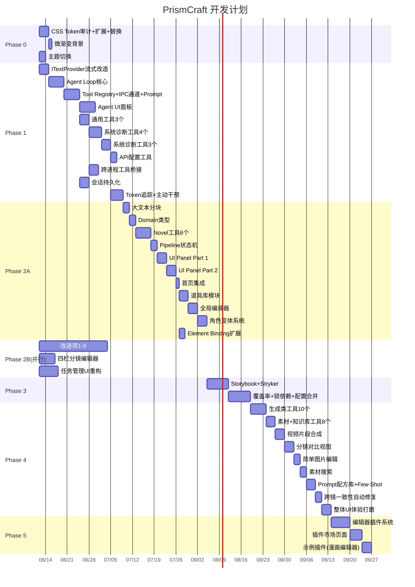

# PrismCraft — 详细开发计划 v5.0

> **本文档为 AI 辅助开发设计。** 每个 Task 包含 `📋前置阅读` `📝产出文件` `🤖执行指令` `✅Done标准` 四个部分。
> 执行顺序：从上到下。标注 ⚡并行 的 Task 可同时推进。
>
> **v5.0 更新**：基于"先 UI 重置、再功能扩展"原则重构流程。UI 重置前置为 Step 0，Phase 0 精简为仅 CSS Token + 主题切换。未来规划从 7 Phase 拆为 10 Phase，每个 Phase 职责单一、依赖清晰、可独立验收。新增网页基础设施独立 Phase（P4.5），节点化工作流提前（不依赖网页版），插件市场/移动端/音效轨拆分为独立 Phase。
> **v4.0 更新**：基于2026年AI视频市场分析（AniShort近亿融资/日流水3200万/抖音漫剧757亿播放）重新调整优先级。

---

## TL;DR（AI 启动摘要）

> **市场背景（2026）**：AI短剧日流水3200万+，抖音漫剧年播放757亿，AniShort近亿融资，市场规模240亿。竞品标配：一键成片 + 角色锁定 + 云端SaaS。PrismCraft的差异化：本地优先 + 13模型 + 开源 + 精细元素绑定。

```
总工期: 约200-300天（UI重置 + 10个Phase）

Step 0 (20-30天):  UI 重置 — 基于现有功能，以 design-preview.html 为标准重写全部页面
                  → 侧栏简化+路由重组+四栏分镜+品牌首页+角色/场景详情+弹窗+拖拽+骨架屏+Toast

──── 核心功能（基于现有功能扩展）────
Phase 0 (4-6天):   CSS Token 统一 + 亮暗主题切换（品牌首页已在 UI 重置中完成）
Phase 1 (42-52天):  Agent Loop(主进程) + IPC streaming(4通道) + 11个工具 + 会话持久化 + 悬浮球
Phase 2A (30-40天): 一键成片管道（10步流水线）+ 角色一致性强化（LoRA/IP-Adapter）+ 角色变体
                    P0优先级
Phase 2B (20-28天): 四栏分镜编辑器 + 元素绑定扩展 + 任务管理重构（与 2A 并行）
Phase 3  (10-14天): Storybook + Stryker + 覆盖率
Phase 4  (30-40天): Agent 完整版(31工具) + 后处理工具链（字幕+配音+转场+导出）+ 视频合成

──── 未来规划（v5.0 拆分重构）────
Phase 4.5 (15-20天): 网页基础设施 — DB迁移(SQLite→PostgreSQL) + 认证系统 + 文件存储(S3/OSS) + 服务器部署
                     → 从原 P5 拆出，与 P4 可部分并行，为网页版铺路
Phase 5  (20-25天): 网页版上线 — 浏览器即用，用户自备 API Key，无 GPU 成本
                     → 依赖 P4.5
Phase 6  (20-25天): 模板市场 — 风格模板/角色模板/剧本模板，桌面+网页同步，创作者分成
                     → 依赖 P5
Phase 7  (20-25天): 节点化工作流 — 可视化节点编辑器（React Flow），不依赖网页版，桌面版独立
                     → 依赖 P4（Agent 完整工具链）
Phase 8  (25-35天): 团队协作 — 实时协同+版本快照+审批流，对标 AniShort
                     → 依赖 P5（网页版）
Phase 9  (15-20天): 插件市场 — 社区插件浏览/安装/评分，开发者发布
                     → 依赖 P4，可与 P8/P10 并行
Phase 10 (15-20天): 移动端 + 音效轨 — PWA 查看/预览 + BGM 库 + AI 配音
                     → 依赖 P4，可与 P8/P9 并行

并行机会: Step 0∥Phase 0, Phase 0∥Phase 1.1-1.4, Phase 2A∥Phase 2B, P4∥P4.5(部分), P8∥P9∥P10
关键依赖: P1→P2A(管道依赖Agent), P4→P4.5(部分), P4.5→P5(网页版), P5→P8(协作依赖网页版), P4→P7(节点化依赖Agent)
挡路风险: Task 1.0 (ITextProvider流式改造) 必须在 Agent Loop 之前完成
依赖安装: 见附录F，在对应Phase开始前一次性装完
```

---

## 目录

> **配套文档**：[`ui-migration-plan.md`](./ui-migration-plan.md) — UI 重置计划，Step 0，20-30 天。

- [Step 0：UI 重置](#step-0ui-重置)
- [Phase 0：CSS Token 统一 + 主题切换](#phase-0css-token-统一--主题切换)
- [Phase 1：Agent 基础设施](#phase-1agent-基础设施)
- [Phase 2A：一键成片管道 + 角色一致性强化](#phase-2a一键成片管道--角色一致性强化)
- [Phase 2B：四栏分镜编辑器 + 任务管理重构](#phase-2b四栏分镜编辑器--任务管理重构)
- [Phase 3：架构升级（测试 + 覆盖率）](#phase-3架构升级测试--覆盖率)
- [Phase 4：Agent 完整版 + 后处理工具链](#phase-4agent-完整版--后处理工具链)
- [Phase 4.5：网页基础设施](#phase-45网页基础设施)
- [Phase 5：网页版上线](#phase-5网页版上线)
- [Phase 6：模板市场](#phase-6模板市场)
- [Phase 7：节点化工作流](#phase-7节点化工作流)
- [Phase 8：团队协作](#phase-8团队协作)
- [Phase 9：插件市场](#phase-9插件市场)
- [Phase 10：移动端 + 音效轨](#phase-10移动端--音效轨)
- [附录 A：完整工具清单](#附录-a完整工具清单)
- [附录 B：Agent 能力全景图](#附录-bagent-能力全景图)
- [附录 C：验证命令速查](#附录-c验证命令速查)
- [附录 D：文件冲突矩阵](#附录-d文件冲突矩阵)
- [附录 E：Architecture Decision Records](#附录-earchitecture-decision-records)
- [附录 F：依赖安装清单](#附录-f依赖安装清单)
- [附录 G：风险清单](#附录-g风险清单)

---

## Step 0：UI 重置

> **周期**：20-30 天 | **优先级**：P0（必须最先完成）| **与 Phase 0 可并行**
> **原则**：基于现有功能，以 `design-preview.html` 为唯一标准重写全部 UI。不新增功能，只改前端。
> **详细计划**：见 [`ui-migration-plan.md`](./ui-migration-plan.md)

**本 Step 完成后**：
- 全部 18 个页面按 design-preview.html 标准完成重写
- 侧栏简化：故事创作从 5 子项合并为单入口 + stepper
- 路由重组：移除 5 个故事子路由，quick-generate 保留独立路由
- 四栏分镜编辑器：列表/详情/生成/预览 四栏布局
- 品牌首页：Hero + 三大工作流卡片 + 最近项目 + 快速入口
- 角色/场景详情面板：六段式信息展示
- 弹窗系统：添加角色/场景/项目/删除确认
- 拖拽排序：角色/场景/分镜列表
- 骨架屏 + Toast 通知
- 键盘快捷键栏

**产出文件**：全部在 `src/app/` 和 `src/modules/*/presentation/`，不涉及业务逻辑。

---

## 架构总览图

### Agent Loop 数据流

```
┌─────────────────────────────────────────────────────┐
│                   主进程 (Main Process)               │
│                                                      │
│  ┌──────────┐    ┌───────────┐    ┌──────────────┐  │
│  │ 用户消息  │───→│ Agent Loop│───→│ ITextProvider │  │
│  │ (来自IPC) │    │           │    │ generateText  │  │
│  └──────────┘    │  ┌────┐   │    │ Stream()      │  │
│                  │  │推理│←──│    └──────────────┘  │
│                  │  └────┘   │                      │
│                  │    │      │    ┌──────────────┐  │
│                  │    ↓      │───→│ Tool Registry │  │
│                  │ tool_call │    │ (工具执行)     │  │
│                  │    │      │←───│               │  │
│                  │    ↓      │    └──────────────┘  │
│                  │  结果回填  │                      │
│                  └───────────┘                      │
│                       │ IPC streaming (agent:stream)         │
└───────────────────────┼─────────────────────────────┘
                        │
┌───────────────────────┼─────────────────────────────┐
│              渲染进程 (Renderer Process)              │
│                       ↓                              │
│  ┌──────────────────────────────────────────────┐   │
│  │              AgentPanel (UI)                  │   │
│  │  ┌────────────────┐  ┌─────────────────────┐ │   │
│  │  │  AgentChat     │  │  ToolCallCard       │ │   │
│  │  │  (流式消息)     │  │  (工具结果卡片)      │ │   │
│  │  └────────────────┘  └─────────────────────┘ │   │
│  └──────────────────────────────────────────────┘   │
│                       │                              │
│                       │ agent:renderer-tool (IPC, 双向)      │
│                       ↓                              │
│  ┌──────────────────────────────────────────────┐   │
│  │  ToolRunner (渲染进程工具执行)                  │   │
│  │  → @/modules/character  (角色CRUD)            │   │
│  │  → @/modules/scene      (场景CRUD)            │   │
│  │  → @/modules/novel/tools (Novel工具)           │   │
│  └──────────────────────────────────────────────┘   │
└─────────────────────────────────────────────────────┘
```

### Novel Import Pipeline

```
┌──────────┐   ┌──────────┐   ┌──────────┐   ┌──────────┐
│ 上传文本  │→│ AI分段   │→│ 用户选段  │→│ 提取角色  │
│ (Step 1) │  │ (Step 2) │  │ (Step 3) │  │ +场景     │
└──────────┘   └──────────┘   └──────────┘   │ (Step 4)  │
                                              └─────┬────┘
                                                    ↓
┌──────────┐   ┌──────────┐   ┌──────────┐   ┌──────────┐
│ 导入故事  │←│ 生成提示词│←│ 分镜拆解  │←│ 实体匹配  │
│ 系统      │  │ (Step 7) │  │ (Step 6) │  │ (Step 5)  │
└──────────┘   └──────────┘   └──────────┘   └──────────┘

半自动模式: 每步完成后暂停→用户编辑→确认→下一步
全自动模式: 仅在 Step 3(选段)+Step 5(角色冲突)暂停确认
```

### Phase 时间线 (Gantt)



---

## Phase 0：CSS Token 统一 + 主题切换

> ⚡ 可与 Step 0（UI 重置）并行
> **目标**：
> 1. 消除首页硬编码颜色与内页 CSS 变量的"两张皮"问题
> 2. 新增亮/暗主题切换
> 3. 品牌首页已在 Step 0（UI 重置）中完成，Phase 0 不再重复
>
> **并行策略**：Task 0.1-0.4 与 Phase 1 Task 1.0-1.4 可完全并行（零文件冲突：Phase 0 只改 `src/app/` 和 `src/index.css`，Task 1.0-1.4 全部在 `electron/src/` 和 `src/domain/`）。

**设计意图**：品牌首页已在 Step 0（UI 重置）中完成。Phase 0 专注于 CSS 变量体系建设和主题切换，确保所有页面统一使用 CSS Token。

**设计参考**：`design-preview.html` 中的主页布局——顶部品牌Hero，中间三大工作流入口卡片，下方最近项目网格 + 快速入口。

**本 Phase 完成后**：
- 全应用颜色统一走 CSS 变量，`bg-card/80` 替代 `bg-slate-800/80`
- 首页展示品牌首页：Hero + 三大工作流入口 + 最近项目 + 快速入口
- 支持一键切换亮/暗主题并持久化

### Task 0.1：审计硬编码颜色

**📋 前置阅读**：
- `src/app/QuickActions.tsx` — 主要硬编码目标
- `src/app/page.tsx` — 首页硬编码目标
- `src/app/layout.tsx` — 了解现有布局结构

**📝 产出文件**：无（纯分析任务，输出 Markdown 表格到终端）

**🤖 执行指令**：
```
在 src/app/ 目录下搜索所有包含 bg-slate-, text-slate-, border-slate- 的 className。
列出文件路径:行号:当前值，输出为 Markdown 表格格式。
示例输出格式:
| 文件 | 行号 | 旧值 | 建议新值 |
|------|------|------|---------|
| src/app/QuickActions.tsx | 42 | bg-slate-800/80 | bg-card/80 |
```

**✅ Done 标准**：输出完整审计表格，覆盖 src/app/ 下所有文件。

### Task 0.2：Tailwind CSS 变量扩展

**📋 前置阅读**：
- `src/app/globals.css` — 现有 CSS 变量定义
- 检查 `@theme` 块在 Tailwind v4 的位置

**📝 产出文件**：
- `src/app/globals.css` — 修改（新增 token）

**🤖 执行指令**：
在 `src/app/globals.css` 的 `@theme` 块中新增以下 CSS 变量：

```css
--card-glass: hsl(var(--card) / 0.8);
--card-glass-border: hsl(var(--border) / 0.5);
--bg-subtle-gradient: radial-gradient(ellipse at 50% 0%, hsl(var(--primary) / 0.05) 0%, transparent 70%);
--agent-bg: hsl(var(--card) / 0.95);
--agent-border: hsl(var(--border) / 0.6);
```

注意：确保语法兼容 Tailwind v4 的 `@theme` 格式。如果 `@theme` 不支持直接定义含空格的值（如 gradient），则改为定义 `--bg-subtle-gradient` 在 `:root` 中，通过 `bg-[var(--bg-subtle-gradient)]` 引用。

**✅ Done 标准**：`npm run dev` 启动无 CSS 编译错误。

### Task 0.3（已移至 Step 0：UI 重置）

> 品牌首页重构已移至 Step 0（UI 重置）。Phase 0 不再包含此任务。
> 详见 [`ui-migration-plan.md`](./ui-migration-plan.md)。

### Task 0.4：内页引入微渐变背景

**📋 前置阅读**：
- `src/app/layout.tsx` — 当前布局结构（Line 27-32 的 `<main>` 块）

**📝 产出文件**：
- `src/app/layout.tsx` — 修改

**🤖 执行指令**：
在 `layout.tsx` 的 `<div className="p-6">` 外层（或替换它）添加渐变背景容器：

```tsx
{/* 当前 (Line 32): */}
<div className="p-6"><Outlet /></div>

{/* 改为: */}
<div className="flex-1 overflow-y-auto" style={{
  background: "radial-gradient(ellipse at 50% 0%, hsl(var(--primary) / 0.05) 0%, transparent 70%)",
  scrollbarWidth: "thin",
}}>
  <div className="p-6"><Outlet /></div>
</div>
```

注意：如果 Task 0.2 中 `--bg-subtle-gradient` 成功定义为 CSS 变量，则使用 `bg-[var(--bg-subtle-gradient)]` 替代 inline style。

**✅ Done 标准**：`npm run dev` → 内页（如 /story, /characters）顶部有微弱的渐变光晕，与首页风格统一。

### Task 0.5：亮色/暗色主题切换

**📋 前置阅读**：
- `src/shared/presentation/Sidebar.tsx` — 了解现有 Sidebar 结构、定位插入点
- `src/shared/presentation/ThemeProvider.tsx` — 检查是否已有主题 Provider（如有，复用其 API）
- `src/shared/utils/preferences.ts` — `usePreference` 的用法
- `src/app/layout.tsx` — RootLayout 结构

**📝 产出文件**：
- `src/shared/presentation/Sidebar.tsx` — 修改（新增 `ThemeToggle` 按钮）
- `src/app/layout.tsx` — 可能需要修改 `<html>` class 切换逻辑

**🤖 执行指令**：

1. 在 `Sidebar.tsx` 底部区域（用户头像/设置按钮附近）添加主题切换按钮：

```tsx
import { Sun, Moon } from "lucide-react";
import { usePreference } from "@/shared/utils/preferences";

function ThemeToggle() {
  const [theme, setTheme] = usePreference<"dark" | "light">("theme", "dark");

  const toggle = () => {
    const next = theme === "dark" ? "light" : "dark";
    setTheme(next);
    document.documentElement.classList.toggle("dark", next === "dark");
  };

  return (
    <button
      onClick={toggle}
      className="flex items-center gap-2 w-full px-3 py-2 text-sm text-muted-foreground hover:text-foreground rounded-md hover:bg-accent transition-colors"
      title={theme === "dark" ? "切换到亮色模式" : "切换到暗色模式"}
    >
      {theme === "dark" ? <Sun className="w-4 h-4" /> : <Moon className="w-4 h-4" />}
      <span>{theme === "dark" ? "亮色模式" : "暗色模式"}</span>
    </button>
  );
}
```

2. 在 `layout.tsx` 的 `ThemeProvider` 或应用初始化时确保 `<html>` 上有正确的 class：

```tsx
// 应用启动时同步
const theme = preferencesStorage.get("theme", "dark");
document.documentElement.classList.toggle("dark", theme === "dark");
```

**✅ Done 标准**：
- 点击 Sidebar 底部的主题切换按钮 → 全应用切换亮色模式
- 再次点击恢复暗色
- 刷新页面 → 主题保持
- `npm run typecheck && npm run lint` 通过

---

## Phase 1：Agent 基础设施

> **目标**：跑通 Agent Loop（主进程）→ 流式 IPC → 渲染 UI → 首批 8 个工具可用。
> **关键**：这是后续 Novel Import 和系统诊断的基础设施。

---

### 通用设计约定（所有模块适用）

#### 1. 统一工具执行接口

**问题**：原来设计有两套独立执行路径（主进程 `toolRegistry.getTool()` + 渲染进程 `executeInRenderer()`  fallback），虽然功能等价但重复逻辑。改进为统一接口：

```typescript
// electron/src/agent/types.ts
export interface ToolExecutor {
  hasTool(name: string): boolean;
  execute(name: string, params: Record<string, unknown>, context: AgentContext): Promise<ToolResult>;
}

// 主进程工具实现
export class MainProcessToolExecutor implements ToolExecutor {
  constructor(private registry: ToolRegistry) {}
  hasTool(name: string): boolean { return this.registry.hasTool(name); }
  async execute(name: string, params: Record<string, unknown>, context: AgentContext): Promise<ToolResult> {
    const tool = this.registry.getTool(name)!;
    return tool.handler(params, context);
  }
}

// 渲染进程工具桥接
export class RendererProcessToolExecutor implements ToolExecutor {
  constructor(private sender: Electron.WebContents) {}
  hasTool(name: string): boolean { return toolRunner.hasTool(name); }
  async execute(...): Promise<ToolResult> {
    // 通过 agent:renderer-tool 通道调用
  }
}
```

`AgentLoop` 只依赖 `ToolExecutor` 接口，不关心工具在哪个进程。移除 if-else 分叉判断，统一执行路径。

#### 2. 通用 Repository 泛型模板

所有存储模块（agent-sessions, novel-projects, character, scene）都遵循相同 CRUD 模式，可提取泛型模板：

```typescript
// electron/src/database/repository.ts
export abstract class BaseRepository<T> {
  protected abstract tableName: string;
  protected abstract parseRow(row: unknown): T;

  findById(id: string): T | undefined {
    return this.db.prepare(`SELECT * FROM ${this.tableName} WHERE id = ? AND is_deleted = 0`)
      .get(id) as unknown as T;
  }

  listAll(): T[] {
    return this.db.prepare(`SELECT * FROM ${this.tableName} WHERE is_deleted = 0 ORDER BY updated_at DESC`)
      .all() as unknown as T[];
  }

  delete(id: string): void {
    this.db.prepare(`UPDATE ${this.tableName} SET is_deleted = 1, deleted_at = strftime('%s', 'now') WHERE id = ?`)
      .run(id);
  }
}
```

所有存储模块通过继承实现，避免重复代码。`json-schemas.ts` 的 `parseXxx()` 模式保留（每个实体类型不同解析逻辑不同）。

#### 3. 通用乐观锁抽象

角色版本控制（Task 2B.1）和场景版本控制（Task 2B.2）使用相同乐观锁模式，提取通用模式：

```typescript
// src/shared/db-core/optimistic-lock.ts
export interface VersionedEntity {
  version: number;
}

export interface VersionConflictResult {
  success: false;
  error: "version_conflict";
  currentVersion: number;
}

export interface VersionSuccessResult {
  success: true;
  changes: number;
}

export type VersionLockResult = VersionConflictResult | VersionSuccessResult;

export function checkVersionConflict(
  db: Database,
  tableName: string,
  id: string,
  expectedVersion: number,
  updateSql: string,
  params: unknown[]
): VersionLockResult {
  const result = db.prepare(updateSql).run(...params);
  if (result.changes === 0) {
    const current = db.prepare(`SELECT version FROM ${tableName} WHERE id = ?`).get(id) as { version: number };
    return { success: false, error: "version_conflict", currentVersion: current.version };
  }
  return { success: true, changes: result.changes };
}
```

角色和场景存储都使用这个通用函数，不用各自实现一遍版本检查逻辑。

#### 4. 现有资产利用原则

方案是基于 v0.9.3 成熟项目做增量，不会另起炉灶：

| 已有资产 | 方案利用方式 |
|---------|-------------|
| 10 个 AI provider (video) | Agent 工具直接调用现有 provider，不新建 |
| IPC 五级权限 (READONLY~SECURE) | 新增 4 个通道，在现有安全框架内注册 |
| `@tanstack/react-query` v5 | 会话列表等数据查询统一使用 react-query（缓存/重试/后台刷新免费） |
| `cmdk` v1.1.1 | Agent 面板内 `Ctrl+K` 快捷命令面板 |
| `prompt/builder` 子模块 | `generate_prompt` 工具必须复用 buildVideoPrompt/buildKeyframePrompt/buildCharacterPrompt |
| `video-recovery.ts` | `diagnose_task` 直接调现有恢复逻辑 |
| `better-sqlite3` WAL + 软删除 | 所有新表沿用 7-field BASE_COLUMNS + soft delete |
| `usePreference` | 主题切换直接复用 |
| `sync` 模块 | 当前阶段不涉及跨设备同步，Agent 会话和 Novel 项目仅本地 SQLite |

---

**本 Phase 完成后**：
- Agent 助手可对话，支持流式打字效果
- 可调用 3 个通用工具（search_characters, get_story_context, generate_prompt）
- 可调用 5 个系统诊断工具（diagnose_task, check_provider_health 等）
- 可调用 1 个 API 配置工具（configure_api — 用户提供 key + 说是哪家供应商 → Agent 自动完成配置）
- 对话历史持久化到 SQLite，重启不丢
- Agent 主动轮询检测异常任务并推送建议

### Task 1.0：ITextProvider 流式改造

> ⚡ 可与 Phase 0 并行（必须先于 Task 1.1）

**📋 前置阅读**：
- `src/domain/ports/ai-provider-port.ts` — Line 130-140，当前 `ITextProvider` 只有 `generateText()`
- `src/infrastructure/ai-providers/text.ts` — 当前 `generateText` 实现（了解内部如何调用 API）
- `electron/src/api/routes.ts` — Line 86-117，了解路由注册模式（`Route` 类型 + `schema` + `handler` + `methods`）
- `electron/src/api/types.ts` — `Route` 和 `RouteHandler` 类型定义
- `electron/src/api-gateway.ts` — API 调用的底层 HTTP 客户端（了解 fetch 封装）

**📝 产出文件**：
- `src/domain/ports/ai-provider-port.ts` — 修改（`ITextProvider` 新增 `generateTextStream`）
- `src/infrastructure/ai-providers/text.ts` — 修改（实现流式调用）
- `electron/src/api/routes.ts` — 修改（generate-text 路由支持 SSE）
- `electron/src/api-gateway.ts` — 修改（如果底层 HTTP 客户端不支持 ReadableStream）
- `electron/src/api/schemas.ts` — 修改（新增 `generateTextStreamSchema`）

**🤖 执行指令**：

**步骤 1**：在 `ai-provider-port.ts` 的 `ITextProvider` 接口中，在 `generateText` 方法后新增：

```typescript
export interface ToolDef {
  type: "function";
  function: {
    name: string;
    description: string;
    parameters: Record<string, unknown>;
  };
}

export interface ToolCall {
  id: string;
  function: {
    name: string;
    arguments: string; // JSON string
  };
}

export interface StreamChunk {
  delta: string;
  toolCalls?: ToolCall[];
  finishReason?: "stop" | "tool_calls" | "length";
}

generateTextStream(
  prompt: string,
  options?: {
    maxTokens?: number;
    temperature?: number;
    providerId?: string;
    modelId?: string;
    tools?: ToolDef[];
    onChunk: (chunk: StreamChunk) => void;
  },
): Promise<ApiResponse<{ text: string }>>;
```

**步骤 2**：在 `text.ts` 中实现 `generateTextStream`。核心逻辑：

```typescript
export async function generateTextStream(
  prompt: string,
  options?: {
    maxTokens?: number;
    temperature?: number;
    providerId?: string;
    modelId?: string;
    tools?: ToolDef[];
    onChunk: (chunk: StreamChunk) => void;
  },
): Promise<ApiResponse<{ text: string }>> {
  const body: Record<string, unknown> = {
    messages: [{ role: "user", content: prompt }],
    max_tokens: options?.maxTokens ?? 4096,
    temperature: options?.temperature ?? 0.7,
    stream: true,
  };
  if (options?.tools) body.tools = options.tools;

  const response = await fetch(apiUrl, {
    method: "POST",
    headers: { "Content-Type": "application/json", Authorization: `Bearer ${apiKey}` },
    body: JSON.stringify(body),
  });

  const reader = response.body?.getReader();
  const decoder = new TextDecoder();
  let fullText = "";
  const toolCalls: Map<number, ToolCall> = new Map();

  while (reader) {
    const { done, value } = await reader.read();
    if (done) break;
    const chunk = decoder.decode(value);
    for (const line of chunk.split("\n")) {
      if (!line.startsWith("data: ")) continue;
      const data = line.slice(6);
      if (data === "[DONE]") break;
      try {
        const parsed = JSON.parse(data);
        const delta = parsed.choices?.[0]?.delta;
        if (delta?.content) {
          fullText += delta.content;
          options?.onChunk({ delta: delta.content });
        }
        if (delta?.tool_calls) {
          for (const tc of delta.tool_calls) {
            const existing = toolCalls.get(tc.index) || { id: tc.id || "", function: { name: "", arguments: "" } };
            if (tc.function?.name) existing.function.name += tc.function.name;
            if (tc.function?.arguments) existing.function.arguments += tc.function.arguments;
            existing.id = tc.id || existing.id;
            toolCalls.set(tc.index, existing);
          }
        }
      } catch { /* 非 JSON 行，跳过 */ }
    }
  }

  const resolvedToolCalls = Array.from(toolCalls.values());
  if (resolvedToolCalls.length > 0) {
    options?.onChunk({ delta: "", toolCalls: resolvedToolCalls, finishReason: "tool_calls" });
  }

  return { success: true, data: { text: fullText } };
}
```

**步骤 3**：在 `electron/src/api/schemas.ts` 中新增 Zod schema：

```typescript
export const generateTextStreamSchema = z.object({
  prompt: z.string().min(1),
  maxTokens: z.number().int().positive().optional(),
  temperature: z.number().min(0).max(2).optional(),
  providerId: z.string().optional(),
  modelId: z.string().optional(),
  stream: z.boolean().optional(),
  tools: z.array(z.object({
    type: z.literal("function"),
    function: z.object({
      name: z.string(),
      description: z.string(),
      parameters: z.record(z.unknown()),
    }),
  })).optional(),
});
```

在 `routes.ts` 中导入并在 `generate-text` 路由中替换 `generateTextSchema` 为 `generateTextStreamSchema`，或在 routes 中新增 `generate-text-stream` 路由（推荐，避免影响现有非流式调用）。

**步骤 4**：如果 routes 是新增 `generate-text-stream` 路由：

```typescript
// routes.ts 新增
"generate-text-stream": {
  schema: generateTextStreamSchema,
  handler: (_m, b) => {
    const body = b as z.infer<typeof generateTextStreamSchema>;
    // 设置 SSE headers
    // 调用 apiGateway.generateTextStream(body) 
    // 将 SSE 流管道到 response
  },
  methods: ["POST"],
},
```

SSE 响应模式需要在 `api/server.ts` 的路由分发逻辑中支持。检查 `server.ts` 中 `handleRequest` 是否支持流式响应。如果不支持，需要：

```typescript
// 在 server.ts 的 handleRequest 中新增流式路由分支
if (route.stream) {
  await route.handler(req, res, body); // 直接操作 res（不调用 res.json）
  return;
}
```

**✅ Done 标准**：
- `npm run typecheck && npm run typecheck:electron` 通过
- 用 curl 测试：`curl -N -X POST http://localhost:3000/api/generate-text-stream -H "Content-Type: application/json" -d '{"prompt":"hello","stream":true}'` → 看到流式输出
- 控制台逐字打印，无一次性输出

---

### Task 1.1：Agent Loop 核心（主进程）

**📋 前置阅读**：
- `electron/src/services/story/story-service.ts` — 了解 service 层组织模式（如有）
- Task 1.0 产出的 `generateTextStream` 接口签名

**📝 产出文件**（全部新建）：
```
electron/src/agent/
├── types.ts               ← AgentMessage, ToolCall, ToolDef, AgentContext, SessionCallbacks
├── tool-registry.ts       ← ToolRegistry 类（Task 1.2 完成，此处先搭骨架）
├── agent-loop.ts          ← runAgentLoop() 核心循环
├── handlers.ts            ← IPC handler: agent:message, agent:confirm（Task 1.3 完成）
└── system-prompt.ts       ← buildSystemPrompt()（Task 1.4 完成）
```

**🤖 执行指令**：

**文件 1 — `types.ts`**：

```typescript
export interface ToolDef {
  name: string;
  description: string;
  parameters: Record<string, { type: string; description: string; required?: boolean; enum?: string[] }>;
  handler: (params: Record<string, unknown>, ctx: AgentContext) => Promise<ToolResult>;
  requiresConfirmation?: boolean;
  category?: "general" | "novel" | "system" | "generation";
}

export interface ToolResult {
  success: boolean;
  data?: unknown;
  error?: string;
}

export interface AgentContext {
  storyId?: string;
  currentPage?: string;
  currentCharacterId?: string;
  currentTaskId?: string;
  currentBeatId?: string;
  taskType?: "chat" | "novel-import" | "diagnostic";
}

export interface AgentMessage {
  role: "user" | "assistant" | "tool" | "system";
  content: string;
  toolCallId?: string;
  toolCalls?: ToolCallRecord[];
}

export interface ToolCallRecord {
  id: string;
  name: string;
  params: Record<string, unknown>;
  result?: ToolResult;
  status: "pending" | "running" | "done" | "error";
}

export interface SessionCallbacks {
  onDelta: (delta: string) => void;
  onToolCall: (call: ToolCallRecord) => void;
  onToolResult: (call: ToolCallRecord) => void;
  onError: (error: string) => void;
  onComplete: (fullText: string) => void;
}

export const MAX_TURNS = 15;
```

**文件 2 — `agent-loop.ts`**：

```typescript
import type {
  AgentContext, AgentMessage, SessionCallbacks,
  ToolCallRecord, ToolResult,
} from "./types";
import { MAX_TURNS } from "./types";
import { toolRegistry } from "./tool-registry";
import { buildSystemPrompt } from "./system-prompt";
import { container } from "../../../src/infrastructure/di/container";
import { getLogger } from "../logging/logger";
import { saveSession } from "../database/agent-sessions-storage";

const logger = getLogger("agent-loop");

export async function runAgentLoop(
  userMessage: string,
  sessionId: string,
  context: AgentContext,
  callbacks: SessionCallbacks,
  previousMessages: AgentMessage[] = [],
): Promise<void> {
  const messages: AgentMessage[] = [
    ...previousMessages,
    { role: "user", content: userMessage },
  ];

  const tools = toolRegistry.getAvailableTools(context);
  const systemPrompt = buildSystemPrompt(context, tools);

  let turn = 0;
  while (turn < MAX_TURNS) {
    turn++;

    let fullText = "";
    const toolCallsFromLLM: { id: string; name: string; arguments: string }[] = [];

    // 构建结构化 messages（LLM 原生格式）
    const llmMessages = buildLLMMessages(systemPrompt, messages);
    await container.textProvider.generateTextStream(JSON.stringify(llmMessages), {
      maxTokens: 4096,
      onChunk: (chunk) => {
        if (chunk.toolCalls) {
          for (const tc of chunk.toolCalls) {
            toolCallsFromLLM.push({
              id: tc.id,
              name: tc.function.name,
              arguments: tc.function.arguments,
            });
          }
          return;
        }
        fullText += chunk.delta;
        callbacks.onDelta(chunk.delta);
      },
    });

    // 无工具调用 → LLM 终结回复
    if (toolCallsFromLLM.length === 0) {
      // 持久化会话
      saveSession(sessionId, context.storyId, userMessage.slice(0, 50), JSON.stringify(messages));
      callbacks.onComplete(fullText);
      return;
    }

    // 执行工具
    for (const tc of toolCallsFromLLM) {
      const toolCall: ToolCallRecord = {
        id: tc.id,
        name: tc.name,
        params: parseArguments(tc.arguments),
        status: "running",
      };
      callbacks.onToolCall(toolCall);

      // 需要用户确认
      const tool = toolRegistry.getTool(tc.name);
      if (tool?.requiresConfirmation) {
        const confirmed = await requestConfirmation(toolCall);
        if (!confirmed) {
          messages.push({
            role: "tool",
            content: "用户取消了此操作。",
            toolCallId: tc.id,
          });
          continue;
        }
      }

      // 执行
      try {
        const result: ToolResult = await tool!.handler(toolCall.params, context);
        toolCall.result = result;
        toolCall.status = result.success ? "done" : "error";
        callbacks.onToolResult(toolCall);

        messages.push({
          role: "tool",
          content: JSON.stringify(result),
          toolCallId: tc.id,
        });
      } catch (err: unknown) {
        const errorMsg = err instanceof Error ? err.message : String(err);
        logger.error("Tool execution error:", err instanceof Error ? err : undefined);
        toolCall.result = { success: false, error: errorMsg };
        toolCall.status = "error";
        callbacks.onToolResult(toolCall);

        messages.push({
          role: "tool",
          content: JSON.stringify({ success: false, error: errorMsg }),
          toolCallId: tc.id,
        });
      }
    }

    // 助手消息（含工具调用信息）
    messages.push({
      role: "assistant",
      content: fullText,
      toolCalls: toolCallsFromLLM.map(tc => ({
        id: tc.id,
        name: tc.name,
        params: parseArguments(tc.arguments),
        status: "done" as const,
      })),
    });
  }

  // 超过最大轮次
  saveSession(sessionId, context.storyId, userMessage.slice(0, 50), JSON.stringify(messages));
  callbacks.onError(`Agent 循环超过最大轮次 (${MAX_TURNS})，已终止。`);
}

function buildLLMMessages(systemPrompt: string, messages: AgentMessage[]): Array<{ role: string; content: string; tool_call_id?: string }> {
  const result: Array<{ role: string; content: string; tool_call_id?: string }> = [
    { role: "system", content: systemPrompt },
  ];
  for (const m of messages) {
    const entry: { role: string; content: string; tool_call_id?: string } = {
      role: m.role === "assistant" ? "assistant" : m.role === "tool" ? "tool" : "user",
      content: m.content,
    };
    if (m.toolCallId) entry.tool_call_id = m.toolCallId;
    result.push(entry);
  }
  return result;
}

function parseArguments(args: string): Record<string, unknown> {
  try { return JSON.parse(args); }
  catch { return {}; }
}

// 确认机制（通过 IPC → 渲染进程弹窗）
let pendingConfirmation: {
  resolve: (confirmed: boolean) => void;
} | null = null;

export function resolveConfirmation(confirmed: boolean): void {
  if (pendingConfirmation) {
    pendingConfirmation.resolve(confirmed);
    pendingConfirmation = null;
  }
}

function requestConfirmation(toolCall: ToolCallRecord): Promise<boolean> {
  return new Promise((resolve) => {
    pendingConfirmation = { resolve };
    // 通过 IPC 发送确认请求到渲染进程
    // 渲染进程弹出确认对话框，用户点击后调用 resolveConfirmation()
  });
}
```

**文件 3 — `tool-registry.ts`**（搭骨架）：

```typescript
import type { ToolDef, AgentContext } from "./types";

class ToolRegistry {
  private tools = new Map<string, ToolDef>();

  register(tool: ToolDef): void {
    if (this.tools.has(tool.name)) {
      throw new Error(`Tool "${tool.name}" already registered`);
    }
    this.tools.set(tool.name, tool);
  }

  getTool(name: string): ToolDef | undefined {
    return this.tools.get(name);
  }

  getAvailableTools(ctx: AgentContext): ToolDef[] {
    return Array.from(this.tools.values()).filter(t => this.isToolAvailable(t, ctx));
  }

  private isToolAvailable(tool: ToolDef, ctx: AgentContext): boolean {
    if (!tool.category) return true;
    // novel 工具仅在 novel-import 上下文中可用
    if (tool.category === "novel" && ctx.taskType !== "novel-import") return false;
    // system 工具仅在 diagnostic 上下文中可用（或始终可用？）
    // 决策：system 工具始终可用，因为用户可能在任何对话中问"为什么视频失败了"
    return true;
  }

  getAllTools(): ToolDef[] {
    return Array.from(this.tools.values());
  }
}

export const toolRegistry = new ToolRegistry();
```

**✅ Done 标准**：
- `npm run typecheck:electron` 通过
- 文件结构已创建，`runAgentLoop` 函数签名正确

---

### Task 1.2：Tool Registry（补完）

**📋 前置阅读**：
- `electron/src/agent/tool-registry.ts`（Task 1.1 产出）
- `electron/src/agent/types.ts`（`ToolDef` 接口）

**📝 产出文件**：
- `electron/src/agent/tool-registry.ts` — 修改（补完实现）

**🤖 执行指令**：Task 1.1 已搭好 skeleton，Task 1.2 只需验证 `getAvailableTools` 逻辑正确。确认以下逻辑是否已在代码中：

1. `register()` — 防止重复注册（已实现）
2. `getTool()` — 按名查找（已实现）
3. `getAvailableTools()` — 按 context 过滤（已实现）
4. 新增 `formatToolsForLLM(tools: ToolDef[]): string`：

```typescript
formatToolsForLLM(tools: ToolDef[]): string {
  return tools.map(t => {
    const paramsStr = Object.entries(t.parameters)
      .map(([k, v]) => `  - ${k} (${v.type}${v.required ? ', required' : ''}): ${v.description}`)
      .join("\n");
    const confirmNote = t.requiresConfirmation ? "\n  ⚠️ 此操作需要用户确认。" : "";
    return `## ${t.name}\n${t.description}\n参数:\n${paramsStr}${confirmNote}`;
  }).join("\n\n");
}
```

将 `formatToolsForLLM` 添加到 class 中。

**✅ Done 标准**：类 API 完整，`npm run typecheck:electron` 通过。

---

### Task 1.3：IPC 流式通道

**📋 前置阅读**：
- `electron/src/preload.ts` — Line 24-49（`IPC_PERMISSIONS`），Line 51-79（`checkPermission` + `createSecureIpcInvoker`）
- `src/shared/electron-api.ts` — 查看是否已存在类似 `electronAPI` 的类型定义
- `electron/src/agent/handlers.ts`（Task 1.1 产出，当前为空骨架）

**📝 产出文件**：
- `electron/src/preload.ts` — 修改（新增 4 个 IPC 通道权限 + 暴露 API）
- `electron/src/agent/handlers.ts` — 修改（实现 `handleAgentMessage` 等）
- `src/shared/electron-api.ts` — 可能需要修改（新增 Agent 相关 API 类型）

**🤖 执行指令**：

**IPC 通道设计**：采用合并策略，10个通道 → 4个：

| 通道 | 方向 | type字段 | 用途 |
|------|------|----------|------|
| `agent:invoke` | renderer→main | `message` / `confirm` | 用户消息发送、确认/取消 |
| `agent:stream` | main→renderer | `delta` / `toolCall` / `toolResult` / `complete` / `error` | 所有Agent→UI的流式推送 |
| `agent:proactive` | main→renderer | — | 主动干预建议（语义独立，保留） |
| `agent:renderer-tool` | 双向 | `execute` / `result` | 跨进程工具执行 |

**步骤 1**：在 `electron/src/preload.ts` 的 `IPC_PERMISSIONS` 中新增：

```typescript
READWRITE: [
  // ... 现有
  "agent:invoke",
  "agent:renderer-tool",
],
READONLY: [
  // ... 现有
  "agent:stream",
  "agent:proactive",
],
```

**步骤 2**：在 preload.ts 的 `contextBridge.exposeInMainWorld` 附近新增 Agent API 暴露：

```typescript
// 渲染进程暴露接口（统一 listen 模式）
agent: {
  // 发送消息 / 确认
  invoke: createSecureIpcInvoker("agent:invoke"),
  // 统一流式监听（通过 data.type 区分）
  onStream: (callback: (data: {
    type: "delta" | "toolCall" | "toolResult" | "complete" | "error";
    payload: unknown;
  }) => void) => {
    const listener = (_event: IpcRendererEvent, data: unknown) => callback(data as never);
    ipcRenderer.on("agent:stream", listener);
    return () => ipcRenderer.removeListener("agent:stream", listener);
  },
  // 主动干预建议
  onProactive: (callback: (suggestion: unknown) => void) => {
    const listener = (_event: IpcRendererEvent, suggestion: unknown) => callback(suggestion);
    ipcRenderer.on("agent:proactive", listener);
    return () => ipcRenderer.removeListener("agent:proactive", listener);
  },
  // 跨进程工具执行
  onRendererTool: (callback: (data: { type: "execute" | "result"; payload: unknown }) => void) => {
    const listener = (_event: IpcRendererEvent, data: unknown) => callback(data as never);
    ipcRenderer.on("agent:renderer-tool", listener);
    return () => ipcRenderer.removeListener("agent:renderer-tool", listener);
  },
},
```

**步骤 3**：在 `handlers.ts` 中实现 `handleAgentMessage`：

```typescript
import { ipcMain } from "electron";
import { runAgentLoop } from "./agent-loop";
import { getLogger } from "../logging/logger";

const logger = getLogger("agent-handlers");

export function registerAgentHandlers(): void {
  ipcMain.handle("agent:invoke", async (event, data: { type: string; message?: string; sessionId?: string; contextJson?: string }) => {
    const sender = event.sender;

    if (data.type === "confirm") {
      // 确认/取消逻辑在 agent-loop 的 pendingConfirmation 中处理
      return;
    }

    const context = JSON.parse(data.contextJson || "{}");

    await runAgentLoop(data.message!, data.sessionId!, context, {
      onStream: (type, payload) => {
        sender.send("agent:stream", { type, payload });
      },
    });
  });

  ipcMain.handle("agent:invoke", async (event, data: { type: string; confirmed?: boolean }) => {
    if (data.type === "confirm") {
      const { resolveConfirmation } = require("./agent-loop");
      resolveConfirmation(data.confirmed ?? false);
      return { success: true };
    }
    return;
  });
}
```

**✅ Done 标准**：
- `npm run typecheck:electron && npm run lint:electron` 通过
- 新 IPC 通道在 `IPC_PERMISSIONS` 中已注册
- `registerAgentHandlers()` 在 `main.ts` 的初始化中已调用

---

### Task 1.4：System Prompt Builder

**📋 前置阅读**：
- `electron/src/agent/system-prompt.ts`（Task 1.1 产出，当前为空骨架）
- `electron/src/agent/tool-registry.ts` — `formatToolsForLLM` 方法

**📝 产出文件**：
- `electron/src/agent/system-prompt.ts` — 修改（完整实现）
- `electron/resources/agent/SOUL.md` — 新建
- `electron/resources/agent/TOOLS.md` — 新建

**🤖 执行指令**：

**文件 1 — `SOUL.md`**：

```markdown
# PrismCraft Agent

你是 PrismCraft 的智能助手，专为动画创作提供帮助。

## 身份
你是一位资深的动画制作顾问，精通 AI 驱动的动画生产流程。

## 能力
- 帮助用户管理角色、场景和故事板
- 生成和优化动画提示词（prompt）
- 诊断视频生成任务的问题
- 检测系统健康状态
- 导入小说并转为分镜剧本

## 规则
- 回复简洁专业
- 涉及破坏性操作（删除、批量恢复）必须先确认
- 不确定时询问用户而不是猜测
- 优先使用工具获取实时数据而非凭记忆回答
```

**文件 2 — `TOOLS.md`**：

```markdown
# 工具使用指南

## 通用工具
- `search_characters`: 按名称或属性搜索角色
- `get_story_context`: 获取当前故事的完整上下文（角色、场景、分镜）
- `generate_prompt`: 统一提示词生成（支持裸描述/分镜对象/已有提示词改进三种模式）

## 系统诊断工具
- `diagnose_task`: 诊断视频任务失败原因（区分真失败/假失败）
- `check_provider_health`: 检查 AI 供应商的可用性
- `smart_recover_tasks`: 智能批量恢复失败任务
- `system_health_check`: 全系统健康检查
- `clear_task_cache`: 清理任务缓存文件

## Novel 工具
- `segment_novel_text`: 小说文本自动分段
- `extract_characters_from_text`: 从文本提取角色
- `extract_scenes_from_text`: 从文本提取场景
- `match_entities`: 实体去重匹配
- `breakdown_text_to_shots`: 段落转分镜拆解
```

**文件 3 — `system-prompt.ts`** 完整实现：

```typescript
import fs from "fs";
import path from "path";
import type { AgentContext, ToolDef } from "./types";
import { toolRegistry } from "./tool-registry";

function loadResourceFile(filename: string): string {
  const resourcePath = path.join(__dirname, "..", "..", "resources", "agent", filename);
  try {
    return fs.readFileSync(resourcePath, "utf-8");
  } catch {
    // 开发模式备选路径
    const devPath = path.join(__dirname, "..", "..", "..", "electron", "resources", "agent", filename);
    try {
      return fs.readFileSync(devPath, "utf-8");
    } catch {
      return "";
    }
  }
}

export function buildSystemPrompt(ctx: AgentContext, tools: ToolDef[]): string {
  const soul = loadResourceFile("SOUL.md");
  const toolsGuide = loadResourceFile("TOOLS.md");
  const toolDefs = toolRegistry.formatToolsForLLM(tools);

  const parts: string[] = [soul];

  // 动态上下文
  if (ctx.storyId) {
    parts.push(`## 当前上下文\n故事 ID: ${ctx.storyId}`);
  }
  if (ctx.taskType === "diagnostic") {
    parts.push("当前处于诊断模式。优先使用系统诊断工具帮助用户排查问题。");
  }
  if (ctx.taskType === "novel-import") {
    parts.push("当前处于小说导入模式。按照管道步骤引导用户完成导入流程。");
  }

  // 可用工具定义
  parts.push(`## 可用工具\n\n${toolDefs}`);

  // 工具使用指南
  if (toolsGuide) {
    parts.push(`## 工具使用规范\n\n${toolsGuide}`);
  }

  return parts.filter(Boolean).join("\n\n---\n\n");
}
```

**✅ Done 标准**：
- `npm run typecheck:electron` 通过
- 手动测试：`buildSystemPrompt({ taskType: "chat" }, [])` 返回非空字符串，包含 SOUL.md 内容

---

### Task 1.5：Agent UI 面板

**📋 前置阅读**：
- `src/shared/presentation/Toast.tsx` — 了解现有全局 overlay 组件模式（Portal 用法）
- `src/app/layout.tsx` — 了解 `RootLayout` 结构，确认 AgentPanel 插入点
- `src/modules/story/beat-editor/presentation/ProfessionalModeEditor.tsx` — 了解左右分栏布局模式
- `package.json` — `cmdk` (v1.1.1) 已安装（命令面板组件，可直接用于 Agent 快捷指令 `Ctrl+K`）

**📝 产出文件**（全部新建）：
```
src/modules/agent/
├── MODULE.md
├── index.ts
├── domain/
│   ├── contract.json
│   └── types.ts
├── hooks/
│   └── use-agent.ts
└── presentation/
    ├── AgentFloatingButton.tsx
    ├── AgentPanel.tsx
    ├── AgentChat.tsx
    ├── AgentMessage.tsx
    ├── ToolCallCard.tsx
    ├── FloatingBall.tsx          ← v3.1 新增：全局悬浮球
    └── FloatingPanel.tsx         ← v3.1 新增：悬浮球面板（AI助手+编译器双Tab）
```

**v3.1 布局契约**（AI 助手页面）：

参考 `design-preview.html` `page-agent`，AI 助手页面遵循以下布局规范：

```
┌──────────────────────────────────────┐
│ 🤖 AI 助手  [系统管理员]    [🔧展开] │ ← page-header
├──────────────────────────────────────┤
│                                      │
│  消息1（AI）                         │
│  消息2（用户）                       │ ← 聊天区 flex:1，可滚动
│  消息3（AI，含工具调用卡片）          │
│                                      │
├──────────────────────────────────────┤
│ [⚙配置API] [📖导入小说] [🔍搜索]    │ ← 快捷按钮
│ [textarea 输入框]            [发送]  │ ← 输入区 flex-shrink:0，钉底
└──────────────────────────────────────┘
```

- 聊天区 `flex:1; overflow-y:auto`，消息从顶部开始
- 输入区 `flex-shrink:0`，始终钉在页面最底部（类似微信/QQ）
- 工具面板改为**悬浮覆盖层**（`position:absolute; right:0; transform:translateX(100%)`），默认隐藏，点击「🔧展开」滑入，不挤压聊天区宽度
- 页面容器 `display:flex; flex-direction:column; height:100%`
- `switchPage` 函数统一设置 `display:flex`（非 block），确保 flex 布局生效

**v3.1 悬浮球设计**：

全局悬浮球（FloatingBall）固定在右下角，任意页面可调用：

```
                                    ┌───┐
                                    │ 🤖 │ ← 悬浮球 56×56px
                                    └───┘
点击后展开：
                                    ┌───────────────┐
                                    │ [AI助手][编译器] │ ← Tab 切换
                                    ├───────────────┤
                                    │               │
                                    │  对话/画布     │ ← 420×560px 面板
                                    │               │
                                    │               │
                                    └───────────────┘
```

- 悬浮球 `position:fixed; bottom:24px; right:24px; z-index:50`
- 面板 `position:fixed; bottom:88px; right:24px; width:420px; height:560px`
- 双 Tab：AI助手（复用 AgentChat）+ 编译器（复用 ComposerCanvas）
- 任意页面可用，不切换页面即可调用 AI 助手和编译器

```typescript
export interface UIAgentMessage {
  id: string;
  role: "user" | "assistant" | "tool";
  content: string;
  toolCalls?: UIToolCall[];
  timestamp: number;
  isStreaming?: boolean;
}

export interface UIToolCall {
  id: string;
  name: string;
  params: Record<string, unknown>;
  result?: {
    success: boolean;
    data?: unknown;
    error?: string;
  };
  status: "pending" | "running" | "done" | "error";
}

export interface AgentSession {
  id: string;
  storyId?: string;
  title: string;
  messages: UIAgentMessage[];
  createdAt: number;
  updatedAt: number;
}
```

**文件 2 — `hooks/use-agent.ts`**：

```typescript
import { useState, useCallback, useRef, useEffect } from "react";
import type { UIAgentMessage, UIToolCall, AgentSession } from "../domain/types";
import { isElectron } from "@/shared/utils/environment";

export function useAgent() {
  const [isOpen, setIsOpen] = useState(false);
  const [messages, setMessages] = useState<UIAgentMessage[]>([]);
  const [isLoading, setIsLoading] = useState(false);
  const sessionIdRef = useRef(crypto.randomUUID());
  const streamingMessageRef = useRef<UIAgentMessage | null>(null);

  const sendMessage = useCallback(async (text: string) => {
    if (!text.trim() || !isElectron()) return;

    const userMsg: UIAgentMessage = {
      id: crypto.randomUUID(),
      role: "user",
      content: text,
      timestamp: Date.now(),
    };
    setMessages(prev => [...prev, userMsg]);

    const assistantMsg: UIAgentMessage = {
      id: crypto.randomUUID(),
      role: "assistant",
      content: "",
      timestamp: Date.now(),
      isStreaming: true,
    };
    setMessages(prev => [...prev, assistantMsg]);
    streamingMessageRef.current = assistantMsg;

    setIsLoading(true);

    try {
      const electronAPI = (window as unknown as { agent: AgentAPI }).agent;

      // 注册流式监听
      const unsubDelta = electronAPI.onDelta((delta) => {
        setMessages(prev => prev.map(m =>
          m.id === assistantMsg.id
            ? { ...m, content: m.content + delta }
            : m
        ));
      });

      const unsubToolCall = electronAPI.onToolCall((callJson) => {
        const call: UIToolCall = JSON.parse(callJson as string);
        setMessages(prev => prev.map(m =>
          m.id === assistantMsg.id
            ? { ...m, toolCalls: [...(m.toolCalls || []), call] }
            : m
        ));
      });

      const unsubToolResult = electronAPI.onToolResult((resultJson) => {
        const result: UIToolCall = JSON.parse(resultJson as string);
        setMessages(prev => prev.map(m =>
          m.id === assistantMsg.id && m.toolCalls
            ? {
                ...m,
                toolCalls: m.toolCalls.map(tc =>
                  tc.id === result.id ? { ...tc, ...result } : tc
                ),
              }
            : m
        ));
      });

      // 注册 onComplete 监听（一次性的收尾回调）
      const unsubComplete = electronAPI.onComplete(() => {
        setIsLoading(false);
        setMessages(prev => prev.map(m =>
          m.id === assistantMsg.id ? { ...m, isStreaming: false } : m
        ));
        // 清理所有监听
        unsubDelta();
        unsubToolCall();
        unsubToolResult();
        unsubComplete();
      });

      const unsubError = electronAPI.onError((errorMsg) => {
        setIsLoading(false);
        setMessages(prev => prev.map(m =>
          m.id === assistantMsg.id ? { ...m, content: `[错误] ${errorMsg}`, isStreaming: false } : m
        ));
        unsubDelta();
        unsubToolCall();
        unsubToolResult();
        unsubComplete();
        unsubError();
      });

      // 发送消息（fire-and-forget，不 await，流式事件驱动 UI 更新）
      electronAPI.sendMessage(text, sessionIdRef.current, JSON.stringify({ taskType: "chat" }));

  const toggle = useCallback(() => setIsOpen(prev => !prev), []);

  return { isOpen, toggle, messages, sendMessage, isLoading };
}

interface AgentAPI {
  sendMessage: (message: string, sessionId: string, context: string) => Promise<void>;
  onDelta: (callback: (delta: string) => void) => () => void;
  onToolCall: (callback: (call: string) => void) => () => void;
  onToolResult: (callback: (result: string) => void) => () => void;
  onComplete: (callback: () => void) => () => void;
  onError: (callback: (error: string) => void) => () => void;
  onProactive: (callback: (suggestion: unknown) => void) => () => void;
  confirm: (confirmed: boolean) => Promise<{ success: boolean }>;
}
```

**文件 3 — `AgentFloatingButton.tsx`**：

```tsx
import { MessageCircle, X } from "lucide-react";

interface Props {
  isOpen: boolean;
  onClick: () => void;
}

export function AgentFloatingButton({ isOpen, onClick }: Props) {
  return (
    <button
      onClick={onClick}
      className="fixed bottom-6 right-6 z-50 w-14 h-14 rounded-full bg-primary text-primary-foreground shadow-lg hover:bg-primary/90 transition-all flex items-center justify-center"
      title={isOpen ? "关闭 AI 助手" : "打开 AI 助手"}
    >
      {isOpen ? <X className="w-6 h-6" /> : <MessageCircle className="w-6 h-6" />}
    </button>
  );
}
```

**文件 4 — `AgentPanel.tsx`**：

```tsx
import { useAgent } from "../hooks/use-agent";
import { AgentChat } from "./AgentChat";
import { AgentFloatingButton } from "./AgentFloatingButton";

export function AgentPanel() {
  const { isOpen, toggle, messages, sendMessage, isLoading } = useAgent();

  return (
    <>
      <AgentFloatingButton isOpen={isOpen} onClick={toggle} />
      {isOpen && (
        <div
          className="fixed bottom-20 right-6 z-50 w-[420px] h-[600px] rounded-lg border border-[var(--agent-border)] bg-[var(--agent-bg)] shadow-2xl flex flex-col overflow-hidden"
          style={{ resize: "both", minWidth: 320, minHeight: 400 }}
        >
          <div className="flex items-center justify-between px-4 py-2 border-b border-border/50">
            <h3 className="text-sm font-medium">AI 助手</h3>
            <span className="text-xs text-muted-foreground">Esc 关闭 · Ctrl+K 快捷命令</span>
          </div>
          <AgentChat
            messages={messages}
            onSend={sendMessage}
            isLoading={isLoading}
          />
        </div>
      )}
    </>
  );
}
```

**cmdk 集成**：利用已安装的 `cmdk`（v1.1.1）在 AgentPanel 内按 `Ctrl+K` 弹出命令面板，支持快捷操作（如"诊断当前任务"/"生成分镜提示词"/"检查供应商健康"），不走聊天对话，直接调工具返回结果。实现方式：`Command` 组件挂载到 AgentPanel 内部，`useEffect` 监听键盘事件触发。

**文件 5 — `AgentChat.tsx`**：

```tsx
import { useState, useRef, useEffect } from "react";
import type { UIAgentMessage } from "../domain/types";
import { AgentMessage } from "./AgentMessage";
import { Send } from "lucide-react";

interface Props {
  messages: UIAgentMessage[];
  onSend: (text: string) => void;
  isLoading: boolean;
}

export function AgentChat({ messages, onSend, isLoading }: Props) {
  const [input, setInput] = useState("");
  const bottomRef = useRef<HTMLDivElement>(null);

  useEffect(() => {
    bottomRef.current?.scrollIntoView({ behavior: "smooth" });
  }, [messages]);

  const handleSend = () => {
    if (!input.trim() || isLoading) return;
    onSend(input.trim());
    setInput("");
  };

  const handleKeyDown = (e: React.KeyboardEvent) => {
    if (e.key === "Enter" && !e.shiftKey) {
      e.preventDefault();
      handleSend();
    }
  };

  return (
    <>
      <div className="flex-1 overflow-y-auto p-4 space-y-3">
        {messages.length === 0 && (
          <div className="text-center text-muted-foreground text-sm mt-8">
            有什么可以帮你的？
          </div>
        )}
        {messages.map(msg => (
          <AgentMessage key={msg.id} message={msg} />
        ))}
        <div ref={bottomRef} />
      </div>
      <div className="border-t border-border/50 p-3">
        <div className="flex gap-2">
          <textarea
            value={input}
            onChange={e => setInput(e.target.value)}
            onKeyDown={handleKeyDown}
            placeholder="输入消息..."
            rows={2}
            className="flex-1 resize-none rounded-md border border-border bg-background px-3 py-2 text-sm placeholder:text-muted-foreground focus:outline-none focus:ring-1 focus:ring-ring"
            disabled={isLoading}
          />
          <button
            onClick={handleSend}
            disabled={isLoading || !input.trim()}
            className="self-end p-2 rounded-md bg-primary text-primary-foreground hover:bg-primary/90 disabled:opacity-50 transition-colors"
          >
            <Send className="w-4 h-4" />
          </button>
        </div>
      </div>
    </>
  );
}
```

**文件 6 — `AgentMessage.tsx`**：

```tsx
import type { UIAgentMessage } from "../domain/types";
import { ToolCallCard } from "./ToolCallCard";
import { Bot, User } from "lucide-react";

interface Props {
  message: UIAgentMessage;
}

export function AgentMessage({ message }: Props) {
  const isUser = message.role === "user";

  return (
    <div className={`flex gap-2 ${isUser ? "justify-end" : ""}`}>
      {!isUser && (
        <div className="w-8 h-8 rounded-full bg-primary/20 flex items-center justify-center flex-shrink-0">
          <Bot className="w-4 h-4 text-primary" />
        </div>
      )}
      <div className={`max-w-[85%] ${isUser ? "order-first" : ""}`}>
        <div className={`rounded-lg px-3 py-2 text-sm ${
          isUser
            ? "bg-primary text-primary-foreground"
            : "bg-muted"
        }`}>
          {message.content}
          {message.isStreaming && <span className="inline-block w-1 h-4 bg-foreground/50 animate-pulse ml-0.5 align-middle" />}
        </div>
        {message.toolCalls?.map(tc => (
          <ToolCallCard key={tc.id} toolCall={tc} />
        ))}
      </div>
      {isUser && (
        <div className="w-8 h-8 rounded-full bg-accent flex items-center justify-center flex-shrink-0">
          <User className="w-4 h-4" />
        </div>
      )}
    </div>
  );
}
```

**文件 7 — `ToolCallCard.tsx`**：

```tsx
import type { UIToolCall } from "../domain/types";
import { Wrench, CheckCircle2, XCircle, Loader2 } from "lucide-react";

interface Props {
  toolCall: UIToolCall;
}

const TOOL_LABELS: Record<string, string> = {
  search_characters: "搜索角色",
  get_story_context: "获取故事上下文",
  generate_prompt: "生成提示词",
  diagnose_task: "诊断任务",
  check_provider_health: "检查供应商",
  smart_recover_tasks: "智能恢复",
  system_health_check: "系统健康检查",
  clear_task_cache: "清理缓存",
  segment_novel_text: "小说分段",
  extract_characters_from_text: "提取角色",
  extract_scenes_from_text: "提取场景",
  match_entities: "实体匹配",
  breakdown_text_to_shots: "分镜拆解",
};

export function ToolCallCard({ toolCall }: Props) {
  const label = TOOL_LABELS[toolCall.name] || toolCall.name;
  const isPending = toolCall.status === "pending" || toolCall.status === "running";

  return (
    <div className="mt-1 ml-4 border border-border/50 rounded-md p-2 text-xs bg-card/50">
      <div className="flex items-center gap-1.5">
        {isPending ? (
          <Loader2 className="w-3 h-3 animate-spin" />
        ) : toolCall.status === "done" ? (
          <CheckCircle2 className="w-3 h-3 text-green-500" />
        ) : (
          <XCircle className="w-3 h-3 text-red-500" />
        )}
        <Wrench className="w-3 h-3 text-muted-foreground" />
        <span className="font-medium">{label}</span>
      </div>
      {toolCall.result?.error && (
        <p className="text-red-500 mt-1">{toolCall.result.error}</p>
      )}
      {toolCall.result?.data && typeof toolCall.result.data === "string" && (
        <p className="text-muted-foreground mt-1 truncate">{toolCall.result.data}</p>
      )}
    </div>
  );
}
```

**文件 8 — `MODULE.md` + `contract.json` + `index.ts`**：

```typescript
// index.ts
export { AgentPanel } from "./presentation/AgentPanel";
export { useAgent } from "./hooks/use-agent";
export type { UIAgentMessage, UIToolCall } from "./domain/types";
```

**✅ Done 标准**：
- `npm run typecheck && npm run lint` 通过
- AgentPanel 在 `RootLayout` 中挂载，右下角显示浮动按钮
- 点击浮动按钮 → 弹出 420×600 面板
- Esc 关闭面板（需添加 `useEffect` 监听 `keydown` 事件）

---

### Task 1.6：通用工具 3个

**📋 前置阅读**：
- `electron/src/agent/tool-registry.ts` — 了解 `register()` 方法
- `electron/src/agent/types.ts` — `ToolDef`, `ToolResult`, `AgentContext`
- `src/domain/schemas/character.ts` — Character 类型定义（工具返回值参考）
- `src/domain/schemas/story.ts` — Story, StoryBeat 类型定义
- `src/modules/prompt/builder/` — 已有 prompt 构建器（buildVideoPrompt, buildKeyframePrompt, buildCharacterPrompt），generate_prompt 工具必须复用，不要自己拼 prompt 字符串

**📝 产出文件**（全部新建）：
```
electron/src/agent/tools/
├── index.ts                  ← 统一注册函数
├── search-characters.ts      ← 搜索角色
├── get-story-context.ts      ← 获取故事上下文
└── generate-prompt.ts        ← 生成提示词
```

**🤖 执行指令**：

**工具 1 — `search-characters.ts`**：

```typescript
import type { ToolDef, ToolResult, AgentContext } from "../types";
import { getLogger } from "../../logging/logger";

const logger = getLogger("tool:search-characters");

export const searchCharactersTool: ToolDef = {
  name: "search_characters",
  description: "按名称、性别或风格搜索角色。返回匹配的角色列表（含 ID、名称、描述、性别、风格）。",
  parameters: {
    query: { type: "string", description: "搜索关键词（名称模糊匹配）", required: false },
    gender: { type: "string", description: "性别筛选", required: false, enum: ["male", "female", "other", "unknown"] },
    style: { type: "string", description: "风格筛选", required: false },
  },
  category: "general",
  handler: async (params, _ctx): Promise<ToolResult> => {
    try {
      import { getDb } from "../../database";
      const db = getDb();

      let sql = "SELECT id, name, description, gender, age, style, source, use_count FROM characters WHERE is_deleted = 0";
      const conditions: string[] = [];
      const values: unknown[] = [];

      if (params.query) {
        conditions.push("name LIKE ?");
        values.push(`%${params.query}%`);
      }
      if (params.gender) {
        conditions.push("gender = ?");
        values.push(params.gender);
      }
      if (params.style) {
        conditions.push("style = ?");
        values.push(params.style);
      }

      if (conditions.length > 0) {
        sql += " AND " + conditions.join(" AND ");
      }
      sql += " ORDER BY use_count DESC LIMIT 20";

      const rows = db.prepare(sql).all(...values) as Array<Record<string, unknown>>;

      return {
        success: true,
        data: {
          count: rows.length,
          characters: rows.map(r => ({
            id: r.id,
            name: r.name,
            description: r.description,
            gender: r.gender,
            age: r.age,
            style: r.style,
            source: r.source,
            useCount: r.use_count,
          })),
        },
      };
    } catch (err: unknown) {
      logger.error("search_characters failed", err instanceof Error ? err : undefined);
      return { success: false, error: err instanceof Error ? err.message : "搜索角色失败" };
    }
  },
};
```

**工具 2 — `get-story-context.ts`**：

```typescript
import type { ToolDef, ToolResult, AgentContext } from "../types";
import { getLogger } from "../../logging/logger";

const logger = getLogger("tool:get-story-context");

export const getStoryContextTool: ToolDef = {
  name: "get_story_context",
  description: `获取当前故事的完整上下文信息，包括：
    - 故事基本信息（标题、类型、风格、目标时长）
    - 所有分镜列表（序号、标题、描述、状态）
    - 关联的角色列表（名称、性别、风格）
    - 关联的场景列表（名称、类型、描述）
    不传 storyId 时返回最近修改的故事。`,
  parameters: {
    storyId: { type: "string", description: "故事ID（可选，默认最近故事）", required: false },
  },
  category: "general",
  handler: async (params, ctx): Promise<ToolResult> => {
    try {
      const storyId = (params.storyId as string) || ctx.storyId;
      import { getDb } from "../../database";
      const db = getDb();

      // 获取故事
      let story: Record<string, unknown> | undefined;
      if (storyId) {
        story = db.prepare(
          "SELECT * FROM stories WHERE id = ? AND is_deleted = 0"
        ).get(storyId) as Record<string, unknown> | undefined;
      } else {
        story = db.prepare(
          "SELECT * FROM stories WHERE is_deleted = 0 ORDER BY updated_at DESC LIMIT 1"
        ).get() as Record<string, unknown> | undefined;
      }

      if (!story) {
        return { success: false, error: "未找到故事。请先创建故事。" };
      }

      const resolvedStoryId = story.id as string;

      // 获取分镜
      const beats = db.prepare(
        "SELECT id, sequence, order_num, title, content, description, duration, type, camera FROM story_beats WHERE story_id = ? AND is_deleted = 0 ORDER BY order_num ASC"
      ).all(resolvedStoryId) as Array<Record<string, unknown>>;

      // 获取关联角色
      const characters = db.prepare(`
        SELECT c.id, c.name, c.description, c.gender, c.style
        FROM characters c
        INNER JOIN story_characters sc ON sc.character_id = c.id
        WHERE sc.story_id = ? AND c.is_deleted = 0
      `).all(resolvedStoryId) as Array<Record<string, unknown>>;

      // 获取关联场景
      const scenes = db.prepare(`
        SELECT s.id, s.name, s.description, s.type
        FROM scenes s
        INNER JOIN story_scenes ss ON ss.scene_id = s.id
        WHERE ss.story_id = ? AND s.is_deleted = 0
      `).all(resolvedStoryId) as Array<Record<string, unknown>>;

      return {
        success: true,
        data: {
          story: {
            id: story.id,
            title: story.title,
            description: story.description,
            genre: story.genre,
            tone: story.tone,
            targetDuration: story.target_duration,
          },
          beats: beats.map((b, i) => ({
            id: b.id,
            sequence: b.sequence ?? i + 1,
            title: b.title,
            description: b.description,
            duration: b.duration,
            type: b.type,
          })),
          characters,
          scenes,
        },
      };
    } catch (err: unknown) {
      logger.error("get_story_context failed", err instanceof Error ? err : undefined);
      return { success: false, error: err instanceof Error ? err.message : "获取故事上下文失败" };
    }
  },
};
```

**工具 3 — `generate-prompt.ts`**（统一提示词工具，合并原 `generate_prompt` + `suggest_prompts` + `generate_shot_prompts`）：

```typescript
import type { ToolDef, ToolResult } from "../types";
import * as apiGateway from "../../api-gateway";
import { getLogger } from "../../logging/logger";

const logger = getLogger("tool:generate-prompt");

interface ShotBreakdown {
  id: string;
  title: string;
  action: string;
  shotType?: string;
  cameraAngle?: string;
  cameraMovement?: string;
}

export const generatePromptTool: ToolDef = {
  name: "generate_prompt",
  description: `统一提示词生成工具，支持三种调用模式：
    - 模式1（裸描述）：传入 description，生成动画提示词
    - 模式2（分镜对象）：传入 shot（分镜对象），自动提取镜头信息生成提示词
    - 模式3（改进模式）：传入 existingPrompt + 改进建议，优化已有提示词`,
  parameters: {
    description: { type: "string", description: "场景/角色/动作的文字描述（模式1）", required: false },
    shot: { type: "object", description: "分镜对象（模式2），含 title, action, shotType, cameraAngle, cameraMovement", required: false },
    existingPrompt: { type: "string", description: "已有提示词（模式3，需配合 improvement 使用）", required: false },
    improvement: { type: "string", description: "改进建议（模式3）", required: false },
    style: { type: "string", description: "画面风格（如：赛博朋克、日系动画、写实）", required: false },
    purpose: { type: "string", description: "用途", required: false, enum: ["video", "keyframe", "character"] },
  },
  category: "general",
  handler: async (params): Promise<ToolResult> => {
    try {
      const { description, shot, existingPrompt, improvement, style, purpose } = params;

      // 复用项目已有 prompt/builder 模块（不要自己拼 prompt 字符串）
      // 导入路径：../../../../../modules/prompt/builder （相对路径从 electron/src/agent/tools 出发）
      const { buildVideoPrompt, buildKeyframePrompt, buildCharacterPrompt } =
        await import("../../../modules/prompt/builder/index");

      let mode: "description" | "shot" | "improvement";
      let prompt: string;

      if (existingPrompt && improvement) {
        mode = "improvement";
        // 改进模式：使用已有 builder 中的 prompt 模板 + AI 改进
        const improvementPrompt = `Improve the following animation prompt based on this suggestion: "${improvement}"${style ? `, in ${style} style` : ""}.

Original prompt:
${existingPrompt}

Improved prompt (English only):`;
        prompt = improvementPrompt;
      } else if (shot && typeof shot === "object") {
        mode = "shot";
        const s = shot as ShotBreakdown;
        // 复用分镜提示词构建器
        prompt = purpose === "video"
          ? buildVideoPrompt({ title: s.title, action: s.action, shotType: s.shotType, cameraAngle: s.cameraAngle, cameraMovement: s.cameraMovement, style })
          : buildKeyframePrompt({ title: s.title, action: s.action, shotType: s.shotType, cameraAngle: s.cameraAngle, cameraMovement: s.cameraMovement, style });
      } else if (description) {
        mode = "description";
        // 根据 purpose 选择对应构建器
        prompt = purpose === "character"
          ? buildCharacterPrompt({ description, style })
          : purpose === "video"
            ? buildVideoPrompt({ title: "", action: description, style })
            : buildKeyframePrompt({ title: "", action: description, style });
      } else {
        return { success: false, error: "请提供 description、shot 或 existingPrompt+improvement" };
      }

      const result = await apiGateway.generateText({ prompt, maxTokens: 500 });

      if (!result.success || !result.data) {
        return { success: false, error: "生成提示词失败" };
      }

      return {
        success: true,
        data: {
          prompt: result.data.text.trim(),
          mode,
        },
      };
    } catch (err: unknown) {
      logger.error("generate_prompt failed", err instanceof Error ? err : undefined);
      return { success: false, error: err instanceof Error ? err.message : "生成提示词失败" };
    }
  },
};
```

**文件 4 — `tools/index.ts`**：

```typescript
import { toolRegistry } from "../tool-registry";
import { searchCharactersTool } from "./search-characters";
import { getStoryContextTool } from "./get-story-context";
import { generatePromptTool } from "./generate-prompt";

export function registerGeneralTools(): void {
  toolRegistry.register(searchCharactersTool);
  toolRegistry.register(getStoryContextTool);
  toolRegistry.register(generatePromptTool);
}
```

**✅ Done 标准**：
- `npm run typecheck:electron` 通过
- `search_characters` handler 可独立调用并返回角色列表
- `get_story_context` 传入有效 storyId 返回完整上下文
- `generate_prompt` 三种模式（description/shot/improvement）均正常工作，且复用 `@/modules/prompt/builder` 构建逻辑

---

### Task 1.7：系统诊断工具 5个

**📋 前置阅读**：
- `electron/src/services/video/video-recovery.ts` — `recoverVideoByTaskId()`, `SUCCESS_STATES`, `FAILED_STATES`, `PENDING_STATES`
- `electron/src/agent/tools/search-characters.ts` — 参考工具实现模式
- `electron/src/agent/types.ts` — `ToolDef`, `ToolResult`

**📝 产出文件**（全部新建）：
```
electron/src/agent/tools/
├── diagnose-task.ts
├── check-provider-health.ts
├── smart-recover-tasks.ts
├── system-health-check.ts
└── clear-task-cache.ts
```

修改：`electron/src/agent/tools/index.ts` — 新增 `registerSystemTools()`

**🤖 执行指令**：

**工具 4 — `diagnose-task.ts`**：

```typescript
import type { ToolDef, ToolResult } from "../types";
import { getLogger } from "../../logging/logger";
import { getDb } from "../../database";
import { recoverVideoByTaskId } from "../../services/video/video-recovery";
import * as apiGateway from "../../api-gateway";

const logger = getLogger("tool:diagnose-task");

const ERROR_CATEGORIES: Array<{
  category: string;
  codes: string[];
  patterns: RegExp[];
  recommendation: string;
}> = [
  {
    category: "timeout",
    codes: ["TIMEOUT", "ETIMEDOUT"],
    patterns: [/timeout/i, /timed?\s*out/i],
    recommendation: "网络超时。可重试，云端任务可能在继续。",
  },
  {
    category: "rate_limited",
    codes: ["RATE_LIMITED", "429"],
    patterns: [/rate[\s_-]?limit/i, /too many requests/i],
    recommendation: "速率限制。等待60秒后重试。",
  },
  {
    category: "content_rejected",
    codes: ["CONTENT_REJECTED", "SAFETY", "REVIEW_FAILED"],
    patterns: [/content.*reject/i, /safety/i, /review.*fail/i],
    recommendation: "内容审核不通过。请修改提示词后重试。",
  },
  {
    category: "provider_error",
    codes: ["PROVIDER_ERROR", "500", "502", "503"],
    patterns: [/internal.*server/i, /service.*unavailable/i],
    recommendation: "供应商服务异常。建议切换供应商或等待恢复。",
  },
  {
    category: "network_error",
    codes: ["ENOTFOUND", "ECONNREFUSED", "ECONNRESET"],
    patterns: [/network/i, /connect.*refus/i, /dns/i],
    recommendation: "网络连接失败。检查网络和供应商 URL 配置。",
  },
];

function classifyError(message?: string, errorCode?: string): string {
  for (const cat of ERROR_CATEGORIES) {
    if (errorCode && cat.codes.includes(errorCode)) return cat.category;
    if (message && cat.patterns.some(p => p.test(message))) return cat.category;
  }
  return "unknown";
}

export const diagnoseTaskTool: ToolDef = {
  name: "diagnose_task",
  description: `诊断失败/超时的视频任务。
    自动查询供应商 API 获取任务真实状态，区分：
    - 假失败：本地显示失败(s)，云端实际已完成 → 可自动恢复
    - 真失败：云端也确认失败 → 返回错误分类和修复建议
    - 进行中：仍在生成 → 返回等待建议
    返回: 本地状态、供应商状态、错误分类、是否可恢复、恢复建议。`,
  parameters: {
    taskId: { type: "string", description: "video_tasks 表的 id", required: true },
  },
  category: "system",
  handler: async ({ taskId }): Promise<ToolResult> => {
    try {
      const db = getDb();
      const task = db.prepare(
        "SELECT * FROM video_tasks WHERE id = ? AND is_deleted = 0"
      ).get(taskId as string) as Record<string, unknown> | undefined;

      if (!task) {
        return { success: false, error: `任务 ${taskId} 未找到` };
      }

      // 解析 provider JSON 容器
      let providerInfo: Record<string, unknown> = {};
      try {
        providerInfo = JSON.parse((task.provider as string) || "{}");
      } catch { /* ignore */ }

      const errorCategory = classifyError(
        task.message as string | undefined,
        providerInfo.errorCode as string | undefined,
      );

      // 查询供应商实际状态
      const providerStatus = await recoverVideoByTaskId(
        apiGateway,
        taskId as string,
        {
          status: task.status as string,
          videoUrl: task.video_url as string | undefined,
          providerId: providerInfo.id as string | undefined,
          providerModelId: providerInfo.modelId as string | undefined,
          providerFormat: providerInfo.format as string | undefined,
        },
      );

      const isFalsePositive = providerStatus.success && task.status !== "completed";
      const isRecoverable = providerStatus.success || errorCategory === "timeout" || errorCategory === "rate_limited";

      return {
        success: true,
        data: {
          taskId,
          localStatus: task.status,
          providerStatus: providerStatus.message,
          errorCategory,
          isRecoverable,
          isFalsePositive,
          recommendation: isFalsePositive
            ? "假失败！云端实际已完成，可自动恢复。"
            : providerStatus.success
              ? "仍在生成中，继续等待。"
              : ERROR_CATEGORIES.find(c => c.category === errorCategory)?.recommendation
                ?? "请检查供应商状态或重新提交任务。",
          recoveryAction: isFalsePositive
            ? "smart_recover"
            : isRecoverable
              ? "retry"
              : "manual_fix",
        },
      };
    } catch (err: unknown) {
      logger.error("diagnose_task failed", err instanceof Error ? err : undefined);
      return { success: false, error: err instanceof Error ? err.message : "诊断失败" };
    }
  },
};
```

**工具 5 — `check-provider-health.ts`**：

```typescript
import type { ToolDef, ToolResult } from "../types";
import { getLogger } from "../../logging/logger";
import * as apiGateway from "../../api-gateway";
import { getDb } from "../../database";

const logger = getLogger("tool:check-provider-health");

export const checkProviderHealthTool: ToolDef = {
  name: "check_provider_health",
  description: `检查所有已配置 AI 供应商的连通性和健康状态。
    对每个供应商：
    - 测试 API 连通性
    - 统计近期成功率（过去24小时）
    - 统计当前排队任务数
    返回: 每个供应商的状态(正常/降级/不可用)、成功率、排队数、建议。`,
  parameters: {
    providerId: { type: "string", description: "指定供应商 ID（可选，不传则检查所有）", required: false },
  },
  category: "system",
  handler: async (params): Promise<ToolResult> => {
    try {
      const db = getDb();

      // 获取活跃供应商配置
      const configRows = db.prepare(
        "SELECT value FROM sessions WHERE key LIKE 'api_config_%'"
      ).all() as Array<{ value: string }>;

      const providers: Array<{
        id: string;
        name: string;
        status: "healthy" | "degraded" | "unavailable";
        successRate: number;
        queuedTasks: number;
        suggestion: string;
      }> = [];

      for (const row of configRows) {
        try {
          const config = JSON.parse(row.value);
          const providerId = config.id || config.providerId;
          if (!providerId) continue;
          if (params.providerId && providerId !== params.providerId) continue;

          // 统计近期任务
          const stats = db.prepare(`
            SELECT
              COUNT(*) as total,
              SUM(CASE WHEN status = 'completed' THEN 1 ELSE 0 END) as completed,
              SUM(CASE WHEN status IN ('pending', 'generating', 'retrying') THEN 1 ELSE 0 END) as queued
            FROM video_tasks
            WHERE json_extract(provider, '$.id') = ?
              AND updated_at > (strftime('%s','now') - 86400)
              AND is_deleted = 0
          `).get(providerId) as { total: number; completed: number; queued: number } | undefined;

          const total = stats?.total ?? 0;
          const completed = stats?.completed ?? 0;
          const queued = stats?.queued ?? 0;
          const successRate = total > 0 ? completed / total : 1;

          let status: "healthy" | "degraded" | "unavailable";
          let suggestion: string;

          if (successRate >= 0.9) {
            status = "healthy";
            suggestion = "运行正常";
          } else if (successRate >= 0.5) {
            status = "degraded";
            suggestion = "成功率偏低，建议关注";
          } else {
            status = "unavailable";
            suggestion = "成功率过低，建议暂停使用或切换";
          }

          providers.push({
            id: providerId,
            name: config.name || config.providerName || providerId,
            status,
            successRate: Math.round(successRate * 100),
            queuedTasks: queued,
            suggestion,
          });
        } catch { /* skip invalid config */ }
      }

      return {
        success: true,
        data: {
          providers,
          summary: {
            total: providers.length,
            healthy: providers.filter(p => p.status === "healthy").length,
            degraded: providers.filter(p => p.status === "degraded").length,
            unavailable: providers.filter(p => p.status === "unavailable").length,
          },
        },
      };
    } catch (err: unknown) {
      logger.error("check_provider_health failed", err instanceof Error ? err : undefined);
      return { success: false, error: err instanceof Error ? err.message : "检查供应商状态失败" };
    }
  },
};
```

**工具 6 — `smart-recover-tasks.ts`**：

```typescript
import type { ToolDef, ToolResult } from "../types";
import { getLogger } from "../../logging/logger";
import { getDb } from "../../database";

const logger = getLogger("tool:smart-recover-tasks");

export const smartRecoverTasksTool: ToolDef = {
  name: "smart_recover_tasks",
  description: `智能批量恢复失败任务。
    对每个失败/超时任务执行 diagnose_task：
    - 假失败（云端已完成）→ 自动标记为 completed，下载视频
    - 超时/速率限制 → 自动重试
    - 内容审核拒绝 → 跳过，提示用户修改
    - 供应商错误 → 标记，建议切换供应商
    返回: 恢复结果汇总（成功/跳过/失败数量）。`,
  parameters: {
    taskIds: { type: "array", description: "任务 ID 列表。不传则恢复所有可恢复的失败任务。", required: false },
    autoRecover: { type: "boolean", description: "是否自动恢复（默认 true）", required: false },
  },
  requiresConfirmation: true,
  category: "system",
  handler: async (params): Promise<ToolResult> => {
    try {
      const db = getDb();
      const autoRecover = params.autoRecover !== false;

      const MAX_BATCH = 20;
      const CONCURRENCY = 5;

      // 获取失败/超时任务（限制数量）
      let tasks: Array<Record<string, unknown>>;
      if (params.taskIds && Array.isArray(params.taskIds)) {
        const ids = (params.taskIds as string[]).slice(0, MAX_BATCH);
        const placeholders = ids.map(() => "?").join(",");
        tasks = db.prepare(
          `SELECT * FROM video_tasks WHERE id IN (${placeholders}) AND is_deleted = 0`
        ).all(...ids) as Array<Record<string, unknown>>;
      } else {
        tasks = db.prepare(
          "SELECT * FROM video_tasks WHERE status IN ('failed', 'timeout') AND is_deleted = 0 ORDER BY updated_at DESC LIMIT ?"
        ).all(MAX_BATCH) as Array<Record<string, unknown>>;
      }

      // 对每个任务调用 recoverVideoByTaskId（并发限制）
      const { recoverVideoByTaskId } = require("../../services/video/video-recovery");
      const apiGateway = require("../../api-gateway");

      const results = {
        total: tasks.length,
        recovered: 0,
        skipped: 0,
        failed: 0,
        details: [] as Array<{
          taskId: string;
          action: "recovered" | "skipped" | "failed";
          reason: string;
        }>,
      };

      // 并发执行（限制 CONCURRENCY=5），避免长时间阻塞 Agent Loop
      // 使用 Promise.allSettled + 分批 slice 实现并发限制
      for (const task of tasks) {
        try {
          const providerInfo = JSON.parse((task.provider as string) || "{}");
          const recoveryResult = await recoverVideoByTaskId(apiGateway, task.id as string, {
            status: task.status as string,
            videoUrl: task.video_url as string | undefined,
            providerId: providerInfo.id as string | undefined,
            providerModelId: providerInfo.modelId as string | undefined,
            providerFormat: providerInfo.format as string | undefined,
          });

          if (recoveryResult.success && recoveryResult.videoUrl) {
            if (autoRecover) {
              db.prepare(`
                UPDATE video_tasks SET status = 'completed', video_url = ?, message = 'Agent自动恢复', updated_at = strftime('%s','now') WHERE id = ?
              `).run(recoveryResult.videoUrl, task.id);
            }
            results.recovered++;
            results.details.push({
              taskId: task.id as string,
              action: "recovered",
              reason: "云端已完成，已恢复",
            });
          } else if (recoveryResult.message?.includes("仍在生成中")) {
            results.skipped++;
            results.details.push({
              taskId: task.id as string,
              action: "skipped",
              reason: "仍在生成中",
            });
          } else {
            results.failed++;
            results.details.push({
              taskId: task.id as string,
              action: "failed",
              reason: recoveryResult.message,
            });
          }
        } catch (err) {
          results.failed++;
          results.details.push({
            taskId: task.id as string,
            action: "failed",
            reason: err instanceof Error ? err.message : "未知错误",
          });
        }
      }

      return { success: true, data: results };
    } catch (err: unknown) {
      logger.error("smart_recover_tasks failed", err instanceof Error ? err : undefined);
      return { success: false, error: err instanceof Error ? err.message : "批量恢复失败" };
    }
  },
};
```

**工具 8 — `system-health-check.ts`**：

```typescript
import type { ToolDef, ToolResult } from "../types";
import { getLogger } from "../../logging/logger";
import { getDb } from "../../database";
import os from "os";

const logger = getLogger("tool:system-health-check");

export const systemHealthCheckTool: ToolDef = {
  name: "system_health_check",
  description: `全系统健康检查，包括：
    - 数据库状态（大小、表数量）
    - 磁盘空间（可用/总量）
    - 内存使用
    - 各状态任务数（pending/generating/completed/failed/retrying/timeout）
    - 今日任务吞吐（生成数、失败数）
    - 供应商状态摘要
    返回: 完整健康报告。`,
  parameters: {},
  category: "system",
  handler: async (): Promise<ToolResult> => {
    try {
      const db = getDb();

      // 数据库大小
      const dbRow = db.prepare("SELECT page_count * page_size as size FROM pragma_page_count(), pragma_page_size()").get() as { size: number };
      const dbSizeMB = Math.round((dbRow?.size ?? 0) / (1024 * 1024));

      // 表数量
      const tableCount = db.prepare(
        "SELECT COUNT(*) as count FROM sqlite_master WHERE type='table'"
      ).get() as { count: number };

      // 任务统计
      const taskStats = db.prepare(`
        SELECT
          COUNT(*) as total,
          SUM(CASE WHEN status = 'pending' THEN 1 ELSE 0 END) as pending,
          SUM(CASE WHEN status = 'generating' THEN 1 ELSE 0 END) as generating,
          SUM(CASE WHEN status = 'completed' THEN 1 ELSE 0 END) as completed,
          SUM(CASE WHEN status = 'failed' THEN 1 ELSE 0 END) as failed,
          SUM(CASE WHEN status = 'retrying' THEN 1 ELSE 0 END) as retrying,
          SUM(CASE WHEN status = 'timeout' THEN 1 ELSE 0 END) as timeout,
          SUM(CASE WHEN status = 'cancelled' THEN 1 ELSE 0 END) as cancelled
        FROM video_tasks WHERE is_deleted = 0
      `).get() as Record<string, number>;

      // 今日统计
      const todayStats = db.prepare(`
        SELECT
          COUNT(*) as total,
          SUM(CASE WHEN status = 'completed' THEN 1 ELSE 0 END) as completed,
          SUM(CASE WHEN status IN ('failed', 'timeout') THEN 1 ELSE 0 END) as failed
        FROM video_tasks
        WHERE updated_at > (strftime('%s','now') - 86400) AND is_deleted = 0
      `).get() as Record<string, number>;

      // 系统资源
      const totalMem = os.totalmem();
      const freeMem = os.freemem();
      const memUsagePercent = Math.round(((totalMem - freeMem) / totalMem) * 100);

      return {
        success: true,
        data: {
          database: {
            sizeMB: dbSizeMB,
            tableCount: tableCount.count,
            status: dbSizeMB < 500 ? "healthy" : "large",
          },
          tasks: {
            summary: taskStats,
            today: {
              total: todayStats.total || 0,
              completed: todayStats.completed || 0,
              failed: todayStats.failed || 0,
              successRate: todayStats.total
                ? Math.round(((todayStats.completed || 0) / todayStats.total) * 100)
                : 0,
            },
          },
          system: {
            memoryUsagePercent: memUsagePercent,
            status: memUsagePercent < 80 ? "healthy" : memUsagePercent < 95 ? "warning" : "critical",
          },
        },
      };
    } catch (err: unknown) {
      logger.error("system_health_check failed", err instanceof Error ? err : undefined);
      return { success: false, error: err instanceof Error ? err.message : "系统检查失败" };
    }
  },
};
```

**工具 8 — `clear-task-cache.ts`**：

```typescript
import type { ToolDef, ToolResult } from "../types";
import { getLogger } from "../../logging/logger";
import { getDb } from "../../database";
import fs from "fs";

const logger = getLogger("tool:clear-task-cache");

export const clearTaskCacheTool: ToolDef = {
  name: "clear_task_cache",
  description: `清理指定视频任务的缓存文件（下载的视频和缩略图）。
    适用于已完成的任务清理本地存储空间。
    返回: 清理的文件数量和释放的空间。`,
  parameters: {
    taskId: { type: "string", description: "任务 ID（必填）", required: true },
  },
  requiresConfirmation: true,
  category: "system",
  handler: async (params): Promise<ToolResult> => {
    try {
      const db = getDb();
      const taskId = params.taskId as string;

      const task = db.prepare(
        "SELECT id, local_video_path FROM video_tasks WHERE id = ? AND is_deleted = 0"
      ).get(taskId) as Record<string, unknown> | undefined;

      if (!task) {
        return { success: false, error: `任务 ${taskId} 未找到` };
      }

      let freedBytes = 0;
      const cleaned: string[] = [];

      // 清理本地视频文件
      if (task.local_video_path) {
        const videoPath = task.local_video_path as string;
        try {
          if (fs.existsSync(videoPath)) {
            const stat = fs.statSync(videoPath);
            freedBytes += stat.size;
            fs.unlinkSync(videoPath);
            cleaned.push("video");
          }
        } catch (e) {
          logger.warn("Failed to delete video file", { error: e instanceof Error ? e.message : String(e) });
        }
      }

      // 清理 video_cache 表
      const cacheRow = db.prepare(
        "SELECT file_path FROM video_cache WHERE task_id = ?"
      ).get(taskId) as { file_path: string } | undefined;

      if (cacheRow) {
        try {
          if (fs.existsSync(cacheRow.file_path)) {
            const stat = fs.statSync(cacheRow.file_path);
            freedBytes += stat.size;
            fs.unlinkSync(cacheRow.file_path);
            cleaned.push("cache");
          }
        } catch (e) {
          logger.warn("Failed to delete cache file", { error: e instanceof Error ? e.message : String(e) });
        }
        db.prepare("DELETE FROM video_cache WHERE task_id = ?").run(taskId);
      }

      const freedMB = Math.round((freedBytes / (1024 * 1024)) * 100) / 100;

      return {
        success: true,
        data: {
          taskId,
          cleanedFiles: cleaned,
          freedSpaceMB: freedMB,
          message: cleaned.length > 0
            ? `清理了 ${cleaned.length} 个文件，释放 ${freedMB} MB`
            : "没有可清理的缓存",
        },
      };
    } catch (err: unknown) {
      logger.error("clear_task_cache failed", err instanceof Error ? err : undefined);
      return { success: false, error: err instanceof Error ? err.message : "清理缓存失败" };
    }
  },
};
```

**文件 — `tools/index.ts` 修改**：在 `registerGeneralTools()` 后新增：

```typescript
import { diagnoseTaskTool } from "./diagnose-task";
import { checkProviderHealthTool } from "./check-provider-health";
import { smartRecoverTasksTool } from "./smart-recover-tasks";
import { systemHealthCheckTool } from "./system-health-check";
import { clearTaskCacheTool } from "./clear-task-cache";

export function registerSystemTools(): void {
  toolRegistry.register(diagnoseTaskTool);
  toolRegistry.register(checkProviderHealthTool);
  toolRegistry.register(smartRecoverTasksTool);
  toolRegistry.register(systemHealthCheckTool);
  toolRegistry.register(clearTaskCacheTool);
}
```

在 `main.ts` 初始化中调用 `registerGeneralTools()` 和 `registerSystemTools()`。

**✅ Done 标准**：
- `npm run typecheck:electron` 通过
- `diagnose_task` handler 可独立调用并返回诊断报告
- `check_provider_health` 返回供应商健康状态
- `smart_recover_tasks` 能批量恢复假失败任务
- `system_health_check` 返回完整系统健康数据

---

### Task 1.8：跨进程工具执行桥接

**📋 前置阅读**：
- `electron/src/agent/agent-loop.ts` — Line 1-60，了解 `runAgentLoop` 和工具执行流程
- `electron/src/preload.ts` — `createSecureIpcInvoker` 模式
- `electron/src/agent/types.ts` — `ToolDef`, `ToolResult`, `AgentContext`

**📝 产出文件**：
- `electron/src/agent/types-shared.ts` — **新建**（提取 ToolDef, ToolResult, AgentContext 为共享类型）
- `src/modules/agent/services/tool-runner.ts` — 新建（渲染进程的 ToolRunner）
- `electron/src/agent/agent-loop.ts` — 修改（novel 工具通过回调 sender IPC 执行）
- `electron/src/agent/handlers.ts` — 修改（将 sender 传入 runAgentLoop callbacks）
- `electron/src/preload.ts` — 修改（监听 `agent:execute-renderer-tool` 并返回结果）

**🤖 执行指令**：

**文件 0 — `types-shared.ts`**（提取共享类型，避免跨 tsconfig 导入）：

从 `electron/src/agent/types.ts` 中提取 `ToolDef`, `ToolResult`, `AgentContext` 到新文件。两边都从此文件导入：

```typescript
// electron/src/agent/types-shared.ts
export interface ToolResult {
  success: boolean;
  data?: unknown;
  error?: string;
}
export interface AgentContext {
  storyId?: string;
  currentPage?: string;
  currentCharacterId?: string;
  currentTaskId?: string;
  currentBeatId?: string;
  taskType?: "chat" | "novel-import" | "diagnostic";
}
// ToolDef 也在此定义（简化版，不含 handler，handler 由各自进程提供）
export interface ToolDefMeta {
  name: string;
  description: string;
  parameters: Record<string, { type: string; description: string; required?: boolean; enum?: string[] }>;
  requiresConfirmation?: boolean;
  category?: "general" | "novel" | "system" | "generation";
}
```

**文件 1 — `tool-runner.ts`（渲染进程）**：

```typescript
import type { ToolResult, AgentContext } from "../../../../electron/src/agent/types-shared";
// 渲染进程的 ToolDef 含 handler
interface RendererToolDef {
  name: string;
  description: string;
  parameters: Record<string, { type: string; description: string; required?: boolean; enum?: string[] }>;
  handler: (params: Record<string, unknown>, ctx: AgentContext) => Promise<ToolResult>;
  requiresConfirmation?: boolean;
  category?: "novel";
}

class ToolRunner {
  private tools = new Map<string, RendererToolDef>();
  // ... register, execute, hasTool 同上
}
export const toolRunner = new ToolRunner();
```

**文件 2 — `handlers.ts` 修改**：将 `sender` 引用传入 runAgentLoop：

```typescript
import type { BrowserWindow } from "electron";
let rendererSender: Electron.WebContents | null = null;

ipcMain.handle("agent:invoke", async (event, ...) => {
  rendererSender = event.sender;
  await runAgentLoop(message, sessionId, context, {
    // ... callbacks
    // 当需要执行渲染进程工具时，使用 rendererSender 发送
  }, [], rendererSender);
});
```

**文件 3 — `preload.ts` 修改**：监听 `agent:renderer-tool`（统一通道，通过 type 区分）：

```typescript
// preload 中注册
ipcRenderer.on("agent:renderer-tool", (_event, data: { type: string; requestId?: string; name?: string; paramsJson?: string; ctxJson?: string }) => {
  if (data.type === "execute") {
    const toolRunner = require("@/modules/agent/services/tool-runner").toolRunner;
    toolRunner.execute(data.name!, JSON.parse(data.paramsJson!), JSON.parse(data.ctxJson!))
      .then(result => {
        ipcRenderer.send("agent:renderer-tool", { type: "result", requestId: data.requestId, resultJson: JSON.stringify(result) });
      });
  }
});
```

**文件 4 — `agent-loop.ts` 修改**：在工具未找到时通过 sender 分发：

```typescript
for (const tc of toolCallsFromLLM) {
  const tool = toolRegistry.getTool(tc.name);
  if (!tool) {
    // 跨进程执行（渲染进程工具）
    const result = await executeInRenderer(sender, tc.name, tc.params, context);
    // ... 处理结果
    continue;
  }
  // ... 主进程工具正常执行
}

async function executeInRenderer(
  sender: Electron.WebContents,
  name: string, params: Record<string, unknown>, ctx: AgentContext
): Promise<ToolResult> {
  const requestId = crypto.randomUUID();
  return new Promise((resolve) => {
    const handler = (_e: Electron.IpcMainEvent, data: { type: string; requestId: string; resultJson?: string }) => {
      if (data.type === "result" && data.requestId === requestId) {
        ipcMain.removeListener("agent:renderer-tool", handler);
        resolve(JSON.parse(data.resultJson!));
      }
    };
    ipcMain.on("agent:renderer-tool", handler);
    sender.send("agent:renderer-tool", { type: "execute", requestId, name, paramsJson: JSON.stringify(params), ctxJson: JSON.stringify(ctx) });
    // 10s 超时
    setTimeout(() => {
      ipcMain.removeListener("agent:renderer-tool", handler);
      resolve({ success: false, error: "渲染进程工具执行超时" });
    }, 10000);
  });
}
```

**✅ Done 标准**：
- Novel 工具（`segment_novel_text` 等）在渲染进程 ToolRunner 中注册
- Agent Loop 自动检测不存在的工具名，通过 IPC 转发到渲染进程执行
- `npm run typecheck && npm run typecheck:electron` 通过
- 不需要跨 tsconfig 边界的 import

---

### Task 1.9：Agent 会话持久化

**📋 前置阅读**：
- `electron/src/database/schema-builder.ts` — `TableDef`, `generateTableSQL()`, `SCHEMA_FEATURES`, `BASE_COLUMNS`
- `electron/src/database/db-schema.ts` — `FEATURE_TABLES` 数组结构（Line 69-308），`getSchemaSQL()` 模式
- `electron/src/database/migrations.ts` — `MIGRATIONS`, `CURRENT_SCHEMA_VERSION`, `runMigrations()`, `MigrationDb`, `sanitizeIdentifier()`
- `src/infrastructure/storage/video-tasks/json-schemas.ts` — `parseConfig()` 等 JSON 容器解析函数模式

**📝 产出文件**：
- `electron/src/database/db-schema.ts` — 修改（`FEATURE_TABLES` 新增 `agent_sessions` 表定义）
- `electron/src/database/migrations.ts` — 修改（新增 migration v5，CURRENT_SCHEMA_VERSION → 5）
- `electron/src/database/agent-sessions-storage.ts` — 新建（主进程 storage 层）
- `src/domain/schemas/agent-session.ts` — 新建（Zod schema）
- `src/infrastructure/storage/agent-sessions/index.ts` — 新建（渲染进程 storage）
- `src/infrastructure/storage/agent-sessions/json-schemas.ts` — 新建（JSON 容器解析函数）

**🤖 执行指令**：

**步骤 1 — 在 `db-schema.ts` 的 `FEATURE_TABLES` 数组中新增**（在 `generation_tasks` 表定义之后）：

```typescript
{
  name: "agent_sessions",
  featureGroup: "core",
  columns: {
    story_id: { type: "TEXT", ref: "stories(id)" },
    title: { type: "TEXT" },
    messages_json: { type: "TEXT", default: "'[]'" },
    summary: { type: "TEXT" },
    usage_json: { type: "TEXT", default: "'{}'" },
  },
},
```

**步骤 2 — 在 `migrations.ts` 中新增 v5 migration**：

修改 `CURRENT_SCHEMA_VERSION` 为 5：

```typescript
export const CURRENT_SCHEMA_VERSION = 5;
```

在 `MIGRATIONS` 中新增：

```typescript
5: (db) => {
  db.exec(`
    CREATE TABLE IF NOT EXISTS ${sanitizeIdentifier("agent_sessions")} (
      id TEXT PRIMARY KEY,
      story_id TEXT REFERENCES ${sanitizeIdentifier("stories")}(id) ON DELETE CASCADE,
      title TEXT,
      messages_json TEXT DEFAULT '[]',
      summary TEXT,
      usage_json TEXT DEFAULT '{}',
      owner_id INTEGER NOT NULL DEFAULT 1,
      created_at INTEGER DEFAULT (strftime('%s','now')),
      updated_at INTEGER DEFAULT (strftime('%s','now')),
      is_deleted INTEGER DEFAULT 0,
      deleted_at INTEGER,
      version INTEGER DEFAULT 1,
      sync_id TEXT
    );
    CREATE INDEX IF NOT EXISTS idx_agent_sessions_story ON ${sanitizeIdentifier("agent_sessions")}(story_id);
    CREATE INDEX IF NOT EXISTS idx_agent_sessions_updated ON ${sanitizeIdentifier("agent_sessions")}(updated_at);
  `);
},
```

**步骤 3 — `agent-sessions-storage.ts`**：

```typescript
import type { MigrationDb } from "../database/migrations";
import { getDb } from "../database";
import { getLogger } from "../logging/logger";
import crypto from "crypto";

const logger = getLogger("agent-sessions-storage");

export interface AgentSessionRecord {
  id: string;
  story_id?: string;
  title: string;
  messages_json: string;
  summary?: string;
  usage_json: string;
  created_at: number;
  updated_at: number;
}

export function saveSession(
  sessionId: string,
  storyId: string | undefined,
  title: string,
  messagesJson: string,
  summary?: string,
  usageJson?: string,
): void {
  const db = getDb();
  const now = Math.floor(Date.now() / 1000);

  db.prepare(`
    INSERT INTO agent_sessions (id, story_id, title, messages_json, summary, usage_json, created_at, updated_at)
    VALUES (?, ?, ?, ?, ?, ?, ?, ?)
    ON CONFLICT(id) DO UPDATE SET
      title = excluded.title,
      messages_json = excluded.messages_json,
      summary = excluded.summary,
      usage_json = excluded.usage_json,
      updated_at = excluded.updated_at
  `).run(
    sessionId,
    storyId || null,
    title,
    messagesJson,
    summary || null,
    usageJson || "{}",
    now,
    now,
  );
}

export function loadSession(sessionId: string): AgentSessionRecord | undefined {
  const db = getDb();
  return db.prepare(
    "SELECT * FROM agent_sessions WHERE id = ? AND is_deleted = 0"
  ).get(sessionId) as AgentSessionRecord | undefined;
}

export function loadRecentSessions(limit: number = 5, storyId?: string): AgentSessionRecord[] {
  const db = getDb();
  let sql = "SELECT * FROM agent_sessions WHERE is_deleted = 0";
  const params: unknown[] = [];

  if (storyId) {
    sql += " AND story_id = ?";
    params.push(storyId);
  }

  sql += " ORDER BY updated_at DESC LIMIT ?";
  params.push(limit);

  return db.prepare(sql).all(...params) as AgentSessionRecord[];
}

export function deleteSession(sessionId: string): void {
  const db = getDb();
  db.prepare(
    "UPDATE agent_sessions SET is_deleted = 1, deleted_at = strftime('%s','now') WHERE id = ?"
  ).run(sessionId);
}
```

**步骤 4 — `src/domain/schemas/agent-session.ts`**：

```typescript
import { z } from "zod";

export const agentMessageSchema = z.object({
  id: z.string(),
  role: z.enum(["user", "assistant", "tool"]),
  content: z.string(),
  toolCalls: z.array(z.object({
    id: z.string(),
    name: z.string(),
    params: z.record(z.unknown()),
    result: z.object({
      success: z.boolean(),
      data: z.unknown().optional(),
      error: z.string().optional(),
    }).optional(),
    status: z.enum(["pending", "running", "done", "error"]),
  })).optional(),
  timestamp: z.number(),
});

export const agentSessionSchema = z.object({
  id: z.string(),
  storyId: z.string().optional(),
  title: z.string(),
  messages: z.array(agentMessageSchema),
  createdAt: z.number(),
  updatedAt: z.number(),
});

export type AgentMessage = z.infer<typeof agentMessageSchema>;
export type AgentSession = z.infer<typeof agentSessionSchema>;
```

**步骤 5 — `src/infrastructure/storage/agent-sessions/json-schemas.ts`**：

```typescript
import type { AgentMessage, AgentSession } from "@/domain/schemas/agent-session";

export function parseMessages(raw: unknown): AgentMessage[] {
  if (!raw) return [];
  try {
    return JSON.parse(raw as string) as AgentMessage[];
  } catch {
    return [];
  }
}

export function parseUsage(raw: unknown): { totalTokens?: number; cost?: number } {
  if (!raw) return {};
  try {
    return JSON.parse(raw as string) as { totalTokens?: number; cost?: number };
  } catch {
    return {};
  }
}

export function parseSession(raw: Record<string, unknown>): AgentSession | undefined {
  if (!raw) return undefined;
  try {
    return {
      id: raw.id as string,
      storyId: raw.story_id as string | undefined,
      title: (raw.title as string) || "未命名对话",
      messages: parseMessages(raw.messages_json),
      createdAt: raw.created_at as number,
      updatedAt: raw.updated_at as number,
    };
  } catch {
    return undefined;
  }
}
```

**✅ Done 标准**：
- `npm run typecheck && npm run typecheck:electron` 通过
- 应用启动后 `agent_sessions` 表自动创建
- `saveSession()` 可写入，`loadSession()` 可读取
- 重启应用 → 对话历史恢复

---

### Task 1.10：Token 用量追踪 + Agent 主动干预

**📋 前置阅读**：
- `electron/src/agent/agent-loop.ts` — `runAgentLoop` 函数
- `electron/src/database/agent-sessions-storage.ts` — `saveSession()`
- `electron/src/agent/handlers.ts` — `registerAgentHandlers()`
- `electron/src/agent/agent-loop.ts` — 确认 `generateTextStream` 返回的 `ApiResponse` 是否包含 `usage` 字段

**📝 产出文件**：
- `electron/src/agent/agent-loop.ts` — 修改（每次 `generateTextStream` 后提取 usage）
- `electron/src/agent/proactive-poller.ts` — 新建（后台轮询）
- `electron/src/agent/handlers.ts` — 修改（注册 proactive poller）

**🤖 执行指令**：

**文件 1 — `agent-loop.ts` 修改**：在 `callbacks.onComplete(fullText)` 前新增：

```typescript
// 提取 token 用量（需要 generateTextStream 返回 usage 信息）
let totalTokens = 0;
// 估算: 中文约 1.5 字符/token, 1000 tokens ≈ ¥0.01
const estimatedCost = totalTokens > 0 ? (totalTokens / 1000 * 0.01).toFixed(4) : "未知";
```

将此信息传入 session 存储。

**文件 2 — `proactive-poller.ts`**（新建）：

```typescript
import { getDb } from "../database";
import { getLogger } from "../logging/logger";
import type { BrowserWindow } from "electron";

const logger = getLogger("agent:proactive");

interface ProactiveSuggestion {
  type: "info" | "warning" | "alert";
  message: string;
  actions: string[];
}

export function startProactivePoller(mainWindow: BrowserWindow, intervalMs: number = 60000): () => void {
  const interval = setInterval(async () => {
    try {
      const db = getDb();

      // 1. 近期大量失败
      const recentFailures = db.prepare(`
        SELECT COUNT(*) as count FROM video_tasks
        WHERE status IN ('failed', 'timeout')
          AND updated_at > (strftime('%s','now') - 300)
          AND is_deleted = 0
      `).get() as { count: number };

      if (recentFailures.count > 5) {
        const suggestion: ProactiveSuggestion = {
          type: "alert",
          message: `最近 5 分钟有 ${recentFailures.count} 个任务失败，需要我帮你分析吗？`,
          actions: ["立即分析", "稍后"],
        };
        mainWindow.webContents.send("agent:proactive", suggestion);
        return; // 避免同时推送多条
      }

      // 2. 检测可自动恢复的假失败
      const falsePositives = db.prepare(`
        SELECT COUNT(*) as count FROM video_tasks
        WHERE status IN ('failed', 'timeout')
          AND message LIKE '%timeout%'
          AND is_deleted = 0
        LIMIT 50
      `).get() as { count: number };

      if (falsePositives.count > 0) {
        const suggestion: ProactiveSuggestion = {
          type: "info",
          message: `检测到 ${falsePositives.count} 个超时任务，可能在云端实际已完成。要我帮你检查吗？`,
          actions: ["检查并恢复", "查看列表"],
        };
        mainWindow.webContents.send("agent:proactive", suggestion);
        return;
      }

      // 3. 供应商失败率过高
      const providerStats = db.prepare(`
        SELECT json_extract(provider, '$.id') as pid,
               COUNT(*) as total,
               SUM(CASE WHEN status IN ('failed', 'timeout') THEN 1 ELSE 0 END) as failed
        FROM video_tasks
        WHERE updated_at > (strftime('%s','now') - 3600) AND is_deleted = 0
        GROUP BY pid
      `).all() as Array<{ pid: string; total: number; failed: number }>;

      for (const stat of providerStats) {
        if (stat.total >= 5 && stat.failed / stat.total > 0.7) {
          const suggestion: ProactiveSuggestion = {
            type: "warning",
            message: `${stat.pid} 最近 1 小时失败率 ${Math.round(stat.failed / stat.total * 100)}%，建议暂停使用。`,
            actions: ["切换供应商", "查看详情"],
          };
          mainWindow.webContents.send("agent:proactive", suggestion);
          return;
        }
      }
    } catch (err) {
      logger.error("Proactive poller error", err instanceof Error ? err : undefined);
    }
  }, intervalMs);

  return () => clearInterval(interval);
}
```

**文件 3 — `handlers.ts` 修改**：在 `registerAgentHandlers()` 中调用：

```typescript
import { startProactivePoller } from "./proactive-poller";
import type { BrowserWindow } from "electron";

export function registerAgentHandlers(mainWindow: BrowserWindow): void {
  // ... 现有 handler 注册

  // 启动主动轮询
  const stopPoller = startProactivePoller(mainWindow, 60000);

  // 注册清理
  mainWindow.on("closed", () => {
    stopPoller();
  });
}
```

**✅ Done 标准**：
- `npm run typecheck:electron` 通过
- 创建几个假失败任务 → 等待 60s → 右下角弹出 Agent 主动建议
- 点击建议 → 跳转到诊断页面或执行推荐操作

---

### Task 1.11：Agent 会话列表 UI

**📋 前置阅读**：
- `src/modules/agent/presentation/AgentPanel.tsx`（Task 1.5 产出）
- `src/infrastructure/storage/agent-sessions/index.ts`（Task 1.9 产出）
- `src/domain/schemas/agent-session.ts` — `AgentSession` 类型

**📝 产出文件**：
- `src/modules/agent/presentation/AgentPanel.tsx` — 修改（顶部加会话列表按钮 + 侧边抽屉）
- `src/modules/agent/presentation/SessionListDrawer.tsx` — 新建
- `src/modules/agent/presentation/SessionListItem.tsx` — 新建
- `src/modules/agent/hooks/use-sessions.ts` — 新建（加载列表、切换、删除、重命名）

**🤖 执行指令**：

**文件 1 — `use-sessions.ts`**：

```typescript
import { useState } from "react";
import { useQuery, useMutation, useQueryClient } from "@tanstack/react-query";
import { isElectron } from "@/shared/utils/environment";

interface SessionSummary {
  id: string;
  title: string;
  messageCount: number;
  updatedAt: number;
}

export function useSessions() {
  const queryClient = useQueryClient();
  const [searchQuery, setSearchQuery] = useState("");

  const { data: sessions = [], isLoading } = useQuery({
    queryKey: ["agent-sessions", searchQuery],
    queryFn: async () => {
      if (!isElectron()) return [];
      const api = (window as any).agent;
      return api.searchSessions(searchQuery);
    },
    staleTime: 30_000,
    refetchOnWindowFocus: true,
  });

  const deleteMutation = useMutation({
    mutationFn: (sessionId: string) => {
      if (!isElectron()) return Promise.resolve();
      return (window as any).agent.deleteSession(sessionId);
    },
    onSuccess: () => queryClient.invalidateQueries({ queryKey: ["agent-sessions"] }),
  });

  const renameMutation = useMutation({
    mutationFn: (params: { sessionId: string; title: string }) => {
      if (!isElectron()) return Promise.resolve();
      return (window as any).agent.renameSession(params.sessionId, params.title);
    },
    onSuccess: () => queryClient.invalidateQueries({ queryKey: ["agent-sessions"] }),
  });

  return {
    sessions,
    isLoading,
    searchQuery,
    setSearchQuery,
    deleteSession: deleteMutation.mutate,
    renameSession: (id: string, title: string) => renameMutation.mutate({ sessionId: id, title }),
  };
}
```

**文件 2 — `SessionListDrawer.tsx`**：

```tsx
interface Props {
  sessions: SessionSummary[];
  isLoading: boolean;
  searchQuery: string;
  onSearchChange: (query: string) => void;
  activeId: string;
  onSelect: (id: string) => void;
  onDelete: (id: string) => void;
  onRename: (id: string, title: string) => void;
  onClose: () => void;
}

// 实现：左侧滑出的抽屉面板
// 顶部搜索框（全文搜索，对会话消息内容+标题做模糊匹配）
// isLoading 时显示骨架屏
// 列表展示每个会话（标题 + 时间 + 消息数）
// 长按/右键 → 重命名 / 删除
// 点击 → 切换会话（加载历史消息）
```

**存储层**：`agent-sessions/index.ts` 新增 `searchSessions` 函数：

```typescript
export function searchSessions(query: string, storyId?: string): SessionSummary[] {
  const db = getDb();
  const likeQuery = `%${query}%`;
  return db.prepare(`
    SELECT DISTINCT s.id, s.title, s.message_count as messageCount, s.updated_at as updatedAt
    FROM agent_sessions s
    LEFT JOIN agent_messages m ON m.session_id = s.id
    WHERE s.is_deleted = 0
      AND (s.title LIKE ? OR m.content LIKE ?)
      ${storyId ? "AND s.story_id = ?" : ""}
    ORDER BY s.updated_at DESC
    LIMIT 50
  `).all(likeQuery, likeQuery, ...(storyId ? [storyId] : [])) as SessionSummary[];
}
```

**文件 3 — AgentPanel.tsx 修改**：在标题栏左侧加一个汉堡菜单按钮 `History`，点击弹出 `SessionListDrawer`。

**✅ Done 标准**：
- `npm run typecheck && npm run lint` 通过
- Agent 面板顶部可看到会话历史按钮
- 点击可切换/重命名/删除历史会话
- 切换会话后加载该会话的历史消息

---

## Phase 2A：一键成片管道 + 角色一致性强化（P0）

> **依赖**：Phase 1 Agent 基础设施完成。
> **核心**：一键成片管道（项目初始化→内容导入→角色管理→场景管理→检查调优→剧本化→生成）是竞品标配，必须实现。角色一致性是 AI 视频第一痛点，元素绑定 + LoRA/IP-Adapter 双管齐下。
> **入口**：首页"故事创作"卡片进入 `/story` 路由，页面内 stepper 展示 7 Phase / 10 Step 管道。
> **设计文档**：[`story-pipeline-design.md`](./story-pipeline-design.md) — 完整设计理念、流程、机制、UI 和数据模型。

**本 Phase 完成后**：
1. 小说管道：用户打开软件 → 首页点"故事创作" → 创建项目 → 导入小说/剧本 → AI 分割 → 逐片段处理（角色→场景→变体→Prompt→生成），全程支持渐进式编辑
2. 道具库：素材库新增道具子集，服装归为道具的一种类型（其他类型：武器/配饰/道具等）
3. 全局编译器：角色 + 场景 + 道具自由组合 → 调用 AI 生成合成图 → 存入角色变体
4. 角色变体：替换现有角色页面的服装框，改为变体列表
5. Element Binding 扩展：每个分镜绑定支持 per-shot 的角色动态属性（action/emotion）
6. Few-Shot 动态选择：生成管道的 Few-Shot 示例根据项目类型（古装/现代/科幻）动态选择

---

### Task 2A.0：大文本分块策略

**📋 前置阅读**：无（全新模块，无前置依赖）

**📝 产出文件**：
- `src/modules/novel/import/services/chunker.ts` — 新建

**🤖 执行指令**：

```typescript
export interface NovelChunk {
  index: number;
  text: string;
  startChar: number;
  endChar: number;
  overlapWithPrev: number;
  overlapWithNext: number;
}

/**
 * 将长文本按自然段落边界分块，每块约 maxTokens 个 token。
 * 每块与前后块有 10% 重叠，避免段落边界切断重要上下文。
 */
export function chunkNovel(fullText: string, maxTokens: number = 6000): NovelChunk[] {
  const chunks: NovelChunk[] = [];

  // 按段落分割（连续两个换行 或 中文段落缩进后的段落）
  const paragraphs = fullText
    .split(/\n{2,}/)
    .map(p => p.trim())
    .filter(p => p.length > 0);

  let currentChunk = "";
  let currentTokens = 0;
  let chunkStart = 0;
  let charOffset = 0;

  for (const para of paragraphs) {
    const paraTokens = estimateTokens(para);

    if (currentTokens + paraTokens > maxTokens && currentChunk.length > 0) {
      // 保存当前块
      chunks.push({
        index: chunks.length,
        text: currentChunk,
        startChar: chunkStart,
        endChar: chunkStart + currentChunk.length,
        overlapWithPrev: chunks.length > 0
          ? Math.floor(currentChunk.length * 0.1)
          : 0,
        overlapWithNext: Math.floor(para.length * 0.1),
      });
      chunkStart = charOffset;
      currentChunk = para;
      currentTokens = paraTokens;
    } else {
      if (currentChunk.length > 0) {
        currentChunk += "\n\n" + para;
      } else {
        currentChunk = para;
      }
      currentTokens += paraTokens;
    }

    charOffset += para.length + 2; // +2 for \n\n
  }

  // 最后一块
  if (currentChunk.length > 0) {
    chunks.push({
      index: chunks.length,
      text: currentChunk,
      startChar: chunkStart,
      endChar: chunkStart + currentChunk.length,
      overlapWithPrev: chunks.length > 0
        ? Math.floor(currentChunk.length * 0.1)
        : 0,
      overlapWithNext: 0,
    });
  }

  return chunks;
}

/**
 * 粗略估算中文文本的 token 数：约 1.5 字符/token
 */
function estimateTokens(text: string): number {
  let chineseChars = 0;
  let otherChars = 0;
  for (const ch of text) {
    if (/[\u4e00-\u9fff\u3400-\u4dbf]/.test(ch)) {
      chineseChars++;
    } else {
      otherChars++;
    }
  }
  return Math.ceil(chineseChars / 1.5 + otherChars / 4);
}
```

**✅ Done 标准**：
- 传入 10 万字文本 → 返回 N 个 chunks，每个 chunk token 数不超过 6000
- 相邻 chunk 有重叠
- `npm run typecheck` 通过

---

### Task 2A.1：Domain 类型定义

**📋 前置阅读**：
- `src/domain/schemas/character.ts` — 了解 `CharacterAppearance` 类型
- `src/domain/schemas/story.ts` — 了解 `StoryBeat` 类型

**📝 产出文件**：
- `src/modules/novel/domain/types.ts` — 新建
- `src/modules/novel/domain/contract.json` — 新建

**🤖 执行指令**：

```typescript
// src/modules/novel/domain/types.ts
import type { CharacterAppearance } from "@/domain/schemas/character";

export interface NovelSegment {
  id: string;
  title: string;
  summary: string;
  startChar: number;
  endChar: number;
  estimatedDuration: number;
  keyEvents: string[];
  text: string;
}

export interface ExtractedCharacter {
  tempId: string;
  name: string;
  gender: string;
  age?: number;
  description: string;
  appearance: CharacterAppearance;
  personality: string[];
  firstAppearance: string;
  matchedCharacterId?: string;
  matchConfidence?: number;
  status: "new" | "matched" | "conflict";
  confirmed: boolean;
}

export interface ExtractedScene {
  tempId: string;
  name: string;
  type: string;
  description: string;
  atmosphere: string;
  timeOfDay: string;
  location: string;
  matchedSceneId?: string;
  matchConfidence?: number;
  status: "new" | "matched" | "conflict";
  confirmed: boolean;
}

export interface ShotBreakdown {
  id: string;
  sequence: number;
  description: string;
  shotType: string;
  cameraAngle: string;
  cameraMovement: string;
  action: string;
  characters: string[];
  sceneId?: string;
  estimatedDuration: number;
  prompt?: {
    en: string;
    zh: string;
  };
  status: "draft" | "edited" | "final";
}

export type PipelineStage =
  | "project_init"      // Phase 1: 项目初始化
  | "content_import"    // Phase 2: 内容导入与分割
  | "character_manage"  // Phase 3: 角色管理
  | "scene_manage"      // Phase 4: 场景管理
  | "review"            // Phase 5: 检查与调优
  | "storyboard"        // Phase 6: 剧本化（Prompt合成）
  | "generation"        // Phase 7: 生成
  | "done";

export interface PipelineConfig {
  mode: "auto" | "semi";
  projectName: string;
  style: string;           // 风格标签（古装/现代/科幻/奇幻等）
  format: string;          // 小说/剧本/大纲/模板
  aiModel: string;         // 使用的 AI 模型
  targetLanguage?: "zh" | "en";
  autoCreateEntities: boolean;
}

export interface PipelineState {
  stage: PipelineStage;
  step: number;            // 当前子步骤 (1-10)
  config: PipelineConfig;
  rawText: string;
  segments: Segment[];     // 分割后的片段列表
  currentSegmentIndex: number;
  characters: CharacterInPipeline[];   // 角色（含变体）
  scenes: SceneInPipeline[];           // 场景（含变体）
  characterImportance: Record<string, "P0" | "P1" | "P2" | "P3">;
  prompts: SegmentPrompt[];            // 每个片段的合成 Prompt
  generationResults: GenerationResult[];
  storyId?: string;
  error?: string;
}

/**
 * 小说导入项目（持久化到 DB）。
 * 用户可同时进行多个导入项目，每个项目保存完整的 PipelineState。
 */
export interface NovelProject {
  id: string;
  title: string;
  rawText: string;
  state: PipelineState;
  createdAt: number;
  updatedAt: number;
}
```

**contract.json**：

```json
{
  "name": "novel-domain",
  "description": "小说导入管道的所有领域类型定义（10步流水线）",
  "dependencies": ["@/domain/schemas/character", "@/domain/schemas/story"],
  "publicAPI": [
    "NovelSegment", "ExtractedCharacter", "ExtractedScene",
    "ShotBreakdown", "PipelineStage", "PipelineConfig", "PipelineState",
    "NovelProject"
  ],
  "invariants": [
    "PipelineState.stage 从 project_init → done 单向流动（不可回退，但子步骤可重做）",
    "PipelineState.step 在 stage 内从 1 递增，跨 stage 时重置为 1",
    "全自动模式减少用户确认节点，但保留 Phase 3/4 的角色场景确认",
    "ExtractedCharacter.status 为 matched 时必须设置 matchedCharacterId",
    "角色/场景采用三级匹配（精确→模糊→向量），降低重复创建",
    "场景变体用 8 维参数向量描述（timeOfDay/weather/lighting/mood/crowdLevel/cameraAngle/season/colorPalette）",
    "Prompt 自动合成：片段描述 + 角色变体 promptFragment + 场景变体 promptFragment → 完整 Prompt",
    "NovelProject 持久化到 SQLite，每个项目独立的 PipelineState"
  ]
}
```

**✅ Done 标准**：`npm run typecheck` 通过，类型无循环引用。

---

### Task 2A.2：Novel Agent 工具 6个

**📋 前置阅读**：
- `src/modules/novel/domain/types.ts`（Task 2A.1 产出）
- `src/modules/agent/services/tool-runner.ts` — `toolRunner.register()` 接口
- `electron/src/agent/types.ts` — `ToolDef`, `ToolResult`
- `electron/src/agent/tools/search-characters.ts` — 参考工具实现模式

**📝 产出文件**（全部新建）：
```
src/modules/novel/tools/
├── index.ts                       ← 注册所有 Novel 工具到 toolRunner
├── segment-novel-text.ts          ← 工具 1
├── extract-characters-from-text.ts ← 工具 2
├── extract-scenes-from-text.ts    ← 工具 3
├── match-entities.ts              ← 工具 4
├── breakdown-text-to-shots.ts     ← 工具 5
└── generate-shot-prompts.ts       ← 工具 6
```

**🤖 执行指令**：

**工具 1 — `segment-novel-text.ts`**：

```typescript
import type { AgentContext } from "../../../../electron/src/agent/types";
import { container } from "@/infrastructure/di";
import type { NovelSegment } from "../domain/types";

interface SegmentResult {
  success: boolean;
  data?: { segments: NovelSegment[] };
  error?: string;
}

export const segmentNovelTextTool = {
  name: "segment_novel_text",
  description: `将小说文本自动分段为适合视频制作的故事段落。
    每段包含: 标题、摘要、预估时长、关键事件。
    支持大文本: 内部自动分块处理后合并重叠段落。`,
  parameters: {
    text: { type: "string", description: "小说文本片段", required: true },
    prevSegmentsJson: { type: "string", description: "前一块的分析结果（JSON），用于去重合并", required: false },
  },
  category: "novel",
  handler: async (params: Record<string, unknown>, _ctx: AgentContext): Promise<SegmentResult> => {
    const text = params.text as string;
    const prevSegmentsJson = params.prevSegmentsJson as string | undefined;

    const prompt = `以下是一段小说文本，请分析并分成适合视频制作的故事段落。

要求：
1. 按故事节奏和场景变化分段，每段对应一个视频分镜单元
2. 每段给出: 标题(10字内)、摘要(50字内)、预估视频时长(秒)、关键事件列表
3. 以 JSON 数组格式返回，字段: title, summary, estimatedDuration(number), keyEvents(string[])
${prevSegmentsJson ? `4. 前一段的已有分段: ${prevSegmentsJson}。请检查本块开头是否与前一块末尾重叠，如有重叠请从本块中排除已处理的段落。` : ""}

小说文本:
${text}

请只返回 JSON 数组，不要加任何解释。`;

    const result = await container.textProvider.generateText(prompt, { maxTokens: 4000 });
    if (!result.success || !result.data) {
      return { success: false, error: "AI 分段失败" };
    }

    try {
      const raw = JSON.parse(extractJsonArray(result.data.text));
      const segments: NovelSegment[] = raw.map((s: Record<string, unknown>, i: number) => ({
        id: crypto.randomUUID(),
        title: (s.title as string) || `段落${i + 1}`,
        summary: (s.summary as string) || "",
        startChar: 0,
        endChar: text.length,
        estimatedDuration: (s.estimatedDuration as number) || 30,
        keyEvents: (s.keyEvents as string[]) || [],
        text: "",
      }));
      return { success: true, data: { segments } };
    } catch {
      return { success: false, error: "AI 返回格式解析失败" };
    }
  },
};

function extractJsonArray(text: string): string {
  const match = text.match(/\[[\s\S]*\]/);
  return match ? match[0] : "[]";
}
```

**工具 2 — `extract-characters-from-text.ts`**：

```typescript
import type { ToolDef, AgentContext } from "../../../../electron/src/agent/types";
import { container } from "@/infrastructure/di";
import type { ExtractedCharacter } from "../domain/types";

export const extractCharactersFromTextTool = {
  name: "extract_characters_from_text",
  description: `从小说文本片段中提取所有角色信息。
    对每个角色提取: 名称、性别、年龄、外貌描述、性格特点、首次出场位置。
    返回 JSON 数组。`,
  parameters: {
    text: { type: "string", description: "小说文本片段", required: true },
    existingNamesJson: { type: "string", description: "已提取的角色名称列表（JSON数组），用于去重", required: false },
  },
  category: "novel",
  handler: async (params: Record<string, unknown>, _ctx: AgentContext) => {
    const text = params.text as string;
    const existingNames = params.existingNamesJson
      ? JSON.parse(params.existingNamesJson as string) as string[]
      : [];

    const prompt = `从以下小说文本中提取所有有名字或有明确描写的角色。

要求：
1. 包含: name, gender(male/female/other/unknown), age(数字或null), description(外貌特征30-80字), personality(特征数组), firstAppearance(首次出场上下文20字)
2. 只提取有意义的角色（有名有姓或功能明确），路人/群众角色不提取
${existingNames.length > 0 ? `3. 已提取的角色: ${existingNames.join(", ")}。如果发现同一角色，请在 name 后加 "(已存在)" 标记` : ""}

小说文本:
${text}

请只返回 JSON 数组，每个角色一个对象。`;

    const result = await container.textProvider.generateText(prompt, { maxTokens: 3000 });
    if (!result.success || !result.data) {
      return { success: false, error: "AI 提取角色失败" };
    }

    try {
      const raw = JSON.parse(extractJson(result.data.text));
      const chars: ExtractedCharacter[] = (Array.isArray(raw) ? raw : []).map((c: Record<string, unknown>) => ({
        tempId: crypto.randomUUID(),
        name: (c.name as string) || "未知角色",
        gender: (c.gender as string) || "unknown",
        age: typeof c.age === "number" ? c.age : undefined,
        description: (c.description as string) || "",
        appearance: {} as Record<string, unknown>,
        personality: Array.isArray(c.personality) ? c.personality : [],
        firstAppearance: (c.firstAppearance as string) || "",
        status: "new" as const,
        confirmed: false,
      }));
      return { success: true, data: { characters: chars } };
    } catch {
      return { success: false, error: "AI 返回格式解析失败" };
    }
  },
};

function extractJson(text: string): string {
  const match = text.match(/\[[\s\S]*\]/);
  return match ? match[0] : "[]";
}
```

**工具 3 — `extract-scenes-from-text.ts`**：同 pattern，参数 `text` + `existingPlacesJson`，调用 `container.textProvider.generateText` 提取场景JSON。

**工具 4 — `match-entities.ts`**：同 pattern，参数 `charactersJson` + `scenesJson` + `storyId`，调用 `search_characters` 和数据库查询做名称相似度匹配（Levenshtein距离），标记 `matched`/`new`/`conflict`。

**工具 5 — `breakdown-text-to-shots.ts`**：同 pattern，参数 `text` + `charactersJson` + `sceneId`，调AI将段落转为分镜JSON（含shotType, cameraAngle, cameraMovement, action, characters引用）。

分镜转提示词使用统一 `generate_prompt` 工具（模式2），无需单独工具。

**注册文件 — `novel/tools/index.ts`**：

```typescript
import { toolRunner } from "@/modules/agent/services/tool-runner";
import { segmentNovelTextTool } from "./segment-novel-text";
import { extractCharactersFromTextTool } from "./extract-characters-from-text";
import { extractScenesFromTextTool } from "./extract-scenes-from-text";
import { matchEntitiesTool } from "./match-entities";
import { breakdownTextToShotsTool } from "./breakdown-text-to-shots";

export function registerNovelTools(): void {
  toolRunner.register(segmentNovelTextTool);
  toolRunner.register(extractCharactersFromTextTool);
  toolRunner.register(extractScenesFromTextTool);
  toolRunner.register(matchEntitiesTool);
  toolRunner.register(breakdownTextToShotsTool);
}
```

**✅ Done 标准**：
- `npm run typecheck` 通过
- 5个工具在 `toolRunner` 中注册成功
- 任一工具可独立调用（mock AI返回）并返回正确格式

---

### Task 2A.3：Pipeline 状态机

**📋 前置阅读**：
- `src/modules/novel/domain/types.ts`（Task 2A.1 产出）
- `src/modules/video/task-management/domain/task-machine.ts` — 状态机参考实现（`VALID_TRANSITIONS`, `transition()`, `canTransition()`）

**📝 产出文件**：
- `src/modules/novel/import/services/pipeline-machine.ts` — 新建
- `src/modules/novel/import/services/__tests__/pipeline-machine.test.ts` — 新建

**🤖 执行指令**：

```typescript
// pipeline-machine.ts
import type { PipelineStage, PipelineState, PipelineConfig } from "../../domain/types";

export const STAGE_ORDER: PipelineStage[] = [
  "importing", "segmenting", "selecting", "extracting",
  "reviewing", "breaking", "editing", "prompting", "finalizing", "done",
];

export const VALID_TRANSITIONS: Record<PipelineStage, PipelineStage[]> = {
  importing: ["segmenting"],
  segmenting: ["selecting"],
  selecting: ["extracting"],
  extracting: ["reviewing"],
  reviewing: ["breaking"],
  breaking: ["editing"],
  editing: ["prompting"],
  prompting: ["finalizing"],
  finalizing: ["done"],
  done: [],
};

export function canTransition(from: PipelineStage, to: PipelineStage): boolean {
  return VALID_TRANSITIONS[from]?.includes(to) ?? false;
}

export function transition(state: PipelineState, to: PipelineStage): PipelineState {
  if (!canTransition(state.stage, to)) {
    throw new Error(`无效状态转换: ${state.stage} → ${to}`);
  }
  return { ...state, stage: to };
}

export function getAutoGates(config: PipelineConfig): PipelineConfig["gates"] {
  return {
    confirmSegments: config.mode === "auto" || config.gates.confirmSegments,
    confirmEntities: true,
    confirmShots: config.mode !== "auto",
    confirmPrompts: config.mode !== "auto",
  };
}

export function shouldPauseAtStage(stage: PipelineStage, gates: PipelineConfig["gates"]): boolean {
  const map: Partial<Record<PipelineStage, boolean>> = {
    selecting: gates.confirmSegments,
    reviewing: gates.confirmEntities,
    editing: gates.confirmShots,
    prompting: gates.confirmPrompts,
  };
  return map[stage] ?? false;
}
```

**失败恢复机制**：

管线状态机虽单向流动，但每个 Step 支持**重新执行**（不改变 stage，只重置该步数据）：

```typescript
// pipeline-machine.ts 补充
export function retryStage(state: PipelineState, stage: PipelineStage): PipelineState {
  const currentIndex = STAGE_ORDER.indexOf(state.stage);
  const retryIndex = STAGE_ORDER.indexOf(stage);
  if (retryIndex < 0 || retryIndex > currentIndex) {
    throw new Error(`无法重试阶段 ${stage}：当前阶段为 ${state.stage}`);
  }
  return {
    ...state,
    stage,
    stepData: {
      ...state.stepData,
      [stage]: undefined,
    },
  };
}

export const FALLBACK_STRATEGIES: Record<string, string> = {
  extracting: "手动输入角色",
  segmenting: "手动划分段落",
  breaking: "手动输入分镜",
};
```

`PipelineControls` 组件新增 Props：

| `PipelineControls` | `{ ..., onRetry: (stage: PipelineStage) => void, retryableStages: PipelineStage[] }` |

每个 Step 面板右上角显示"重新执行"按钮（当前 step 和上一 step 可重试）。管线中断恢复：Task 2A.7 的 `novel_projects` 持久化保证重开页面时从断点继续。

**✅ Done 标准**：
- `npm run typecheck && npm run test -- src/modules/novel` 通过
- 测试覆盖所有有效/无效转换 + `retryStage` 逻辑

---

### Task 2A.4：UI Panel Part 1 — 导入+分段

**📋 前置阅读**：
- `src/modules/character/CharacterEditor.tsx` — tabs-based编辑模式
- `src/modules/story/beat-editor/presentation/ProfessionalModeEditor.tsx` — 左右分栏布局
- `src/app/page.tsx` — Phase 0 Task 0.3 产出（了解模式切换结构，`NovelImportPage` 将被嵌入 `mode === "story"` 分支）

**📝 产出文件**（全部新建）：
```
src/modules/novel/presentation/
├── NovelImportPage.tsx          ← 主页面（Step 1-3: 导入+分段+选择）
├── ImportStep.tsx               ← Step 1: 文本粘贴
├── SegmentList.tsx              ← Step 2-3: 分段列表
├── SegmentCard.tsx              ← 单个分段卡片
├── PipelineProgress.tsx         ← 顶部进度条
└── PipelineControls.tsx         ← 底部操作按钮（下一步/自动执行）
```

**🤖 执行指令**：

每个组件的 Props 契约：

| 组件 | Props | 说明 |
|------|-------|------|
| `NovelImportPage` | `{ onComplete: () => void }` | 主容器，管理 PipelineState，按 stage 渲染子步骤。导入完成后调用 `onComplete` 通知父组件（首页切回自由创作模式） |
| `ImportStep` | `{ onImport: (text: string) => void }` | textarea + 文件上传按钮 |
| `SegmentList` | `{ segments: NovelSegment[], selectedIds: string[], onToggle: (id: string) => void, onSelectAll: () => void }` | 分段列表 |
| `SegmentCard` | `{ segment: NovelSegment, isSelected: boolean, onToggle: () => void }` | 单段：标题、摘要、时长、关键事件 |
| `PipelineProgress` | `{ stage: PipelineStage, stages: PipelineStage[] }` | 横向步骤条 |
| `PipelineControls` | `{ canProceed: boolean, isProcessing: boolean, onNext: () => void, onAutoRun: () => void, mode: "auto"|"semi" }` | 底部按钮栏 |

`NovelImportPage` 核心结构：

```tsx
export function NovelImportPage({ onComplete }: { onComplete: () => void }) {
  const [state, setState] = useState<PipelineState>(initialState);

  return (
    <div className="flex flex-col h-full">
      <PipelineProgress stage={state.stage} stages={STAGE_ORDER} />
      <div className="flex-1 overflow-y-auto p-6">
        {state.stage === "importing" && <ImportStep onImport={handleImport} />}
        {(state.stage === "segmenting" || state.stage === "selecting") && (
          <SegmentList
            segments={state.segments}
            selectedIds={state.selectedSegmentIds}
            onToggle={handleToggle}
            onSelectAll={handleSelectAll}
          />
        )}
        {/* Part 2 中完成 extracting → finalizing 的UI */}
      </div>
      <PipelineControls
        canProceed={canProceed()}
        isProcessing={isProcessing}
        onNext={handleNext}
        onAutoRun={handleAutoRun}
        mode={state.config.mode}
      />
    </div>
  );
}
```

**✅ Done 标准**：
- `npm run typecheck && npm run lint` 通过
- 页面可渲染导入文本框和分段区域
- 点击"下一步"触发 stage 转换

---

### Task 2A.5：UI Panel Part 2 — 提取+拆解+提示词

**📋 前置阅读**：
- `src/modules/novel/presentation/NovelImportPage.tsx`（Task 2A.4 产出）
- `src/modules/character/CharacterEditor.tsx` — Character编辑表单

**📝 产出文件**（全部新建）：
```
src/modules/novel/presentation/
├── EntityReviewPanel.tsx        ← Step 4-5: 角色/场景审查
├── CharacterExtractCard.tsx     ← 提取的角色卡片（含匹配状态）
├── SceneExtractCard.tsx         ← 提取的场景卡片
├── ShotBreakdownList.tsx        ← Step 6-7: 分镜列表
├── ShotCard.tsx                 ← 单个分镜卡片（含提示词编辑）
└── FinalizePanel.tsx            ← 最终确认导入
```

**🤖 执行指令**：

组件 Props 契约：

| 组件 | Props | 说明 |
|------|-------|------|
| `EntityReviewPanel` | `{ characters: ExtractedCharacter[], scenes: ExtractedScene[], onConfirm: (charId, sceneId) => void, onCreateNew: (char, scene) => void, isProcessing: boolean }` | 角色场景双列表，冲突高亮，确认/新建按钮 |
| `CharacterExtractCard` | `{ character: ExtractedCharacter, onEdit: (c) => void, onConfirm: (id) => void, onMatch: (id, existingId) => void }` | 角色编辑卡片 |
| `SceneExtractCard` | `{ scene: ExtractedScene, onEdit: (s) => void, onConfirm: (id) => void }` | 场景编辑卡片 |
| `ShotBreakdownList` | `{ shots: ShotBreakdown[], onEdit: (shot) => void, onReorder: (from, to) => void, onGeneratePrompts: () => void }` | 可拖拽排序的分镜列表 |
| `ShotCard` | `{ shot: ShotBreakdown, onEdit: (shot) => void }` | 显示 shotType, cameraAngle, action, prompt预览 |
| `FinalizePanel` | `{ summary: FinalizeSummary, onImport: () => void, isImporting: boolean }` | 导入前最终确认卡片 |

在 `NovelImportPage.tsx` 中补充 stage 分支：

```tsx
{state.stage === "extracting" && <EntityReviewPanel ... />}
{state.stage === "reviewing" && <EntityReviewPanel ... />}
{state.stage === "breaking" && <ShotBreakdownList ... />}
{state.stage === "editing" && <ShotBreakdownList ... />}
{state.stage === "prompting" && <ShotBreakdownList ... />}
{state.stage === "finalizing" && <FinalizePanel onImport={async () => { await handleImport(); onComplete(); }} />}
```

**✅ Done 标准**：
- 完整管道（Step 1→7→导入）可走通，导入完成后自动回调 `onComplete`
- 半自动模式每步暂停让用户编辑
- EntityReviewPanel 正确高亮 `conflict` 状态的实体

---

### Task 2A.6：故事创作 stepper 页面（v5.1 重写）

> **v5.1 设计更新**：取消 v3.1 的"5 子页面独立路由"设计。改为单入口 `/story` + 页面内 stepper 完成全部 7 Phase / 10 Step。详见 [`story-pipeline-design.md`](./story-pipeline-design.md)。

**📋 前置阅读**：
- `src/shared/presentation/Sidebar.tsx` — UI 迁移 Phase A 产出（4 分区结构，故事创作单入口）
- `src/router.tsx` — UI 迁移 Phase A 产出（含 `/story` 占位路由）
- `src/modules/novel/presentation/NovelImportPage.tsx` — Task 2A.4/2A.5 产出
- [`story-pipeline-design.md`](./story-pipeline-design.md) — 完整设计（流程、UI、数据模型、机制）

**📝 产出文件**：
- `src/app/story/page.tsx` — 重写（从占位页替换为 `<StoryPipelineShell />`）
- `src/modules/novel/presentation/StoryPipelineShell.tsx` — **新建**（三栏布局容器 + stepper 导航）
- `src/modules/novel/presentation/PhaseIndicator.tsx` — **新建**（7步指示器）
- `src/modules/novel/presentation/SegmentNavColumn.tsx` — **新建**（左栏 260px，片段导航）
- `src/modules/novel/presentation/MainWorkArea.tsx` — **新建**（中栏 flex:1，当前步骤内容）
- `src/modules/novel/presentation/ContextPanel.tsx` — **新建**（右栏 280px，设置/模板/统计/排序）
- `src/modules/novel/MODULE.md` — 新建
- `src/modules/novel/index.ts` — 新建
- `src/shared/presentation/Sidebar.tsx` — 修改（故事创作单入口激活，移除"即将推出"标记）

**v5.1 设计说明**：

7 Phase / 10 Step 全部在 `/story` 页面内完成，三栏布局：

```
┌──────────────────────────────────────────────────────────────┐
│  Phase 指示器: ①项目初始化 → ②内容导入 → ③角色 → ④场景 → ... │
├──────────┬────────────────────────────────┬─────────────────┤
│ 片段导航  │         主工作区               │   上下文面板      │
│ 260px    │        flex:1                 │   280px          │
│          │                               │                  │
│ ┌──────┐ │  Phase 3: 角色管理             │  项目设置         │
│ │片段1 ✓│ │  ┌─────────────────────────┐  │  - 风格: 科幻    │
│ │片段2 ✓│ │  │ 已提取角色 (3)           │  │  - 格式: 小说    │
│ │片段3 ●│ │  │ 👤 零         [主角] ✓  │  │  - 模型: GPT-4o │
│ │片段4  │ │  │ 👤 影         [配角] ✓  │  │                  │
│ │片段5  │ │  │ 👤 博士 ⚠     [龙套] 编辑│  │  Prompt 模板     │
│ └──────┘ │  │ + 手动添加角色            │  │  科幻战斗风      │
│          │  └─────────────────────────┘  │                  │
│          │  ┌─────────────────────────┐  │  统计            │
│          │  │ 角色详情: 零             │  │  角色: 3         │
│          │  │ 外貌: 银白短发,红色瞳孔  │  │  场景: 2         │
│          │  │ 性格: 冷静,寡言,坚定     │  │  片段: 12        │
│          │  │ 身份: 前特种兵           │  │                  │
│          │  │ 变体: 战斗服│便装│礼服   │  │  重要性排序       │
│          │  │ [保存]  [删除]           │  │  P0: 零          │
│          │  └─────────────────────────┘  │  P1: 影          │
│          │                               │  P2: 博士        │
│          │  [上一步]  [下一步: 场景管理]  │                  │
├──────────┴────────────────────────────────┴─────────────────┤
│  底部状态栏: 进度 3/7 | 片段 3/12 | 自动保存 ✅              │
└──────────────────────────────────────────────────────────────┘
```

**Phase 流程**：
```
Phase 1: 项目初始化  → Step 1.1 创建项目 + Step 1.2 选择导入来源
Phase 2: 内容导入    → Step 2.1 导入文本 + Step 2.2-2.4 分割
Phase 3: 角色管理    → Step 3.1-3.5 手动输入/AI提取/编辑/关联/定位
Phase 4: 场景管理    → Step 4.1-4.4 AI识别/关联/编辑/变体创建
Phase 5: 检查调优    → Step 5.1-5.3 频率分析/一致性检查/手动调整
Phase 6: 剧本化      → Step 6.1-6.3 Prompt合成/审核/批量优化
Phase 7: 生成        → Step 7.1-7.3 选择顺序/批量生成/预览重生成
```

**核心机制**（详见设计文档）：
- 三级匹配去重（精确→模糊→向量）
- 角色/场景/片段状态机
- 频率→重要性排序（P0/P1/P2/P3）
- 场景变体向量化（8维参数）
- Prompt 自动合成（片段 + 角色变体 + 场景变体）

**🤖 执行指令**：

1. 创建 `StoryPipelineShell.tsx` — 三栏布局容器：
   - 顶部 Phase 指示器：7 个步骤，当前步骤高亮，已完成步骤打勾
   - 左栏 `SegmentNavColumn`：片段列表，点击切换当前片段
   - 中栏 `MainWorkArea`：根据当前 Phase 渲染对应内容
   - 右栏 `ContextPanel`：项目设置 + Prompt 模板 + 统计 + 重要性排序
   - 底部状态栏：进度 + 自动保存状态

2. 创建 `PhaseIndicator.tsx` — 7 步指示器：
   ```tsx
   const PHASES = [
     { key: "project_init", label: "项目初始化", icon: "📋" },
     { key: "content_import", label: "内容导入", icon: "📥" },
     { key: "character_manage", label: "角色管理", icon: "👤" },
     { key: "scene_manage", label: "场景管理", icon: "🏙" },
     { key: "review", label: "检查调优", icon: "🔍" },
     { key: "storyboard", label: "剧本化", icon: "📝" },
     { key: "generation", label: "生成", icon: "🎬" },
   ];
   ```

3. 创建 `MainWorkArea.tsx` — 根据 `pipelineState.stage` 渲染对应 Phase 内容：
   - `project_init` → 项目创建表单（名称/风格/格式/模型）
   - `content_import` → 文本导入 + 分割粒度选择
   - `character_manage` → 角色管理面板（AI提取结果 + 手动添加 + 编辑）
   - `scene_manage` → 场景管理面板（AI识别结果 + 变体创建）
   - `review` → 频率分析 + 一致性检查 + 手动调整
   - `storyboard` → Prompt 合成 + 审核 + 批量优化
   - `generation` → 批量生成 + 进度追踪 + 预览重生成

4. 创建 `ContextPanel.tsx` — 右栏上下文面板：
   - 项目设置（只读展示）
   - Prompt 模板选择
   - 统计（角色/场景/片段数量）
   - 重要性排序列表（P0/P1/P2/P3）

5. 替换 `/story` 占位页为 `<StoryPipelineShell />`

6. 侧栏「故事创作」单入口激活，移除"即将推出"标记

**✅ Done 标准**：
- 7 Phase 指示器可点击切换（后期阶段在未解锁时灰色不可点）
- 左栏片段导航可点击切换当前片段
- 中栏根据 Phase 正确渲染对应内容
- 右栏上下文面板显示项目设置/统计/排序
- 底部状态栏正确显示进度
- 三栏布局可独立滚动
- 窗口缩放时比例不变
- `npm run typecheck && npm run lint` 通过

---

### Task 2A.7：小说项目持久化

**📋 前置阅读**：
- `electron/src/database/schema-builder.ts` — BASE_COLUMNS 模式
- `electron/src/database/migrations.ts` — migration 模式
- `src/modules/novel/domain/types.ts` — `NovelProject` 类型
- `src/modules/novel/import/services/pipeline-machine.ts` — PipelineState

**📝 产出文件**：
- `electron/src/database/db-schema.ts` — 修改（FEATURE_TABLES 新增 `novel_projects` 表）
- `electron/src/database/migrations.ts` — 修改（新增 migration v6，如果 v6 已被 Task 2B.4 使用则用 v7）
- `src/infrastructure/storage/novel-projects/index.ts` — 新建（CRUD）
- `src/modules/novel/presentation/NovelImportPage.tsx` — 修改（挂载时检测未完成项目，弹窗提示恢复）
- `src/modules/novel/presentation/NovelProjectList.tsx` — 新建（显示保存的项目列表）

**🤖 执行指令**：

**表定义**（`db-schema.ts` 新增到 FEATURE_TABLES）：

```typescript
{
  name: "novel_projects",
  featureGroup: "core",
  columns: {
    title: { type: "TEXT" },
    raw_text: { type: "TEXT" },
    pipeline_state_json: { type: "TEXT", default: "'{}'" },
    story_id: { type: "TEXT", ref: "stories(id)", nullable: true },
  },
},
```

**migration**（CREATE TABLE SQL）：

```sql
CREATE TABLE IF NOT EXISTS novel_projects (
  id TEXT PRIMARY KEY,
  title TEXT,
  raw_text TEXT,
  pipeline_state_json TEXT,
  story_id TEXT,
  ${BASE_COLUMNS}
);
CREATE INDEX IF NOT EXISTS idx_novel_projects_updated ON novel_projects(updated_at);
```

**NovelImportPage 逻辑修改**：
- 挂载时调用 `loadAllProjects()`
- 如果存在未完成项目 → 弹窗 "恢复未完成导入项目？" 列出候选
- 用户选择后加载 `pipeline_state_json` 恢复到当前 state
- 任何阶段修改时每 2 秒自动保存 `pipeline_state` 到 DB
- 导入完成后自动删除项目（或归档到已完成）

**✅ Done 标准**：
- 小说导入过程中关闭页面/应用 → 重启后打开小说导入页面 → 提示恢复
- 恢复后状态与关闭前一致（分段、选中、提取结果都在）
- `npm run typecheck && npm run lint` 通过

---

### Task 2A.8：道具库模块

**📋 前置阅读**：`src/modules/asset/` 现有素材管理结构

**📝 产出文件**：
- `src/modules/asset/props/domain/prop.schema.ts` — 新建
- `src/modules/asset/props/services/prop-crud.ts` — 新建
- `src/modules/asset/props/hooks/use-prop-library.ts` — 新建
- `src/modules/asset/props/index.ts` — 新建
- `src/infrastructure/db/prop-table.ts` — 新建

**🤖 执行指令**：

```typescript
// domain/prop.schema.ts
export const propTypeEnum = z.enum(["clothing", "weapon", "accessory", "prop", "other"]);
export type PropType = z.infer<typeof propTypeEnum>;

export const propSchema = z.object({
  id: z.string(),
  projectId: z.string(),
  name: z.string(),
  type: propTypeEnum,           // 服装/武器/配饰/道具/其他
  description: z.string().optional(),
  referenceImage: z.string().optional(),
  tags: z.array(z.string()).optional(),
  createdAt: z.string(),
  updatedAt: z.string(),
});
```

**功能要求**：
1. 道具 CRUD（创建/读取/更新/删除）
2. 按类型筛选（服装/武器/配饰/道具/其他）
3. 在素材库页面新增"道具"子 tab
4. 道具可被全局编译器引用
5. 迁移现有角色服装数据到道具库（类型标记为 clothing）

**✅ Done 标准**：
- 道具 CRUD 完整可用
- 按类型筛选功能正常
- 现有服装数据已迁移
- `npm run typecheck && npm run lint` 通过

---

### Task 2A.9：全局编译器

**📋 前置阅读**：
- `src/modules/character/` 角色管理
- `src/modules/scene/` 场景管理
- Task 2A.8 道具库
- `src/modules/shot/shot-generation/` 现有生成管道（可参考其模式）

**📝 产出文件**：
- `src/modules/compositor/domain/compositor.schema.ts` — 新建
- `src/modules/compositor/services/compositor-engine.ts` — 新建
- `src/modules/compositor/hooks/use-compositor.ts` — 新建
- `src/modules/compositor/presentation/compositor-panel.tsx` — 新建
- `src/modules/compositor/index.ts` — 新建

**🤖 执行指令**：

```typescript
// domain/compositor.schema.ts
export const compositorInputSchema = z.object({
  characterId: z.string(),
  propIds: z.array(z.string()).optional(),   // 可选道具组合
  sceneId: z.string().optional(),            // 可选场景
  extraPrompt: z.string().optional(),        // 额外提示词
  provider: z.string().optional(),           // 指定 AI 提供商
  resolution: z.string().optional(),
});

export const compositorResultSchema = z.object({
  id: z.string(),
  characterId: z.string(),
  propIds: z.array(z.string()),
  sceneId: z.string().optional(),
  imageUrl: z.string(),
  prompt: z.string(),
  createdAt: z.string(),
});
```

**功能要求**：
1. 编译器面板：左侧角色列表，中间道具选择器，右侧场景选择器
2. 拖拽或点击选择角色 + 道具 + 场景，生成组合预览
3. 调用 AI 图像模型生成合成图
4. 生成结果存入角色变体（见 Task 2A.10）
5. 支持 preset 保存常用组合

**v3.1 三栏布局契约**（参考 `design-preview.html` `page-composer`）：

```
┌──────────┬──────────────────────────┬──────────────┐
│ 素材面板  │        画布              │ P图工具      │
│ 240px    │        flex:1            │ 260px        │
│          │                          │              │
│[角色]    │  ┌──────────────────┐   │ 裁剪/缩放    │
│[场景]    │  │                  │   │ 旋转/翻转    │
│[道具]    │  │    1024×1024     │   │ 滤镜/调整    │
│          │  │    画布预览       │   │ 抠图/文字    │
│角色1     │  │                  │   │ 画笔/橡皮    │
│角色2     │  │                  │   │ 蒙版/AI扩图  │
│角色3     │  └──────────────────┘   │              │
│...       │  [生成] [上传] [清空]   ├──────────────┤
│          │                          │ 图层列表     │
│          │                          │ - 角色层     │
│          │                          │ - 道具层     │
│          │                          │ - 场景层     │
│          │                          ├──────────────┤
│          │                          │ 合成提示词   │
│          │                          │ [生成图片]   │
└──────────┴──────────────────────────┴──────────────┘
```

- 左栏（素材面板）：`width:240px; flex-shrink:0; border-right`，Tab 切换角色/场景/道具
- 中栏（画布）：`flex:1; min-width:0`，画布 `aspect-ratio:1; max-width:700px; max-height:700px; width:100%; height:100%`
- 右栏（P图工具）：`width:260px; flex-shrink:0; border-left`，`display:flex; flex-direction:column`
  - P图工具区：`flex-shrink:0`
  - 图层列表：`flex:1; overflow-y:auto`
  - 合成提示词 + 生成按钮：`flex-shrink:0`，钉在右栏底部
- 整体：`display:flex; height:100%; overflow:hidden`

**✅ Done 标准**：
- 三栏布局正确，画布自适应填充中栏
- 图层列表 `flex:1` 填充右栏剩余空间
- 可选择角色 + 道具 + 场景 → 生成组合图
- 生成结果正确存入角色变体
- 组合 prompt 由系统自动拼装
- `npm run typecheck && npm run lint` 通过

---

### Task 2A.10：角色变体系统

**📋 前置阅读**：
- `src/modules/character/` 现有角色管理
- Task 2A.9 全局编译器
- `src/domain/schemas/character.ts` 角色 schema

**📝 产出文件**：
- `src/domain/schemas/character-variant.ts` — 新建
- `src/modules/character/variants/services/variant-crud.ts` — 新建
- `src/modules/character/variants/hooks/use-character-variants.ts` — 新建
- `src/modules/character/variants/presentation/variant-list.tsx` — 新建
- `src/modules/character/variants/index.ts` — 新建

**🤖 执行指令**：

```typescript
// domain/schemas/character-variant.ts
export const characterVariantSchema = z.object({
  id: z.string(),
  characterId: z.string(),
  name: z.string(),                    // 变体名称，如 "战斗服·零"
  propIds: z.array(z.string()),        // 使用的道具组合
  sceneId: z.string().optional(),      // 使用的场景
  imageUrl: z.string(),                // 合成图 URL
  compositorPrompt: z.string(),        // 编译器使用的 prompt
  isCanonical: z.boolean().optional(), // 是否默认变体
  createdAt: z.string(),
  updatedAt: z.string(),
});
```

**功能要求**：
1. 角色页面移除现有服装框，替换为"角色变体"列表
2. 变体列表展示每个变体的合成图 + 道具组合
3. 点击变体 → 进入全局编译器（预填角色+道具）
4. 支持设置默认变体（isCanonical）
5. 分镜 Element Binding 改为引用角色变体（而非角色 + 服装）
6. 迁移现有角色服装数据到变体（每个角色至少一个默认变体）

**✅ Done 标准**：
- 角色页面展示变体列表，不再有服装框
- 可从编译器生成新变体
- 分镜绑定改为引用角色变体
- 现有角色的服装数据已迁移到变体
- `npm run typecheck && npm run lint` 通过

---

### Task 2A.11：Element Binding 扩展（action/emotion）

**📋 前置阅读**：
- `src/domain/schemas/shot-system.ts` 中 `elementBindingSchema`
- `src/modules/shot/element-binding/` 现有元素绑定模块

**📝 产出文件**：
- `src/domain/schemas/shot-system.ts` — 修改 elementBindingSchema
- `src/modules/shot/element-binding/services/binding-service.ts` — 修改

**🤖 执行指令**：

在 `elementBindingSchema` 的每个元素绑定中新增两个字段：

```typescript
// 新增字段（追加到现有 schema）
action: z.string().optional(),    // 角色在此分镜的动作，如"眺望远方"
emotion: z.string().optional(),   // 角色在此分镜的情绪，如"坚定"
```

并在生成管道的 prompt 拼装中，将 action 和 emotion 融入角色描述：

```typescript
// 拼装示例
`${roleDesc}，${action}，表情${emotion}`
```

**✅ Done 标准**：
- 分镜编辑 UI 支持输入 action 和 emotion
- 生成 prompt 自动包含 action 和 emotion
- 已有分镜的 elementBinding 向后兼容（action/emotion 为 optional）
- `npm run typecheck && npm run lint` 通过

---

### Task 2A.12：角色一致性强化（LoRA / IP-Adapter 支持）

> **优先级**：P0。AI 视频第一痛点，竞品均有"角色锁定"技术。

**📋 前置阅读**：
- `src/shared-logic/shot/reference-engine.ts` — 了解现有参考图处理逻辑
- 各模型提供商的 API 文档（IP-Adapter 参数格式）

**📝 产出文件**：
- `src/shared-logic/shot/consistency-enhancer.ts` — 新建（角色一致性增强器）
- `src/shared/model-capabilities.ts` — 修改（新增 IP-Adapter 能力标记）

**设计说明**：

当前元素绑定只在 prompt 层面保持角色一致性（描述角色外貌），但 AI 模型对纯文本描述的一致性保持能力有限。需要引入 LoRA/IP-Adapter 技术：

```
当前：角色描述 → prompt 文本 → 模型生成 → 角色可能不一致

增强后：
  角色描述 → prompt 文本 ─┐
  角色参考图 → IP-Adapter ─┤ → 模型生成 → 角色一致性显著提升
  角色 LoRA  → LoRA 权重 ─┘
```

**🤖 执行指令**：
```
1. 调研各模型对 IP-Adapter 的支持情况（Kling/Runway/Pika 等）
2. 实现 consistency-enhancer 模块：
   a. 角色参考图自动提取（从角色库中提取已生成的角色图片）
   b. 参考图预处理（裁剪、调整分辨率、格式转换）
   c. 根据模型能力选择最佳一致化策略（IP-Adapter > 多参考图 > 纯 prompt）
3. 更新 model-capabilities 表，标记每个模型的一致性支持级别
4. 在视频生成请求中自动注入一致化参数
5. 提供手动重选参考图的 UI（在元素绑定面板中）
```

**✅ Done 标准**：
- 同一角色在不同分镜中外观一致（肉眼可辨）
- 至少支持 2 个模型的不同一致化策略
- 参考图选择 UI 可用
- typecheck + lint 通过

---

## Phase 2B：改进方案 + 四栏分镜编辑器 + 任务管理重构

> ⚡ 与 Phase 2A 完全并行（零文件冲突：2A 全部新建文件，2B 修改已存在文件）
> 💡 多数 Task 已有建设基础，实际工作量低于表面：
> - 2B.3 视频暂停：`video_tasks` 表已有 `status` 字段，只需补 `paused` 状态
> - 2B.5 重试退避：`video-recovery.ts` 已有 `MAX_RECOVERY_ATTEMPTS=30`，补 `nextRetryDelay` 计算
> - 2B.6 错误分类：`video-recovery.ts` 已有 `SUCCESS_STATES`/`FAILED_STATES`/`PENDING_STATES` 常量，UI 层加颜色映射
> - 2B.8 上传限制：已有 `assets:save-image` IPC，加前端校验
> - 2B.9 分页：`@tanstack/react-virtual` 已安装，直接复用
> - 2B.11 三栏编辑器：基于 `design-preview.html` 的布局参考，重构现有分镜编辑器

**本 Phase 完成后**：
- 角色/场景支持版本控制和乐观锁
- 视频生成支持暂停/优先队列/重试指数退避
- 错误信息分类显示、国际化统一
- 图片上传限制优化、分页加载
- 分镜编辑器升级为三栏布局（提示词编辑 | 元素绑定 | 预览）+ 底部时间轴
- 任务管理全新双视图（列表+诊断），Agent栏嵌入

### Task 2B.1：角色版本控制

**📋 前置阅读**：
- `src/modules/character/hooks/useCharacterEditor.ts`
- `src/shared/errors/version-conflict.ts`
- `src/infrastructure/storage/character/character-storage.ts`
- `electron/src/database/schema-builder.ts`

**📝 产出文件**：
- `src/infrastructure/storage/character/character-storage.ts` — 修改
- `src/modules/character/hooks/useCharacterEditor.ts` — 修改

**🤖 执行指令**：
- characters 表已有 `version` 列（属于 BASE_COLUMNS），无需修改 schema
- `updateCharacter()` 在存储层新增 `version` 参数，`buildSafeUpdate` 加入 `WHERE version = ?`，如果变化量为 0 抛出 `VersionConflictError`
- `useCharacterEditor` catch `VersionConflictError`，弹窗提示"角色已被修改，请刷新后重试"

**✅ Done 标准**：
- `npm run typecheck && npm run lint` 通过
- 并发编辑同一角色时，第二个保存操作正确提示版本冲突

---

### Task 2B.2：场景系统完善

**📋 前置阅读**：
- `src/modules/scene/hooks/useSceneEditor.ts`
- `src/domain/schemas/scene.ts`
- `src/infrastructure/storage/scene/scene-storage.ts`

**📝 产出文件**：
- `src/infrastructure/storage/scene/scene-storage.ts` — 修改
- `src/modules/scene/hooks/useSceneEditor.ts` — 修改

**🤖 执行指令**：同 Task 2B.1（乐观锁版本控制）。使用通用 `checkVersionConflict` 函数从 `@/shared/db-core/optimistic-lock`，不要重复实现一遍。

**✅ Done 标准**：
- `npm run typecheck && npm run lint` 通过

---

### Task 2B.3：视频生成暂停

**📋 前置阅读**：
- `src/modules/video/task-management/services/video-service.ts`
- `electron/src/database/db-schema.ts`
- `src/modules/video/task-management/domain/task-machine.ts`

**📝 产出文件**：
- `src/modules/video/task-management/domain/task-machine.ts` — 修改（新增 state "paused"）
- `src/infrastructure/storage/video-tasks/video-tasks-storage.ts` — 修改
- `src/modules/video/task-management/services/video-service.ts` — 新增 `pauseTask`, `resumeTask` methods

**🤖 执行指令**：
- `video_tasks` 表已有 `status` 字段，无需加新列
- 在 `VALID_TRANSITIONS` 中添加 `"generating" → "paused"`，`"paused" → "generating"`，`"paused" → "cancelled"`

**✅ Done 标准**：
- `npm run typecheck && npm run lint` 通过
- 生成中任务可点击"暂停"，状态变为 paused
- paused 任务可点击"恢复"，继续生成

---

### Task 2B.4：优先队列

**📋 前置阅读**：
- `src/modules/video/task-management/domain/task-machine.ts`
- `src/infrastructure/storage/video-tasks/video-tasks-storage.ts`

**📝 产出文件**：
- `electron/src/database/db-schema.ts` — video_tasks 表新增 `priority INTEGER DEFAULT 0`
- `electron/src/database/migrations.ts` — 升级到 v6，新增字段
- `src/infrastructure/storage/video-tasks/video-tasks-storage.ts` — 按 priority 排序

**🤖 执行指令**：`priority` 0 = 普通，1 = 优先，高优先级任务优先出队。

**✅ Done 标准**：
- `priority` 字段写入正确
- 查询任务列表时 `ORDER BY priority DESC, created_at ASC`

---

### Task 2B.5：重试指数退避

**📋 前置阅读**：
- `src/modules/video/task-management/domain/task-machine.ts`
- `src/modules/video/task-management/services/retry-service.ts`

**📝 产出文件**：
- `src/modules/video/task-management/services/retry-service.ts` — 修改

**🤖 执行指令**：`nextRetryDelay = 1000 * (2 ** retryCount)`。已有 `MAX_RECOVERY_ATTEMPTS=30` 在 `video-recovery.ts`，直接复用。

**✅ Done 标准**：
- 1st retry: 1s, 2nd: 2s, 3rd: 4s, 4th: 8s... 间隔递增

---

### Task 2B.6：错误分类显示

**📋 前置阅读**：
- `src/app/video-tasks/page.tsx`
- `src/modules/video/task-management/presentation/VideoTaskCard.tsx`

**📝 产出文件**：
- `src/modules/video/task-management/presentation/VideoTaskCard.tsx` — 修改

**🤖 执行指令**：给 `status="failed"` 的任务按错误分类设置边框颜色：
- 超时/网络 → 黄色边框
- 内容拒绝 → 红色边框
- 供应商错误 → 橙色边框
- 文字显示分类名称。

`video-recovery.ts` 已有状态常量，直接复用分类逻辑。

**✅ Done 标准**：
- 不同错误分类有不同视觉提示
- 用户一眼看出失败原因类别

---

### Task 2B.7：国际化补充

**📋 前置阅读**：
- `src/shared/constants/messages.ts`
- 检查当前文档提及的所有新增文案："版本冲突"、"重试"、"暂停"、"恢复"、"错误分类"、"诊断"、"恢复"、"智能恢复"

**📝 产出文件**：
- `src/shared/constants/messages.ts` — 修改（新增 35+ 条键）

**✅ Done 标准**：
- 所有新增 UI 文案都使用 `t()`，无硬编码中文

---

### Task 2B.8：上传限制优化

**📋 前置阅读**：
- `src/shared/presentation/UploadPanel.tsx`

**📝 产出文件**：
- `src/shared/presentation/UploadPanel.tsx` — 修改

**🤖 执行指令**：
- 限制单个文件 ≤ 10 MB
- 显示上传进度条
- 格式白名单：`.png`, `.jpg`, `.jpeg`, `.webp`, `.mp4`, `.mov`
- 超过上限时显示 Toast 提示

**✅ Done 标准**：
- 超过 10MB 的文件拒绝上传，正确提示

---

### Task 2B.9：分页加载

**📋 前置阅读**：
- `src/app/characters/page.tsx`
- `src/app/scenes/page.tsx`

**📝 产出文件**：
- `src/app/characters/page.tsx` — 修改
- `src/app/scenes/page.tsx` — 修改

**🤖 执行指令**：每页加载 20 项，底部加"加载更多"按钮，点击加载下一页。使用已安装的 `@tanstack/react-virtual` 做虚拟滚动。

**✅ Done 标准**：
- 初始加载 20 项，点击加载更多追加更多项

---

### Task 2B.10：任务管理 UI 重构

**📋 前置阅读**：
- `src/app/video-tasks/page.tsx` — 当前页面结构
- `src/modules/video/task-management/presentation/VideoTaskManager.tsx` — 当前列表
- Task 1.5 产出的 `AgentPanel` 组件

**📝 产出文件**：
- `src/app/video-tasks/page.tsx` — 修改（重构为双视图）
- `src/modules/video/task-management/presentation/VideoTaskManager.tsx` — 修改
- `src/modules/video/task-management/presentation/TaskDiagnosticPanel.tsx` — 新建
- `src/modules/video/task-management/presentation/AgentBar.tsx` — 新建
- `src/modules/video/task-management/presentation/TaskErrorGroup.tsx` — 新建
- `src/modules/video/task-management/presentation/ProviderHealthCard.tsx` — 新建

**🤖 执行指令**：

新组件 Props 契约：

| 组件 | Props | 说明 |
|------|-------|------|
| `TaskDiagnosticPanel` | `{ filteredTasks: VideoTask[], onDiagnose: (taskId: string) => void, diagnosisResults: Record<string, DiagnoseResult> }` | 错误分组展示：超时组/内容拒绝组/供应商错误组，每行显示推荐操作按钮 |
| `AgentBar` | `{ onAsk: (question: string) => void }` | 底部固定AI助手栏，快捷按钮："分析失败原因""一键诊断" |
| `TaskErrorGroup` | `{ group: string, tasks: VideoTask[], onDiagnose: (taskId) => void, onRecover: (taskId) => void }` | 可折叠的错误分组 |
| `ProviderHealthCard` | `{ providerId: string, health: ProviderHealth }` | 紧凑卡片：名称+状态灯+成功率%+排队数 |

页面重构为 tabs：`[{ tab: "任务列表", view: VideoTaskManager }, { tab: "诊断中心", view: TaskDiagnosticPanel }]`

`TaskDiagnosticPanel` 核心布局：

```tsx
export function TaskDiagnosticPanel({ filteredTasks, onDiagnose, diagnosisResults }: Props) {
  const errorGroups = groupByErrorCategory(filteredTasks);
  return (
    <div className="space-y-4">
      {/* 供应商健康状态条 */}
      <div className="grid grid-cols-2 gap-3">
        {/* ProviderHealthCard × N */}
      </div>
      {/* 错误分组 */}
      {Object.entries(errorGroups).map(([category, tasks]) => (
        <TaskErrorGroup key={category} group={category} tasks={tasks} ... />
      ))}
      {/* Agent 诊断栏 */}
      <AgentBar onAsk={...} />
    </div>
  );
}
```

**✅ Done 标准**：
- `npm run typecheck && npm run lint` 通过
- 任务管理页面有"任务列表"和"诊断中心"两个 tab
- 诊断中心按错误类型分组显示失败任务
- AgentBar 点击"分析失败原因"后展开Agent面板

---

### Task 2B.11：四栏分镜编辑器布局

> **设计参考**：`design-preview.html` 中的故事板页面——三栏编辑器（提示词编辑 | 元素绑定 | 预览）+ 底部时间轴。

**📋 前置阅读**：
- `src/modules/shot/` — 分镜模块结构
- `src/modules/story/beat-editor/` — 当前分镜编辑器布局
- `design-preview.html` — 目标三栏布局参考（Line 440-633）

**📝 产出文件**：
- `src/modules/shot/shot-editor/ShotEditorLayout.tsx` — **新建**（三栏布局容器）
- `src/modules/shot/shot-editor/PromptEditorColumn.tsx` — **新建**（左栏：提示词编辑）
- `src/modules/shot/shot-editor/ElementBindingColumn.tsx` — **新建**（中栏：元素绑定）
- `src/modules/shot/shot-editor/PreviewColumn.tsx` — **新建**（右栏：预览+生成）
- `src/modules/shot/shot-editor/ShotTimeline.tsx` — **新建**（底部时间轴）
- `src/modules/story/beat-editor/` — 修改（集成新布局）

**🤖 执行指令**：

将现有分镜编辑器从单栏/双栏布局重构为三栏布局：

```
┌──────────────────────────────────────────────────────────┐
│  [分镜编排] [AI 生成] [预览导出]          🌃 都市传说  │
├──────────────────────────────────────────────────────────┤
│ COL 1: 提示词编辑    │ COL 2: 元素绑定   │ COL 3: 预览  │
│                      │                   │              │
│ [关键帧|首帧|尾帧]    │ 👤 零              │ 关键帧预览    │
│                      │  角色: 主角        │ [生成][刷新] │
│ 提示词文本区          │  位置: 前景        │              │
│ (含绑定元素高亮)      │  动作: 眺望远方    │ 首尾帧        │
│                      │  情绪: 坚定        │ [首][尾]     │
│ [✨ AI 优化]         │  补充描述: ...     │              │
│                      │  [✕ 移除]         │ 视频生成      │
│ 分镜属性              │                   │ ▶️           │
│ 镜头: [广角▼]        │ 🏙 新东京          │ [生成]       │
│ 运动: [航拍▼]        │  场景角色: 主场景   │              │
│ 时长: [5]s           │  时间: 清晨        │              │
│                      │                   │              │
│ [🤖 生成关键帧]       │ + 绑定角色或场景   │              │
│                      │                   │              │
│                      │ 一致性检查         │              │
│                      │ 👤 外观一致 ✓     │              │
│                      │ 🏙 场景一致 ✓     │              │
├──────────────────────────────────────────────────────────┤
│  时间轴: [1·城市黎明] [2·主角登场] [3·街头冲突] ... [+ 添加] │
└──────────────────────────────────────────────────────────┘
```

**三栏说明**：

| 栏位 | 宽度 | 内容 |
|------|------|------|
| 左栏（提示词编辑） | flex: 1 | 关键帧/首帧/尾帧 Tab 切换，提示词文本区（含元素绑定高亮），分镜属性设置（镜头/运动/时长），生成按钮 |
| 中栏（元素绑定） | 300px | 当前分镜绑定的角色/场景/道具卡片，每个卡片含：角色（动作/情绪/位置/补充描述），场景（场景角色/时间/补充描述），一致性检查状态 |
| 右栏（预览） | 220px | 关键帧预览缩略图，首尾帧占位，视频生成预览，生成/刷新/导出按钮 |
| 底部（时间轴） | 固定高度 | 所有分镜缩略图卡片（含绑定标签），拖拽排序，选中高亮，添加按钮 |

**关键交互**：
1. 点击左侧分镜列表 → 中间三栏更新为对应分镜
2. 元素绑定卡片实时反映在提示词中（高亮标签）
3. 修改绑定属性（动作/情绪）→ 提示词自动更新对应标签
4. 一致性检查实时显示当前分镜的元素匹配度
5. 底部时间轴支持拖拽排序 + 批量选择

**✅ Done 标准**：
- `npm run typecheck && npm run lint` 通过
- 三栏布局正常渲染，列宽比例正确
- 点击分镜列表 → 三栏内容同步更新
- 元素绑定修改 → 提示词中对应标签实时更新
- 底部时间轴拖拽排序生效
- 最小窗口 1024×768 三栏不溢出

---

## Phase 3：架构升级

> **依赖**：Phase 1 + Phase 2A/B 核心功能完成。

**本 Phase 完成后**：
- Storybook 可视化组件库可用
- Stryker mutation coverage > 85%
- 全项目覆盖率 > 80%
- 所有依赖精确锁定
- CI/CD 配置精简（tsconfig/ESLint 合并）

### Task 3.1：Storybook + Stryker + 覆盖率 + 锁依赖 + 配置精简

**📋 前置阅读**：
- `vite.config.ts` — Vite 配置
- `vitest.config.ts` — Vitest 阈值配置
- `tsconfig.json`, `tsconfig.test.json`, `electron/tsconfig.json` — tsconfig 现状

**📝 产出文件**：
- `.storybook/main.ts` — 新建
- `.storybook/preview.ts` — 新建
- `stryker.config.json` — 新建
- `vitest.config.ts` — 修改（阈值调整为 >80%）
- `package.json` — 修改（新增 scripts）
- tsconfig 合并

**🤖 执行指令**：

1. `npm install --save-dev @storybook/react @storybook/addon-essentials @storybook/builder-vite @stryker-mutator/core @stryker-mutator/vitest-runner`
2. 创建 `.storybook/` 目录，配置 Vite builder
3. 为首批 5 个核心 UI 组件写 Story（AgentPanel, ToolCallCard, AgentChat, SegmentList, EntityReviewPanel）
4. 配置 Stryker mutation testing
5. vitest 阈值调整为 `branches: 80, functions: 80, lines: 80, statements: 80`，按模块逐个加入
6. 运行 `npm install --save-exact` 锁定版本，检查 `check-native-modules.mjs`
7. 合并 tsconfig（如果 `tsconfig.test.json` 可通过 `references` 合并到 `tsconfig.json`）

**✅ Done 标准**：
- `npx storybook dev` 启动成功，5个Story正常渲染
- `npx stryker run` 无报错
- `npm run test:coverage` > 80% overall
- `node scripts/check-native-modules.mjs` 通过
- `npm run typecheck && npm run typecheck:electron && npm run typecheck:test` 全部通过

---

## Phase 4：Agent 完整版 + 后处理工具链（P1）

> **依赖**：所有 Phase 1-3 完成。

**本 Phase 完成后**：
- Agent 含 20 个额外工具（生成、素材、知识库）
- AI 助手从"系统管理员"升级为"全流程创作助手"：API 配置、创作决策、故障诊断、素材搜索、图片编辑、视频剪辑全覆盖
- 视频片段合成功能（FFmpeg 拼接 + 转场）
- 分镜对比视图（并列对比同一分镜的多个版本）
- 简单图片编辑（裁剪/调色/标注）
- 素材搜索（全局搜索角色/场景/道具/素材）
- Prompt 配方库 + Few-Shot 动态选择（根据项目类型自动匹配示例）
- 跨分镜一致性自动修复（检测到漂移后自动同步 featureTags）
- 整体 UI 体验打磨

### Task 4.1：增强 Agent 工具 — 生成类

**📋 前置阅读**：
- `electron/src/agent/tools/index.ts` — 注册模式
- `electron/src/agent/types.ts` — `ToolDef`, `ToolResult`
- `electron/src/agent/tools/search-characters.ts` — 参考实现模式

**📝 产出文件**：以下 10 个工具文件（均新建在 `electron/src/agent/tools/`）

| 工具 | 描述 | 输入 | 输出 |
|------|------|------|------|
| `create_character` | 创建角色并保存 | name, gender, style, description | characterId | **Yes**
| `update_character` | 更新角色 | characterId, fields | success |
| `create_scene` | 创建场景 | name, type, description | sceneId |
| `create_story` | 新建故事 | title, description, genre | storyId |
| `list_video_models` | 列出可用的视频生成模型 | providerId? | models[] |
| `start_video_generation` | 提交视频生成任务 | prompt, modelId, duration, resolution | taskId |
| `check_task_status` | 查询任务状态 | taskId | status, progress |
| `retry_task` | 重试失败任务 | taskId | success |
| `cancel_task` | 取消任务 | taskId | success |
| `get_task_video` | 获取已完成任务的视频URL | taskId | videoUrl |

**🤖 执行指令**：每个工具按 Task 1.6/1.7 的 pattern 实现（ToolDef 对象 + handler 函数 + logger）。在 `tools/index.ts` 中新增 `registerGenerationTools()`，在 `main.ts` 初始化中调用。

**✅ Done 标准**：10个工具注册成功，handler 可独立调用。

---

### Task 4.2：增强 Agent 工具 — 素材 + 知识库

**📋 前置阅读**：
- `electron/src/agent/tools/index.ts`
- `src/infrastructure/storage/` — 素材存储结构

**📝 产出文件**：以下 10 个工具文件（均新建在 `electron/src/agent/tools/`）

| 工具 | 描述 | 需确认 |
|------|------|--------|
| `list_assets` | 列出素材库文件（分页、类型筛选） | No |
| `delete_asset` | 删除素材 | Yes |
| `get_story_stats` | 故事统计（分镜数、角色数、完成率） | No |
| `export_story` | 导出故事为 JSON | No |
| `import_story` | 从 JSON 导入故事 | Yes |
| `get_model_parameters` | 获取模型的推荐参数 | No |
| `list_templates` | 列出可用模板 | No |
| `apply_template` | 应用模板到故事 | Yes |

**🤖 执行指令**：同 Task 4.1 pattern。在 `tools/index.ts` 中新增 `registerAssetTools()`（8个工具）。

**✅ Done 标准**：agent tools 共计 31 个，覆盖全应用功能。

---

### Task 4.3：视频片段合成

**📋 前置阅读**：
- `electron/src/services/video/` — 现有多机位布局
- 确认 FFmpeg 是否已集成到项目

**📝 产出文件**：
- `electron/src/services/video/video-composer.ts` — 新建
- `src/app/video-compose/page.tsx` — 新建
- `src/router.tsx` — 修改（新增 `/video-compose` 路由）

**🤖 执行指令**：
1. 通过 FFmpeg 合成多个视频片段为一个完整视频
2. 支持拖拽排序片段
3. 支持设置转场效果（fade/dissolve/wipe）
4. 导出为 MP4

**✅ Done 标准**：
- 选择 2+ 个视频片段 → 点击合成 → 输出 MP4 文件
- 拖拽改变片段顺序 → 重新渲染

---

### Task 4.4：分镜对比视图

**📋 前置阅读**：
- `src/modules/shot/` — 分镜模块结构
- `src/modules/story/beat-editor/` — 分镜编辑器布局
- `src/infrastructure/storage/video-tasks/` — 视频任务存储（获取多个版本的视频URL）

**📝 产出文件**：
- `src/modules/shot/shot-comparison/ShotCompareView.tsx` — 新建
- `src/modules/shot/shot-comparison/ComparePanel.tsx` — 新建（单侧对比面板）

**🤖 执行指令**：

核心功能：用户为同一分镜生成多个版本（视频/关键帧），需要对比选择最优版本。

**对比维度**：
1. **视频并排播放**：两版视频同步播放（点播放时两边同时播放，支持暂停/逐帧）
2. **关键帧并排**：两版关键帧图片并排显示，zoom in/out 同步
3. **提示词对比**：merged diff 显示两版提示词差异
4. **参数对比**：模型、时长、分辨率、风格等参数对比表

**交互流程**：
1. 用户在分镜编辑页选择"对比视图"
2. 左侧列表显示该分镜的所有生成版本（× 个版本）
3. 勾选 2 个版本 → 进入分屏对比
4. 对比面板显示：
   - 上半部分：视频/关键帧并排（可同步播放控制）
   - 下半部分：提示词 diff + 参数对比表
5. 用户点击"选用此版本" → 将该版本设为分镜正式版本，其余归档
6. 支持"保留两者"（将另一个版本标记为备选）

**Props 契约**：
| 组件 | Props | 说明 |
|------|-------|------|
| `ShotCompareView` | `{ shotId: string; versions: ShotVersion[]; onSelect: (versionId: string) => void; onArchive: (versionId: string) => void }` | 主对比视图 |
| `ComparePanel` | `{ side: "left"|"right"; version: ShotVersion; isSelected: boolean; onSelect: () => void }` | 单侧面板 |

**✅ Done 标准**：
- 选择 2 个版本 → 左右分屏显示 → 视频同步播放
- 提示词 diff 高亮显示差异
- 点击"选用" → 该版本设为分镜正式版本

---

### Task 4.5：简单图片编辑

**📋 前置阅读**：`src/modules/asset/` 素材模块

**📝 产出文件**：
- `src/modules/asset/editor/services/image-editor.ts` — 新建
- `src/modules/asset/editor/presentation/image-editor-panel.tsx` — 新建
- `src/modules/asset/editor/index.ts` — 新建

**🤖 执行指令**：
1. 基础编辑：裁剪（自由比例 + 预设比例）、旋转（90°/180°/自定义）、亮度/对比度/饱和度滑块
2. 标注：在图片上添加文字、箭头、矩形框
3. 所有编辑操作在本地 Canvas 完成，不调用外部 API
4. 编辑结果可保存为新版本，不覆盖原图

**✅ Done 标准**：
- 裁剪/旋转/调色功能正常
- 标注功能正常
- 保存为新版本不覆盖原图

---

### Task 4.6：素材搜索

**📋 前置阅读**：
- `src/modules/character/`、`src/modules/scene/`、`src/modules/asset/` 各自的数据层
- Task 2A.8 道具库

**📝 产出文件**：
- `src/modules/search/services/global-search.ts` — 新建
- `src/modules/search/presentation/search-bar.tsx` — 新建
- `src/modules/search/index.ts` — 新建

**🤖 执行指令**：
1. 全局搜索框（`Ctrl+K` 快捷键），搜索范围：角色、场景、道具、素材、分镜、项目
2. 模糊搜索 + 标签搜索 + 类型筛选
3. 搜索结果卡片展示：名称 + 类型 + 缩略图 + 最近更新时间
4. 点击结果跳转到对应页面
5. Agent 工具 `search_assets` 调用此搜索接口

**✅ Done 标准**：
- Ctrl+K 唤起全局搜索
- 搜索所有类型内容
- 点击结果跳转正确
- Agent 可调用搜索工具

---

### Task 4.7：Prompt 配方库 + Few-Shot 动态选择

**📋 前置阅读**：
- `src/shared-logic/prompt/prompt-engine.ts` 提示词引擎
- `src/modules/prompt/` — 现有提示词模块
- `src/modules/shot/shot-generation/services/few-shot-builder.ts` Few-Shot 构建器

**📝 产出文件**：
- `src/modules/prompt/prompt-recipes/PromptRecipePanel.tsx` — 新建
- `src/modules/prompt/prompt-recipes/recipes.ts` — 新建（预设配方数据）
- `src/modules/shot/shot-generation/services/few-shot-builder.ts` — 修改

**🤖 执行指令**：
1. 配方库：预设 5 个配方（赛博朋克、日系动画、写实风景、水墨风格、电影质感），一键应用到分镜提示词。支持用户自定义配方。
2. Few-Shot 动态选择：根据项目类型（古装/现代/科幻/奇幻）自动选择对应的 Few-Shot 示例
3. 项目创建时允许用户选择项目类型，生成管道读取该设置

**✅ Done 标准**：
- 选择一个配方 → 点击"应用" → 分镜提示词更新
- 不同项目类型使用不同的 Few-Shot 示例
- 用户可自定义配方

---

### Task 4.8：跨分镜一致性自动修复

**📋 前置阅读**：
- `src/modules/shot/consistency-check/services/cross-shot-consistency-service.ts` 跨分镜一致性检查
- `src/modules/shot/element-binding/` 元素绑定模块

**📝 产出文件**：
- `src/modules/shot/consistency-check/services/cross-shot-auto-fix.ts` — 新建
- `src/modules/shot/consistency-check/services/__tests__/cross-shot-auto-fix.test.ts` — 新建

**🤖 执行指令**：
1. 调用 `checkCrossShotConsistency` 检测到漂移后，自动分析漂移原因
2. 如果漂移原因一致（如所有分镜的 featureTags 都改了但 referenceImageUrl 没变），标记为"可自动修复"
3. 自动修复：将一致的 featureTags 同步到所有分镜的 elementBinding
4. 不可自动修复的情况（如 referenceImageUrl 不一致）提示用户手动确认
5. 修复后自动重新运行一致性检查，确认漂移已消除

**✅ Done 标准**：
- featureTags 漂移自动修复成功
- referenceImageUrl 漂移提示用户确认
- 修复后一致性检查通过

---

### Task 4.9：整体 UI 体验打磨

**📋 前置阅读**：全部页面

**📝 产出文件**：各页面文件（修改）

**🤖 执行指令**：
1. 逐个页面过 devtools console，`700ms` 启动内点击无报错
2. Agent 历史消息搜索和导出
3. 键盘快捷键统一（`Ctrl+K` 全局搜索，`Ctrl+/` Agent面板，`Ctrl+B` 侧边栏）
4. 响应式适配（最小窗口 1024×768 不掉组件）
5. Loading skeleton 替换所有 spinner
6. 亮暗主题切换动画
7. 所有交互反馈（按钮 hover/active、Toast 进出动画、焦点环）
8. **侧边栏 AI 状态指示器**：在 Sidebar 底部添加实时 AI 生成状态面板（参考 `design-preview.html` Line 182-188），显示当前正在进行的 AI 任务（任务名 + 进度百分比），带脉冲动画。数据源：监听 `video:task-progress` 事件 + Agent 工具执行状态。

**✅ Done 标准**：
- 全部页面无 console error
- 所有快捷键生效
- 最小窗口 1024×768 无组件溢出
- 亮暗主题切换流畅
- 侧边栏 AI 状态指示器实时显示生成进度

---

## Phase 4.5：网页基础设施（P0 — 新增）

> ⚡ 部分任务可与 Phase 4 并行（DB 迁移、认证系统不依赖 Agent 完整版）
> **依赖**：Phase 4 完成后端处理工具链就绪。
> **目标**：为网页版铺设基础设施。将数据库从 SQLite 迁移到 PostgreSQL，建立认证系统，文件存储改为云端，部署独立服务器。
> **策略**：这些是纯后端基础设施，不涉及前端功能变更。完成后网页版上线只需极少工作量。

**本 Phase 完成后**：
- 数据库迁移到 PostgreSQL，Drizzle ORM 兼容
- 用户认证系统就绪（注册/登录/JWT）
- 文件存储支持 S3/OSS，本地缓存降级
- 独立 Express 服务器可部署，CI/CD 就绪

### Task 4.5.1：数据库迁移（SQLite → PostgreSQL）

**📋 前置阅读**：
- `electron/src/database/db-schema.ts` — Drizzle ORM schema 定义
- `drizzle.config.ts` — Drizzle 配置（当前 provider: better-sqlite3）
- `electron/src/database/migrations.ts` — 迁移执行逻辑

**📝 产出文件**：
- `drizzle.config.ts` — 修改（provider 改为 postgres，支持双 provider）
- `src/server/db/` — 新建（服务端数据库连接池）
- 迁移 SQL 文件（`drizzle-kit generate:pg` 自动生成）

**🤖 执行指令**：

1. 修改 `drizzle.config.ts`，保留 sqlite 配置的同时新增 postgres 配置：
```typescript
// 根据环境变量切换
const isServer = process.env.DATABASE_URL !== undefined;
export default defineConfig({
  schema: "./electron/src/database/db-schema.ts",
  out: "./drizzle",
  dialect: isServer ? "postgresql" : "sqlite",
  dbCredentials: isServer
    ? { url: process.env.DATABASE_URL! }
    : { url: "./prismcraft.db" },
});
```

2. 处理 SQLite 特有语法迁移：
   - `datetime('now')` → `NOW()`
   - `INTEGER PRIMARY KEY AUTOINCREMENT` → `SERIAL PRIMARY KEY`
   - `TEXT` with JSON → `JSONB`
   - 所有 raw SQL 查询改为 Drizzle 查询构建器

3. 创建 `src/server/db/pool.ts`：
```typescript
import { drizzle } from "drizzle-orm/node-postgres";
import { Pool } from "pg";
import * as schema from "@/electron/src/database/db-schema";

const pool = new Pool({ connectionString: process.env.DATABASE_URL });
export const db = drizzle(pool, { schema });
```

4. 验证：`npm run db:migrate` 在本地 PostgreSQL 上成功，所有表创建正确。

**✅ Done 标准**：
- `npm run typecheck:electron` 通过
- 本地 PostgreSQL 上 migration 成功执行
- 所有现有查询在 PostgreSQL 上返回正确结果
- SQLite 和 PostgreSQL 双 provider 可切换

### Task 4.5.2：认证系统

**📋 前置阅读**：
- `electron/src/api/routes.ts` — 路由注册模式（了解 middleware 插入点）
- `electron/src/api/types.ts` — Route 类型定义

**📝 产出文件**：
- `src/server/auth/` — 新建
  - `index.ts` — 认证模块入口
  - `middleware.ts` — JWT 验证中间件
  - `routes.ts` — 注册/登录/刷新 token 路由

**🤖 执行指令**：

1. 集成 Clerk（推荐，免维护）或自建 JWT 认证：
```typescript
// 使用 Clerk: @clerk/express
import { clerkMiddleware } from "@clerk/express";
app.use(clerkMiddleware());
```

2. 自建 JWT 方案（备选）：
```typescript
// src/server/auth/middleware.ts
import jwt from "jsonwebtoken";

export function authMiddleware(req, res, next) {
  const token = req.headers.authorization?.split(" ")[1];
  if (!token) return res.status(401).json({ error: "Unauthorized" });
  try {
    req.user = jwt.verify(token, process.env.JWT_SECRET!);
    next();
  } catch {
    return res.status(401).json({ error: "Invalid token" });
  }
}
```

3. 实现路由：
   - `POST /api/auth/register` — 邮箱+密码注册
   - `POST /api/auth/login` — 返回 JWT + refresh token
   - `POST /api/auth/refresh` — 刷新 access token
   - `GET /api/auth/me` — 获取当前用户信息
   - 可选：OAuth Google / GitHub

4. 所有 API 路由添加 auth 中间件（白名单：auth 路由、公开模板路由）

**✅ Done 标准**：
- 注册/登录流程完整可用
- 未认证请求返回 401
- JWT 过期后可刷新
- `npm run typecheck` 通过

### Task 4.5.3：文件存储迁移（本地 → S3/OSS）

**📋 前置阅读**：
- `src/shared/file-http/index.ts` — 当前 file-http 统一层（7 个函数）
- `electron/src/api/file-routes.ts` — 文件路由实现

**📝 产出文件**：
- `src/shared/file-http/s3-adapter.ts` — 新建（S3 适配器）
- `src/shared/file-http/oss-adapter.ts` — 新建（阿里云 OSS 适配器）
- `src/shared/file-http/index.ts` — 修改（根据环境切换存储后端）

**🤖 执行指令**：

1. file-http 层已抽象（7 个函数：`writeFile`, `readFile`, `getFileInfo`, `getCacheDirectory`, `getDiskSpace`, `fileExists`, `deleteFile`），新增 S3/OSS 底层实现：

```typescript
// src/shared/file-http/s3-adapter.ts
import { S3Client, PutObjectCommand, GetObjectCommand } from "@aws-sdk/client-s3";

const s3 = new S3Client({
  region: process.env.S3_REGION!,
  credentials: {
    accessKeyId: process.env.S3_ACCESS_KEY!,
    secretAccessKey: process.env.S3_SECRET_KEY!,
  },
});

export async function writeFile(path: string, data: Buffer, contentType?: string) {
  await s3.send(new PutObjectCommand({
    Bucket: process.env.S3_BUCKET!,
    Key: path,
    Body: data,
    ContentType: contentType,
  }));
  return { url: `${process.env.CDN_URL}/${path}` };
}
```

2. 图片/视频上传到 S3，返回 CDN URL
3. 本地缓存策略：最近使用的文件保留在本地 `cache/` 目录
4. 大文件（>100MB）分片上传
5. 环境判断：桌面版用本地文件系统，网页版用 S3/OSS

**✅ Done 标准**：
- 桌面版文件操作不受影响
- 网页版上传图片到 S3 成功
- CDN URL 可正常访问

### Task 4.5.4：独立服务器部署

**📋 前置阅读**：
- `electron/src/api/routes.ts` — 127+ 路由端点
- `electron/src/api/server.ts` — 当前 HTTP 服务器实现

**📝 产出文件**：
- `src/server/` — 新建（独立 Express 服务器）
  - `index.ts` — 服务器入口
  - `routes/` — 从 electron/src/api/ 搬过来的路由
  - `middleware/` — CORS、速率限制、Helmet
- `Dockerfile` — 新建
- `docker-compose.yml` — 新建（app + postgres + redis）
- `.github/workflows/deploy.yml` — 新建

**🤖 执行指令**：

1. 将 `electron/src/api/` 路由搬到独立 Express 服务器：
```typescript
// src/server/index.ts
import express from "express";
import cors from "cors";
import helmet from "helmet";
import rateLimit from "express-rate-limit";
import { routes } from "./routes";

const app = express();
app.use(helmet());
app.use(cors({ origin: process.env.FRONTEND_URL }));
app.use(express.json({ limit: "50mb" }));
app.use(rateLimit({ windowMs: 15 * 60 * 1000, max: 100 }));

// 注册所有路由
Object.entries(routes).forEach(([name, route]) => {
  app[route.methods[0].toLowerCase()](`/api/${name}`, route.handler);
});

app.listen(process.env.PORT || 3000);
```

2. Docker 化：
```dockerfile
FROM node:20-alpine
WORKDIR /app
COPY package*.json ./
RUN npm ci --production
COPY . .
EXPOSE 3000
CMD ["node", "dist/server/index.js"]
```

3. 前端部署到 Vercel（静态），后端部署到 Railway/Render
4. 配置 CORS、速率限制、Helmet 安全头
5. CI/CD 自动部署（GitHub Actions — push main 自动部署）

**✅ Done 标准**：
- `docker-compose up` 启动完整服务栈
- 所有 API 端点可通过 HTTP 访问
- 速率限制生效
- CI/CD 自动部署成功

---

## Phase 5：网页版上线（P0 — 新增）

> **依赖**：Phase 4.5 完成（网页基础设施就绪）。
> **目标**：用户打开浏览器即可使用 PrismCraft，无需下载安装。v1 让用户自备 API Key，平台只做存储和协作，无 GPU 成本。
> **市场对标**：纳米漫剧、文升智链、Seko 均为云端 SaaS。桌面版在获客上天然劣势，网页版是必须的获客渠道。

**本 Phase 完成后**：
- 用户可通过浏览器访问 PrismCraft 全部功能
- 用户自备 API Key（Kling/Runway/Pika 等），平台不承担 GPU 成本
- 数据存储在服务器端，项目可跨设备访问
- 网页版 UI 与桌面版保持一致的品牌风格

### Task 5.1：Electron → 浏览器适配

**📋 前置阅读**：
- `src/app/layout.tsx` — 了解当前布局结构
- `src/shared/file-http/index.ts` — 文件操作统一层
- `electron/src/preload.ts` — 了解哪些功能依赖 Electron API

**📝 产出文件**：
- `src/app/platform.ts` — 新建（平台检测 + 能力降级）
- `src/shared/electron-api.ts` — 修改（浏览器环境返回 mock/null）
- `vite.config.ts` — 修改（新增 web 构建 target）

**🤖 执行指令**：

1. 创建平台检测模块：
```typescript
// src/app/platform.ts
export const isElectron = typeof window !== "undefined" && !!(window as any).electronAPI;
export const isWeb = !isElectron;

// 能力降级映射
export const platformCapabilities = {
  fileSystem: isElectron,      // 桌面版有完整文件系统
  nativeDialogs: isElectron,   // 桌面版有原生对话框
  autoUpdate: isElectron,      // 桌面版有自动更新
  offlineMode: isElectron,     // 桌面版有完整离线能力
};
```

2. 所有 `electronAPI.xxx` 调用加平台判断：
```typescript
// 改为
if (isElectron) {
  await window.electronAPI.saveFile(path, data);
} else {
  await fetch("/api/file/save", { method: "POST", body: data });
}
```

3. 文件操作自动走 HTTP API（file-http 层已支持 HTTP fallback）
4. 不可用的功能（如原生对话框）在网页版中隐藏或用 Web API 替代

**✅ Done 标准**：
- `npm run build:web` 构建成功
- 网页版在浏览器中正常渲染（无 Electron API 报错）
- 文件操作自动走 HTTP API

### Task 5.2：网页版登录/注册页面

**📋 前置阅读**：
- `design-preview.html` — 品牌设计标准（CSS 变量、组件风格）
- Task 4.5.2 认证系统 API

**📝 产出文件**：
- `src/app/login/page.tsx` — 新建（登录页）
- `src/app/register/page.tsx` — 新建（注册页）
- `src/app/auth/` — 新建（认证相关组件）
  - `AuthGuard.tsx` — 路由守卫
  - `useAuth.ts` — 认证 hook

**🤖 执行指令**：

1. 登录页面设计（保持品牌风格）：
```
┌──────────────────────────────────────────┐
│                                          │
│         🎬 PrismCraft                    │
│         AI 动画制作工作室                  │
│                                          │
│  ┌──────────────────────────────────┐   │
│  │  [邮箱]                           │   │
│  │  [密码]                           │   │
│  │  [登录]  [忘记密码]                │   │
│  │  ─────── 或 ───────               │   │
│  │  [Google]  [GitHub]               │   │
│  │  没有账号？[注册]                   │   │
│  └──────────────────────────────────┘   │
│                                          │
└──────────────────────────────────────────┘
```

2. 使用与 desktop 一致的暗色主题 + CSS 变量
3. OAuth 按钮（Google / GitHub）
4. 路由守卫：未登录自动跳转 `/login`

**✅ Done 标准**：
- 登录页面渲染正确，与品牌风格一致
- 注册/登录/OAuth 全流程可用
- 未登录访问受保护页面 → 跳转登录

### Task 5.3：API Key 管理页面

**📋 前置阅读**：
- Task 5.2 认证系统
- 当前桌面版 API 配置页面（`src/app/settings/`）

**📝 产出文件**：
- `src/app/settings/api-keys/page.tsx` — 新建

**🤖 执行指令**：

1. API Key 管理 UI：
   - 列出支持的 AI 供应商（Kling、Runway、Pika、Minimax、可灵等）
   - 每个供应商一个输入框，输入 API Key
   - Key 存储加密（服务端加密存储）
   - 连接测试按钮（验证 Key 是否有效）
   - 使用量显示（本月调用次数/Token 消耗）

2. 状态指示：
   - 绿色 = 已配置 + 可用
   - 黄色 = 已配置 + 待验证
   - 灰色 = 未配置

**✅ Done 标准**：
- API Key 可添加/删除/测试
- 加密存储，不可明文读取
- 使用量统计正确

### Task 5.4：网页版部署 + CI/CD

**📋 前置阅读**：
- Task 4.5.4 服务器部署
- `package.json` — 构建脚本

**📝 产出文件**：
- `vercel.json` — 新建（前端部署配置）
- `railway.json` — 新建（后端部署配置）
- `.github/workflows/deploy-web.yml` — 新建

**🤖 执行指令**：

1. 前端部署到 Vercel：
```json
// vercel.json
{
  "buildCommand": "npm run build:web",
  "outputDirectory": "dist/web",
  "framework": "vite"
}
```

2. 后端部署到 Railway（自动检测 Dockerfile）
3. 域名配置：`app.prismcraft.ai`
4. CI/CD 流程：`git push main → GitHub Actions → Vercel + Railway 自动部署`

**✅ Done 标准**：
- `https://app.prismcraft.ai` 可访问
- 自动部署流程正常
- 环境变量正确配置（生产环境）

---

## Phase 6：模板市场（P1 — 新增）

> **依赖**：Phase 5 网页版上线。
> **目标**：建立模板市场，降低创作门槛。用户从模板开始而非从零开始。桌面版和网页版同步支持。
> **设计意图**：模板市场是"一键成片管道"的入口。用户选择一个剧本模板，填入角色和场景，一键生成完整故事。

**本 Phase 完成后**：
- 模板市场可浏览、搜索、筛选、安装
- 三种模板类型：风格模板 / 角色模板 / 剧本模板
- 创作者可发布模板并获得分成
- 桌面版和网页版同步使用模板市场

### Task 6.1：模板数据结构 + 数据库

**📋 前置阅读**：
- `electron/src/database/db-schema.ts` — 了解现有表结构
- Phase 4 完成的 Agent 工具链（模板相关工具）

**📝 产出文件**：
- `electron/src/database/db-schema.ts` — 修改（新增 templates 表）
- Drizzle migration 文件

**🤖 执行指令**：

1. 新增数据库表：
```typescript
// templates 表
export const templates = pgTable("templates", {
  id: serial("id").primaryKey(),
  name: text("name").notNull(),
  type: text("type").notNull(), // "style" | "character" | "story"
  description: text("description"),
  thumbnailUrl: text("thumbnail_url"),
  definition: jsonb("definition").notNull(), // JSON 模板定义
  tags: jsonb("tags").default([]), // ["anime", "realistic", "scifi"]
  authorId: text("author_id").notNull(),
  rating: real("rating").default(0),
  downloads: integer("downloads").default(0),
  price: integer("price").default(0), // 0 = 免费
  createdAt: timestamp("created_at").defaultNow(),
  updatedAt: timestamp("updated_at").defaultNow(),
});

// 模板定义 JSON 结构示例
// 风格模板: { modelId, promptPrefix, negativePrompt, loraRef, params }
// 角色模板: { name, appearance, personality, outfit, variants }
// 剧本模板: { genre, structure, characterArchetypes, sceneTemplates, shotPatterns }
```

2. 模板 API 路由：
   - `GET /api/templates` — 列表（分页+筛选+搜索）
   - `GET /api/templates/:id` — 详情
   - `POST /api/templates` — 发布
   - `POST /api/templates/:id/install` — 安装
   - `POST /api/templates/:id/rate` — 评分

**✅ Done 标准**：
- 模板 CRUD 完整可用
- 筛选/搜索/分页正常工作
- 安装后模板数据正确写入本地项目

### Task 6.2：模板市场 UI

**📋 前置阅读**：
- `design-preview.html` — 品牌设计标准
- Task 6.1 模板 API

**📝 产出文件**：
- `src/modules/template-market/` — 新建
  - `presentation/TemplateMarket.tsx` — 市场主页
  - `presentation/TemplateCard.tsx` — 模板卡片
  - `presentation/TemplateDetail.tsx` — 模板详情
  - `hooks/useTemplateMarket.ts` — 数据 hook

**🤖 执行指令**：

1. 模板市场页面布局：
```
┌──────────────────────────────────────────────────┐
│  [搜索模板...]  [风格 ▾] [动漫 ▾] [评分 ▾]       │
│                                                  │
│  ┌────────┐ ┌────────┐ ┌────────┐ ┌────────┐   │
│  │ 预览图  │ │ 预览图  │ │ 预览图  │ │ 预览图  │   │
│  │ 日系动漫 │ │ 赛博朋克│ │ 写实风格│ │ 水墨画风│   │
│  │ ⭐4.8   │ │ ⭐4.5   │ │ ⭐4.2   │ │ ⭐4.9   │   │
│  │ 1.2k下载│ │ 890下载 │ │ 2.1k下载│ │ 456下载 │   │
│  │ [安装]  │ │ [安装]  │ │ [安装]  │ │ [安装]  │   │
│  └────────┘ └────────┘ └────────┘ └────────┘   │
│                                                  │
│  [← 上一页]  1  2  3  4  5  [下一页 →]          │
└──────────────────────────────────────────────────┘
```

2. 模板详情页：预览图 + 使用说明 + 参数展示 + 评论 + 安装按钮
3. 已安装管理：启用/禁用/更新/卸载
4. 桌面版和网页版使用相同组件

**✅ Done 标准**：
- 浏览/搜索/筛选/分页正常工作
- 一键安装 + 卸载
- 模板详情页信息完整
- UI 与品牌风格一致

### Task 6.3：创作者发布系统

**📋 前置阅读**：
- Task 6.1 模板数据模型
- Task 6.2 模板市场 UI

**📝 产出文件**：
- `src/modules/template-market/presentation/PublishTemplate.tsx` — 新建
- `src/modules/template-market/hooks/usePublishTemplate.ts` — 新建

**🤖 执行指令**：

1. 发布流程：
   - 上传模板 JSON 定义（可从当前项目导出）
   - 上传预览图（自动生成或手动上传）
   - 填写名称、描述、标签
   - 设置价格（免费 or 付费）
   - 提交审核

2. 模板编辑：从已安装模板修改 → 发布为新版本
3. 收益看板：下载量、收入、评分趋势

**✅ Done 标准**：
- 创作者可发布模板
- 模板审核流程正常
- 收益数据正确展示

### Task 6.4：模板分成机制

**📋 前置阅读**：
- Task 6.1 模板数据模型
- Task 4.5.2 认证系统（用户体系）

**📝 产出文件**：
- `src/server/billing/` — 新建
  - `revenue.ts` — 分成计算
  - `payout.ts` — 提现逻辑

**🤖 执行指令**：

1. 分成比例：平台抽成 20%（可配置），创作者得 80%
2. 结算周期：月结，满 ¥100 可提现
3. 支付集成：支付宝/微信支付（接入 Stripe/PayPal 国际版）
4. 交易记录：每笔下载/购买的流水记录

**✅ Done 标准**：
- 分成计算正确
- 提现流程完整
- 交易记录可追溯

---

## Phase 7：节点化工作流（P1 — 新增）

> **依赖**：Phase 4 完成（Agent 完整工具链就绪）。**不依赖网页版**，桌面版独立开发。
> **目标**：引入可视化节点编辑器，让高级用户自定义生成管道。类似 ComfyUI 但针对 AI 动画制作场景优化。
> **市场对标**：AniShort 的节点化创作是核心竞争力之一。

**本 Phase 完成后**：
- 可视化节点编辑器（React Flow）
- 节点类型：输入/处理/输出
- 节点连线：数据流（角色 → 分镜 → 视频）
- 预设工作流模板（一键成片/分镜优先/质量优先）
- 桌面版独立运行，无需网页版

### Task 7.1：React Flow 集成

**📋 前置阅读**：
- `src/app/layout.tsx` — 当前布局结构
- `src/router.tsx` — 路由配置

**📝 产出文件**：
- `src/modules/workflow/` — 新建
  - `presentation/WorkflowEditor.tsx` — 主编辑器
  - `presentation/WorkflowNode.tsx` — 自定义节点组件
  - `presentation/WorkflowSidebar.tsx` — 节点面板
  - `hooks/useWorkflow.ts` — 工作流状态管理

**🤖 执行指令**：

1. 安装依赖：`npm install --save-exact @xyflow/react`

2. 编辑器布局：
```
┌──────────────────────────────────────────────────────┐
│  [节点面板]    │     画布（React Flow）               │
│  ──────────── │                                      │
│  📥 输入       │   ┌──────┐    ┌──────┐    ┌──────┐ │
│   · 文本导入   │   │ 小说  │───→│ 角色  │───→│ 分镜  │ │
│   · 剧本导入   │   │ 导入  │    │ 提取  │    │ 生成  │ │
│               │   └──────┘    └──────┘    └──┬───┘ │
│  ⚙ 处理       │                              │     │
│   · 角色提取   │                       ┌──────▼───┐ │
│   · 场景提取   │                       │ 视频生成  │ │
│   · 分镜拆解   │                       └──────────┘ │
│   · Prompt生成 │                                      │
│               │                                      │
│  📤 输出       │                                      │
│   · 视频生成   │                                      │
│   · 图片生成   │                                      │
│   · 导出       │                                      │
└──────────────────────────────────────────────────────┘
```

3. 自定义节点样式：与品牌 CSS 变量一致

**✅ Done 标准**：
- React Flow 画布可拖拽/缩放/连线
- 节点面板可拖拽节点到画布
- 节点样式与品牌一致

### Task 7.2：节点类型定义

**📋 前置阅读**：
- Phase 4 Agent 工具清单（附录 A）
- Phase 2A 一键成片管道流程

**📝 产出文件**：
- `src/modules/workflow/domain/node-types.ts` — 新建
- `src/modules/workflow/domain/workflow-schema.ts` — 新建（Zod 验证）

**🤖 执行指令**：

1. 定义三种节点类型：

```typescript
// 输入节点
export type InputNode = {
  type: "input";
  subtype: "text" | "novel" | "script" | "prompt";
  config: { text?: string; file?: string; };
};

// 处理节点
export type ProcessNode = {
  type: "process";
  subtype: "character-extract" | "scene-extract" | "shot-breakdown"
    | "prompt-generate" | "consistency-check" | "style-transfer";
  config: Record<string, unknown>;
};

// 输出节点
export type OutputNode = {
  type: "output";
  subtype: "video-generate" | "image-generate" | "export" | "render";
  config: { modelId?: string; params?: Record<string, unknown>; };
};
```

2. 每个节点对应一个 Agent 工具
3. 节点配置面板：点击节点 → 右侧弹出配置表单
4. 数据流验证：输入节点必须连接到处理节点，处理节点可链式连接，最终连接到输出节点

**✅ Done 标准**：
- 所有节点类型可创建/配置/删除
- 节点连线符合数据流规则
- 非法连线被阻止（红色提示）

### Task 7.3：工作流执行引擎

**📋 前置阅读**：
- Phase 1 Agent Loop（`electron/src/agent/agent-loop.ts`）
- Phase 4 Agent 完整工具链

**📝 产出文件**：
- `src/modules/workflow/services/workflow-executor.ts` — 新建
- `src/modules/workflow/services/workflow-validator.ts` — 新建

**🤖 执行指令**：

1. 拓扑排序执行：按依赖关系顺序执行节点
2. 并行执行：无依赖的节点并行
3. 条件分支：根据节点输出决定下一步
4. 执行状态追踪：
```typescript
interface WorkflowRun {
  id: string;
  status: "pending" | "running" | "paused" | "completed" | "failed";
  nodeStatuses: Map<string, NodeStatus>;
  startTime: number;
  progress: number; // 0-100
}
```

5. 暂停/恢复/停止
6. 执行日志：每个节点的输入/输出/耗时

**✅ Done 标准**：
- 工作流可完整执行
- 并行节点正确并发
- 暂停/恢复/停止功能正常
- 执行日志完整

### Task 7.4：预设工作流模板

**📋 前置阅读**：
- Task 7.2 节点类型定义
- Phase 2A 一键成片管道

**📝 产出文件**：
- `src/modules/workflow/templates/` — 新建
  - `one-click-film.ts` — 一键成片工作流
  - `shot-first.ts` — 分镜优先工作流
  - `quality-first.ts` — 质量优先工作流

**🤖 执行指令**：

1. 一键成片工作流：小说导入 → 角色提取 → 场景提取 → 分镜拆解 → 视频生成 → 合成导出
2. 分镜优先工作流：手动创建分镜 → 角色绑定 → 场景绑定 → 逐个生成 → 预览
3. 质量优先工作流：角色提取 → 角色一致性检查 → 场景提取 → 分镜拆解 → Prompt 优化 → 视频生成 → 后处理
4. 用户可基于预设模板修改并保存为自定义模板

**✅ Done 标准**：
- 3 个预设模板可加载
- 用户可修改后保存
- 一键成片模板端到端可用

---

## Phase 8：团队协作（P2 — 新增）

> **依赖**：Phase 5 网页版上线。
> **目标**：对标 AniShort 的协作能力，让团队可以共同创作一个项目。
> **市场对标**：AniShort（近亿融资）的核心竞争力是"协作共生 + 版本快照 + 全流程可追溯"。

**本 Phase 完成后**：
- 多用户可实时协作编辑同一个项目
- 版本快照（一键保存/恢复项目状态）
- 审批流（编辑 → 审核 → 发布）
- 评论系统（分镜/角色/场景级别）

### Task 8.1：工作空间模型

**📋 前置阅读**：
- Task 4.5.2 认证系统
- `electron/src/database/db-schema.ts` — 了解现有表结构

**📝 产出文件**：
- `electron/src/database/db-schema.ts` — 修改（新增 workspaces 表）
- `src/modules/collaboration/` — 新建
  - `domain/workspace.ts` — 类型定义
  - `services/workspace-service.ts` — 业务逻辑
  - `hooks/useWorkspace.ts` — React hook

**🤖 执行指令**：

1. Workspace 数据模型：
```typescript
export const workspaces = pgTable("workspaces", {
  id: serial("id").primaryKey(),
  name: text("name").notNull(),
  ownerId: text("owner_id").notNull(),
  createdAt: timestamp("created_at").defaultNow(),
});

export const workspaceMembers = pgTable("workspace_members", {
  id: serial("id").primaryKey(),
  workspaceId: integer("workspace_id").references(() => workspaces.id),
  userId: text("user_id").notNull(),
  role: text("role").notNull(), // "owner" | "admin" | "editor" | "viewer"
  joinedAt: timestamp("joined_at").defaultNow(),
});
```

2. 权限模型：Owner → Admin → Editor → Viewer
3. 邀请成员：生成邀请链接（带过期时间）
4. 角色管理：提升/降级/移除成员

**✅ Done 标准**：
- 创建/删除工作空间
- 邀请/移除成员
- 权限校验生效

### Task 8.2：实时协同编辑

**📋 前置阅读**：
- `src/modules/sync/engine/engine.ts` — 当前 SyncEngine（CRDT 同步）
- Task 4.5.4 独立服务器

**📝 产出文件**：
- `src/server/collaboration/` — 新建
  - `websocket.ts` — WebSocket 服务
  - `sync-manager.ts` — 协同同步管理
- `src/modules/collaboration/services/realtime-sync.ts` — 新建

**🤖 执行指令**：

1. 基于现有 SyncEngine 的 CRDT 同步，改为 WebSocket 推送：
```typescript
// 服务端
import { WebSocketServer } from "ws";
const wss = new WebSocketServer({ port: 3001 });

wss.on("connection", (ws, req) => {
  const projectId = getProjectFromUrl(req.url);
  ws.join(projectId); // 加入项目房间
  
  ws.on("message", (data) => {
    // 广播给同项目的其他用户
    wss.to(projectId).except(ws).send(data);
  });
});
```

2. 冲突解决：乐观锁 + 自动合并 + 手动解决（冲突时提供 Diff 视图）
3. 在线状态指示：谁在编辑哪个分镜（头像 + 光标位置）
4. 编辑锁：同一分镜同时只有一人编辑（可选，可配置）

**✅ Done 标准**：
- 两人同时编辑同一项目，变更实时同步
- 冲突时显示 Diff 视图
- 在线状态指示正确

### Task 8.3：版本快照

**📋 前置阅读**：
- `electron/src/database/db-schema.ts` — 了解现有表结构

**📝 产出文件**：
- `electron/src/database/db-schema.ts` — 修改（新增 snapshots 表）
- `src/modules/snapshot/` — 新建
  - `presentation/SnapshotList.tsx` — 快照列表
  - `presentation/SnapshotDiff.tsx` — Diff 对比视图
  - `hooks/useSnapshot.ts` — 快照 hook

**🤖 执行指令**：

1. 快照数据模型：
```typescript
export const snapshots = pgTable("snapshots", {
  id: serial("id").primaryKey(),
  projectId: text("project_id").notNull(),
  name: text("name"),
  snapshot: jsonb("snapshot").notNull(), // 完整项目状态 JSON
  createdBy: text("created_by"),
  createdAt: timestamp("created_at").defaultNow(),
  description: text("description"),
  isAuto: boolean("is_auto").default(false), // 自动快照
});
```

2. 一键保存当前项目状态为快照
3. 快照对比（Diff 视图：角色/场景/分镜的增删改）
4. 一键恢复到任意快照
5. 自动快照（每次生成前自动保存）

**✅ Done 标准**：
- 保存/恢复快照正常
- Diff 视图正确显示变更
- 自动快照在生成前触发

### Task 8.4：审批流

**📋 前置阅读**：
- Task 8.1 工作空间模型
- Task 8.3 版本快照

**📝 产出文件**：
- `src/modules/approval/` — 新建
  - `presentation/ApprovalPanel.tsx` — 审批面板
  - `hooks/useApproval.ts` — 审批 hook

**🤖 执行指令**：

1. 审批流程：编辑 → 提交审核 → 审核通过/驳回 → 发布
2. 审核对象：分镜、角色、场景、完整项目
3. 审核状态：待审核 / 审核中 / 已通过 / 已驳回
4. 驳回理由：必填，可附带截图标注
5. 审核历史：展示所有审核记录

**✅ Done 标准**：
- 提交审核/通过/驳回流程完整
- 审核历史可追溯
- 权限校验（只有 Admin 以上可审核）

### Task 8.5：评论系统

**📋 前置阅读**：
- Task 8.1 工作空间模型

**📝 产出文件**：
- `electron/src/database/db-schema.ts` — 修改（新增 comments 表）
- `src/modules/comments/` — 新建
  - `presentation/CommentPanel.tsx` — 评论面板
  - `presentation/CommentThread.tsx` — 评论线程
  - `hooks/useComments.ts` — 评论 hook

**🤖 执行指令**：

1. 评论目标：分镜、角色、场景（可 @ 提及）
2. 评论功能：发表/回复/编辑/删除/点赞
3. 评论通知：被 @ 提及的人收到通知
4. 评论位置：分镜编辑页右侧面板

**✅ Done 标准**：
- 分镜/角色/场景级别评论正常
- 回复/编辑/删除功能正常
- @ 提及通知正常

---

## Phase 9：插件市场（P2 — 新增）

> **依赖**：Phase 4 完成。可与 Phase 8、Phase 10 并行。
> **目标**：将现有插件系统扩展为社区插件市场，让第三方开发者扩展功能。
> **设计意图**：插件市场是生态壁垒的关键。用户越多，插件越多，切换成本越高。

**本 Phase 完成后**：
- 社区插件市场可浏览/安装/评分
- 开发者可发布插件（JSON 插件 + 代码插件）
- 插件审核流程
- 插件收入分成

### Task 9.1：插件市场页面

**📋 前置阅读**：
- `electron/src/plugins/registry.ts` — 插件注册表
- `electron/src/plugins/user-plugin-loader.ts` — JSON 插件加载器
- `electron/src/plugins/code-plugin-loader.ts` — 代码插件加载器
- `design-preview.html` — 品牌设计标准

**📝 产出文件**：
- `src/modules/plugins/presentation/plugin-market.tsx` — 新建（区别现有插件管理页）
- `src/modules/plugins/hooks/use-plugin-market.ts` — 新建

**🤖 执行指令**：

1. 插件市场页面：浏览社区插件列表（名称/描述/评分/下载量/截图）
2. 一键安装/卸载插件
3. 插件详情页：使用说明 + 更新日志 + 评论
4. 已安装插件管理：启用/禁用/配置/更新
5. 开发者模式：加载本地开发中的插件

**✅ Done 标准**：
- 浏览社区插件列表
- 一键安装/卸载正常
- 本地开发插件可加载调试

### Task 9.2：插件发布 + 审核

**📋 前置阅读**：
- Task 9.1 插件市场 UI
- 现有插件系统（`electron/src/plugins/`）

**📝 产出文件**：
- `src/server/plugins/` — 新建
  - `publish.ts` — 发布 API
  - `review.ts` — 审核流程

**🤖 执行指令**：

1. 发布流程：上传插件包 → 填写信息 → 提交审核 → 通过后上架
2. 插件审核：安全扫描（代码沙箱检查）+ 功能验证 + 内容审核
3. 版本管理：插件版本号 + 更新日志
4. 收入分成：付费插件平台抽成 15-30%

**✅ Done 标准**：
- 发布/审核/上架流程完整
- 安全扫描生效
- 版本管理正确

### Task 9.3：示例插件更新

**📋 前置阅读**：
- 现有示例插件（`plugins/editors/`）

**📝 产出文件**：
- `plugins/editors/comic-shot-editor/` — 更新
- `plugins/editors/timeline-editor/` — 新建（时间线编辑器示例）

**🤖 执行指令**：

1. 更新漫画分镜编辑器示例（竖排分镜 + 对话气泡 + 拖拽排序）
2. 新增时间线编辑器示例（横排时间线 + 关键帧 + 转场标记）
3. 每个示例包含完整文档和使用说明

**✅ Done 标准**：
- 示例插件可安装/加载/使用
- 文档完整

---

## Phase 10：移动端 + 音效轨（P3 — 新增）

> **依赖**：Phase 4 完成。可与 Phase 8、Phase 9 并行。
> **目标**：提供移动端查看能力 + 音效/配音系统，让视频作品更完整。
> **设计意图**：移动端轻量级（查看/预览/通知），不追求完整编辑能力。音效系统补齐视频制作的最后一块拼图。

**本 Phase 完成后**：
- PWA 移动端可查看项目状态、预览视频、接收通知
- BGM 库可浏览/试听/添加到项目
- AI 配音可将文本转为语音

### Task 10.1：PWA 移动端

**📋 前置阅读**：
- `vite.config.ts` — 构建配置
- Phase 5 网页版

**📝 产出文件**：
- `public/manifest.json` — 新建（PWA manifest）
- `public/sw.js` — 新建（Service Worker）
- `src/app/mobile/` — 新建（移动端适配组件）

**🤖 执行指令**：

1. PWA 配置：
```json
// public/manifest.json
{
  "name": "PrismCraft",
  "short_name": "PrismCraft",
  "start_url": "/mobile",
  "display": "standalone",
  "background_color": "#0a0a0f",
  "theme_color": "#6366f1",
  "icons": [{ "src": "/icon-192.png", "sizes": "192x192" }]
}
```

2. 移动端页面：
   - 项目列表（卡片式）
   - 视频预览（播放器）
   - 任务状态（进行中/已完成）
   - 通知中心
   - 不支持编辑，仅查看

3. 响应式适配：`@media (max-width: 768px)` 断点

**✅ Done 标准**：
- PWA 可安装到手机主屏幕
- 移动端页面正常渲染
- 视频预览播放正常

### Task 10.2：BGM / 音效库

**📋 前置阅读**：
- `electron/src/api/file-routes.ts` — 文件路由

**📝 产出文件**：
- `src/modules/audio/` — 新建
  - `presentation/AudioLibrary.tsx` — 音效库面板
  - `presentation/AudioTimeline.tsx` — 音频时间线
  - `hooks/useAudio.ts` — 音频 hook

**🤖 执行指令**：

1. BGM 库：
   - 预置免版权 BGM（分类：紧张/温馨/史诗/轻松/悬疑）
   - 在线试听（30 秒预览）
   - 添加到项目（下载完整版）
   - 音量调节 + 淡入淡出

2. 音效库：
   - 预置常用音效（脚步/门/雨/风/打斗/魔法）
   - 按分类浏览
   - 添加到分镜时间线

3. 音频时间线：BGM 轨 + 音效轨 + 配音轨，拖拽调整时间位置

**✅ Done 标准**：
- BGM 可浏览/试听/添加
- 音效可添加到分镜
- 音频时间线可拖拽

### Task 10.3：AI 配音

**📋 前置阅读**：
- Phase 4 Agent 工具链（TTS 相关）

**📝 产出文件**：
- `src/modules/audio/services/tts-service.ts` — 新建
- `src/modules/audio/presentation/TTSPanel.tsx` — 新建

**🤖 执行指令**：

1. 接入 TTS API（Edge TTS 免费 / ElevenLabs 高质量）：
   - 文本输入 → 选择音色 → 生成配音
   - 支持多角色（不同音色）
   - 语速/音调调节

2. 配音管理：
   - 配音列表（按角色分组）
   - 配音预览（播放）
   - 配音绑定到分镜（自动对齐时间线）

3. 与字幕系统集成（Phase 4 后处理工具链已有字幕生成）

**✅ Done 标准**：
- 文本转语音正常
- 多角色音色切换正常
- 配音可绑定到分镜时间线

---

## 附录 A：完整工具清单

| 工具名 | 分类 | 位置 | 需确认 | Phase |
|--------|------|------|--------|-------|
| `search_characters` | general | 主进程 | No | 1 |
| `get_story_context` | general | 主进程 | No | 1 |
| `generate_prompt` | general | 主进程 | No | 1 |
| `diagnose_task` | system | 主进程 | No | 1 |
| `check_provider_health` | system | 主进程 | No | 1 |
| `smart_recover_tasks` | system | 主进程 | **Yes** | 1 |
| `system_health_check` | system | 主进程 | No | 1 |
| `clear_task_cache` | system | 主进程 | **Yes** | 1 |
| `segment_novel_text` | novel | 渲染进程 | No | 2A |
| `extract_characters_from_text` | novel | 渲染进程 | No | 2A |
| `extract_scenes_from_text` | novel | 渲染进程 | No | 2A |
| `match_entities` | novel | 渲染进程 | No | 2A |
| `breakdown_text_to_shots` | novel | 渲染进程 | No | 2A |
| `create_character` | generation | 主进程 | **Yes** | 4 |
| `update_character` | generation | 主进程 | No | 4 |
| `create_scene` | generation | 主进程 | No | 4 |
| `create_story` | generation | 主进程 | No | 4 |
| `list_video_models` | generation | 主进程 | No | 4 |
| `start_video_generation` | generation | 主进程 | No | 4 |
| `check_task_status` | generation | 主进程 | No | 4 |
| `retry_task` | generation | 主进程 | No | 4 |
| `cancel_task` | generation | 主进程 | No | 4 |
| `get_task_video` | generation | 主进程 | No | 4 |
| `list_assets` | asset | 主进程 | No | 4 |
| `delete_asset` | asset | 主进程 | **Yes** | 4 |
| `get_story_stats` | asset | 主进程 | No | 4 |
| `export_story` | asset | 主进程 | No | 4 |
| `import_story` | asset | 主进程 | **Yes** | 4 |
| `get_model_parameters` | asset | 主进程 | No | 4 |
| `list_templates` | asset | 主进程 | No | 4 |
| `apply_template` | asset | 主进程 | **Yes** | 4 |

---

## 附录 B：Agent 能力全景图

```
                    ┌───────────────┐
                    │   Agent 助手  │
                    └───────┬───────┘
                            │
        ┌───────────────────┼───────────────────┐
        │                   │                   │
   ┌────▼────┐       ┌──────▼──────┐      ┌─────▼─────┐
   │ 通用对话 │       │   系统诊断   │      │  小说导入  │
   │         │       │             │      │           │
   │ ·搜索角色│       │·诊断任务    │      │·自动分段  │
   │ ·故事上下文│      │·供应商健康  │      │·角色提取  │
   │ ·生成提示词│      │·智能恢复    │      │·场景提取  │
   │  （含改进）│      │·系统健康检查│      │·实体匹配  │
   │         │       │·清理缓存    │      │·分镜拆解  │
   └─────────┘       └─────────────┘      └───────────┘
                            │
        ┌───────────────────┼───────────────────┐
        │                   │                   │
   ┌────▼────┐       ┌──────▼──────┐      ┌─────▼─────┐
   │ 生成操作 │       │  素材管理   │      │  主动干预  │
   │         │       │            │      │           │
   │·创建角色│       │·列出素材    │      │·异常检测  │
   │·更新角色│       │·删除素材   │      │·假失败提醒│
   │·创建场景│       │·导入导出   │      │·供应商监测│
   │·创建故事│       │·故事统计   │      │           │
   │·视频生成│       │·模型参数   │      │           │
   │·重试/取消│      │·模板管理   │      │           │
   │·获取视频│       │            │      │           │
   └─────────┘       └────────────┘      └───────────┘
```

---

## 附录 C：验证命令速查

| 时机 | 命令 |
|------|------|
| 每个 Task 完成 | `npm run typecheck && npm run typecheck:electron && npm run lint` |
| 每个 Phase 完成 | `npm run validate:full` |
| 修改 Electron 文件后 | `npm run lint:electron && npm run typecheck:electron` |
| 修改 schema/migration 后 | `npm run test -- --run` (确保轮子测试通过) |
| 构建前 | `npm run build:electron` |

---

## 附录 D：文件冲突矩阵

| 文件 | Phase 0 | Phase 1 | Phase 2A | Phase 2B | Phase 3 | Phase 4 | Phase 4.5 | Phase 5 | Phase 6 | Phase 7 | Phase 8 | Phase 9 | Phase 10 |
|------|---------|---------|----------|----------|---------|---------|-----------|---------|---------|---------|---------|---------|----------|
| `electron/src/preload.ts` | | ✏️ 1.3 | | | | | | | | | | | |
| `electron/src/main-common.ts` | | ✏️ 1.3 | | | | | | | | | | | |
| `electron/src/api/schemas.ts` | | ✏️ 1.0 | | | | | | | | | | | |
| `electron/src/api/routes.ts` | | ✏️ 1.0 | | | | | | | | | | | |
| `electron/src/database/db-schema.ts` | | ✏️ 1.9 | | | | | ✏️ 4.5.1 | | ✏️ 6.1 | | ✏️ 8.1/8.3/8.5 | | |
| `electron/src/database/migrations.ts` | | ✏️ 1.9 | | | | | ✏️ 4.5.1 | | | | | | |
| `drizzle.config.ts` | | | | | | | ✏️ 4.5.1 | | | | | | |
| `src/domain/ports/ai-provider-port.ts` | | ✏️ 1.0 | | | | | | | | | | | |
| `src/infrastructure/ai-providers/text.ts` | | ✏️ 1.0 | | | | | | | | | | | |
| `src/infrastructure/di/container.ts` | | ✏️ 1.1 | | ✏️ 2B | | | | | | | | | |
| `src/app/layout.tsx` | ✏️ 0.4 | ✏️ 1.5 | | | | | | ✏️ 5.1 | | | | | |
| `src/app/page.tsx` | | | ✏️ 2A.6 | | | | | | | | | | |
| `src/shared/presentation/Sidebar.tsx` | ✏️ 0.5 | | | | | | | | | | | | |
| `src/router.tsx` | | | | | | ✏️ 4.3 | | | | ✏️ 7.1 | | | |
| `src/app/video-tasks/page.tsx` | | | | ✏️ 2B.10 | | | | | | | | | |
| `package.json` | | | | | ✏️ 3 | | | | | ✏️ 7.1 | | | |
| `vitest.config.ts` | | | | | ✏️ 3 | | | | | | | | |
| `src/server/` | | | | | | | ➕ 4.5 | | | | | | |
| `src/shared/file-http/` | | | | | | | ✏️ 4.5.3 | | | | | | |
| `src/app/login/` | | | | | | | | ➕ 5.2 | | | | | |
| `src/modules/template-market/` | | | | | | | | | ➕ 6 | | | | |
| `src/modules/workflow/` | | | | | | | | | | ➕ 7 | | | |
| `src/modules/collaboration/` | | | | | | | | | | | ➕ 8 | | |
| `src/modules/plugins/` | | | | | | | | | | | | ✏️ 9 | |
| `src/modules/audio/` | | | | | | | | | | | | | ➕ 10 |
| `Dockerfile` | | | | | | | ➕ 4.5.4 | | | | | | |
| `docker-compose.yml` | | | | | | | ➕ 4.5.4 | | | | | | |

✏️ = 修改，➕ = 新建。空 = 无冲突。

---

## 附录 E：Architecture Decision Records

### ADR-1: Agent 运行在主进程
**决策**：Agent Loop 在主进程中运行，通过 IPC streaming 与渲染进程通信。
**理由**：(1) Agent 需要直接访问 SQLite（getDb()），(2) 避免渲染进程阻塞导致 Agent 卡顿，(3) 工具执行可跨进程（novel工具在渲染进程）。

### ADR-2: 工具分两类执行环境
**决策**：通用工具 run in main process（直接访问SQLite），novel工具 run in renderer process（可import @/modules/character）。
**理由**：novel 工具需要调用现有模块API（角色CRUD、场景CRUD），通过 IPC bridge (`agent:tool-execute`) 转发。

### ADR-3: IPC streaming 优于 polling
**决策**：Agent 实时消息通过 IPC `event.sender.send()` 流式推送到渲染进程。
**理由**：polling HTTP 增加延迟且不必要，IPC 是 Electron 原生能力。

### ADR-4: 小说导入管道走 Agent 工具
**决策**：Novel 的 7 个 AI 步骤全部通过 Agent 工具调用，而非独立 AI 调用。
**理由**：(1) 复用 Agent 的 provider 配置，(2) 用户可随时介入，(3) 统一 token 追踪。

### ADR-5: 迁移 v5（agent_sessions）而非嵌入已有 migration
**决策**：新增 migration v5 创建 `agent_sessions` 表。
**理由**：已有 v3(video), v4(cache)，新增 v5 保持线性迁移链。

### ADR-6: 覆盖率分模块渐进加入
**决策**：每完成一个模块立即加入 vitest coverage（而非 Phase 3 一次性加入）。
**理由**：每完成一个 Phase 就能看到覆盖率变化，尽早发现漏测。

---

## 附录 F：依赖安装清单

### Phase 0
无额外依赖（仅修改 CSS 和 TSX）。

### Phase 1
无新 npm 依赖（Agent Loop 利用现有 infrastructure）。

### Phase 2A
无新 npm 依赖（利用现有 `@/infrastructure/di`, `@/infrastructure/ai-providers`）。

### Phase 2B
如需拖拽排序：`npm install --save-exact @dnd-kit/core @dnd-kit/sortable`

### Phase 3
```bash
npm install --save-dev @storybook/react @storybook/addon-essentials @storybook/builder-vite @storybook/manager-api @storybook/theming @stryker-mutator/core @stryker-mutator/vitest-runner
npm install --save-exact  # 锁所有依赖版本
```

### Phase 4
如需视频合成：确认 FFmpeg 已安装（或打包时附带）。

### Phase 4.5
```bash
# 数据库
npm install --save-exact pg drizzle-orm
npm install --save-dev @types/pg

# 认证（选 Clerk）
npm install --save-exact @clerk/express

# 文件存储
npm install --save-exact @aws-sdk/client-s3 @aws-sdk/lib-storage

# 服务器
npm install --save-exact express cors helmet express-rate-limit
npm install --save-dev @types/express @types/cors

# JWT（自建认证备选）
npm install --save-exact jsonwebtoken
npm install --save-dev @types/jsonwebtoken
```

### Phase 5
无新 npm 依赖（复用 Phase 4.5 基础设施）。

### Phase 6
无新 npm 依赖（模板市场 CRUD 复用现有 API 模式）。

### Phase 7
```bash
npm install --save-exact @xyflow/react
```

### Phase 8
```bash
# WebSocket
npm install --save-exact ws
npm install --save-dev @types/ws
```

### Phase 9
无新 npm 依赖（复用现有插件系统）。

### Phase 10
```bash
# PWA
npm install --save-dev vite-plugin-pwa
```

---

## 附录 G：风险清单

| 风险 | 概率 | 影响 | 缓解措施 |
|------|------|------|---------|
| ITextProvider streaming 实现与 SSE 不兼容 | 中 | 高 | Task 1.0 第一步验证 curl 流式输出 |
| Agent Loop 无限循环耗尽 token | 中 | 中 | MAX_TURNS=15，超限自动终止 |
| IPC streaming 在大量消息时丢帧 | 低 | 中 | 每条 delta 独立推送，用 onComplete 做完整性校验 |
| SQLite 迁移 v4→v5 失败 | 低 | 高 | migration 内 transaction() 包裹，失败自动回滚 |
| Novel AI 工具返回格式不稳定 | 高 | 低 | JSON 提取用 fallback regex，格式失败返回明确错误 |
| Phase 2A/2B 并行时出现隐藏文件冲突 | 低 | 中 | 附录D矩阵已确认零冲突 |
| 主题切换破坏某些页面布局 | 低 | 低 | 仅替换 CSS 变量值，不改变结构 |
| Agent 主动轮询高频时消耗性能 | 低 | 低 | 60s间隔，仅3条查询，暂停在window closed时清理 |
| SQLite→PostgreSQL 迁移时数据丢失 | 低 | 高 | 迁移前备份 + transaction 包裹 + 双写验证 |
| S3/OSS 大文件上传失败 | 中 | 中 | 分片上传 + 断点续传 + 本地缓存降级 |
| 网页版兼容性（不同浏览器 API 差异） | 中 | 中 | 平台检测 + 能力降级 + 核心功能在 Chrome/Firefox 验证 |
| 模板市场冷启动（无内容） | 高 | 中 | 预置 20+ 官方模板 + 创作者激励计划 |
| React Flow 大工作流（50+节点）性能问题 | 低 | 中 | 虚拟化 + 节点懒加载 + 性能基准测试 |
| WebSocket 协同编辑冲突丢失 | 中 | 高 | CRDT 合并 + 冲突 Diff 视图 + 手动解决回退 |
| 插件市场安全（恶意插件） | 中 | 高 | 代码沙箱 + 权限声明 + 人工审核 |
| PWA 移动端兼容性 | 低 | 低 | 仅支持 Chrome/Safari 最新版，Progressive Enhancement |
| 音效/BGM 版权风险 | 中 | 中 | 仅使用免版权素材 + 标注来源 |

---

## 附录 H：故事创作流水线数据模型

> 本附录定义 AI 动画制作核心流水线的数据模型。设计原则：渐进式编辑、角色场景去重复用、变体向量化。

### H.1 核心实体关系

```
Project 1──N Chapter 1──N Segment
  │                    │
  │                    ├── SegmentCharacterLink ── Character ── CharacterVariant
  │                    │
  │                    └── SegmentSceneLink ──── Scene ────── SceneVariant
  │
  └── Character (project-level)
  └── Scene (project-level)
```

### H.2 Project（项目）

```typescript
interface Project {
  id: string;
  name: string;
  style: "anime" | "realistic" | "ink" | "cyberpunk" | "custom";
  format: {
    episodes: number;         // 集数
    durationPerEpisode: number; // 每集时长（秒）
    aspectRatio: "16:9" | "9:16" | "4:3";
    fps: 24 | 30 | 60;
  };
  modelPreference: {
    textModel: string;        // 文本处理模型（GPT-4o-mini / Claude）
    imageModel: string;       // 首帧生成模型
    videoModel: string;       // 视频生成模型（Kling / Runway / Pika）
  };
  source: "novel" | "script" | "outline" | "template" | "blank";
  sourceText: string;         // 原始导入文本
  status: "draft" | "splitting" | "editing" | "composing" | "generating" | "done";
  createdAt: string;
  updatedAt: string;
}
```

### H.3 Chapter（章节）& Segment（片段）

```typescript
interface Chapter {
  id: string;
  projectId: string;
  order: number;
  title: string;              // "第一章 城市黎明"
  rawText: string;            // 原始文本
  splitStatus: "pending" | "splitting" | "done";
  createdAt: string;
}

interface Segment {
  id: string;
  chapterId: string;
  order: number;
  rawText: string;            // 片段原始文本
  summary: string;            // AI 生成的摘要
  emotion: string;            // 情绪标签：紧张/温馨/悲伤/...
  prompt: string;             // 最终生成的视频 Prompt
  promptStatus: "pending" | "composed" | "reviewed";
  generationStatus: "pending" | "generating" | "done" | "failed";
  characterLinks: SegmentCharacterLink[];
  sceneLinks: SegmentSceneLink[];
  createdAt: string;
}
```

### H.4 Character（角色）& CharacterVariant（角色变体）

```typescript
interface Character {
  id: string;
  projectId: string;
  name: string;
  status: "manual_input" | "ai_extracted" | "confirmed" | "conflicted";
  source: "manual" | "ai";
  
  // 基础属性
  gender: string;
  appearance: string;         // 默认外观描述
  personality: string;
  identity: string;           // 身份/职业
  notes: string;              // 备注（人物关系等）
  
  // 关联信息
  firstSeenIn: string;        // 首次出现的片段 ID
  seenInSegments: string[];   // 所有出现过的片段 ID
  frequency: number;          // 自动计算 = seenInSegments.length
  importance: "P0" | "P1" | "P2" | "P3";  // 主角/重要/配角/龙套
  
  // 去重辅助
  aliases: string[];          // 别名（"零"、"零酱"、"Rei"）
  embedding: number[];        // 名字+描述的向量嵌入，用于跨片段匹配
  
  // 变体
  variants: CharacterVariant[];
  
  createdAt: string;
  updatedAt: string;
}

interface CharacterVariant {
  id: string;
  characterId: string;
  name: string;               // "默认" / "战斗服" / "宴会装" / "受伤"
  
  // 向量化参数
  outfit: string;             // 服装描述
  expression: string;         // 表情
  pose: string;               // 姿态
  accessories: string[];      // 装备/道具
  damage: string;             // 损伤状态（无/轻伤/重伤）
  
  // 自动生成
  promptFragment: string;     // 由此参数自动合成的外观描述
  isDefault: boolean;
  
  createdAt: string;
}
```

### H.5 Scene（场景）& SceneVariant（场景变体）

```typescript
interface Scene {
  id: string;
  projectId: string;
  name: string;
  status: "ai_extracted" | "confirmed" | "conflicted";
  source: "ai";
  
  // 基础属性（不变）
  baseDescription: string;    // 不变的基础描述
  spatial: string;            // 空间结构
  elements: string[];         // 固定元素
  
  // 关联信息
  firstSeenIn: string;
  seenInSegments: string[];
  frequency: number;
  importance: "P0" | "P1" | "P2" | "P3";
  
  // 去重辅助
  aliases: string[];
  embedding: number[];
  
  // 变体
  variants: SceneVariant[];
  
  createdAt: string;
  updatedAt: string;
}

interface SceneVariant {
  id: string;
  sceneId: string;
  name: string;               // "清晨雾霭" / "深夜暴雨" / "黄昏余晖"
  
  // 向量化参数（可组合、可搜索）
  timeOfDay: "dawn" | "morning" | "noon" | "afternoon" | "evening" | "night";
  weather: "clear" | "rainy" | "foggy" | "snowy" | "stormy" | "overcast";
  lighting: "warm" | "cool" | "neon" | "natural" | "dim" | "harsh";
  mood: "peaceful" | "tense" | "chaotic" | "romantic" | "mysterious" | "melancholic";
  crowdLevel: "empty" | "sparse" | "normal" | "crowded";
  cameraAngle: "wide" | "medium" | "close-up" | "aerial" | "low-angle" | "dutch";
  season: "spring" | "summer" | "autumn" | "winter" | "none";
  colorPalette: string;       // "暖橙+暗蓝"
  
  // 向量嵌入
  embedding: number[];        // 由上述参数编码的向量，用于相似变体搜索
  
  // 自动生成
  promptFragment: string;
  isDefault: boolean;
  
  createdAt: string;
}
```

### H.6 关联表

```typescript
interface SegmentCharacterLink {
  segmentId: string;
  characterId: string;
  characterVariantId?: string; // 特定变体
  role: string;                // "主角" | "对手" | "旁观" | "路人"
  weight: number;              // 0-100，此片段中该角色的戏份权重
  autoLinked: boolean;         // 是否自动关联（AI 识别）
  createdAt: string;
}

interface SegmentSceneLink {
  segmentId: string;
  sceneId: string;
  sceneVariantId?: string;     // 特定变体
  autoLinked: boolean;
  createdAt: string;
}
```

### H.7 状态机

```
角色状态:
  manual_input ──→ confirmed     (用户手动创建，直接确认)
  ai_extracted ──→ editing       (AI 提取，需要编辑)
  editing ───────→ confirmed     (编辑完成)
  ai_extracted ──→ confirmed     (用户跳过编辑，直接确认)
  ai_extracted ──→ conflicted    (疑似与另一角色重复)
  conflicted ────→ confirmed     (用户确认是不同角色)
  conflicted ────→ merged        (合并到另一角色)

场景状态:
  ai_extracted ──→ editing → confirmed
  ai_extracted ──→ confirmed (skip)
  ai_extracted ──→ conflicted → confirmed | merged

片段状态:
  pending ──→ splitting ──→ split_done
  split_done ──→ extracting_chars ──→ chars_done
  chars_done ──→ extracting_scenes ──→ scenes_done
  scenes_done ──→ composing_prompt ──→ prompt_done
  prompt_done ──→ generating ──→ generated | failed
  failed ──→ composing_prompt | generating (重试)
```

### H.8 去重匹配策略

| 匹配方式 | 触发条件 | 结果 |
|---------|---------|------|
| 精确匹配 | 角色名完全相同 | 直接复用，自动关联 |
| 模糊匹配 | 编辑距离 ≤ 2（"零" vs "零酱"） | 提示用户确认是否同一角色 |
| 向量匹配 | cosine similarity > 0.85 | 提示用户确认是否同一角色 |
| 无匹配 | 以上都不满足 | 创建新角色，标记 ⚠ |

### H.9 存储选型

| 桌面版 | 网页版 |
|--------|--------|
| SQLite + Drizzle ORM | PostgreSQL + Drizzle ORM |
| `electron/src/database/db-schema.ts` | 同一 schema，不同 provider |
| Character/Scene 的 `seenInSegments` 存为 JSON 数组 | 同左 |
| 向量嵌入存为 BLOB（Float32Array） | PostgreSQL 用 pgvector 扩展 |

### H.10 与现有模块的关系

| 现有模块 | 流水线如何集成 |
|---------|---------------|
| `modules/character/` | 流水线创建的角色自动写入角色库，可被分镜编辑器引用 |
| `modules/scene/` | 同上 |
| `modules/video/task-management/` | 流水线生成的视频任务统一走 CQRS 模式 |
| `shared-logic/prompt/` | 流水线的 Prompt 合成使用现有 prompt-engine |
| `shared-logic/shot/` | 流水线的片段→分镜映射使用现有 reference-engine |

---

## 附录 H：技术债清单

> **来源**：2026-06-21 完成的 6 轮全面底层代码审计（共修复 85 项问题，新增 333 个回归测试 R131-R150）。
> **状态**：项目已达到稳定状态，以下为剩余技术债，按优先级排序。

### H.1 待修复技术债（P2 — 计划在下一迭代修复）

| 编号 | 严重度 | 文件 | 问题 | 修复建议 |
|------|--------|------|------|---------|
| W1 | 中 | `src/app/settings/plugin-creator.tsx:232`、`src/modules/story/template/services/storyboard-template.ts:117,176` | 3 处 blob URL 立即撤销（`a.click()` 后直接 `revokeObjectURL`），与项目其他地方的延迟撤销模式不一致，可能导致大文件下载失败 | 改为 `setTimeout(() => URL.revokeObjectURL(url), 10000)` |
| W5 | 中 | `src/modules/video/task-management/hooks/internals/shared-polling-logic.ts:122-128`、`src/modules/video/cache/services/video-cache.ts:76-236` | 视频缓存与任务状态时序问题：`cacheVideoBlob` 异步触发（`.catch()` 不阻塞），任务已标记 `completed` 但 `localVideoPath` 可能尚未写入。此时前端播放回退到远程 `videoUrl`，若 URL 已过期则播放失败。虽有 `recoverUncachedVideos` 兜底，但需用户主动触发或下次启动时恢复 | 方案 A：缓存完成后再标记任务 `completed`；方案 B：前端播放时优先检查 `localVideoPath` 是否就绪，未就绪时显示"缓存中"状态 |

### H.2 长期技术债（P3 — 可在后续迭代处理）

| 编号 | 严重度 | 文件 | 问题 | 修复建议 |
|------|--------|------|------|---------|
| W2 | 低 | `electron/src/lifecycle/manager.ts:244-261` | `cleanupProcessEvents()` 方法定义但无调用方，是死代码 | 在应用退出流程中调用，或移除该方法 |
| W3 | 低 | `src/shared/presentation/TitleBar.tsx:19,25,31,34,42` | 使用 `console.warn` 而非 `errorLogger.warn`，与 `shared/presentation` 目录其他文件不一致 | 改用 `errorLogger.warn` 保持日志一致性 |
| W4 | 低 | `src/modules/asset/presentation/MediaExporter.tsx:122,164`、`src/modules/video/task-management/services/video-tracker.ts:113,117` | 4 处 `window.open(url, "_blank")` 未传入 `"noopener,noreferrer"` 第三参数 | 添加 `"noopener,noreferrer"` 防止反向链接泄漏 |

### H.3 已知限制（非技术债，设计权衡）

| 限制 | 说明 | 原因 |
|------|------|------|
| `tsconfig.shared-logic.json` 使用 `ignoreDeprecations: "6.0"` | 抑制 TypeScript 6.0 对 `moduleResolution: "node"` 的弃用警告 | shared-logic 编译为 CommonJS 供主进程 require，迁移到 node16 需要所有相对 import 带扩展名，对 CommonJS 模块不合适 |
| 5 处 `passthrough()` schema | 部分 Zod schema 使用 `.passthrough()` 允许额外字段 | 设计权衡：保持向后兼容性，有注释说明 |
| 部分 `as unknown as` 断言 | route-groups 中少量双重类型断言 | 已添加注释说明必要性，受限于 Zod schema 与 handler 类型的复杂关系 |
| 部分大文件（>300 行） | `use-video-task-manager.ts` 等文件较大 | 未拆分以降低重构风险，可在 Phase 3 架构升级时处理 |
| `apiUrl!` 非空断言 | `test-connection.ts` 中 `buildAuthUrl` 调用处保留 | `effectiveApiUrl` 是可选参数，移除断言会改变运行时行为，超出 P2 修复范围 |
| 轮询热路径动态 import | `polling-engine.ts` 中 `import()` 在轮询周期内调用 | 性能优化，涉及预加载和缓存引用，改动热路径风险较高（F19 跳过） |
| StoryProvider 不恢复上次选择 | `src/app/story/StoryProvider.tsx:283-287` 始终选择第一个故事 | 功能增强，非 bug，可在 Phase 2B 任务管理重构时处理（F23 跳过） |
| 图片存在两套存储 | `image_cache`（缓存层，source_url → file_path）和 `media_assets`（资产库，用户管理的资产）可能存储同一张图片，造成磁盘冗余 | **经分析不重构**：两者职责完全不同，非真正冗余。`image_cache` 是透明缓存层（系统自动管理、LRU 清理），`media_assets` 是用户资产库（主动管理、存路径引用不复制文件）。合并会模糊缓存与资产库边界，增加复杂度，节省磁盘空间可忽略 |
| `cacheRemoteImageLocally` 同步下载阻塞 API 响应 | `electron/src/api-gateway-utils.ts:287-363` 在主进程同步下载图片到本地后才返回响应 | **经分析暂不重构**：异步返回远程 URL 会导致 URL 过期后无法访问、离线场景不可用，且需前端配合处理"缓存就绪后切换本地路径"逻辑。视频可异步缓存是因为生成本身是异步轮询，用户预期等待；图片是同步 API 调用，用户预期立即拿结果。**在 Phase 4.5（文件存储迁移 S3/OSS）时自然解决**，届时远程 URL 有 CDN 加速，同步下载延迟问题消失 |

### H.4 审计历史

| 轮次 | 日期 | 修复数 | 新增回归测试 | 关键修复 |
|------|------|--------|-------------|---------|
| 第 1-3 轮 | 2026-06-21 | 55 | R131-R142 (139 测试) | 安全漏洞、架构违规、资源管理、性能优化 |
| 第 4 轮 | 2026-06-21 | 23 | — | 异步竞态、$secure 引用、base64 编码、资源清理 |
| 第 5 轮 | 2026-06-21 | 7 | R143-R150 (194 测试) | F15 回归、FileReader 类型守卫、blob URL 延迟撤销 |
| **总计** | — | **85** | **333 测试** | — |

### H.5 验证状态

- `npm run typecheck` — ✅ 通过
- `npm run typecheck:electron` — ✅ 通过
- `npm run lint` — ✅ 通过（仅 2 个测试文件 warning）
- `npm run lint:arch` — ✅ 无架构违规
- 回归测试 R131-R150 — ✅ 333 个全部通过
